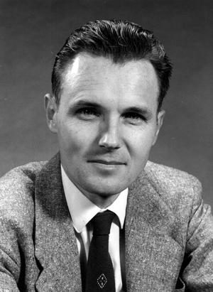

[up](top.md)

# まえがき

この本は、1961-62年の学年に、カリフォルニア理工科大学でファインマン教授によって講ぜられた物理学人門の講義に基づくものである.カリフォルニア理工科大学の1年生と2年生は、2年課程の物理学序論を聴講するが、これはその第1年目の分である.そして1962年には同じような第2年目の分がこれに続いた.序論講義を根本的に改訂しようということは4年間も考えられてきたのであるが、このファインマン講義はその中核をなすものである.

根本的改訂が必要になったのには、二つの理由がある.その一つは、この数十年間に物理学が急速に発展したことである.もう一つの理由は、高等学校の数学の内容が改善されたために、新入生の数学の力がだんだんと向上してきたことである.我々は、このことをうまくとり入れようと考えた.そしてまた、近代的の問題にもふれて、この課程がいきいきとして興味のあるものであるようにし今日の物理学の姿をよりよくあらわすものにしたいと考えた.

どんな問題を取り上げるか、またそれをどういうふうに講義するか、ということについては、いろいろの考え方があるだろう.そこで、物理学科の教官に頼んで、おのおのの考えを改訂課程の概要というような形にまとめて提出してもらった.そのようなものがいくつか提出され、そして充分に検討された、ほとんどすぐに皆の意見の一致したことは、単に別の教科書を採用するだけでは根本的の改訂はできない、あるいは、はじめから教科書を書いても、だめである.そして週に2、3回の割で新しい改訂講義をするというのが先決問題だということであった.そしてその課程をだんだんやっていけば、適当な内容もできてくるから改訂の第2段に進めるし、また講義内容にあうように適当な実験も用意できるだろうということであった.このようにして講義のあらすじができ上がったが、もちろんこれは不完全かつ試案的なもので、実際に講義の任にあたる人によって少なからず変更されるものと了解された.

この講義を実際にどうやって行なうかというやり方についても、いろいろの案が考えられた.これらの案は、大部分似たりよったりで、$N$人の教官が協力して全体の仕事を公平に分担するというのであった：各人は内容の$\frac{1}{N}$に責任をもち、講義をし、自分の分の原稿を作るというのである.しかし教官の数が充分でないし、また各人それぞれに個性も考えもちがうから、統一的な立場をとることはむずかしく、このようなやり方はうまくいきそうにない.

単にこれまでとは違った物理学課程を新たに作るというだけではなく、独特のものを作るのにひとつうまい方法があるということがわかったのはサンズ教授の思い付きによるのである.サンズ教授の案によれば、ファインマン教授に用意して講義をしてもらい、それをテープに録音するというものである.これを文字に直して編集すれば、そのまま改訂課程の教科書になるというのであった.これがほぼ実際に採用された方法であった.

編集の仕事は、図を入れたり、句読点や文章を直すくらいのことで、大したことはあるまい:それは大学院の学生が1人か2人ですむことだろうと考えられた.ところが残念ながらこの期待は間もなく外れてしまった.話し口調のものを目で読むかたちに直すということは、編集のたいへんな仕事であった.内容を並びかえたり直したりすることもときには必要であったが、そういうことがなかったとしてもたいへんであった.そのうえ、この仕事は単なる編集者とか、大学院学生などのできうることではなく、講義一つについて物理教官が10〜12時間くらい細心の注意を払ってはじめてできることなのである!

こういう編集の仕事がむずかしいのと、この内容をできるだけ早く学生の手に入るようにすることが必要であったのと、この二つの理由で、内容に“磨きをかける”量には自ら限度があるのは、やむをえないことであった.したがって、終局的のものというよりは予備的ではあるが内容は正しくてすぐ使えるようなものを作ることに我々の目標を限らざるをえなかった.カルテクの学生用のものをたくさん作ることも必要であったし、また他の学校の教師や学生の強い希望もあったので、まず予備版として本書を出版することにした.将来すっかり書き直すのもよいだろうが、これはちょっと実現しそうにない.我々はこの版が完全であり、平明であり、内容の配列もうまくいっているとは、夢にも考えていない、すぐにでも若干の小改訂を加えることを計画している.そして形式も内容も固定的にならないことを目指している.

講義は課程全体の中核部分であるが、それに加えて、適当な演習を課して学生の経験と能力を向上させ、また適当な実験を課して、講義に出てくることに実験室で直接ふれてみさせるということも必要であった.どちらも講義内容ほどではないが、かなり進歩している.講義の進行につれて演習問題もいろいろつくり上げ、それをふやして次年度に使えるようにした.しかしこれらの演習問題の種類は充分でなく、また内容も浅く、学生がこれによっていかようにも有効に力を養うことができると悟るほど満足すべきものになっているとは思っていないから、演習問題は別にいわば仮の形で出版して、度々改訂しやすいようにした.

この新課程に対して、ネーア教授は新しい実験をたくさん考案した.そのなかには、気体べアリグの摩擦が非常に低いことを利用したものがいくつかある;すなわち、空気溝の新考案で、1次元運動、衝突、調和運動の量的測定ができるもの、あるいな空気で浮かして空気でまわすマクスウェル独楽で、回転加速度運動やジャイロスコープの歳差運動や章動運動を調べることができるものなどがある.新しい実験はこれからもずっと工夫をつづけるつもりである.

課程改訂の仕事は、レイトン、ネープ、サンズ各教授の担当の下に行なわれた.この改訂に公式に参加したのは、物理数学天文学教室からファインマン、ノイゲバウアー、サトン、スタブラー(*)、ストロング、フォグトの各教援が工学教室からカウヒイ、プレセット、ウィルツ各教授である.この改訂の仕事に関与された方々の有溢な助力に対して厚く御礼を申述べる またフォード財団には特に負うところが大きい.その財政的援助がなかったら、この仕事はできなかったのである.

1963年7月

ロバート・B・レイトン

-----
(*) 1961-62 ウイリアムス・カレッジ(マサチューセッツ州ウィリアムスタウン)からの休暇中

[up](top.md)
