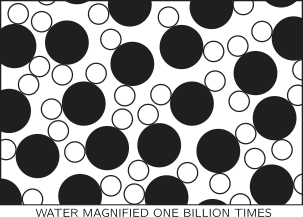
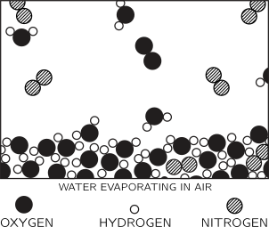
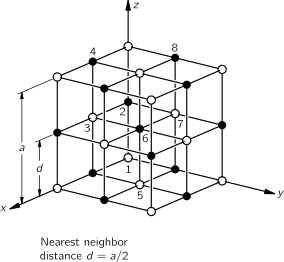
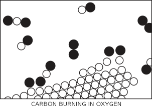
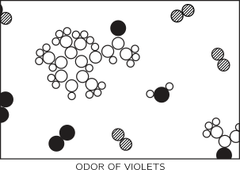

[up](top.md)

## 1 躍るアトム

### 1-1 はじめに

これから述べる講義は、2年課程の物理学であるが、学生諸君(読者諸君)が将来物理学者になるものとして、話を進めることにする.もちろん、実際は、必ずしもそうではない.しかし、これは、あらゆる学科のあらゆる教授が仮定することなのだ!もしも諸君が将来物理学者になろうというのならば、これから実にたくさんのことを勉強しなければならない.そこにあるのは、この200年間に非常ないきおいで発展してきた知識の世界である.そんなに厖大な知識は、とても4年の間に知りつくせるものではない、と諸君は思うだろう.まさにそのとおりである.そして諸君は将来更に大学院へも行かなければならないのだ.

この永い間に行なわれた仕事の量は実におびたたしいものである.しかし、驚くべきことには、その厖大な結果をずっと圧縮してしまうことができるのである.---すなわち、いくつかの法則をみつけだして、我々のすべての知識をそれに要約してしまうことができるのである.しかしそうはいっても、それらの法則の真意を把握するということは非常にむずかしい.そこで、ここにまず述べようと思うのは、科学上の問題において、一つの部分と他の部分とはどういう関連をもっているか、というようなことに関する、案内図とも、手引きともいうべきことがらである.こういうものなしに、いきなり広汎な物理学の間題に取り組もうとしても、それは諸君にとって適切な進み方であるとはいえない.このようなわけで、はじめの3章では、物理学とその他の科学との関係、諸科学相互の間の関係、科学の意義、などについて、そのあらましを述べることにする.これは、これからの問題に対して我々が"親しみ"をもつ一助とするためである.

ここで諸君はこういう疑問をもつかも知れない.ユ一クリッドの幾何学では、まず公理を述べて、それからあらゆる演繹を行なてっている.物理学でも、それと同じように、第1ページには基本的な法則を列記するだけにしおいて、次に、それらの法則があらゆる場合にいかにうまくあてはまるかを説明していくというやり方はできないものか.なぜこのやり方では、物理学は教えられないのだろうか.（4年かかって、物理学を勉強するのがいやで、4分間ですませたいとでもいうのだろうか?）しかしこれは不可能である.それには二つの理由がある.第一の理由は、その基本的な法則なるものを我々がすべて知りつくしているわけではないということである.我々の知らないこと、我々にわかっていないことは、ますます増加しつつある.第二の理由は、物理学のいろいるな法則を厳密に述べようとすると、これまでにであったこともないような新奇な概念が出てきて、それを記述するのに高級な数学が必要になるからである.それらのことばがそもそも何を意味するのかということを学ぶためにさえも、諸君はたくさんの準備訓練を経なければならない.ユークリッド幾何学的のやり方が不可能だといったのはこのためである.そういうわけで、一つ一つやっていくというのが、残された唯一の方法なのである.

自然全体のなかの一齣、あるいは一部分というものは、完全な真理---といっても我々の知る限りにおける真理---に対する一つの近似に過ぎないのが常である.じっさい、我々の知っていることは、すべてなんらかの近似である.というのは、我々はまだすべての法則を知りつくしているのではないということを承知しているからである.だから、これからいろいろのことを勉強しても、それはやがて忘れてしまわなければならず、そうでないにしても、多くの場合、修正を加えなければならないのである.

科学の原理---あるいは定義といってもほとんど同じことなのたが---は、知識はすべて実験によって検討されるということである.科学上で一つのことが"真理"であるかどうかを判定するものは、実験の他にはない.しかし、そういう知識のもととなるものは何なのだろうか.正否を検討しようとする法則なるものは、いったい、どこから出てくるのだろうか.実験自身からヒントが与えられて、法則が生まれるということもある.しかし、そのようなヒントからさらに大きく前進して、普遍的なものが樹立されるためには---それらの背後にある見事な、簡潔な、それでいていままで考えもしなかったような理法を推測し、更に、その推測が正しかったかどうかをためすに足る実験をしてみるというように、ことを運ぶためには---洞察力がまた必要なのである.ところがこの洞察の過程というのが決して容易なわざではない.それで、物理学では、仕事が分業になている.理論物理学者は洞察し、演繹し、新しい法則を推測する.けれども、実験はしない.実験物理学者は、実験し、洞察し、演繹し、そして推測する.

我々は、自然の法則は近似的であるといった、まずはじめに"正しくない"法則を見し、そして次に"正しい"法則を見出すといった.しかし、ーつの実験の結果が"正しくない"ものであるなどというのは、いったいどんな場合であろうか.それはまず、諸君の気が付かないところで何か装置が狂っているというようなつまらないことから起こる.しかしこのようなところなら、それを直して又やってみるのはわけないことである.このようなつまらぬことは問題外として、一つの実験の結果というものがどういうときに正しくないものでありうるのだろけか.その唯一の原因は不精密ということに尽きる.例えば、一つの物体の質量は、変化するものだとは決して考えられない.まわっているコマと止まっているコマとは同じ目方である.そこで、ーつの"法則"が設定される: 質はその速さに関係なく一定である、というのである.ところがこの"法則"は今では正しくないことがわかっている.速度が大きくなればなるほど、質量は大きくなるのである.もっとも、めだった質量増加が生ずるためには、速度が光の速度に近いものでなければならない.法則は正しくはこうなのである:一つの物体の動いている速さが1秒に100マイル以下であるならば、その質量は100万分の1以下の程度で一定である.この近似の程度においては、質量不変というのは正しい法則だといってよい.だから、実際間題としては、この新しい法則はこれまでとくらべて、べつだん大した差をもたらすものではないと考えられるだろう.これは、そうだともいえるし、またそうでないともいえる.ふつうの速さに対しては、我々は上のことを忘れて、ーっのよい近似として、質量不変という単純な法則を使っても差支えない.しかし、速さが大きくなると、我々は間違いをおかすことになり、速さが大きくなればなるほど、その間違いはさらに大きくなるのである.

結論的にいって、そして最も重大なことには、この近似法則は根本的に全然正しくないのである.質量の変化がたとえ小さいものであるに過ぎなくても、なおかつ我々の世界像は書きかえられなければならないのである.こういう点が、法則の背後にある哲理とか、考え方というものの非常に特異なところなのである.非常に小さなことがらであっても、我々は考え方をすっかり改めなければならないということが、時々あるものなのである.

さて、まず何から話をはじめたらよいだろうか.例えば相対性理論、4次元の時空等々のように、正しいことは正しいが、しかし、新奇でむずかしい概念を含んでいてとりつきにくい法則の話をしたらいいのだろうか.それともまず、"質量不変"の法則のように、近似的にすぎないけれども、上のようなむずかしい概念が入ってこない、単純なものからはじめたらよいのだろうか.第一のやり方の方が刺激的であり、見事であり、そして面白いだろう.しかし最初にとりつきやすいのは、むしろ第ニのやり方の方である.そしてそれはまた、第一のやり方の真意を理解するための第一歩ともなる.こういうことは物理学の講義でよく出てくる.ときにはそれをいろいろにほごしてやってみなければならない場合もあるだろう.しかし、今どんなことがわかっているか、それはどのくらい正確であるか、それは他のあらゆるものにどのように適合するか、そして我々の知識がもっとふえたらそれはどういうふうに変更されるだろうか、というようなことを、それぞれの段階において知っておくのは有意義なことである.

では、今日、我々は科学(特に物理学、またその周辺にある諸科学)というものをいかに理解するのか.このことについての手引、案内を更につづけことにしよう.こうしておけば、後になって我々がある特定の間題について深入りするときにも、何故その間題が大切なのか、それが学間の大構造とどういう関連をもっているのか、というような背景について、幾分の理解をもつようになると思う.では、我々の世界観は一口にいって、どのようなものなのだろうか.

 ### 1-2 物質は原子からできている

もしもいま何か大異変が起こって、科学的知識が全部なくなってしまい、たったーつの文章だけしか次の時代の生物に伝えられないということになったとしたら、最小の語数で最大の情報を与えるのはどんなことだろうか.私の考えでは、それは原子仮説(原子事実、その他、好きな名前でよんでよい)だろうと思う.すなわち、すべてのものはアトム---永久に動きまわっている小さな粒で、近い距離では互いに引きあうが、あまり近付くと互いに反撥する---からできている、というのである.これに少し洞察と思考とを加えるならば、この文の中に、我々の自然界に関して実に厖大な情報量が含まれていることがわかる.

アトムという考えがいかに有力なものであるかを示す例として、ここに大きさ$frac{1}{4}$インチの水滴があるとしよう.どんなによくみつめても、水---なめらかな連続した水---しか見えない.今日最高級の光学顕徴鏡---およそ2000倍---でそれを拡大してみれば、この水滴はさしわたしおよそ40フィート、つまり大きな部屋ぐらいの大きさになるが、それをよくみても、みえるものは相変わらす比較的なめらかな水である.しかしそのところどころにフットボールのような形をした小さなものが前後に泳いでいるのがみえる.これは面白い.ゾウリムシである.ここで足ぶみするのもよかろう.ゾウリムシが繊毛を動かしからだをひねているのがあまり面白いから、ゾウリムシをもっと拡大してみてその内部をしらべるということにし、もうその先へは進まないというのもよかろう.これはもちろん生物学の問題である.しかしここでは先へ進んで、更に2000倍の倍率をかけ、水という物質自体をもっとよくみることにしよう.こうすると、この水滴のさしわたしはおよそ15マイルになる.それをよくみると、'何かがゴチャゴチャしていて、もはやなめらかな外見をもっていない.ちょうどフットボール見物の群集を非常に遠くから眺めているのと似ている.このゴチャゴチャはいったい何なのであろうか.

図 1-1 水を10億倍したところ

それを検べるために、更に250倍の倍率をかけると、図1ー1に示したようなものがみえるはずであるにこれは水を10億倍してみたものだが、この図はいくつかの点で簡単化されている.まず第一に、粒にはっきりした境があるように簡単にかいてあるが、これは正確ではない.第二に、簡単化のために、粒は2次元にならんでいるように、いわば模式的に描いてあるが、もちろん粒は3次元に動きまわっているのである.酸素の原子と水素の原子とをあらわすために、それぞれ黒と白との2種類の"マル粒"が使ってあって、ーつの酸素には二つの水素が結び付いているのに注意してほしい.(一つの酸素とニつの水素からなるおのおのの小集団を分子と名付ける.)ほんものの粒は、たえずふるえたり、はずんだり、互いのまわりをまわたり、ひねれたりしているのだが、こういう点でもこの図は簡単化されている.この図は静的なものではなく、動的なものと思ってみなければならない.もうーつ、この図でかき表わせなかた点は、粒と粒とが"関係しあっている"ということ---この粒はあの粒にというように、互いに引きあっているということである.全体がいわば、"くっついて"いるのである.また、これらの粒は、互いにとおりぬけるということもない.二つの粒をあまり近くにおしつけると、それは互いに斥けあうのである.

原子の半径は$1 \sim 2 \times 10^{-8} \mathrm{cm}$である.$10^{-8} \mathrm{cm}$のことを(別名)オングストロームと名付ける.だから、原子の半径は1ないし2オングストローム($\AA$)であるといえる.原子の大きさを記憶するのにもうーつ、こういううまい覚え方がある.ーつの林擒を地球の大きさに引きのばしたとすると、林檎の中にあった原子の大きさは、だいたいもとの林檎の大きさくらいになる.

さて、さきほどの大きな水滴で、粒々がみんなふるえたり、くっつきあったりしているところを考えてみよう.この水は一定の体積を保っていて、バラバラになることはない.これは分子の間に引力がはたらいているからである.水滴が斜面の上にあって、動くことができるようになっている場合には、水は流れる.けれども、消減することはない---飛び散ってしまうことはない.これは分子引力があるからである.分子のふるえ運動を、我々は熱という言彙でいいあらわす.水の温度を上げると、この運動ははげしくなる.水を熱すると、ふるえが大きくなって、アトムとアトムとの間のすき間が大きくなる.どんどん熱しつづけていくと、ついに分子間の引力ではそれらをいっしょにひきつけておくことができなくなり、分子は飛び散って互いにはなればなれになってしまう.我々が水から蒸気を作るのに、この方法---温度を上げる---によっていることはいうまでもない.運動がはげしくなって粒は飛び散ってしまうのである.

図 1-2 蒸気

図1-2は蒸気の画である.この蒸気の画には、よくないところが一つある.それはふつうの大気圧の下では、このかこみに相当する大きさの中にある蒸気分子の数はほんの僅かで、この図のように中に三つもあるといことはない.これくらいの大きさの四角なら、その中に分子が一つも入っていないのがふつうである.しかし、この図では、たまたま二つ半か三つ入っているのである.(そうでなかったら、何もない真白な図になってしまう.) さてこの蒸気の場合には、水の場合よりも、水分子の特性がよくみえる.簡単化のために、この図では120°という角がめだつようにかいてある.この角は実際には105°3'であって、一つの水素の中心と酸素の中心との間の距離は0.957$\AA$である.このように、この分子のことは実によくわかっているのである.

次に蒸気や他の気体の二、三の性質について調べてみよう.分子は互いにバラバラになっていて、壁にぶつかっては、はねかえっている.いまーつの部屋を想像する.そして、その中にたくさん(100個ぐらい)のテニスボールがあり、それがたえずぶつかりあい、はずみあっているとしよう.ボールは壁にあたって、それをおしている.(もちろん我々は壁をおしかえしてやらなければならない.)これによって気体は衝突のたびごとにピクピクした力を壁に及ぼすことになるのであるが、我々のあらっぽい感覚では(我々は100億倍に拡大されていないから)、平均して一つの押しの力を感ずるだけである.ある気体を一定の体積に閉じこめておくのには、これに圧力を加えておかなければならない.

図1-3

図1-3は気体をとじこめておく例の容器(どんな教科書にも出てくる)であって、筒とそれにはまるピストンとからできている.水の分子がどんな形をしていても、この際問題にならないから、簡単のために、テニスのタマのような小さなマルにかいておこう.それが、あらゆる方向にたえず運動をつづけているのである.天井のピストンには、たくさんのタマが絶えず衝突する.そのため、ピストンはジリジリとタンクからはずれようとするわけだが、それを防ぐためには、ある力によってそれを下の方におしつけておかなければならない.この力を圧力と名付ける.(実は、圧力かける面積がカである.)このカの大きさは、面積に比例することは明らかである.何故ならば、$1 \mathrm{cc}$あたりの分子の数を同じにしたままピストンの面積を増すと、それと同じ割合でピストンに衝突する回数がふえるからである.

次に、このタンクに入れる分子の数を2倍にして、密度を2倍にする.しかし、分子の速さは同じ、すなわち温度は同じにしておく.こうすると、衝突の回数はほとんど2倍になる.しかも、一つ一つの衝突の"いきおい"は前と同じだから、圧力は密度に比例することになる.アトムとアトムとの間にはたらく力の性質を考えに入れると、それによって、圧力はいまいったのよりも少し小さいことになり、またアトムの占める体積が有限であることを考えに入れると、圧力はこれよりも少し大きいことになる.しかし密度が小さくて、アトムの数がそんなに多くない場合には、圧力は密度に比例するとして、ほとんど間違いはない.

まだまだ他のこともわかる.こんどは気体の密度はそのままにしておいて温度を上げる.すなわちアトムの速さを大きくしてやるのである.そうすれば、圧力はどうなるであろうか.アトムの速さが大きくなったのだから、衝突のいきおいは強くなり、回数もふえる.したがって温度を上げれば圧力は大きくなる.原子説の考えはこのように明快である.

もっと別の面を考えよう.ピストンを中の方へおし下げていって、アトムがだんたんせまいところにおしこめられるようになるとしよう.このピストンの動いてくるところに、ーつのアトムが衝突したらどんなことが起こるだろうか.衝突によって速さをもらうことは明らかである.例えばラケットが前進してくるところにピンポンのタマをあてて、はずませてみるとよい.ピンポンのタマはラケットにあたる前よりも速さが早くなってもどってくる.(特判な場合: たまたまアトムが止まっているところにピストンが当たれば、アトムが動き出すことは明らかである.)だから、ピストンにあたってもどってくるときには、それにあたる前にくらべて、アトムは"熱く"なっているのである.こうして容器の中にあるアトムはすべて速さをもらってくる.これは、気体をだんだん圧縮するとその温度が上がるということを意味する.すなわち、気体はだんだん圧縮するとその温度は上がり、膨張すると温度は下がるのである.

図1-4 氷

さきほどの水滴の話に立ち戻って、また別の面から眺めてみよう.こんどはこの水滴の温度を下げたとする.そして、水の中でアトムのあつまりがふえているのが、だんだん衰えてくるとする.アトムの間には引力がはたらいているので、しばらくたつうちに、アトムはそんなに活発にふるえられなくなる.温度が非常に低くなったらどんなことになるかということを示したのが、図1-4である.アトムのあつまりがからみあって新しい模様に並ぶようになる.これが氷である.この氷の模型図は2次元に書いてあるので、ほんとは正しくはないのだが、定性的にはまず正しいといってよい.大切なことは、この氷のなかでは、あらゆるアトムの位置がちゃんときまってしまっているということである.氷満の一端にあるすべてのアトムを何かの方法でおさえつけて、このアトムはここに、次のアトムはそこにというように、ある配列にとめてしまったとすると、網目のつながりがしっかり固くなっているので、(拡大した尺度で)何マイルも遠くにある他の端のアトムの場所もきっちり定まってしまうということになる.だから氷の針をつくってその一端をもち、他の端を横にまげようとすると、それに抵抗する.これが水の場とちがうところである.水の場合には、アトムはみな四方八方に活発に動きまわっているので、構造はこわれてしまう.つまり、固体と液体とのちがいは、固体では、アトムが結晶配列とよばれるある配列をとっていて、ずいぶん遠くのことを考えても勝手な位置を占めるわけにいかないというところにある.結晶の一端におけるアトムの位置は、何百万アトムとはなれている他端のアトムの位置によってきまってしまっているのである.図1-4は氷のなかの配列として求められたものである.この図は氷の有様を正しく伝えているところも多いが、そのままほんとの配列というわけではない.正しいことの一例は、六方対称の一部があらわれているということである.この図を軸のまわりに120°まわすと、もとにもどる.雪華は六角形だが、これを説明しうる対称性が氷の中にあるのである.図1-4からわかるもうーつのことは氷がとけると体積が減る理由である.ここに示してある氷の結晶模様には"穴"がたくさんあいているが、ほんものの氷の構造もこれと同じである.この組織がこわれると、これらの穴に分子が入り込んでくることができる.水と活字金とは例外であるが、たいていの簡単な物質は、とけると体積が膨張する.それは、固体のときにはアトムがぎっしりつまっているが、とけるとアトムがふるえまわるのにひろい場所を必要とするからである.しかし水のような場合には、穴のある構造がこわれてしまうのである.

さて氷は"堅間な"結晶形をもっているけれども、その温度は変化しうる---氷は熱をもっている.我々がその熱の量を変化させようと思えば、変化させることができるのである.といっても、氷の場合に熱とは何であろうか、アトムは静止しているのではなく、ふるえつづけ、振動しつづけているのである.氷の結晶にきまった秩序---きまった構造---があるとはいっても、アトムはみな"その場所"で振動しているのである.温度を上げると、振動の振幅がだんたん大きくなって、その場所からふりとばされてしまう.これを融解という.温度を下げると、振動の振幅はだんだん小さくなって、遂に絶対零度ではとりうる最小---ゼロではない---になる.アトムがとりうるこの最小の運動の量は、物質をとかすのには足りない:ヘリウムはたった一つの例外である.ヘリウムでは、アトム運動を極端にヘらして、絶対零度にしたとしても、まだかなりの運動が残っていて、こおることはない.大きな圧力をかけてアトムをおさえつけない限り、ヘリウムは絶対零度でもこおらない.しかし圧力をませば、こおらせることができる.

### 1-3 原子のプロセス

図1-5

以上、固体、液体、気体を原子の視点から説明しました。しかし、原子仮説はプロセスも記述しているので、ここではいくつかのプロセスを原子の観点から見ていきたいと思います。最初に見るのは、水の表面に関するプロセスです。水の表面では何が起こっているのでしょうか。ここでは、水面が空気中にあると仮定して、より複雑でより現実的なイメージを描いてみましょう。図1-5は、空気中の水の表面を示しています。水分子が液体の水を形成しているのは先ほどと同じですが、今度は水の表面が見えています。水面の上にはいくつかのものがあります。まず、水蒸気のように水分子があります。これは水蒸気で、液体の水の上には必ず存在します。水蒸気と水の間には平衡状態がありますが、これについては後述します）。そのほかにも、酸素原子が2つくっついて酸素分子になっていたり、窒素原子が2つくっついて窒素分子になっていたりと、さまざまな分子が存在します。空気は、ほとんどが窒素、酸素、若干の水蒸気、そして少量の二酸化炭素やアルゴンなどで構成されています。つまり、水面の上にあるのは、水蒸気を含んだ気体である空気なのです。さて、この写真では何が起こっているのでしょうか？水の中の分子は常に動き回っています。時々、水面上の1つがたまたまいつもより少し強く叩かれて、叩き落とされることがあります。写真は静止画なので、その様子を見ることはできません。しかし、表面に近いところにある分子がちょうどぶつかって飛び出している、あるいは別の分子がぶつかって飛び出していると想像することができます。このようにして、分子ごとに水が消えていく-蒸発していくのです。上の容器を閉じてしばらくすると、空気の分子の中に大量の水の分子が混じっているのがわかります。この水蒸気分子の1つが、時折、水の方に飛んできて、またくっついてしまうのです。このように、20年以上も放置されている水の入ったコップという、一見すると死んだような面白みのないものの中に、実はダイナミックで面白い現象が常に起こっていることがわかります。私たちの粗末な目には何も変化していませんが、もし10億倍に拡大して見ることができたら、それ自体の視点から見ると、分子が表面から出て行ったり、戻ってきたりして、常に変化していることがわかります。

なぜ変化が見えないのか？それは、出て行く分子と戻ってくる分子の数が同じだからです。長い目で見れば、「何も起こらない」のです。次に、容器の上部を外して湿った空気を吹き飛ばし、乾燥した空気に置き換えると、出て行く分子の数は、水の揺れに依存するため、以前と同じですが、戻ってくる数は、水の上にある水分子の数が非常に少ないため、大幅に減少します。したがって、入ってくる数よりも出て行く数の方が多くなり、水は蒸発します。したがって、水を蒸発させたい場合は、扇風機を回しましょう。

他にもあります：どの分子が離れるのか？分子が離脱するのは、通常よりも少し多めのエネルギーが偶然、余分に蓄積されたためで、そのエネルギーは隣の分子の引力から離脱するために必要です。そのため、離脱する分子は平均よりも多くのエネルギーを持っているので、残された分子は以前よりも平均運動量が少なくなります。そのため、液体が蒸発すると徐々に冷えていきます。もちろん、空気中から下の水に蒸気の分子がやってくると、分子が表面に近づくにつれて急に大きな引力が発生します。これは、入ってきた分子をスピードアップさせ、熱を発生させます。つまり、出て行くときには熱を奪い、戻ってくるときには熱を発生させるのです。もちろん、正味の蒸発がない場合、結果は何もなく、水の温度は変化しません。蒸発する数が継続的に優位になるように水に息を吹きかければ、水は冷やされます。したがって、スープに息を吹きかけると冷えるのです。

もちろん、今説明したプロセスは、私たちが示した以上に複雑であることを理解してください。水が空気中に入るだけでなく、時折、酸素や窒素の分子の1つが入ってきて、水分子の塊の中で「迷子」になり、水の中に働きかけます。このようにして、空気は水に溶け、酸素や窒素の分子が水の中に入り、水には空気が含まれるようになる。もし、急に船から空気を抜いてしまうと、空気の分子は入ってきた時よりも早く出て行ってしまい、その際に泡を作ってしまいます。これはダイバーにとって非常に良くないことですが、ご存知の通りです。

図1-6

図1-7

次に、別のプロセスについて説明します。図1-6は、固体が水に溶けている様子を原子レベルで表したものです。この水の中に塩の結晶を入れると、どうなるでしょうか。塩は固体であり、結晶であり、"塩の原子 "が組織的に配列されたものです。図1-7は、一般的な塩である塩化ナトリウムの立体構造を示したものです。厳密に言えば、結晶は原子ではなく、イオンと呼ばれるものでできています。イオンとは、原子に数個の電子を追加したり、数個の電子を失ったりしたものです。塩の結晶の中には、塩素イオン（電子を1個余分に持った塩素原子）とナトリウムイオン（電子を1個失ったナトリウム原子）が含まれています。固体の塩の中では、イオンは電気的な引力でくっついていますが、水の中に入れると、マイナスの酸素とプラスの水素がイオンに引力を持つため、イオンの一部がぐらついてしまいます。図1-6では、塩素イオンが外れて、他の原子がイオンの形で水に浮かんでいる様子を示しています。この絵は、ちょっとした工夫がされています。例えば、塩素イオンの近くには水分子の水素の端が、ナトリウムイオンの近くには酸素の端が集まりやすいことに注目してください。この写真から、塩が水に溶けているのか、水から結晶化しているのかがわかるでしょうか？もちろん分かりません。なぜなら、一部の原子が結晶から離れている間に、他の原子が再び結晶に加わるからです。このプロセスは、蒸発の場合と同様に動的なものであり、水の中にある塩が平衡に必要な量よりも多いか少ないかによって決まります。平衡とは、原子が出て行く速度と戻ってくる速度がちょうど一致している状態を意味します。水の中に塩がほとんどなければ、出て行く原子の数が戻ってくる原子の数を上回り、塩が溶けていきます。一方、「塩の原子」が多すぎると、出て行く原子よりも戻ってくる原子の方が多くなり、塩が結晶化してしまうのです。

ところで、物質の分子という概念は近似的なものであり、ある種の物質にしか存在しないことを述べておきます。水の場合、3つの原子が実際にくっついていることは明らかです。固体の塩化ナトリウムの場合は、それほど明確ではありません。ナトリウムイオンと塩素イオンが立方体状に配列されているだけなのだ。塩の分子 "として自然にグループ化する方法はありません。

溶液と沈殿の話に戻りますが、塩水の温度を上げれば、原子が持っていかれる速度も上がりますし、原子が戻ってくる速度も上がります。一般に、固体の溶解量が多いか少ないか、どちらに転ぶかを予測するのは非常に難しいことがわかります。ほとんどの物質は、温度が上がるとより多く溶解しますが、一部の物質はより少なく溶解します。

 ### 1-4 化学反応

これまで説明してきた過程では、原子やイオンの相手が変わることはありませんでしたが、もちろん、原子の組み合わせが変わり、新しい分子が形成される場合もあります。その様子を図1-8に示します。このように、原子の組み合わせが変わる過程を化学反応と呼びます。それ以外の過程を物理過程と呼んでいますが、両者を明確に区別しているわけではありません。この図は、酸素の中で炭素が燃える様子を表していると思われる。酸素の場合、2つの酸素原子は非常に強くくっついています。なぜ3個でも4個でもくっつかないのか？それは、このような原子のプロセスの非常に独特な特徴の1つです。原子は非常に特殊なもので、特定の相手、特定の方向を好みます。その理由を解明するのが物理学の仕事です。ともかく、2つの酸素原子が飽和状態で幸せになって、分子を形成するのである)

図1-8

炭素原子は固体の結晶（グラファイトやダイヤモンドなど）の中にあるはずです。例えば、酸素分子の1つが炭素のところに来て、それぞれの原子が炭素原子を拾って、「炭素-酸素」という新しい組み合わせで飛び立っていくと、一酸化炭素という気体の分子になります。これが一酸化炭素という気体の分子で、化学名はCOである。「CO」という文字がそのまま分子の絵になっているという、とてもシンプルな名前です。しかし、炭素は、酸素が酸素を、炭素が炭素を引き寄せるよりも、はるかに酸素を引き寄せます。そのため、このプロセスでは、酸素はわずかなエネルギーで到着するかもしれないが、酸素と炭素がものすごい勢いでぶつかり合い、その近くにあるすべてのものがそのエネルギーを拾うことになります。このようにして、大量の運動エネルギー(キネティック・エネルギー)が発生する。これはもちろん燃焼であり、酸素と炭素の組み合わせから熱を得ているのです。通常、熱は高温のガスの分子運動の形をしていますが、ある状況下では、光を発生させるほど巨大になります。これが炎の正体です。

さらに、一酸化炭素は満足していない。酸素が炭素と結合すると同時に、一酸化炭素の分子と衝突するという、より複雑な反応が起こる可能性があるのです。1つの酸素原子がCOに付着し、最終的に1つの炭素と2つの酸素からなる分子を形成する可能性があり、この分子はCO2と指定され、二酸化炭素と呼ばれます。もし、炭素を非常に少ない酸素で非常に急速な反応で燃焼させると（例えば、自動車のエンジンでは、爆発が非常に速く、二酸化炭素を作る時間がない）、かなりの量の一酸化炭素が形成される。このような多くの再編成では、非常に大きなエネルギーが放出され、反応によっては爆発や炎などが形成される。化学者はこのような原子の配列を研究し、あらゆる物質が何らかの形で原子の配列であることを発見した。

この考えを説明するために、別の例を考えてみましょう。小さなスミレの花畑に行くと、「あの匂い」が何であるかがわかります。それは、私たちの鼻に入ってきた何らかの分子、または原子の配列です。まず、どうやって入ってきたのか。それは簡単だ。匂いが空気中のある種の分子で、あちこちに飛び回っているとしたら、それが偶然に鼻に入ってきたのかもしれない。確かに、匂いは私たちの鼻に入りたいとは思っていません。それは単に、混沌とした分子の群れの中の無力な一部分に過ぎず、目的もなくさまよっているうちに、この特定の物質の塊は偶然にも鼻の中に入ってしまったのである。

図1-9

現在、化学者はスミレの香りのような特殊な分子を採取して分析し、空間内の原子の正確な配置を知ることができます。二酸化炭素の分子はまっすぐで対称的であることがわかっています。O-C-Oです。化学では、非常に複雑な原子の配列であっても、長い時間をかけて、驚くべき方法で、原子の配列を見つけることができるのです。図1-9は、バイオレットの周辺の空気の写真ですが、ここでも空気中には窒素と酸素、そして水蒸気が存在しています。なぜ水蒸気があるかというと、バイオレットが湿っているからです。 植物はすべて蒸散します）しかし、炭素原子、水素原子、酸素原子が、ある特定のパターンを選んで配置されている「怪物」も見られます。それは、二酸化炭素よりもはるかに複雑な配列であり、実際には非常に複雑な配列である。なぜなら、すべての原子の正確な配置は、実際には3次元で知られているが、私たちの絵は2次元でしかないからである。リングを形成する6つの炭素は、平らなリングではなく、「くびれた」リングのような形をしています。角度も距離もすべてわかっている。つまり、化学式とは、このような分子の絵に過ぎないのです。化学者が黒板にそのようなことを書くのは、大雑把に言えば2次元で「描こう」としているのです。例えば、炭素6個の「環」と、その端にぶら下がっている炭素の「鎖」、端から2番目の酸素、その炭素に結びついている3つの水素、ここに突き出ている2つの炭素と3つの水素、などなど。

図1-10.写真の物質はα-ironeです。

化学者はどのようにしてその配列を見つけるのでしょうか？瓶いっぱいの物質を混ぜ合わせ、それが赤くなれば、ここに水素が1つ、炭素が2つ結ばれていることがわかる。一方、青くなれば、それは全く違う状態であることがわかる。これは、これまでに行われた最も素晴らしい探偵の仕事の1つである有機化学です。このように非常に複雑な原子の配列を発見するために、化学者は2つの異なる物質を混ぜ合わせたときにどうなるかを調べます。物理学者は、化学者が原子の配列を説明しているときに、その化学者が何を言っているのか分かっているとは到底思えなかった。20年ほど前から、このような分子（これほど複雑ではないが、その一部を含むものもある）を物理的な方法で見ることができるようになりました。そして驚いたことに、化学者の言うことはほとんど正しいのです。

実際、スミレの香りの中には、水素原子の配置だけが異なる3つの微妙に異なる分子があることがわかっています。

化学の課題の一つは、物質に名前をつけて、それが何であるかを知ることです。この形の名前を見つけよう 名前は形だけでなく、ここには酸素原子がある、ここには水素があるというように、それぞれの原子がどこに何があるかを正確に伝えなければなりません。このように、化学名は複雑でなければ完成しないことがわかります。この物質の構造を示すより完全な形の名前は、4-（2、2、3、6テトラメチル-5-シクロヘキセニル）-3-ブテン-2-オンであり、これが配列であることを示しているのがわかります。私たちは化学者の困難さを理解し、このような長い名前の理由も理解できます。曖昧にしたいわけではなく、分子を言葉で表現するという非常に難しい問題を抱えているのです。

原子があることはどうやってわかるのか？先に述べたように、「原子がある」という仮説を立てると、「原子でできている」という予測通りの結果が次々と出てくるのです。また、もう少し直接的な証拠もあり、その良い例が次のようなものです。原子は非常に小さいので、光学顕微鏡では見えないし、電子顕微鏡でも見えない。例えば、原子が常に動いている水の中に、原子よりもはるかに大きなボールを入れると、ボールはぐらぐらと動きます。大きなボールを大勢で押して遊ぶプッシュボールゲームでは、人がいろいろな方向に押しているので、ボールはフィールドを不規則に動き回ります。それと同じように、「大きなボール」も、ある瞬間からある側面に衝突したときの不等式によって動くことになるわけです。したがって、水中の非常に小さな粒子（コロイド）を優れた顕微鏡で見ると、原子の砲撃の結果である粒子の絶え間ない揺れが見られます。これを「ブラウン運動」といいます。

原子の存在は、結晶の構造にも表れている。X線解析によって導き出された構造は、多くの場合、その空間的な「形」が自然界に存在する結晶の形と一致しています。結晶の様々な「面」の間の角度は、結晶が原子の多くの「層」からできていると仮定して推論された角度と、数秒の範囲で一致します。

すべては原子でできている。これが重要な仮説です。例えば、生物学で最も重要な仮説は、「動物がしていることは、すべて原子がしている」というものです。つまり、物理学の法則にしたがって動く原子でできているという観点から理解できないことは、生物にはないということです。これは最初から分かっていたわけではなく、この仮説を提案するためには実験や理論化が必要でしたが、今では受け入れられており、生物学の分野で新しいアイデアを生み出すための最も有用な理論となっています。

原子が隣り合わせになっている鉄や塩が、これほど興味深い特性を持つとしたら、また、地球上で何マイルも同じものが並んでいる小さな塊にすぎない水が、波や泡を形成し、セメントの上を流れるときに、ごう音や奇妙なパターンを作るとしたら、そして、これらすべて、つまり水流のすべての生命が、原子の山にすぎないとしたら、さらにどれほどのことが可能だろうか？もし、原子を何か決まったパターンで配列し、それを何度も繰り返し、延々と続け、あるいはスミレの匂いのような小さな複雑な塊を形成するのではなく、場所によって常に異なる配列をし、様々な種類の原子を様々な方法で配列し、繰り返しではなく絶えず変化させるとしたら、そのものの振る舞いはどれほど驚異的なものになるでしょうか？あなたの目の前を行ったり来たりしている、あなたに話しかけている「もの」は、非常に複雑に配置されたこれらの原子の大きな塊であり、その複雑さゆえに何ができるのか想像を絶するものである可能性があります。なぜなら、次から次へと繰り返されることのない原子の山は、あなたが鏡の中で見ているような可能性を持っているかもしれないからです。

[up](top.md)