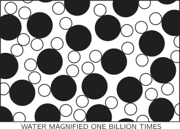
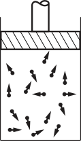
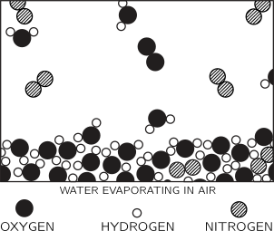
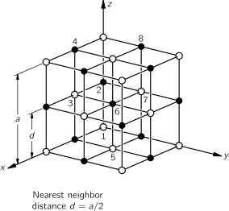
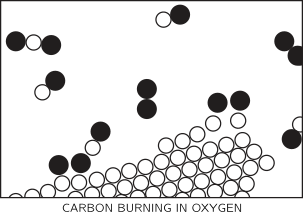
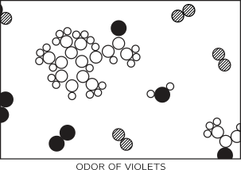

[up](top.md)

## 1 Atoms in Motion (原子の動き)

### 1-1 はじめに

この物理学の2年間のコースは、読者であるあなたが物理学者になることを前提にしています。もちろん、必ずしもそうではありませんが、すべての科目のすべての教授がそう想定しています。あなたが物理学者になろうとするなら、たくさんのことを学ばなければなりません。200年もの間、最も急速に発展してきた知識の分野です。あまりの知識の多さに、4年間ですべてを学ぶことはできないと思うかもしれませんが、実際にそうではなく、大学院にも行かなければならないのです。

驚くべきことに、これまでの膨大な作業にもかかわらず、膨大な量の結果をかなりの程度まで凝縮することができます。そうは言っても、法則を理解するのは非常に難しいので、科学という対象の一部分が他の部分とどのように関係しているのか、ある種の地図やアウトラインを持たずにこの途方もないテーマの探求を始めるのは不公平です。そこで、最初の3つの章では、物理学と他の科学との関係、科学同士の関係、科学の意味を説明し、このテーマの「感覚」を身につけられるようにしました。

ユークリッド幾何学のように、公理を述べた上で様々な推論を行うように、基本的な法則を1ページ目に示し、それがあらゆる状況下でどのように機能するかを示すことで、なぜ物理学を教えることができないのか、と疑問に思うかもしれません(4年間で物理学を学ぶことに満足せず、4分で学びたいということですね) 。この方法では、2つの理由からできません。第一に、基本的な法則をすべて判っているわけではなく、無知の領域が広がっています。第二に、物理法則を正しく記述するには、非常に馴染みのない考え方が含まれており、その記述には高度な数学が必要です。そのため、言葉の意味を知るだけでも相当の準備訓練が必要です。いや、そんなことはできません。一歩一歩やっていくしかありません。

自然界全体の各部分は、常に完全な真実の近似値、あるいは我々が知る限りの完全な真実に過ぎません。実際、私たちが知っていることはすべてある種の近似値に過ぎません。なぜなら、私たちはまだすべての法則を知っているわけではないことを知っているからです。したがって、物事は学ばなければならないが、それは再び学ばないためであり、もっと言えば、修正するためでもある。

科学の原理、定義、ほとんど、次のようなものです。すべての知識のテストは実験である。実験は科学的な「真実」を判断する唯一の手段である。しかし、知識の源は何でしょうか？テストされるべき法則はどこから来るのか？実験は、それ自体、法則を生み出すためのヒントを与えてくれます。しかし、そのヒントから大まかな法則を導き出すためには、想像力が必要です。単純で素晴らしい、しかし非常に奇妙なパターンを推測し、その推測が正しかったかどうかを再度実験で確認するのです。この想像力を働かせる作業は非常に難しいため、物理学では分業制になっています。想像し、推論し、新しい法則を推測するが、実験はしない理論物理学者と、実験し、想像し、推論し、推測する実験物理学者です。

自然界の法則は近似的なものであり、まず「間違った」ものを見つけ、次に「正しい」ものを見つけると言いました。では、どのようにして実験が「間違った」ものになるのでしょうか。まず、些細なことですが、自分では気づかなかった何かが装置の中で間違っていた場合です。しかし、このようなことは簡単に修正できますし、何度も確認できます。では、そのような些細なことを抜きにして、実験結果が間違っているとはどういうことでしょうか。それは、「不正確」だからです。例えば、物の質量は変わらないように見えます、回っているコマは止まっているコマと同じ重さです。そこで、「質量は速度によらず一定である」という「法則」が生まれました。しかし、この法則は間違っていることがわかりました。質量は速度に応じて増加することがわかっていますが、評価できるほどの増加には光の速度に近い速度が必要です。真の法則は、「物体が1秒間に100マイル以下の速度で動く場合、質量は100万分の1の範囲内で一定である」というものです。このような近似的な形では、これは正しい法則です。ですから、実際には、この新しい法則は大きな違いはないと思われるかもしれません。しかし、それはイエスでもありノーでもあります。通常の速度では、確かにこのことを忘れて、単純な質量一定の法則を良い近似として使うことができます。しかし、高速では間違っており、速度が上がれば上がるほど間違っていることになります。

最後に、最も興味深いことですが、哲学的には近似法を完全に間違っています。質量が少ししか変わらないのに、世界の全体像を変えなければならないのです。これは、法則の背後にある哲学、つまり考え方の非常に奇妙な点です。ほんの少しの影響でも、考え方を大きく変えなければならないことがあるのです。

さて、最初に何を教えるべきでしょうか。相対性理論や四次元時空など、不思議で難しい概念を持つ、正しいけどよくわからない法則を教えるべきでしょうか。それとも、近似的ではあるが、そのような難しい概念を含まない単純な「質量一定」の法則を最初に教えるべきでしょうか？前者の方がより刺激的で、より素晴らしく、より楽しいものですが、後者の方が最初に手に入れやすく、最初のアイデアを本当の意味で理解するための第一歩となります。この点は、物理学を教える際に何度も出てきます。しかし、どの段階においても、現在知られていること、それがどの程度正確であるか、それが他のすべてのものにどのように適合するか、さらに学んだときにどのように変更されるかを学ぶ価値があります。

ここで、今日の科学（特に物理学、周辺の他の科学も含む）に対する私たちの理解の概要、つまり全体地図を作成してみましょう。そうすれば、後である特定のポイントに集中して取り組むときに、その背景や、その特定のポイントがなぜ面白いのか、そしてそれが大きな構造の中でどのように位置づけられるのかが、ある程度わかるようになります。では、世界の全体像はどのようになっているのでしょうか。

 ### 1-2 物質は原子でできている

何かの大災害で全ての科学知識が破壊され、たった一つの文章だけが次の世代の生物に伝えられるとしたら、最も少ない言葉で最も多くの情報を含むのはどのような文章でしょうか。それは、「すべてのものは原子からできている」という原子仮説（あるいは原子事実とでもいうのでしょうか）です。原子とは、永久に動き続ける小さな粒子のことで、少し離れたところでは互いに引き合うが、押しつぶされると反発する。この一文には、ちょっとした想像力と思考力を働かせれば、世界に関する膨大な量の情報が含まれていることがわかります。

図1-1

原子仮説の力を説明するために、横に4分の1インチの水滴があるとします。よく見ると、そこには滑らかな連続した水があるだけです。最高の光学顕微鏡で約2000倍に拡大しても、水滴の大きさは大体40フィート、大きな部屋と同じくらいの大きさになり、さらによく見ると、比較的滑らかな水が、あちこちで小さなサッカーボールのような形をしたものが泳いでいます。面白いですね。これはゾウリムシです。繊毛をくねらせ、体をくねらせているゾウリムシに興味を持ったあなたは、ここで立ち止まって、ゾウリムシをもっと拡大して中を見てみることにしましょう。もちろん、これは生物学の課題ではあるが、ここでは先に進み、水の素材そのものをさらに2,000倍に拡大して見てみよう。この水滴は、横に15マイルほど広がっていますが、よく見ると、もはや滑らかな外観を持たない、ある種の群集が見られます。これは、非常に遠くから見た、サッカーの試合の観客のようなものです。これが何かというと、さらに250倍に拡大してみると、図1-1のような状態になります。これは、水を10億倍に拡大したものですが、いくつかの点で理想化されています。まず、粒子を単純化して描いていますが、これは正確ではありません。第二に、簡単のために、ほとんど模式的に2次元の配列で描かれていますが、もちろん3次元で動き回っています。酸素（黒）と水素（白）の原子を表す2種類の「塊」または円があり、それぞれの酸素には2つの水素が結合していることに注目してほしい。この絵はさらに理想化されていて、自然界に存在する本物の粒子は、絶えず互いに揺れ動き、跳ね返り、回転し、ねじられています。静的な絵ではなく、動的な絵として想像する必要があります。もう1つ、絵では表現できないのは、粒子同士が「くっついている」という事実です。粒子同士が引き合っている、この粒子がこの粒子に引っ張られている、など。いわばグループ全体が「接着」されているのです。一方で、粒子同士はお互いに押し合うことはありません。2つの粒子をくっつけようとすると、反発します。

原子の半径は1または2×10^(-8)cmです。今、10^(-8)cmはオングストローム（別名）と呼ばれているので、半径が1または2オングストローム（Å）であると言います。また、リンゴを地球の大きさに拡大すると、リンゴの中の原子は元のリンゴの大きさとほぼ同じになる、というように大きさを覚えることもできます。

さて、この大きな水滴の中で、ピクピクと動く粒子が互いにくっついて離れない状態を想像してみてください。水は、分子同士の引力によって、体積を保ち、バラバラにはなりません。水滴がある場所から別の場所に移動できるような斜面にある場合、水は流れますが、分子の引力のおかげで、ただ消えてしまうわけではなく、物が飛び散ってしまうわけでもありません。このピクピクした動きは、私たちが熱として表現しているもので、温度を上げれば動きも大きくなります。水を加熱すると、ピクピクが増えて原子間の体積が増え、さらに加熱を続けると、分子間の引力が足りなくなって、飛び散って離れてしまうことがあるのです。もちろん、これは水から蒸気を作る方法で、温度を上げれば粒子は動きが活発になって飛び散ります。

図1-2

図1-2は、蒸気の絵です。普通の大気圧では、この絵の中に水分子が3個も入っていないはずです。この大きさの正方形には、ほとんどの場合、水の分子は含まれていません。しかし、この絵では、全くの空白にならないように、偶然にも2個半または3個の水の分子が描かれています。水蒸気の場合は、水の場合よりも特徴的な分子をはっきりと見ることができます。簡単にするために、水素原子の間に120°の角度があるように分子を描いています。実際には、角度は105°3′で、水素の中心と酸素の中心の間の距離は0.957Åと、この分子はよく知られています。

水蒸気やその他の気体の特性を見てみましょう。分子はお互いに離れているので、壁にぶつかって跳ねます。部屋の中で、何個ものテニスボール（100個くらい）が永遠に跳ね続けている状態を想像してみてください。それらが壁に衝突すると、これによって壁が押し出されます。もちろん、私たちは壁を押し戻さなければなりませんが）これは、気体がジリジリとした力を発揮していることを意味し、私たちの粗い感覚（自分自身を10億倍に拡大していない）では、平均的な押しの強さとしてしか感じられません。気体を閉じ込めるためには、圧力をかけなければなりません。図1-3は、気体を入れる標準的な容器（教科書にも載っている）である、ピストンを入れた円筒です。水の分子は、どんな形をしていても構わないので、ここでは簡単にテニスボールや小さな点で描いておきます。水の分子は、あらゆる方向に向かって動き続けています。あまりにも多くの水分子が常に上のピストンに当たっているので、この絶え間ない衝突によって根気よくタンクから叩き出されないようにするためには、圧力と呼ぶある種の力でピストンを押さえつけなければなりません（実際には、圧力に面積を掛けたものが力です）。面積を大きくしても、1立方センチメートルあたりの分子の数を変えなければ、面積が大きくなったのと同じ割合で、ピストンとの衝突回数が増えるからです。

図1-3

このタンクに、密度が2倍になるように2倍の分子を入れて、同じ速度、つまり同じ温度にします。そうすると、近似的に衝突の回数が2倍になり、それぞれが以前と同じように「エネルギー」を持つことになるので、圧力は密度に比例することになります。原子間の力の本質を考えれば、原子間の引力のために圧力はわずかに減少し、原子が占める有限の体積のためにわずかに増加すると考えられます。とはいえ、非常に近似的に、原子の数が少なく密度が低ければ、圧力は密度に比例します。

他にも、気体の密度を変えずに温度を上げた場合、つまり、原子の速度を上げた場合、圧力はどうなるでしょうか。原子の動きが速くなるので、原子はより強くぶつかり、さらにぶつかる回数も増えるので、圧力が高くなるのです。このように、原子論の考え方はとてもシンプルです。

別の状況を考えてみましょう。ピストンが内側に移動して、原子がゆっくりと小さな空間に圧縮されていくとします。原子が動くピストンにぶつかるとどうなるでしょうか。明らかに衝突して速度を上げています。例えば、ピンポン玉を前進するパドルで跳ね返してみると、当たった時よりも速いスピードで跳ね返ってくるのがわかります。特殊な例では、たまたま静止している原子にピストンが当たると、確実に動きます）。つまり、ピストンから離れた原子は、ピストンにぶつかる前よりも「熱く」なっているのです。そのため、容器の中にあるすべての原子の速度が上がったことになります。つまり、気体をゆっくりと圧縮すると、気体の温度が上昇するのです。つまり、ゆっくりと圧縮すると気体は温度が上がり、ゆっくりと膨張すると温度が下がるのです。

図1-4

次に、水滴に戻って別の方向を見てみましょう。水滴の温度を下げたとします。水の中の原子の揺れがどんどん小さくなっていったとします。原子の間には引力が働いているので、しばらくすると、うまく揺れなくなることがわかっています。非常に低い温度ではどうなるかというと、図1-4に示すように、分子が新しいパターンに固定され、それが氷となります。この氷の模式図は2次元なので間違っていますが、質的には正しいのです。興味深い点は、この物質にはすべての原子に決まった場所があるということです。何らかの方法で、水滴の片方の端にあるすべての原子を一定の配列で保持し、それぞれの原子を一定の場所に置くと、剛体である相互接続の構造のために、何マイルも離れたもう片方の端（私たちの拡大されたスケールで）にも決まった場所ができることを容易に理解できるでしょう。つまり、氷の針の片方を持つと、もう片方は私たちがそれを押しのけようとするのに抵抗するのです。水の場合は、原子の動きが活発になるために構造が破壊され、すべての原子がさまざまな方法で動き回るのとは異なります。固体と液体の違いは、固体では原子が結晶配列と呼ばれるある種の配列をしていて、長い距離でのランダムな位置関係ではなく、結晶の片側の原子の位置は、結晶の反対側の何百万個も離れたところにある他の原子の位置によって決まるということです。図1-4は、氷の配列として考案されたもので、氷の正しい特徴を多く含んでいますが、本当の配列ではありません。正しい特徴の一つは、対称性の中に六角形の部分があることです。絵を軸にして60°回転させると、絵が元に戻ることがわかります。つまり、氷には対称性があり、それが雪の結晶の6面性を説明しているのです。もう一つ、図1-4からわかることは、氷が溶けると縮む理由です。ここに示した氷の特殊な結晶パターンには、本来の氷の構造と同じように、たくさんの「穴」があります。組織が壊れると、この穴に分子が入り込むことができます。水とタイプメタルを除くほとんどの単純な物質は、固体の結晶の中に原子が緊密に詰まっていて、溶けるともっと自由に動き回れるスペースが必要になるので、溶けると膨張しますが、開いた構造は水のように崩れてしまいます。

さて、氷は「硬い」結晶形態をしていますが、その温度は変えることができます-氷には熱があります。氷には熱があり、その熱量を変えようと思えば変えられます。氷の場合の熱とは？原子はじっとしているわけではありません。ジワジワと振動しているのです。つまり、結晶には明確な秩序があり、明確な構造があるにもかかわらず、すべての原子は "その場で "振動しているのです。温度を上げていくと、その振動の振幅がどんどん大きくなり、振り切れてしまうのです。これを「溶ける」といいます。温度を下げていくと、振動はどんどん小さくなっていき、絶対零度では、原子の振動はゼロではないものの、最低限の振動量になります。この原子の最小運動量は、物質を溶かすのに十分ではありませんが、例外としてヘリウムがあります。ヘリウムは、原子の運動をできるだけ小さくしているだけで、絶対零度でも凍結しないだけの運動が残っている。ヘリウムは、絶対零度であっても、原子が押しつぶされるほどの圧力をかけない限り、凍ることはありません。圧力を上げれば、固まることができます。

### 1-3 原子のプロセス

図1-5

以上、固体、液体、気体を原子の視点から説明しました。しかし、原子仮説はプロセスも記述しているので、ここではいくつかのプロセスを原子の観点から見ていきたいと思います。最初に見るのは、水の表面に関するプロセスです。水の表面では何が起こっているのでしょうか。ここでは、水面が空気中にあると仮定して、より複雑でより現実的なイメージを描いてみましょう。図1-5は、空気中の水の表面を示しています。水分子が液体の水を形成しているのは先ほどと同じですが、今度は水の表面が見えています。水面の上にはいくつかのものがあります。まず、水蒸気のように水分子があります。これは水蒸気で、液体の水の上には必ず存在します。水蒸気と水の間には平衡状態がありますが、これについては後述します）。そのほかにも、酸素原子が2つくっついて酸素分子になっていたり、窒素原子が2つくっついて窒素分子になっていたりと、さまざまな分子が存在します。空気は、ほとんどが窒素、酸素、若干の水蒸気、そして少量の二酸化炭素やアルゴンなどで構成されています。つまり、水面の上にあるのは、水蒸気を含んだ気体である空気なのです。さて、この写真では何が起こっているのでしょうか？水の中の分子は常に動き回っています。時々、水面上の1つがたまたまいつもより少し強く叩かれて、叩き落とされることがあります。写真は静止画なので、その様子を見ることはできません。しかし、表面に近いところにある分子がちょうどぶつかって飛び出している、あるいは別の分子がぶつかって飛び出していると想像することができます。このようにして、分子ごとに水が消えていく-蒸発していくのです。上の容器を閉じてしばらくすると、空気の分子の中に大量の水の分子が混じっているのがわかります。この水蒸気分子の1つが、時折、水の方に飛んできて、またくっついてしまうのです。このように、20年以上も放置されている水の入ったコップという、一見すると死んだような面白みのないものの中に、実はダイナミックで面白い現象が常に起こっていることがわかります。私たちの粗末な目には何も変化していませんが、もし10億倍に拡大して見ることができたら、それ自体の視点から見ると、分子が表面から出て行ったり、戻ってきたりして、常に変化していることがわかります。

なぜ変化が見えないのか？それは、出て行く分子と戻ってくる分子の数が同じだからです。長い目で見れば、「何も起こらない」のです。次に、容器の上部を外して湿った空気を吹き飛ばし、乾燥した空気に置き換えると、出て行く分子の数は、水の揺れに依存するため、以前と同じですが、戻ってくる数は、水の上にある水分子の数が非常に少ないため、大幅に減少します。したがって、入ってくる数よりも出て行く数の方が多くなり、水は蒸発します。したがって、水を蒸発させたい場合は、扇風機を回しましょう。

他にもあります：どの分子が離れるのか？分子が離脱するのは、通常よりも少し多めのエネルギーが偶然、余分に蓄積されたためで、そのエネルギーは隣の分子の引力から離脱するために必要です。そのため、離脱する分子は平均よりも多くのエネルギーを持っているので、残された分子は以前よりも平均運動量が少なくなります。そのため、液体が蒸発すると徐々に冷えていきます。もちろん、空気中から下の水に蒸気の分子がやってくると、分子が表面に近づくにつれて急に大きな引力が発生します。これは、入ってきた分子をスピードアップさせ、熱を発生させます。つまり、出て行くときには熱を奪い、戻ってくるときには熱を発生させるのです。もちろん、正味の蒸発がない場合、結果は何もなく、水の温度は変化しません。蒸発する数が継続的に優位になるように水に息を吹きかければ、水は冷やされます。したがって、スープに息を吹きかけると冷えるのです。

もちろん、今説明したプロセスは、私たちが示した以上に複雑であることを理解してください。水が空気中に入るだけでなく、時折、酸素や窒素の分子の1つが入ってきて、水分子の塊の中で「迷子」になり、水の中に働きかけます。このようにして、空気は水に溶け、酸素や窒素の分子が水の中に入り、水には空気が含まれるようになる。もし、急に船から空気を抜いてしまうと、空気の分子は入ってきた時よりも早く出て行ってしまい、その際に泡を作ってしまいます。これはダイバーにとって非常に良くないことですが、ご存知の通りです。

図1-6

図1-7

次に、別のプロセスについて説明します。図1-6は、固体が水に溶けている様子を原子レベルで表したものです。この水の中に塩の結晶を入れると、どうなるでしょうか。塩は固体であり、結晶であり、"塩の原子 "が組織的に配列されたものです。図1-7は、一般的な塩である塩化ナトリウムの立体構造を示したものです。厳密に言えば、結晶は原子ではなく、イオンと呼ばれるものでできています。イオンとは、原子に数個の電子を追加したり、数個の電子を失ったりしたものです。塩の結晶の中には、塩素イオン（電子を1個余分に持った塩素原子）とナトリウムイオン（電子を1個失ったナトリウム原子）が含まれています。固体の塩の中では、イオンは電気的な引力でくっついていますが、水の中に入れると、マイナスの酸素とプラスの水素がイオンに引力を持つため、イオンの一部がぐらついてしまいます。図1-6では、塩素イオンが外れて、他の原子がイオンの形で水に浮かんでいる様子を示しています。この絵は、ちょっとした工夫がされています。例えば、塩素イオンの近くには水分子の水素の端が、ナトリウムイオンの近くには酸素の端が集まりやすいことに注目してください。この写真から、塩が水に溶けているのか、水から結晶化しているのかがわかるでしょうか？もちろん分かりません。なぜなら、一部の原子が結晶から離れている間に、他の原子が再び結晶に加わるからです。このプロセスは、蒸発の場合と同様に動的なものであり、水の中にある塩が平衡に必要な量よりも多いか少ないかによって決まります。平衡とは、原子が出て行く速度と戻ってくる速度がちょうど一致している状態を意味します。水の中に塩がほとんどなければ、出て行く原子の数が戻ってくる原子の数を上回り、塩が溶けていきます。一方、「塩の原子」が多すぎると、出て行く原子よりも戻ってくる原子の方が多くなり、塩が結晶化してしまうのです。

ところで、物質の分子という概念は近似的なものであり、ある種の物質にしか存在しないことを述べておきます。水の場合、3つの原子が実際にくっついていることは明らかです。固体の塩化ナトリウムの場合は、それほど明確ではありません。ナトリウムイオンと塩素イオンが立方体状に配列されているだけなのだ。塩の分子 "として自然にグループ化する方法はありません。

溶液と沈殿の話に戻りますが、塩水の温度を上げれば、原子が持っていかれる速度も上がりますし、原子が戻ってくる速度も上がります。一般に、固体の溶解量が多いか少ないか、どちらに転ぶかを予測するのは非常に難しいことがわかります。ほとんどの物質は、温度が上がるとより多く溶解しますが、一部の物質はより少なく溶解します。

 ### 1-4 化学反応

これまで説明してきた過程では、原子やイオンの相手が変わることはありませんでしたが、もちろん、原子の組み合わせが変わり、新しい分子が形成される場合もあります。その様子を図1-8に示します。このように、原子の組み合わせが変わる過程を化学反応と呼びます。それ以外の過程を物理過程と呼んでいますが、両者を明確に区別しているわけではありません。この図は、酸素の中で炭素が燃える様子を表していると思われる。酸素の場合、2つの酸素原子は非常に強くくっついています。なぜ3個でも4個でもくっつかないのか？それは、このような原子のプロセスの非常に独特な特徴の1つです。原子は非常に特殊なもので、特定の相手、特定の方向を好みます。その理由を解明するのが物理学の仕事です。ともかく、2つの酸素原子が飽和状態で幸せになって、分子を形成するのである)

図1-8

炭素原子は固体の結晶（グラファイトやダイヤモンドなど）の中にあるはずです。例えば、酸素分子の1つが炭素のところに来て、それぞれの原子が炭素原子を拾って、「炭素-酸素」という新しい組み合わせで飛び立っていくと、一酸化炭素という気体の分子になります。これが一酸化炭素という気体の分子で、化学名はCOである。「CO」という文字がそのまま分子の絵になっているという、とてもシンプルな名前です。しかし、炭素は、酸素が酸素を、炭素が炭素を引き寄せるよりも、はるかに酸素を引き寄せます。そのため、このプロセスでは、酸素はわずかなエネルギーで到着するかもしれないが、酸素と炭素がものすごい勢いでぶつかり合い、その近くにあるすべてのものがそのエネルギーを拾うことになります。このようにして、大量の運動エネルギー(キネティック・エネルギー)が発生する。これはもちろん燃焼であり、酸素と炭素の組み合わせから熱を得ているのです。通常、熱は高温のガスの分子運動の形をしていますが、ある状況下では、光を発生させるほど巨大になります。これが炎の正体です。

さらに、一酸化炭素は満足していない。酸素が炭素と結合すると同時に、一酸化炭素の分子と衝突するという、より複雑な反応が起こる可能性があるのです。1つの酸素原子がCOに付着し、最終的に1つの炭素と2つの酸素からなる分子を形成する可能性があり、この分子はCO2と指定され、二酸化炭素と呼ばれます。もし、炭素を非常に少ない酸素で非常に急速な反応で燃焼させると（例えば、自動車のエンジンでは、爆発が非常に速く、二酸化炭素を作る時間がない）、かなりの量の一酸化炭素が形成される。このような多くの再編成では、非常に大きなエネルギーが放出され、反応によっては爆発や炎などが形成される。化学者はこのような原子の配列を研究し、あらゆる物質が何らかの形で原子の配列であることを発見した。

この考えを説明するために、別の例を考えてみましょう。小さなスミレの花畑に行くと、「あの匂い」が何であるかがわかります。それは、私たちの鼻に入ってきた何らかの分子、または原子の配列です。まず、どうやって入ってきたのか。それは簡単だ。匂いが空気中のある種の分子で、あちこちに飛び回っているとしたら、それが偶然に鼻に入ってきたのかもしれない。確かに、匂いは私たちの鼻に入りたいとは思っていません。それは単に、混沌とした分子の群れの中の無力な一部分に過ぎず、目的もなくさまよっているうちに、この特定の物質の塊は偶然にも鼻の中に入ってしまったのである。

図1-9

現在、化学者はスミレの香りのような特殊な分子を採取して分析し、空間内の原子の正確な配置を知ることができます。二酸化炭素の分子はまっすぐで対称的であることがわかっています。O-C-Oです。化学では、非常に複雑な原子の配列であっても、長い時間をかけて、驚くべき方法で、原子の配列を見つけることができるのです。図1-9は、バイオレットの周辺の空気の写真ですが、ここでも空気中には窒素と酸素、そして水蒸気が存在しています。なぜ水蒸気があるかというと、バイオレットが湿っているからです。 植物はすべて蒸散します）しかし、炭素原子、水素原子、酸素原子が、ある特定のパターンを選んで配置されている「怪物」も見られます。それは、二酸化炭素よりもはるかに複雑な配列であり、実際には非常に複雑な配列である。なぜなら、すべての原子の正確な配置は、実際には3次元で知られているが、私たちの絵は2次元でしかないからである。リングを形成する6つの炭素は、平らなリングではなく、「くびれた」リングのような形をしています。角度も距離もすべてわかっている。つまり、化学式とは、このような分子の絵に過ぎないのです。化学者が黒板にそのようなことを書くのは、大雑把に言えば2次元で「描こう」としているのです。例えば、炭素6個の「環」と、その端にぶら下がっている炭素の「鎖」、端から2番目の酸素、その炭素に結びついている3つの水素、ここに突き出ている2つの炭素と3つの水素、などなど。

図1-10.写真の物質はα-ironeです。

化学者はどのようにしてその配列を見つけるのでしょうか？瓶いっぱいの物質を混ぜ合わせ、それが赤くなれば、ここに水素が1つ、炭素が2つ結ばれていることがわかる。一方、青くなれば、それは全く違う状態であることがわかる。これは、これまでに行われた最も素晴らしい探偵の仕事の1つである有機化学です。このように非常に複雑な原子の配列を発見するために、化学者は2つの異なる物質を混ぜ合わせたときにどうなるかを調べます。物理学者は、化学者が原子の配列を説明しているときに、その化学者が何を言っているのか分かっているとは到底思えなかった。20年ほど前から、このような分子（これほど複雑ではないが、その一部を含むものもある）を物理的な方法で見ることができるようになりました。そして驚いたことに、化学者の言うことはほとんど正しいのです。

実際、スミレの香りの中には、水素原子の配置だけが異なる3つの微妙に異なる分子があることがわかっています。

化学の課題の一つは、物質に名前をつけて、それが何であるかを知ることです。この形の名前を見つけよう 名前は形だけでなく、ここには酸素原子がある、ここには水素があるというように、それぞれの原子がどこに何があるかを正確に伝えなければなりません。このように、化学名は複雑でなければ完成しないことがわかります。この物質の構造を示すより完全な形の名前は、4-（2、2、3、6テトラメチル-5-シクロヘキセニル）-3-ブテン-2-オンであり、これが配列であることを示しているのがわかります。私たちは化学者の困難さを理解し、このような長い名前の理由も理解できます。曖昧にしたいわけではなく、分子を言葉で表現するという非常に難しい問題を抱えているのです。

原子があることはどうやってわかるのか？先に述べたように、「原子がある」という仮説を立てると、「原子でできている」という予測通りの結果が次々と出てくるのです。また、もう少し直接的な証拠もあり、その良い例が次のようなものです。原子は非常に小さいので、光学顕微鏡では見えないし、電子顕微鏡でも見えない。例えば、原子が常に動いている水の中に、原子よりもはるかに大きなボールを入れると、ボールはぐらぐらと動きます。大きなボールを大勢で押して遊ぶプッシュボールゲームでは、人がいろいろな方向に押しているので、ボールはフィールドを不規則に動き回ります。それと同じように、「大きなボール」も、ある瞬間からある側面に衝突したときの不等式によって動くことになるわけです。したがって、水中の非常に小さな粒子（コロイド）を優れた顕微鏡で見ると、原子の砲撃の結果である粒子の絶え間ない揺れが見られます。これを「ブラウン運動」といいます。

原子の存在は、結晶の構造にも表れている。X線解析によって導き出された構造は、多くの場合、その空間的な「形」が自然界に存在する結晶の形と一致しています。結晶の様々な「面」の間の角度は、結晶が原子の多くの「層」からできていると仮定して推論された角度と、数秒の範囲で一致します。

すべては原子でできている。これが重要な仮説です。例えば、生物学で最も重要な仮説は、「動物がしていることは、すべて原子がしている」というものです。つまり、物理学の法則にしたがって動く原子でできているという観点から理解できないことは、生物にはないということです。これは最初から分かっていたわけではなく、この仮説を提案するためには実験や理論化が必要でしたが、今では受け入れられており、生物学の分野で新しいアイデアを生み出すための最も有用な理論となっています。

原子が隣り合わせになっている鉄や塩が、これほど興味深い特性を持つとしたら、また、地球上で何マイルも同じものが並んでいる小さな塊にすぎない水が、波や泡を形成し、セメントの上を流れるときに、ごう音や奇妙なパターンを作るとしたら、そして、これらすべて、つまり水流のすべての生命が、原子の山にすぎないとしたら、さらにどれほどのことが可能だろうか？もし、原子を何か決まったパターンで配列し、それを何度も繰り返し、延々と続け、あるいはスミレの匂いのような小さな複雑な塊を形成するのではなく、場所によって常に異なる配列をし、様々な種類の原子を様々な方法で配列し、繰り返しではなく絶えず変化させるとしたら、そのものの振る舞いはどれほど驚異的なものになるでしょうか？あなたの目の前を行ったり来たりしている、あなたに話しかけている「もの」は、非常に複雑に配置されたこれらの原子の大きな塊であり、その複雑さゆえに何ができるのか想像を絶するものである可能性があります。なぜなら、次から次へと繰り返されることのない原子の山は、あなたが鏡の中で見ているような可能性を持っているかもしれないからです。

[up](top.md)