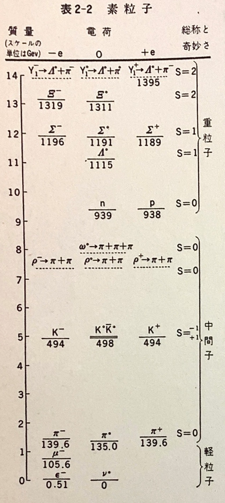

[up](top.md)

## 2 物理学の原理

### 2-1 はじめに

これからこの章で論ずるのは、物理というものに関して我々がもっている一番根本的な考え方---つまりものごとの本性を現在我々はどうみるのか---といったことである.このような考えがすべて正しいということがわかるまでには、どんな歴史を辿ってきたのかというようなことについては、いまは触れない: それは諸君にだんだんとわかってくると思う.

科学において、我々の関心をひくものは、千差万別であり、またその性質もいろいろである.例えば、海岸に立って海を眺めているとしよう.そこには水がある、くずれる波がある、泡がある、水がボチャボチャ動いている、音、空気、風と雲、太陽と青い空、光がある.砂があり、また、いろいろな岩石がある.それには固いのもやわらかいのも、永もちするのもしないのもあり、色も構成もさまざまである.動物もいるし、海藻もある.腹のすいたのも、病気のもいる.そしてその波うちぎわには、これらに見入っている人がいる.そこには幸福や思索さえあるかも知れない.他の場所へ行ってみても同じことだ.そこにはいろいろなもの、さまざまの環境がある.どこへ行ったとしても、自然はこのように複雑きわまりない.そこで我々の探究心から、次のような疑問が湧いてくる.すなわち、これらのものごとは実に千差万別であるが、それを全体としてまとめてみて、そしてその千差万別の面というものは、比較的少数の基本的なことがらの作用、あるいは力がいろいろに組み合わさったものの結果として生じたものであるとして、理解することはできないのだろうか.

例えば: 砂というのは岩石とは違うのだろうか.つまり、砂というのは非常に小さい岩石にすぎないのではなかろうか.月も大きな岩石なのだろうか.岩石というものを理解しさえすれば、砂をも月をも理解することができるのではなかろうか.風というのは、空気の動きであって、海で水が動くのに似たものなのではないか?いろいろな運動についていえば、どんな共通の面があるのか?いろいろな種類の音に共通なところは何か?色には何種類あるのか?等々.このように我々はすべてのことをだんだんと分析していく.あるいは、初めは別もののように見えたことをいっしょにしていく.そして、違うことがらの数を減らし、それによってことがらを更によく理解することができるようになるということを目指しているのである.

上に述べたような疑問に対して、一部分の解答を与えうる方法が考え出されたのは、今から二、三百年前のことである.すなわち、それは科学的方法といわれるものであって、それは観察と推理と実験が相まって形成されるものである.ここでは話を限って、物理的原論などといわれるものの根本的の立場、あるいは上の科学的方法を適用することによって生まれてきた基本的概念の意味といったものを述べるに止めよう.

いったい、我々が何かを"理解"するというのは、どういう意味なのであろうか.複雑な森羅万象が"世界"をなしている有様は、いわば、神々がチェスの大手合せをしているのに似ていて、我々はその見物人なのだと考えることができる.しかし、我々はその勝負の規則を知らないのである.我々にできるのは、それを見物するということだけだとする.永く見物しているうちには、若干の規則が我々にわかってくるということも、もちろん、あるだろう.この勝負の規則が、我々が物理学原論といったものにあたる.しかし、たとえ規則がすっかりわかったとしても、駒の一つ一つの動きがどういう意味をもっているかを理解することはできまい.それはあまりにこみ入ったものであり、我々の視野はあまりに浅く狭いものだからである.諸君がチェスができるなら知っているだろうが、規則をみんな覚えるのは大したとではない.しかし、一番いい手を選択すること、あるいはある対局者が何故その手を指すのかということを理解することは、非常に難しい.これにもまして、自然はそうなのである:とはいっても、その規則をすべて見つけ出すぐらいのことは可能であるかもしれない.しかし、現在ではすべての規則がわかっているわけではないというのが実情である.(チェスのキャスリング(*)に似たようなことが、自然にも時々起こって、我々はまだそれを理解することができないのである.)規則がまだすっかり解っていないということをしばらくおくとしても、規則に基づいてはっきり説明できるということがらは、むしろ非常に限られているのである.というのは、あらゆる状態というものは、ほとんどみなおそろしくこみ入っているのであって、規則にたよっているだけでは、勝負の進行についていけないし、いわんや次に何がはじまるかなどということは、到底、想像もつかないからである.だから我々は、勝負の規則は何かという、より根本的な問題だけに話を限らざるをえない.そしてその規則がわかったとき、我々は世界を"理解"したと考えるのである.

勝負をみても、その内容があまりよく解らないといったが、もしもそうであるならば、我々が"推量"した規則がほんとに正しいかどうか、それをどうやって知ることができるだろうか.大ざっばにいって、それには三つの方法がある.第一は、自然がしつらえ、あるいは我々が自然をしつらえるとき、それが単純なものであって、関与する要素が少なく、これから何事が起こるかをはっきりと予測でき、我々の見出した規則がうまくあてはまるかどうかを検べることができるというような場合である.(将棋盤のすみに少ししか駒が残っていないような場合には、我々ははっきり見とおしをつけることができる.)

第二のいい方法は、たくさんの規則からやや一般的な規則を導き出して、それによって、もとの規則を験してみるというやり方である.例えば、ビショップは将拱盤の上で対角線の方向にだけしか動けないというのが規則である.したがって、ーつのビショップに着目すれば、何手動かしても、いつも赤なら赤の目にいるということになる.だから、ーつーつの細かい動きに立ち入ることができなくても、ビショップがいつも赤なら赤の目にいるかどうかをしらべさえすれば、その動き方について、我々の推定したところが正しかったかどうかをためしてみることができるはずである.もちろん、しばらくやっていると、このビショップが突如として黒い目にいるのを発見することがある.(これは、ビショップが敵にとられたときに、歩がなりこんで王手をかけ、黒の目の上のビショップになったのであることはいうまでもない.)物理学でも、このようなことがある.細かいところに立ち入ることができなくても、やがて我々は、全般にうまくあてはまる一つの法則を見出すことができ、そしてまたいつかは新しい法則を発見するかも知れない.物理学原論の立場からいって、最も興味のある現象は、新しい分野、規則があてはまらない分野---あてはまる分野ではない---にあるのはもちろんのことである.こうして、我々は新しい規則を見出していくのである.

我々の考えが正しいかどうかを知るための第三の方法というのは、三つのうちでは荒っぽいのだが、おそらく一番有力だと思う.それは大まかな近似によるというのである.将棋の名人が、何故、特にこの駒を動かすのかということはわからなくても、キングを守るためにそのそばにコマをよせているのだ、局面によってそうするのがいいらしいということは、大まかに理解することができる.これと同じように小さいところがどうなっているかはわからなくても、将棋を理解しうるというのに似た意味で、自然を多少なりとも理解しうるということがしばしばあるのである.

以前は、自然現象は大きくいくつかに類別されていた.例えば、熱、電気、力学、磁気、物性、化学現象、光(あるいは光学)、X線、核物理、引力、中間子現象等々.しかし、我々の目指しているのは、これら一連の現象は、実は全自然がその相異なるいろいろの面を見せているのだという立場からこれを眺めようということなのである.実験の背後にある法則を見出して、上のような類別を統合しようというのが、今日の基礎理論物理学の課題である.歴史的にいっても、これまでもこの統合ということは絶えず行なわれてきた.しかし、時がたつにつれて、新しいことがらがいくつか見出された.かっては、いろいろのことがらがうまく統合されたと思われていたが、突如として、X線が発見された.それから更にいくつかのものが統合されたところへ、中間子が発見された.だから、このような進み方は、あらゆる段階において、キチンと割り切れているというものでもないのである.大多数のものは統合されているとしても、いつも、それからは針金や糸があらゆる方向にたくさんのびているというのが現状である.このことについて次に説明しよう.

この統合の歴史の例として、次のようなことがある.まず熱と遅動論とをとりあげよう.原子が運動しているとすると、その運動が大きいほどこの系は熱をたくさんもっているのたから.熱や温度の現象はすべて、運動の法則によってあらわされる.もうーつの著しい例は、電気と磁気と光との関係が発見されたことである.今日ではこれら三つのものは、電磁場とよばれている一つのものを、別々の面からみたものであるということがわかっている.更に、化学現象、いろいろな物質が有するいろいろの性質、化学量子力学にあらわれる原子粒子の行動などが、みな一つのものとして考えられるというのも、統合の一つである.

ここで当然問題となるのは、あらゆるものが一つに統合され、そしてこの世界というものは、そのただ一つのものが、別々の面をあらわしているのだというようなことになるのだろうか、そのことは、はたして可能なのだろうか、ということである.それは誰にもわからない.我々にわかっているのは、だんだんやっていると、いろいろなことを統合することができるということであり、そしてまた、それにうまく合わないものもみつかる.ちょうど、はめ絵をうまくあわせていこうとしているのだということである.はめ絵の数は有限なのか、そもそもはめ絵に境があるのかどうかということは、もちろんわかってはいない.はめ絵が有限個数で完了するものだとしても、そのことははめ絵が完成するまではわからない.しかし、これから述べようとするのは、できるだけ少数の原理によって、基礎的の現象を統合的に理解するというその立場からもいって、この統合がどのくらいまでいっているか、現在ではどんな状態になっているかということである.簡単にいうなら、物は何からできていて、いくつの要素で話がすむかということである.

### 2-2 1920年以前の物理学

ここでいきなり現在の自然観からはじめるのは、少し難しいから、まず1920年ころにはどうであったか、その様子を考えてみて、その中から二、三の点を取り上げてみることにしよう.森羅万象が演じている"舞台"は、ユークリッド幾何学の3次元の空間であって、時と称する流れにそって、物事が変化している.舞台の上にあるのは、例えば原子といったような粒であって、それぞれ特性をもっている.特性というのは、第一に慣性である: 一つの粒が運動しているとすると、力がそれにはたらかない限り、同じ方向に運動しつづける.第二は力である.当時、力には2種類あると考えられていた.第一の種類の力というのは、非常にこみ入った、また精細な相互作用力であって、それによっていろいろなアトムの複雑なくみあわせが作られているものである.例えば、温度を上げると食塩のとけるのが早くなるか、おそくなるかということをきめるのは、このカである.もう一つの類の力というのは、遠隔相互作用---変化の激しくない静隠な引力---として知られているものであって、距離の自乗に反比例し、万有引力といわれている力である.この引力の法則はよくわかっていて、非常に簡単なものであった.しかし、物体が運動しているとき、運動をつづけるのは何故か、あるいは、万有引力の法則があるのは何故か、というようなことは、もちろん、わかってはいなかった.

自然を記述するというのが、いま我々の問題である.この立場からするならば、気体に限らず、すべての物質は、運動している粒子が無数に集まったものである.我々は、海辺に立ってたくさんのものを見たが、それらを互いに関連づけることはわけない.まず圧力: これはアトムが壁や何かに衝突することによって生ずる; すべての空気のアトムが全体として、一方向に動くなら、その移動が風である; 内部の不規則な運動が熱である.また粒がたくさん集まって、密度過剰の波になり、おしあいへしあいしているところもある.この密度過剰の波は音である.こんなたくさんのことを理解することができるというのは、大した成果である.これらのうち、あるものについては、前章でもすでに述べておいた.

粒にはどんな種類があるか.当時は92種類だと思われていた:結局において92種類の原子が発見された.その化学的性質に応じて、それぞれ違った名前がつけられていた.

次の問題は、近距離力とは何か?ということである.炭素は、酸素一つ、あるいはときに酸素二つを引張ることがあるが、それは何故か?酸素三つを引張らないのは何故か?原子の間の相互作用のからくりは何なのか?それは万有引力であるか?答はノーである.万有引力は弱くて問題にならない.いま一つの力を想像し、それは引力のように距離の自乗に反比例するが、もっとずっと強く、しかも引力とくらべて次に述べるような違いをもっているものとしよう.引力では、あらゆるものが他のあらゆるものを引張る.しかしいま、この"もの"に2種類あると考えよう.そして、この新しいカ(もちろん電気力である)は、"同"は反し、"異"は引くという性質をもっているとする.この強い相互作用をもっている“もの''を電荷という.

こうだとすれば、どういうことになるだろうか.いま"異"が二つ、すなわちプラスとマイナスとがあって、互いに引合って、非常にしっかりいっしょになっているとしよう.そしてまた、それからある距離のところに、別の電荷があるとしよう.このとき、この電荷は、何程の引力を感ずるであろうかといえば、それはほとんどゼロであろう.そのわけは、はじめの二つの電荷の大きさが等しいとすると、第一のものによる引力と第二のものによる斥力とが、ちょうどつりあってしまうからである.それ故、ちょっと離れれば力はほとんどない.しかし、もしもこの第三の電荷が非常に近付いたとすると、引力があらわれる.それは、"同"の間の斥力と"異"の間の引力とによて、"異"同士を近よせ、"同"をおしはなすからである.こうして斥力は引力よりも小さくなる.原子はプラスとイナスの電荷から成り立っているが、原子がかなり離れていれば(万有引力は別として)その力をほとんど感じないのは、このためである.原子がもっと近くなると、"互いに内部をみぬいて"、その電荷の分布をかえ、その結果として非常に強い相互作用があらわれるのである.原子間の相互作用の根本は、要するに、電気的なものである.このカの大きさは莫大なものであて、プラスとマイナスとはすべてできるだけ強く結び付いているのが普通である.我々自身さえも例外ではないが、すべてのものは非常に強く作用しあうプラスとマイナスのこまかい粒からできているのであって、それがうまくバランスしているのである.ときにはたまたま、マイナスあるいはプラスがうばい去られる(マイナスをうばい去る方がやさしいのが普通である)こともある.そんな場合には、パランスがくずれて、電気的引力の影響があらわれてくる.

万有引力にくらべて、電気力ははるかに強い.その見当をつけるために、ここにさしわたし1mmの砂が2粒あって、それが30mの距離にあるとしよう.この二つの間の力が釣り合っていないとし、また“同”が斥けあうということもなくて、あらゆるものが相手のあらゆるものを引いているとする.そうしたら、力はどのくらいの大きさになるか?驚くなかれ、この二つの間には300万トンの力がはたらくことになる!電気的効果がわかるくらいにあらわれるには、負あるいは正の電荷の数に、ほんの少しの過不足があればよいのである.帯電しているものと帯電していないものとの間に、一見、差があるようにはみえないが、それはまさにこのためなのである.帯電というようなことに関与する粒の数は非常に少なく、一つの物体の目方や大きさにはなんらの差を生じないのである.

このように考えてくると、原子というものはだいぶ理解しやすいものになった.原子には、中心に"原子核"があって、正の電気をもち、非常に重い.この原子核のまわりを、非常に軽くて負の電気をもっているいくつかの"電子"がとり囲んでいる.これまではこのように考えられていたのである.しかし、今では話はもうちょと前進している.原子核自身の中に、陽子と中性子という2種類の粒子があって、それはほとんど同じ重さであり、共に非常に重いというのである.陽子は帯電しているが、中性子は帯電していない.いま、一つの原子の核の中に陽子が六つあるとすると、そのまわりには電子が六つある.(普通の物質の世界では、負の粒子はすべて電子であて、それは原子核を構成している陽子や中性子とくらべると非常に軽い.)これは化学元素表で6番の原子であって、炭素と呼ばれる.8番の原子は酸素と呼ばれる等々、化学的性質は、原子の外側にある電子によってきまり、その電子がいくつあるかということだけによってきまるのである.このように、ある物質の化学的性質は、電子の数という一つの数のみによってきまる.(化学者の元素の表は、1、2、3、4、5等でもよいのである."炭素"という代りに、電子を六つもっているという意味で"元素6番"といってもよい.もちろん元素というものがはじめて発見されたときには、このように番号がつけられるということはわかっていなかった.また番号だけにすると、かえってものごとが複雑になるかも知れない.あらゆるものを番号で呼ぶよりは、やはり名前と符号をつけておく方がよさそうである.)

電気力については、更にいくつかのことがわかってきた.電気的の相互作用を文字どおり解釈するなら、二つのものが、正対負で互いに引きあうというだけのことになる.しかし、この考えは相互作用をあらわすのには、やや不適当であることがわかった.それで、正の電気があると、空間をいわば変形させ、そこに一つの"条件"をつくり、そのため、そこに負の電荷をもってくるとそれが力を感ずる、といった方がより適切なのである.この力を生ずる潜在能力を電場という.そして一つの電子をある電場におくと、それが"引かれる"というのである.

こうすると、ここに二つの規則があることになる.(a)電荷が場をつくる.そして、(b)場の中の電荷は力をうけて動く.こう考えるわけは、次の現象を取り扱ってみると明らかになる: 例えば、櫛なら櫛を帯電させ、帯電した紙を、それからある距離のところにおく.そして櫛を前後に動かしてみる.そうすると、紙はいつでも櫛の方に向かって反応する.櫛の動きを速くすると、紙は少し取り残され、反応におくれが出る.(はじめ櫛の動きがそれほど速くないときには、めんどうなことが起こる.これは磁気のためである.磁気の影響は相対的に運動する電荷によって生ずるのであって、磁力と電気力とは一つの場に帰せられ、、全く同一のものの違った二つの面とみることができる.変化する電場には、必ず磁気が伴う.)紙をもっと遠くにすると、反応のおくれは更に大きくなり、そして面白いことが起こってくる.二つの帯電体の間の力は、距離の自乗に逆比例するのであるが、これに対して、電荷を振動させると、その影響ははじめに想像するよりもすっと遠くまでに及ぶのである.すなわち、影響の小さくなり方は逆自乗よりもずっとゆるやかである.

ここで一つのアナロジーをあげよう: 我々が水泳プールの中にいるとして、すぐそばにコルクが浮んでいるとする.そこでもう一つ別のコルクを手にもって水をおしてやれば、それによってはじめのコルクを"直接"に動かすことができる.いま、この二つのコルクだけに目をつけてみたとすると、一方のコルクは、他方のコルクの運動に応じて、直ちに運動をはじめたということになる---この二つのコルクの間には一種の"相互作用"があるといえる.我々が動かしたのは実は水なのである; そして次にその水が他方のコルクを動かしたのである.すなわち、水をちょっとおせば、その近くにあるものは動き出すという"法則"をたてることができる.もしも、第二のコルクがもっと遠くにあるならば、もちろん、それはほとんど動かない.我々は水を局部的に動かしたたけだからである.ところが、コルクをボチャボチャふるわせていると水の運動が水を動かし、その水の運動が次の水を動かすという新しい現象が起こりはじめて、波が遠くに伝わていく.このように、ものをふるわせると、すっと遠くまで振動的影響が及ぶのであるが、これは直接の相互作用として理解することはできない.だから、直接の相互作用という考えは、水の存在ということにおきかえねばならず、電気の場合には、電磁場と呼ぶものにおきかえねばならないのである.

電磁場は、波をはこぶ.例えば、光もそれであり、放送に使われる波もそれであるが、電磁波というのがその一般的な名称である.これらの振動波の周波数はいろいろである.一つの波と他の波との違いは、振動の速さにある.電荷を振動させるのをおそいところからだんだん速くしていって様子をみると、その全域にわたって、それぞれいろいろ違った現象があらわれるが、1秒間の振動数という一つの数を指定するだけで、それらをまとめて整理することができる.部屋の壁についている電流回路から得られる普通の"電源"の振動数は、1秒におよそ100である.振動数を500ないし1000キロサイクル(1キロサイクル=1000サイクル)に上げると、空中に"放送中"ということになる.ラジオ放送に使われる振動数は、このあたりである.(この空中は、空気に関係がないことはもちろんである.空気がなくても、ラジオ放送はできる.)更に周波数を上げると、FM放送やテレビ放送に使われる範囲になる.まだもっと先のことをいうと、例えばレーダーなどには極超短波が使われる.もっともっといくと、これらのものを"見る"ための道具はいらなくなり、人間の目で直接に見ることができるようになる.周波数が1秒に$5 \times 10^{14} \sim 5 \times 10^{15}$の範囲となって、さっきの電気を帯びた櫛をその速さでふるうことができたとしたら、この櫛が、周波数によって、赤や青や紫に見えることになる.周波数がこれよりも下ならば赤外線、上ならば紫外線である.周波数がある範囲内にあると、我々の目に見えるが、そういても、物理学者の立場からいえば、他の部分にくらべて、ここの部分の方が特に面白いというわけでもない.しかし、人間の立場からみれば、これは、より関心のあることであるのはもちろんである.更にこれ以上の周波数にいくと、X線になる.X線は、周波数の非常に高い光にほかならない.もっといくと、ガンマ線になる.X線といい、ガンマ線といっても、この二つの言葉はほとんど同じ意味である.原子核からくる電磁波をガンマ線、原子からくる高エネルギーの電磁波をX線というのが普通であるが、周波数が同じなら、その源は何であても、物理的にこれを区別することは不可能である.更に周波数の高いところ~いって、1秒に$10^{24}$回くらいになると、それは例えばこのCaltech(*)にあるシンクロトロンで人工的に発生させることができることがわかっている.宇宙線の中にある波動のうちには、びっくりするくらい周波数の高い電磁波---上のよりも1000倍も速い周波数の---がみつかる.この種の波は、人為的にはつくれない.

表 2–1 電磁波スペクトル

|周波数(振動数/秒)| 名称        | およその性質  |
|:---------------:|:------------|:---------------|
|  10^2           | 電気的擾乱  | 場             |
| 5x10^5 - 10^6   | ラジオ放送  | 波動           |
| 10^8            | FM〜TV      | 波動           |
| 10^10           | レーダー    | 波動           |
| 5x10^14 - 10^15 | 光          | 粒子           |
|  10^18          | X線         | 粒子           |
|  10^21          | γ線(放射能) | 粒子           |
|  10^24          | γ線(人工的) | 粒子           |
|  10^27          | γ線(宇宙線) | 粒子           |

### 2-3 量子物理学

電磁場という考え方、そしてまたこの場に波がつたわるということを述べてきたのだが、これから説明するように、これらの波の様子というものは、実に波らしくない奇妙なものなのである.周波数が高いと、波としてよりも、粒として行動するといった方がずっと事実に近い! この奇妙な行動を説明するのが、1920年直後に発展した量子力学である.3次元空間としての空間観があり、そしてそれと別のものとしての時間観があるという考えは、アインシュタインによって変更され、時空間という一つのものに統合された.そして次に、引力をあらわすために、曲率のある時空間に統合されたのであった.これは1920年のすこし前のころであった.かくて"舞台"は時空間にかわり、引力はその時空間のある変形であるらしい.そのうちに、粒子の運動の法則が正しくないことが発見された.原子の世界では、"慣性"や"力"の力学法則は、正しくない---ニュートンの法則は間違っている.そして、黴視的なスケールにおけるものの行動は、巨視的なスケールにおけるものの行動と全然違ったものであるということが発見されたのである.この辺のことが、物理学を困難にし---かつ非常に面白くするところなのである.困難だというのは、徴視的なスケールにおけるものの行動がたいへん“不自然”だからである.我々は、そういうことについての直接の経験を一つももっていない.微視的のところにおけるものの行動は、既知のものとは全く違っている.だから、その行動は、数式であらわすより他にない.しかし、これは困難なことであり、大いに洞察力を発揮しなければならない.

量子力学には、いろいろな特色がある.まず第一に、一つの粒子が、きまった位置ときまった速さをもっているという従来の考えは、もはやここでは許されないのである; その考えは間違っているのである.昔流の物理学がどう間違っていたかということを示す一例をあげるならば、量子力学には、あるものがどこに存在し、またそれがどんな速さで運動しているか、ということの両方を知ることはできないという法則があるのである.運動量の不確定と位置の不確定とは相補的であって、両者の積は一定である.この法則は、次のように書ける:$ΔxΔp≧h/2π$.このことについては後にくわしく述べる.ところで、次に述べるような非常に不思議なバラドックスがあるが、上の法則によってこれを説明することができる.もしも原子がプラスとマイナスの電荷から成り立っているのならば、マイナスの電荷がプラスの電荷の上にのっかって(マイナスとプラスとは互いに引きあっている)、電荷を完全に帳消しするくらいに近くくっついてしまいそうだが、そうならないのは何故だろうか?何故原子はこんなに大きいのか?原子核が中心にあって、電子がそのまわりにあるというのは何故か?昔は、それは原子核がそれだけ大きいからだと思っていた; しかしノーである.原子核は非常に小さいのである.一つの原子の直径はだいたい$10^{-8} \mathrm{cm}$であるのに対して、原子核の直径はだいたい$10^{-13}\mathrm{cm}である.もしここに一つの原子があって、それの原子核を目に見える大きさにしようとするなら、原子全体を大きな部屋くらいの大きさに拡大しなければならない.そうすれば、原子核はほんのごみつぶくらいになって肉眼でやっと見えるようになる.ところが原子の目方はほとんど全部この小さい小さい原子核が占めているのである.しかしそれにしても、電子が原子核の方へ落ち込んでこないのは、何のはたらきによるのだろうか?それはこうである: もしも電子が原子核の中にあるというなら、我々にはその位置が正確にわかっていることになるが、不確定性原理によれば、そのときは電子は非常に大きな(しかし不確定の)運動量、したがって非常に大きな運動エネルギーをもっていなければならないということになる.エネルギーがそんなに大きいならば、電子は原子核から飛び去ってしまう.そこで、電子はある妥協をするのである: 電子はこの不確定の入る余地を残して、この原理にあうように小さな振動運動を行なうのである.(ここで思い出してほしいのは、一つの結晶でも、それを冷やして絶対0度にしたときに、原子は運動をやめないで、振動しつづけているということである.これは何故か?もしも運動をやめたなら、原子の位置がはっきりわかり、運動はゼロだということになるが、これは不確定性原理に反する.我々は原子がどこにあり、またどんな速さで運動しているかを知ることができないのだから、原子はそこでぶるぶる振動をつづけているよりほか仕方がないのである!)

量子力学は、科学の考え方、哲理といったものに、非常に重大な変革をもたらしたのであるが、その一つは、ある条件の下で、次に何が起こるかということを正確に予報することはできないということである.例えば、一つの原子を考えると、それが光を発するような状態におくこともできるし、また、それが光を出したなら、光子---後に述べる---を捉えて測定することもできる.しかし、原子がいつ光を出すかということを予報することはできない.また原子がいくつあるときに、どの原子が光を出すかを予報することもできないのである.これは、内部の"しかけ"がまだ充分よくわかていないからだと、諸君はいうかも知れな.ところが、そうではないのである.そういう内部のしかけというものはないのである; 今日、我々が理解するところによると、自然というものは、一つの実験をしたときに、何が起こるかをはっきり予報することは、原則的に不可能であるという性格をもっているのである.これはたいへんなことである; かつて哲学者は、科学の根本的の要請は、条件を同じにすれば、同じことが起こるということであるといった.しかし、これは正しくない; これは科学の根本的要請ではないのである.じっさいは、同じことは起こらず、我々が知りうるのは、何が起こるかということの統計的の平均であるに過ぎない.こういっても、科学が全然崩壊してしまったのではもちろんない.さて、哲学者は、科学として絶対に必要なものは何かということについて、いろいろな意見を述べている.しかし、これまでのところでは、それらはみなむしろ素朴であり、おそらく間違っているのである.例えば、ストックホルムで一つの実験を行ない、そして同じ実験をキトーで行なったとすれば、同し結果にならなければならないというのが、科学研究にとって根本的のことであると、ある哲学者はいう.しかし、これは完全にあやまりである.科学がそのようなものであるということは必要ではない.これは経験的事実であるかも知れないが、必要ではない.例えば、この実験というのがストックホルムで北極光をみるということであれば、キトーではそれは見えない;これは違った現象である."しかし"と諸君はこういうだろう."これは外界の問題である; ストックホルムで自分のからだを箱に閉じこめて、幕をおろしたとしたら、その中で何か違いが起こるだろうか?"起こるのである.どの方向へも自由にふれる振子があったとして、それを一方に引張ってから放したとすると、振子の振動はほとんど一平面に限られているが、完全にそうではない.その面は、ストックホルムではゆっくり回転していくが、キトーでは回転しない.幕はおろしてあるのだ.このようなことが起こっても、別段科学が崩壊するわけではない.科学の根本仮説、根本哲理とは、何か?一つの考えの正否を検す唯一のものは実験であるということを第1章で述べた.もしも、ストックホルムで行なった実験とキトーで行なった実験の大部分が同じようになったとすれば、その"大部分の実験"は、何か一般的の法則をたてるのに役立つであろう.そして同じようにならなかった実験は、ストックホルム附近の環境のせいであったといえるだろう.いずれにしろ我々は実験の結果をまとめる方法を考え出すのであって、その方法がどんなものであるかを予め知らされる必要はない.同じ実験をすれば同じ結果が生じるということがわかったとすれば、それはそれで結構である.しかし我々が実験をしてみて、そういかないなら、そういかないのである.我々はみるとおりのものを取り上げ、現実の経験にてらして他の考えをみなまとめていかなければならない.

再び、量子力学と基礎物理学に戻るのであるが、ここで量子力学的原理のくわしいところに立ち入ることはできない.それは、なかなか理解しにくいからである.ここでは、そういう原理があることとして、その結果がどんなことになるか、二、三の例を述べることにしようと思う.量子力学の一つの結果によると、我々がこれまで波動として考えてきたものが粒子のようなふるまいを示したり、また逆に、粒子が波動のようなふるまいを示すことがあるのである.一つの波動というものと、一つの粒子というものとの間に区別はないのである.このように、量子力学は、場とその波動というものと、粒子というものとを一つにまとめるのである.周波数が低いと、現象には場としての面の方がよくあらわれて、近似的には普通のことばで記述するのに都合がよい.しかし周波数が高くなると、我々が普通に使っているような測定装置に対しては、現象には粒子としての面の方がよくあらわれる.周波数にもいろいろあるといったけれども、周波数がだいたい1秒に$10^{12}$以上になると、その周波数が直接的に関係してくるというような現象はまだ見付かっていない.我々は、量子力学の粒子-波動の考えが成り立っとして、それから出てくる法則を使って、粒子のエネルギーからそのような高い周波数を算出するだけのことなのである.

かくて、我々は電磁的相互作用について、新しい見方をするようになったのである.電子、陽子、中性子に加えて新しい粒子を考える.この新しい粒子は光子である.電子と陽子との相互作用は電磁理論であるが、量子力学的にみて、あらゆる点で正しいこの新しい見方は、電磁量子力学と呼ばれる.光と物質、あるいは電場と電荷の相互作用に関するこの基本的理論は、これまでの物理学における最大の成果である.引力と原子核現象とを除いて、あらゆる普通の現象の基本的法則が、この一つの理論の中に含まれているのである.例えば、この電磁量子力学から、既知の電気的、機械的、化学的の法則はすべて出てくる.撞球のタマの衝突、磁界における針金の運動、一酸化炭素の比熱、ネオンサインの色、食塩の密度、水素と酸素が反応して水になる---これらの現象はみなこの一つの法則から出てくることがらなのである.ことがらが簡単で、近似がゆるされるなら、これらの現象のくわしいところまで立ち入ることもできるが、そんなことはまずほとんどない.しかし、どんなことが起こっているかを或る程度まで理解することができる場合は多い.現在のところ、.原子核よりも外側で起こっていることについては、電磁量子力学に例外は一つもない.原子核の内部については、そこで何が起こっているかはわかっていないので、例外があるかどうかもわからない.

原理的にいって、電磁量子力学は化学のすべてと生命の理論である.というのは、生命というものが最終的には化学に帰し、そしてまた化学はすでに物理学に帰しているからである.(物理学の中で、化学に関係のあるところは、すでによくわかっている.)更に、この電磁量子力学という大したものによると、新しいことがいくつも予言されるのである.まず第一に、非常に高エネルギーの光子やガンマ線等の性質が予言される.また次のような著しいことも予言された: 電子のほかに、質量はそれと同じで、電荷は反対の粒子、陽電子とよばれるものがあるはずであり、それが電子に近付いていっしょになると、光、すなわちガンマ線が出るというのである.(光とガンマ線とは、要するに全く同じものである.周波数の目盛で別のところにあるだけのことである.)これを更に一般化して、おのおのの粒子には、それぞれ反粒子があるということも正しい.電子の場合には、その反粒子は陽電子という別の名前をもっているが、他のたいていの粒子の場合には、反何々、例えば反陽子とか反中性子とかいう.電磁量子力学では、二つの数を指定しさえすれば、他のいろいろの数はたいていそれから出てくると考えられている.指定するその二つの数というのは、電子の質量といわれるものと、電子の電荷といわれるものである.実をいえば、これは全く正しいとはいえない.というのは、化学においては、それぞれの原子核の重さをあらわす1列の数があるから、である.このことについては次に述べる.

### 2-4 原子核と粒子

原子核は何からできているのか、そしてそれはどんなふうになっていっしょにかたまっているのか?それは莫大な力によっていっしょにかたまっていることがわかっている.それが解放されるときにでるエネルギーは、化学エネルギーとはくらべものにならないくらい厖大なもので、その違いはTNT爆発と原子爆弾との違いと同じである.これは、原子爆弾が原子核の内部における変化に関係しているのに対して、TNTの爆発は、原子の外側にある電子の変化に関係しているからであるのはいうまでもない.問題は、原子核の内部で陽子と中性子とを結び付けている力は何かということである.電気的の相互作用が光子という一つの粒子に関係づけられるように、中性子と陽子の間の力にもある種の場があって、この場がピクピク動くと、それが一つの粒子のようにふるまうのではあるまいか、というのが湯川秀樹の考えである.もしもそうだとすると、自然界には、陽子や中性子以外にも、まだほかの粒子がありうることになる.そして、湯川はこれまでにわかっている核力の特性から考えて、この粒子の性質はこれこれであるはずだということを導き出すことができた.例えば、この粒子の質量は、電子の二、三百倍であるはずだと予言した; ところがこれはいかに、宇宙線の中にまさしくこの質量をもった粒子が発見されたのである!しかし後になって、これはまた別の粒子であることがわかった.この粒子はμメソンあるいはミューオンなどと呼ばれている.

ところが、これから少したって、1947、8年の頃、また別の粒子が発見された.この粒子は、πメソンとかパイオンとかいうものであって、湯川の条件を満足する.核力を生ずるためには、陽子と中性子のほかこのバイオンを考えに入れなければならないというわけだ.そこで諸君はこう叫ぶだろう."何とすばらしいことだ!この理論では、湯川の思ったように、パイオンを考えに入れて量子核力学が組み立てられた.そしてそれがうまくいった、これであらゆることが説明される!”しかし残念でした、ここに出てくる数式は非常に難しくて、その理論からどういう結果が出てくるかという見当をつけたり、また実験とくらべてみたりすることは、まだ誰にもできないのである.こういう状態がいまやほとんど20年続いてきた.

我々は一つの理論にこだわっているのだ.それが正しいか間違っているかは知らないが、少し間違っている、あるいは少なくとも不完全であることはわかっている.我々がこの理論からどんな結果が出てくるかを計算しようとして、モタモタしている間に、実験屋はいろいろのことを発見している.例えば、彼らはこのμメソンすなわちミューオンをとっくに発見しているのだが、我々にはこれがどこにはまるのかわかっていない.また、宇宙線の中にも、まだほかの“番外の”粒子が多数発見されている.今日ではおよそ30種類の粒子があるということになっているが、これらすべての粒子の間にどんな関係があるのかとか、なんのために自然がそんな粒子を必要とするのかとか、互いの関連はどういうものなのかとかいうことを理解するのは、容易なことではない.我々が今日理解するところによれば、これらいろいろの粒子というものは、同じ一つのものがいろいろの違った面をみせているというものではない.こんなにたくさんの別々の粒子があるということは、バラバラな知識がたくさんあるだけで、よい理論がないということを示している.電磁量子力学が大成功を収めた後にも、原子核物理にはあらっぽい知識がかなりあるのである.それはいわば半分は経験、半分は理論であって、陽子と中性子との間に或る種の力を仮定して、それからどういう結果が出てくるかを調べるというのだが、その力がどこからくるのかは、実はわかっていない.これを別にしては、我々はほとんど進歩していないのである.化学元素の数は実にたくさんある.化学では、それら元素の間に、思いもよらないあることが突如として発見されたのであって、それはメンデレーフの周期表に示されている.例えば、ナトリウムとカリウムとは化学的性質がよく似ていて、メンデレーフの図表で同じ行にある.上に述べた新しい諸粒子に対しても、メンデレーフ式の図表に相当するようなものがあるのではないかと思われていたが、アメリカのゲルマン、日本の西島によって、そのようなものの一つが独立につくられた.彼らが粒子を分類するにあたって基準としたのは、新たに導入された一つの数であって、"奇妙さ"$S$とよばれるものである.この数は電荷と同じように、粒子それぞれがもっている.そして、核力によって起こる反応では、電荷が全体として保存するように、この数も保存するのである.

表 2–2 素粒子 

表2-2には、すべての粒子が示してある.いまここでくわしく論ずるわけにはいかないが、この表をみると、我々の知らないことがいかに多いかということがわかるだろう.おのおのの粒子の下には、その質量がMevという単位で与えてある. $1\mathrm{Mev}$は$1.782 \times 10^{-27}グラム$に等しい.この単位が採用されるようになったのには、歴史的な理由があるのだが、ここではふれない.質量の大きい粒子は、この図の上の方に書いてある; 中性子と陽子とがほとんど同じ質量であることもわかる.たての行には、電荷が同じの粒子が並んでいる.中性のものは一つの行に、正の電荷をもっているものはみなその右の行に、負の電荷をもっているものはその左の行に書いてある.

また、粒子は実線、"共鳴"は破線で示してある.この表に書いてない粒子もいくつかある.例えば、質量ゼロ、電荷ゼロの重要な粒子---光子とグラビトン---がそれである.このような粒子は、重粒子-中間子-軽粒子という分類形式にはうまくはまらない.また新しい共鳴($K^*,\varphi ,\eta$)で、この表に書いてないものもいくつかある.中間子の反粒子は表にのっている.軽粒子と重粒子の反粒子は別の表に書かなければならなかったのだが、それを書いても、この表を電荷ゼロの行で鏡にうつしたのと全然同じになるわけだ.電子、ニュートリノ、光子、グラビトン、陽子以外の粒子はすべて不安定であるが、それらが崩壊してできるものは、共鳴の場合だけが示してある.軽粒子は原子核との間に強い相互作用がないので、奇妙さをこれにあてがうことはできない.

中性子や陽子の仲間の粒子は、重粒子とよばれ、それには次のようなものがある.すなわち、質量が$1154\mathrm{Mev}$の"ラムダ"があり、他にシグママイナス、シグマゼロ、シグマプラスの三つがあって、その質量はみなほとんど同じである.1〜2％の程度でほとんど質量の同じの群、あるいは組になっているのである.一つの仲間の中の粒子は、同じ奇妙さをもっている.まず第一は、陽子-中性子の二つ一組であり、次は単独(ラムダ)であり、その次がシグマの三つ一組であり、最後がカイの二つ一組である.最近1961年には、更に新粒子が二、三発見された.しかし、それらははたして粒子なのだろうか？ その寿命は非常に短かく、できるとすぐほとんど瞬間的に崩壊してしまう.これを新しい粒子と考えるべきなのか、それともそれは、或るきまったエネルギーを有する"共鳴"相互作用の一種であって、それは崩壊によって生ずる$\Lambda$粒子と$pi$粒子との間に起こるものであると考えるべきなのか、我々にはわかっていない.

核反応に関与する粒子のなかには、重粒子の他に、中間子とよばれるものがある.まずバイオンがある.これには、正と負と中性のものがあって、三つ一組になっている.また、$K$中間子という新しいものも発見された.これは$K^+$と$K^0$との二つ一組になっている.また、一つの粒子がそれ自身の反粒子でない限り、あらゆる粒子にはその反粒子がある.たとえば、$\pi ^-$と$\pi ^+$とは反粒子であるが、$\pi ^0$はそれ自身の反粒子である.$K^-$と$K^+$とは反粒子である.$K^0$と$\bar{K}^0$ともそうである.更に1961年には、ほとんど瞬間的に崩壊してしまう中間子、あるいは中間子らしきもの$\omega$が発見された.この$\omega$とよばれるものは、我々の単位で質量780であって、三つのバイオンになる.二つのバイオンになるものもあるらしいが、あまりはっきりしていない.中間子、重粒子などの粒子と中間子の反粒子とはこの同じ表にのせてあるが、重粒子の反粒子は、電荷ゼロの行で"鏡にうつした"別の表になる.

メンデレーフの周期表では、多くの稀土類元素がはみだしているが、その点を除けば、たいへんうまくいっている.これと同じように、我々の表からはみだしているものもたくさんあるのである.それは、核の中で強い相互作用も示さず、核の相互作用にも関与せず、また核とも強い相互作用も示さないような粒子である.これらの粒子は、軽粒子とよばれ、次のようなものである.まず電子がある.質量は非常に小さく、我々の単位でたった$0.510\mathrm{Mev}$しかない.次にμ中間子、すなわちミューオンがある.その質量は電子よりはずっと大きく、その206倍である.これまでのすべての実験の結果からいえることは、電子とミューオンとの違いは質量の点だけである.他のあらゆることは、ミューオンに対しても電子に対しても全く同じように起こり、違うのはミューオンの方が電子よりも重いというだけのことである.重いのがあるというのは何故だろうか.何のためだろうか.それはわからない.これ以外に、ニュートリノという中性の軽粒子もある.その質量はゼロである.実は、ニュートリノにも2種類あって、一つは電子と、他はミューオンと関係があることが、今ではわかっている.

核粒子と強い相互作用を示さない粒子が、まだ他に二つある.一つは光子である.それから、もしも万有引力の場に量子力学的類推がきくならば(万有引力の量子理論はまだできていない)質量ゼロの一つの粒子、グラビトンがあるはずである.

この"質量ゼロ"とはいったい何のことか.ここでいう質量とは、静止している粒子の質量という意味である.一つの粒子の質量がゼロであるということは、いってみれば、それは静止していることはありえないということである.光子は決して静止していない.つねに1秒間186,000マイルの速さで動いている.質量とは何を意味するのか、このことは、相対性理論を理解すれば、もっとよくわかるようになる.これについては、そのうちに述べることにする.

このように我々の前にはたくさんの粒子があり、それらが素材となって物質が構成されているようである.幸いなことには、それらの間の相互作用がそれぞれみな違うというわけではない.事実、粒子の間の相互作用は4種類に限られている.強い方からいえば、核カ、電気カ、β崩壊相互作用、万有引力である.光子はすべての帯電粒子と関係があって、その間の相互作用の強さには$\frac{1}{137}$という数が出てくる.このカップリングの法則はくわしくわかっており、これがすなわち電磁量子力学である.万有引力はすべてのエネルギーと関係するが、そのカップリングは極端に弱く、電気のカップリングよりもずっと弱い.次にいわゆる弱崩壊---ベータ崩壊というのがあって、それによって中性子が陽子と電子とニュートリノとに比較的ゆっくりと崩壊する.これの法則は一部分わかっているだけである.いわゆる強い相互作用、中間子-重粒子相互作用は、このスケールで1という強さであるが、その法則は全然わかっていない.もっとも、任意の反応においては、重粒子の数は変化しないという規則くらいはいくつかわかっている.

表 2–3 基本的相互作用

| カップリング                     | 強さ*     | 法則 |
|:---------------------------------|:----------|:-----|
| 帯電粒子に対して光子             | ∼10^(−2)  | 既知 |
|すべてのエネルギーに対する万有引力| ∼10^(−40) | 既知 |
| 弱い崩壊                         | ∼10^(−5)  | 一部既知 |
| 重粒子に対して中間子             | 1          | 不明(一部ルールは判明) |

*「強さ」は、おのおのの相互作用に関与するカップリング定数を無次元で表したものです（∼は「およそ」という意味）.

今日、我々の物理学はこのようなおそるべき状態におかれているのである.要するにこういうことである.核の外のことについてはすっかりわかっていると思われる; 核の中では量子力学が通用する---これまでのところ量子力学の諸原理はうまくいかないことはない.我々の知識は、相対論的時空間という舞台におかれている; ことによると引力はこの時空間に内在するものであるかも知れない.宇宙がどのように始まったのか、我は知らない.空間や時間についての我々の考えが、非常に小さい距離に対しても正しいかどうか、それを正確にためす実験が行なわれたということもない.だから我々が知っているのは、そのような距離よりも大きいところでは我々の考えが正しいということだけなのである.つけくわえていうならば、このとき適用される規則は量子力学的原理であって、我々の知る限りでは、それは古くから知られている粒子にも、新しく知られた粒子にもよくあてはまる.原子核の中のカの起原から考えて新しい粒子が出てきたが、困ったことにはそれがたくさんあって、それらの間の相互関係を完全に理解することはできないのである.もっともそれらの間には驚くべき関係がいくつかあることはわかっている.かくて我々は、原子以下の粒子の微小の世界を理解するのにむかって手さぐりしながら徐々に進んでいるようである.しかし、どれだけ行なったらこの仕事が終りになるのか、それは全くわからない.

------
(*) チェスの手の一種
* California Institute of Technologyの略称.

[up](top.md)
