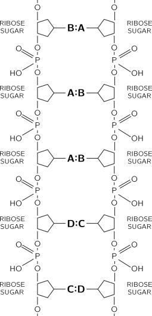

[up](top.md)

## 3 物理学と他の学問との関係

### 3-1 はじめに

すべての学問のうちで、物理学はいちばん基礎的かつ包括的であって、あらゆる学問の発展に大きな影響を与えてきた.昔、自然哲学と称せられるものがあった! 我々の近代科学はそれから生まれてきたものなのだが、物理学は今日ちょうどそれにあたる位置を占めている.物理学はあらゆる現象で基礎的の役目を演ずるので、他の学問分野の研究者たちも、それを勉強している.そこでこの章では、物理学以外の学問では、どんなことが基礎的な問題となっているかということを説明するつもりである.しかし、僅かな枚数で、そのこみいった、微妙な、そして見事なこどがらを本式に取り扱うことはとてもできない.枚数が限られているので、物理学と工学、産業、社会、戦争などとの関係を論ずるわけにもいかない.それどころでなく、数学と物理学との間にある極めて顕著な関係にさえもふれることができない(我々の見方からすれば、数学は自然科学でないという意味で、科学ではない.数学の正否をためすのは実験ではない).しかし、ここでまず明らかにしておかなければならないが、あるものが科学ではないからといって、それは下らないものだときまっていはしない.例えば、恋愛は科学ではない.だから、あるものが科学ではないといったところで、そこに何かあやまりがあるということにはならない.単に科学ではないというだけのことである.

### 3-2 化学

物理学からいちばん大きい影響を受けた学問は、おそらく化学であろう.歴史的にいうと、初期の化学で取り扱われたのは、ほとんどすべて今日我々が無機化学といっているもの、すなわち生物に関連のない物質の化学であった.元素というものがたくさんあり、その間にどんな関係があるのか、---また、それがどのようにして、岩石の中や地球の中などにある比較的簡単な各種の化合物を作っているのか.このようなことを見つけ出すのには、厖大な調査や研究が必要であった.この初期の化学は、物理学にとって実に重要なものであった.原子という考えは、主として化学の実験によって立証されたのだから、物理学と化学との間には、切っても切れない関連があったのである.メンデレーフの周期表からは、各種の元素の間に面白い関係がたくさんあることがよみとれるのであって、化学の理論、すなわち反応そのものの理論は、大部分この表に要約されている.これは、どの物質とどの物質とが、どのように化合するかという規則の集積であって、これが無機化学を形成するのである.これらの規則は、結局すべて量子力学の原理によって説明されるのだから、理論化学は要するに物理学なのである.しかし、強調しておかなければならないのは、これはあくまで原則的の話に過ぎないということである.前にもいったとおり、将棋の規則を知っているということと、将稘をさすことができるということとは、別問題である.規則を知っていても、うまくさせないということがあるのである.一つの化学反応を考えたとき、そこでどんな現象がおこるかということをはっきり予言するのは非常に難しい.しかし、ともかく、理論化学のいちばんの根本は、量子力学に帰することは確かである.

物理学と化学とから出た分野で、その両方によって発展した非常に大切なものがある.それは統計的方法である.これは、ある一つの状態があって、それを支配する運動法則がわかっているような場合に適用できるのであって、統計力学といううまい名前がついている.どんな化学状態であっても、そこには無数の原子が関係しているのであって、しかも、それらの原子はみな、全く偶然的な複雑な揺動を続けているのである.そのおのおのの衝突を分析し、おのおのの分子の運動をこまかく追跡することができたとすれば、どんな現象がおこるかという見当をつけることができないわけではない.しかし、これらすべての分子を追跡するのに、どれだけの数が必要かといえば、それはたいへんなものであって、どんな計算機の容量をも、あるいは、我々の思考容量をもはるかに超えてしまう.だから、このような複雑な状態を取り扱う方法を考え出すということが、非常に大切なのである.統計力学は、熱現象、熱力学現象の学問である.学問としての無機化学は、今までは、本質的には物理化学といわれるものと、量子化学といわれるものに帰した.反応はどんな速さで起こるか、どんな現象が起こるか、分子はどのように衝突するか、最初にとび出すのは何か、等々を研究するのが物理化学である.起こっている現象を物理法則にてらして理解するのに助けになるのが量子化学である.

化学のもう一つの分野は、有機化学で、生物に関連のある物質の化学である.かっては、生物に関連のある物質は非常に霊妙なものであって、無機物から人工的に作り出すことはできないと信ぜられていた.しかし、これは決して正しくはない---有機物と、無機化学で作り出されるものとの間には、何の違いもない.ただ有機物では分子の組合せがより複雑になっているだけのことである.有機化学は、このような物質を提供する生物学とも、また産業とも、非常に密接に関係していることは明らかである.また物理化学や量子力学は、無機化学と同様に、有機化学へも適用することができる.しかし、有機化学の主な問題は、こういうところにあるのではなく、むしろいろいろな生物系やいろいろな生物の中で作り出される物質を分析し合成することにある.そしてこれがだんだんと進んで、いつの間にか、生化学につらなり、生物学自身につらなり、あるいは分子生物学につらなることになる.

### 3-3 生物学

次は、生物の学問、すなわち生物科学である.生物学において、初期の生物学者が取り扱わなければならなかったのは、どんな生物がいるかをみつけ出すというような純記載的な問題であった.そして、のみの脚には毛が何本はえているかを数えるというようなこともしなければならなかった、このようなことが真剣に研究された後に、生物学者は、生物の中の機能の問題に入っていった.こまかいところに入るのはたいへんなので、研究は、まず大まかのところから始まったのはいうまでもない.

このとき、すでに物理学と生物学との間には、注目すべき関係があったのであった.それはエネルギー保存という物理法則が発見されるのに、生物学がその一翼を担ったということである.この法則をはじめていい出したのはマイヤーであるが、そのとき、彼は生物がとる熱とだす熱とをひきあいに出してこの例証としたのであった.

生物現象をさらによく調べてみると、そこにはたくさんの物理現象がある:血液の循環、鼓動、血圧等々、さらに神経がある:とがった石をふむと、ふんだということがわかり、ともかくその情報が足から上の方へ伝わってくる.どのようにしてこういうことになるのか.これは面白い問題である.生物学者の研究の結果によると、神経は非常に細い管であって、その壁は複雑でかつ非常に薄い.細胞がポンプのように働いて、この壁をとおしてイオンを動かし、ちょうど電気の場合のキャパシティーのように、外側には正のイオン、内側には負のイオンが分布するようになっている.この膜には面白い性質がある.もしも1カ所で"放電が起こって"、或るイオンが1カ所で通過したとすると、そこの電圧が下がり、その電気的の影響が近くにあるイオンに及ぶ.そしてそれがまた膜に影響を及ばして、その近所でもイオンを通過させるようになる.そして、これがまた次々に影響を及ぼすというわけで、とがった石をふんで、神経の一端が"刺激"されると、膜の"通過性"という波が神経繊維に沿って伝わっていくのである. この波は長い将棋だおしに似ている: 一端をつついてたおすと、それが次のをたおす、それがまた次のをたおす、こういうことが順々に進行していくのである.しかし、将棋の駒をたてなおさなければ、これではたった一つの情報しか伝えられない.神経細胞でも、駒のたてなおしと同じことだ.ふたたびイオンをゆっくり送り出して、次の刺激がきても大丈夫なようになるのである.このようなわけで、我々はどんなことを明らかにしようと努力しているのか、自らちゃんと承知しているのである(少なくとも、その見当はついている).この神経刺激に伴う電気的の変化は、もちろん、電気計器でしらべることができる.そして電気的の変化が現実に起こっているのだから、電気的変化に関する物理学が、この現象を解明するのに大いにものをいったのは明らかである.

これと反対なのは、脳の中のどこかから、神経に沿って信号が送り出されるという現象である.神経の末端では、どんなことが起こるか.神経の先の方はこまかい枝にわかれていて、筋肉のそばにある終板という構造につながっている.まだその理由ははっきりわかっていないのだが、刺激が神経の末端に届くと、アセチルコリンという化学物質の小さいタマ(一度に5ないし10分子)がそこからうち出され、それが筋肉繊維に働いて、それを収縮させる---何と簡単ではないか!しかし、なぜ筋肉が収縮するのだろうか.一つの筋肉というのは、非常に多数の繊維がぎっしりいっしょになっているものであって、ミオシンとアクトミオシンという二つの物質がそれに含まれている.しかし、アセチルコリンによってひきおこされた化学反応が、どんなからくりによって筋肉分子の寸法を変化させるのかということは、まだわかっていない.このように、機械的運動を生じさせる基本的のところはまだよくわかっていないのである.

生物学の領域は実にひろく、他にもまだまだたくさん問題があって、とても述べきれるものではない---視覚のはたらき(目の中で光は何をするのか)、聴覚のはたらき等々(思考のはたらきについては、心理学のところであとに述べる).生物学について、これまで述べてきたところは、生物学者の立場からいって、根本的でもなく、また生命の真髄にふれるようなものでもない.たとえこれらのことがすっかり理解されたとしても、生命それ自身を理解することはとてもできないからである.例えば、神経のことを研究している人は、神経のない生物というものはないのだから、自分の仕事こそ、非常に重要だと思っている.しかし、神経のない生命というものもありうる.植物には神経もなく、筋肉もない.それにもかかわらず、植物はいとなみを続け、生きているのである.だから生物学の根本問題ということになれば、もっと深いところをみなければならないのだ.このようにみていくと、すべての生物には共通の特性がたくさんあることがわかる.生物について、いちばん一般的にいえる特性は、それが細胞からできているということである.おのおのの細胞の中にはこみいったしくみがあって、そこではものごとが化学的に行なわれている.例えば、植物の細胞には、光をとり入れて蔗糖をつくりだすしくみがある.光が来なくなると、蔗糖は消費されて植物の生命を保持する.動物が植物を食べると、この蔗糖はそのからだの中で植物の光合成(くらやみではその反対)に非常に密接に関連した一連の化学反応を起こす.

図 3–1. クレプスのサイクル

生物の細胞の中では、こみいった化学反応がいろいろ起こっていて、一つの化合物が次々と他のものに変化していく.生物化学でこれまで行なわれてきた努力は実に大したものであるが、そのことの例として、図3-1を示す.この図は細胞の中でたくさん起こっている反応系列のごく小部分、百分の一といってもよいくらいのものについて、今までにわかっている知識をまとめたものである.

この図には、分子が一つのものから次のものへと順々に、小きざみに変化していく全系列が示してある.これは、クレプスのサイクル、呼吸サイクルといわれるものである.おのおのの化学物質も、各段階も、分子内の変化という点からみれば、かなり簡単なものである.しかし---これらが生化学における実に重要な発見なのだが---これらの変化を実験室の中で起こさせることは、いささか難しいのである.いまここに一つの物質とそれに非常に似た物質とがあったとすると、その間にはエネルギーの壁---岡---があってその間をへだてているので、一方から他の方へは変化しないというのが普通である.ここで次のアナロジーを考えてみよう.いま、ある場所に一つの物体があったとする.そして、それを同じ高さだが岡の向う側の場所に移そうとする.それには物体をおして岡の頂をこえさせればよい.しかしそうするには、それだけのエネルギーを加えてやらなければならない.これと同じように、励起エネルギーというものが途中にあるので、化学反応というものはたいていの場合起こらないのである.一つの化学物質に別の原子をつけ加えるのには、それをうんと近付けて、何かの再配列が起こるようにしてやらなければならない; そしてそうすればくっつくのである.しかし、そのように近付くのに充分なだけのエネルギーを与えることができないならば、おわりまでゆかないで、"岡"の途中まで上がるだけで、また戻ってきてしまう.しかし、我々が分子を文字どおり手につかまえて、その分子の原子をつぶしたりひっぱったり、ひいたりして穴をあけ、そこに新しい原子を入れてパチンと止めてやれば、岡のまわりをまわっていく別の道がみつかる.それには余分のエネルギーは必要でないので、反応がたやすく起こることになるのである.細胞の内部には、上にひきあいに出したような変化をする分子よりも、もっとずと大きな、分子が実際にあるのであって、それが複雑な方法によって、小さな分子をうまくおさえつけているので、反応がたやすく起こりうるようになっているのである.この非常に大きな複雑なもの酵素いう(これは糖の醗酵ではじめて発見されたので、以前は醗酵素とよばれていた.クレプスのサイクルの初めの方の反応は、醗酵で発見されたのである).酵素があると、それによって反応は進行する.

酵素は、蛋白質というまた別の物質からできている.酵素の分子は非常に大きく、かっ複雑であって、種類によって差があり、それぞれ特有の反応を左右するようにできている.図3-1のそれぞれの反応のところに書いてあるのが酵素の名前である(同じ酵素が二つの反応を左右することもある).ここに強調しておきたいのは、酵素それ自身は反応に直接参与していないということである.酵素は変化しない; そのはたらきは、一つの原子を一つの場所から他の場所へうつしてやるというだけである.それをすませた酵素は、次の分子に対してまた同じはたらきをする.ちょうど工場の機械のようなものである.もちろんそこには、ある原子が供給され、そしてまた他の原子がすてられるというみちがついていなければならない.例えば水素を考える; すべての化学反応で水素を運ぶ役目をする酵素がいくつかあって、それはそれぞれ特別なしくみをもっている.例えば、脱水素酵素には三つ、四つあって、それがクレプスのサイクルの方々で使われている.面白いことには、あるところで水素が放出されると、他のところではその水素がとり入れられ、どこか別のところで使われるというしかけになっているのである.

図3-1のサイクルでいちばん大切なのは、GDP(Guanadine-di-phosphate)からGTP(Guanadine-tri-phosphate)に変換するところである.というのは、後者は前者よりもはるかに多くのエネルギーをもっているからである.ある酵素が水素原子をはこびまわる“箱”をもっているように、エネルギーを運ぶ"箱"があるのであって、三リン酸塩グループもその一つである.GTPはGDPにくらべて、エネルギーをたくさんもっているのである.サイクルがGDPからGTPへという向きに進んでいるとすると、エネルギーを余分にもっている分子が作られているのであって、それが例えば筋肉の収縮というようなエネルギーを要する他のサイクルを進行させることになる.GTPがなければ筋肉は収縮しない.筋肉の繊維をとって、水に入れ、GTPを加えると筋肉は収縮し、適当な酵素があるとGTPはGDPにかわる.だから本質的のところはGDP-GTP変換にある.光のない暗いところでは、日中に蓄積したGTPのはたらきで、このサイクルは逆の向きに進行する.反応がどちらむきに進行するかということについては、酵素は我関せずなのである.もしもそうでなかったら、これは物理学の法則の一つに反することになる.

生物学やその他の学問にとって物理学が非常に大切だというのには、まだ他にも理由がある.それは実験技術についてである.実験物理の大進歩がなかったら、上に述べたクレプスのサイクルのような生物化学の図は今日もまだわかていなかただろう.というわけは、生物化学系というものは、おそろしくこみ入たものであるが、それを研究していくのに何よりも一番大切なことは、問題とする反応に関与する原子に名札をつけることだからである.だからもしもこのサイクルの中に、"青印"をつけた二酸化炭素を入れてやり、3秒後にそれはどこにいるか、10秒後にそれはどこにいるか等々を測ることができたとすれば、反応の道すじをたどることができるはずである.その"青印"とは何か.それはいろいろのアイソトープである.前にいったとおり、原子の化学的性質というものは、電子の数によってきまり、原子核の質量によってきまるのではない.炭素の原子核はみな陽子を六つもっているが、その中に中性子を六つもっているものも七つもっているものもある.C12の原子もC13の原子も化学的には同じであるが、しかし重さが違い、また核の性質も違うので、その間の区別がつくのである.このような重さの違うアイソトープ、さらにまた非常な微量でも鋭敏に検出できるC14のような放射性アイソトープなどを使うと、反応の道すじをたどることができる.

さて、酵素と蛋白質の話に戻ろう.蛋白質はすべて酵素であるとはいえないが、酵素はすべて蛋白質である.蛋白質の中には、筋肉内の蛋白質や、軟骨、毛、皮膚などの中にある構造蛋白質など、いろいろのものがあるが、それらは酵素ではない.ともかく、蛋白質は、生命に特有な物質である.第一に、酵素はみな蛋白質からできている.第ニに、その他の生体物質も蛋白質からできているものが多い.酵素は面白い規則的な構造をもっている.それは、いろいろのアミノ酸のつながり---くさり---なのである.アミノ酸には違ったものが20種類もあるが、それらがいっしょになって、CO-NHなどを基本とした連鎖をつくっている.蛋白質というのは、これら20種のアミノ酸をいろいろに組み合わせた鎖なのである.おのおののアミノ酸は、おそらくそれぞれ固有の目的に役に立っているのだろう.例えば、あるアミノ酸では、ある位置にイオウ原子が一つある; 同じ蛋白質の中にイオウ原子が二つあると、この間に結合が生ずるのでこの蛋白質は2点でつながってループになる.また他の蛋白質には、余分の酸素原子があって、それを酸性なものにしている.アルカリ性の蛋白質もある.また、一方側に大きな原子群があって、空間的にかなりひろがっている蛋白質もある.蛋白質の一つにプロレンというのがあるが、これは実はアミノ酸ではなく、イミノ酸である.アミノ酸とイミノ酸との間には、ちょっとした差がある.その結果、鎖の中にプロレンがあると、そこがねじれる.もしある特定の一つの蛋白質を作ろうというなら、次のような手順ということになるだろう:イオウのひっかかりをここにおけ;何かを加えてひろがりをつくれ;何かを加えて鎖にねじれをつくれ.このようにすれば、ひかかりあって複雑な構造をもった、こみいった鎖が得られるだろう.いろいろな酵素はおそらくこのようにしてできるのだと思われる.近年(1960年以来)の一大成果は、56ないし60ものアミノ酸が一列になているある種の蛋白質の中で、原子が空間的にどのように配列しているかが、とうとうはっきりわかたことである.1000個以上(水素原子を入れれば、2000個に近い)もの原子がどこに並んでいるかということが、ある2種の複雑な蛋白質について、その有様がはっきりわかったのである.その第一はヘモグロビンである.しかし、悲しいかな、その配列様式をみても、それからは何もよみとれないのである; ヘモグロビンが何故あのようなはたらきをするのかわからない.もちろん、これは今後研究すべき問題である.

次の問題は、酵素がどうして自分の役目を知っているのかということである.目の赤い蠅は、目の赤い蠅を生む.だから、赤い色素をつくるのだという情報が酵素のすみずみまでいきわたっていて、それが親から子に伝えられるに違いない.この役目をするのは細胞の核の中にある物質であって、これは蛋白質ではなく、DNA(desoxyribose nucleic acidの略)というものである.これは、一つの細胞から、他の細胞に伝えられる基本物であって(例えば、精子細胞は大部分DNAでできている)、どのようにして問題の酵素を作るかという情報を蔵しているのである.DNAは"青写真"のようなものである.この青写真とはどのようなもので、またどのように使われるのか.まず第一にこの青写真は自分自身を再生することができるものでなければならない.第二に、この青写真は、蛋白質に指図を与えることができるものでなければならない.はじめの再生というのは、細胞の増殖と同じような方式で進行するのだろうか.細胞はまずそのまま大きくなって、そして半分にわかれる.DNAも、やはり大きくなりすぎて、半分にわかれるというのだろうか.どんな原子でも、それが大きくなって半分にわれるということはない.何かうまい方法がない限り、分子を再生することはできない.

図 3–2. DNAの模式図

DNAなる物質の構造については、長い間研究されてきた.はじめは、その成分を知るために化学的な方法によって、次には空間配列を知るためにX線の方法によって、研究が進められてきた.その結果、次のような著しいことが発見された: DNA分子は、二つの鎖が互いにまきついているものである.その鎖は、蛋白質の鎖に対応するものではあるが、化学的にいうと全く違うものであって、図3-2に示したように、糖とリン酸塩群との系列からなっている.こうやってみると、この鎖がどのようにして指示を蔵しえるのかがわかる.例えばこの鎖をまん中でたてに切ったとすると、BAADC・・・という系列になる.そして、あらゆる生体物質はそれぞれ違った系列をもっている.だから、ことによったら、蛋白質生成の個々の指示は、あるしかたによってDNAの個々の系列に包蔵されているのかも知れない.

このような列になっている糖には、ある種のつなぎ手が対になってついていて、それが二つの鎖をつないでいる.しかし、そのつなぎ手は1種類ではない; それにはアデニン、チミン、シトシン、グアニンという4種類がある.それをA、B、C、Dであらわしておこう.面白いことに、そのうち互いにひきあって位することのできるのは、ある対に限られているのである.例えば、AとB、CとDという具合である.そしてこれらの対は、鎖が"うまくあう"ように並んでいるのであって、その間に強い相互作用がある.しかし、CはAとはあわない、BはCとはあわない.AはBと、CはDという対でなければあわない.だから、一つがCならば、相手はDにきまっている等々.一方の鎖にある文字が、何であっても、そのおのおのは他方の鎖に固有の相手がなければならないのである.

では、再生はどうなるのか?まず鎖を二つに切ったとしよう.どうやったら、それと同じものができるか.細胞の物質の中に、リン酸塩、糖、鎖につながっていないA、B、C、Dを生産するところがあったとすると、きれた鎖にくつつくのは、BAADC・・・の正しい相手、すなわちABBCD・・・である.このように、細胞分裂の道程で鎖がたてにわれ、その一半は一つの細胞にゆき、他の半分は他の細胞にいく;そして半分ずつわかれわかれになると、それぞれの鎖半分によって新しい相手が作られるのである.

次に出てくる問題は、いったいどのようにして蛋白質の中のアミノ酸の配列がA、B、C、Dの並ぶ順序によってきめられるのかということである.これは生物学で今日解けていない中心問題である.このことを考える第一の手がかりというか、材料というか、それにはこんなことがある.細胞の中にはミクロソームという微小な粒があって、で蛋白質がつくられるということがわがっている.DNAやその指示は細胞核の中にあるのだが、ミクロソームは細胞核にはない.ここには何かいわくがありそうだ.DNAから小さな分子片がちぎれてくる.---あらゆる情報を担っている大きなDNAほど長くはなくて、その小切片のようなものである.これをRNAというのであるが、名前などはどうでもいい.それはDNAの一種のコピー、短いコピ一である.とにかくどの種類の蛋白質を作るかということに関する指示をRNAは担っているのだが、これがミクロソームのところにやってくる;このことはわかっている.RNAがやってくると、ミクロソームで蛋白質が合成される.これもわかっている.しかし、どのようにしてアミノ酸がやってきて、どのようにしてRNAにのっている信号に従って並ぶのか、そのくわしいことはまだわかっていない.それをどう判読したらいいのか、わからない.例えばA、B、C、C、Aという“ラインアップ”がわかったとしても、どの蛋白質ができるのかわからない.

現在、生物学ほどたくさんの面で著しい進歩をしている問題や分野はないようである.我々を駆って、生命を理解するための努力を続けさせるのに、いちばん有力な仮説は何かというならば、それは、すべてのものは原子からできているというものであり、生物が行なうあらゆることは、原子の運動に帰して理解することができるということである.

### 3-4 天文学

全自然界のことを、かけあしで説明しているのだが、こんどは天文学である.天文学は物理学よりも古い学問である.星や惑星の運動に見事な単純性があることを示したのが天文学であって、それによって、物理学が発足したのである.この単純性を理解するということが、物理学のはじまりであった.しかし、天文学で発見されたことのうちで、何よりもいちばん大したことは、星も地球にあるのと同じ原子からできてきる(*)ということである.どうしてこのことがわかったのか.原子は光を出している.シロフォンの一つの木片の出す音の高さ、すなわち振動数がきまっているのと同じように、原子の出す光もその振動数がきまっている.いろいろの音が耳に入ると、我々はそれを聞きわけることができるけれども、色のまざっているのを目でみても、何色と何色とが入っているかわからない.この点では、目は耳と違っていて、その成分を識別することができないのである.しかし分光器を使えば、我々は光の波の振動数をふるいわけることができ、こうして、いろいろの星の中の原子が奏でる調べをみることができるのである.実際、元素のうちには、それが地球上で発見されるよりも以前に、ある星にその存在が発見されたものが二つある.ヘリウムは太陽に発見された.このヘリウムという名前はそれからきている.テクネチウムは、ある低温星に発見された.(**)"星をつくっている元素は、地球にあるのと同種のものだというのだから、このことは、星を理解するのに具合がいい.温度が高くて密度がそれほど大きくないという状態の下で、原子の行動がどんなものであるか、このことについては、我々には特にたくさんのことがわかっている.地球上にその状態を再現することはできないけれども、物理学の基本法則を使って考えれば、どんな現象が起こるかということが、かなりはっきりわかる場合が少なくない.かくて物理学は天文学に助けをかしているということになる.おかしな話だけれども、太陽の内部における物質の分布は、地球の内部よりもずっとよくわかっているのである.星の内部でどんなことが起こっているか.望遠鏡で小さな星の光の点をみるということはなかなか困難であるから、星の内部のことを知るのはさぞ困難だろうと想像されるかも知れないが、実際はそれよりもずっとよくわかっているのである.これは、たいていの場合、星の中では原子がこうなっていなければならないということを計算することができるからである.

もっとも印象的な発見の一つは、星をたえずもやし続けているエネルギーの源泉である.星を輝かせるのには星の中で核反応が起こっているに違いない、ということに考えついた発見者の一人は、夜、彼女と外に出ていた."なんて星がきれいなんでしょう"と彼女がささやく.彼はいった"そうだね、だけど星が何故光る0か、そのわけを知っているのは、いま世界中で僕一人だけなんだ"、それを聞いて彼女はニッコリするだけであった.何故星が光るかを知っているというただ一人の男とその瞬間にいっしょに歩いているということには、彼女は別段感興を示さなかった.たった一人というのはあわれなものである.しかしこの世界はそういうものなのである.

太陽のエネルギーを供給するのは、水素核の"燃焼"である; 水素がヘリウムにかわるのである.そればかりでなく、星の中心ではいろいろの化学元素が結局水素から生成されているのである.我々のからだを作っているものも、かっては星の中で"料理され"、それがとび出したものである.どうしてこんなことがわかるのかというと、それには手がかりがあるのである.いろいろのアイソトープの割合---C12がいくらで、C13がいくらかというようなことは、化学反応では全然わからない.それは、化学反応というものは、C12に対してもC13に対しても全く同じように起こるからである、この二つの割合というものは、全く核反応の結果によってきまるものである.我々自身のような冷たい消えたもえさしの中で、アイソトープの割合がどうなっているかを調べると、我々のからだを作っているものがどんな炉で作られたのかということがわかるのである.その炉は星のようなものであった.だから、我々のからだにある元素も、もとは星の中で"作られ"、新星とか超新星というものの爆発によってとび出してきたものだということは、ほとんど確かである.天文学は物理学に非常に近いから、これからも天文学のことがらがたくさん出てくると思う.

### 3-5 地学

さて、こんどは地球の科学、地学といわれているものの話である.まず気象学や天気の話である.気象器械が物理器械であることはもちろんであって、前にも述べたように実験物理学の進歩によって、こういうものができるようになったのである.しかし満足すべき気象学の理論は、物理学者の手によっていまだに作られていない."しかし"と諸君はいうだろう."そこには空気だけしかないのだし、また空気の運動方程式はわかっているのではないか."そのとおりである."だから、もしも今日の空気の状態がわかっていさえすれば、明日の空気の状態がわかるはずではないか."ところが、実は、今日の空気の状態はほんとにはわかっていないのである.というのは、空気はいたるところで渦をまき、乱れている.空気というものはちょっとしたことにも実に敏感に動きやすく、不安定である.水が静かにダムをこえて流れ、それが落ちるときに、粒やしぶにになるところを諸君がみたことがあるなら、ここで不安定と私のいうことの意味がわかるだろう.ダムの余水路をこえる前の水の状態はよくわかっている; 水は全く静かである.しかし水が落ちはじめたら、どこから水滴になるのか.水滴の大きさは何によってきまるのか.どこから水滴になるということが何によってきまるのか.水は不安定で、これはとてもわからない.静かに動いている空気でさえ、山をこえていくと、複雑な渦になる.いろいろなところにこの乱流という状態があらわれてくるが、今日まだ、このことはよくわかっていない.天気の話はこのくらいで切りあげて、地質学の話をしよう.

地質学の根本問題は、地球はどのようにして今日のありさまになったかということである.いちばん明暸な現象は、諸君の目の前に起こっている.それは川や風による浸食作用である.これらの現象を理解するのは難しくないが、浸食に伴って、他のことが起こっているに違いないのである.浸食があっても、今日の山の高さは、平均として、過去にくらべて決して低くなってはいない.だから山をつくる作用が進行しているに違いないのである.諸君が地質学を勉強すると、造山作用や火山作用というものが、たしかにあることを知るだろう.しかし、地質学の半ばをしめるその現象については、ほんとのことは誰にもわかっていないし、火山の現象もよくわかっていない.地震が起こるのはどうしてかということも、要するにわかってはいない.何かが他のものを押せば、それはこわれて、またすべるだろう---それはそれでよいのだが、何が押すのか、何故押すのだろうか.地球の中には流れがある---地球の中の方と外の方とでは温度が違うので、そこに循環流が生ずる---そしてそれが表面を少しずつ押しているのだと理論はいう.逆むきにまわる循環流がとなりあっているとすれば、その境のところにはものが集まって、山脈ができる.そしてそこは不安定な歪の状態にあるので、火山や地震が起こる.

地球の内部はどうなっているのであろうか?地球の内部をとおる地震の波の速さや密度分布については、たくさんのことがわかっている.しかし、地球の中心における圧力の下では物質の密度はいくらになるべきかという理論は、まだ物理学者によって得られていない.いいかえれば、我はそのような状態における物質の性状について、見当をつけることができないのでいるのである.地球に関する我の知識は星における物質の状態に関する知識よりもずっと少ない.これらの間題に出てくる数学は、これまでのところいささか難しすぎるようであるが、誰かがこれは大切な問題であるということに気が付いて、やがてそれを完成するだろうと思う.また、たとえ、密度がわかったとしても、循環流のようすはわからない.また高圧の下における岩石の性状もわからない.岩石がどんなに速く"まいるのか"もわかっていない.これらは実験によって明らかにされなければならない.

### 3-6. 心理学

次には心理学について考えよう.一言しておくが、精神分析は科学ではない: せいぜい一つの医療法というところだが、むしろ、まじないに近い.しかしそれにも、病気の原因についての理論はちゃんとあるのである.---病気はいろいろさまざまの"霊"の仕業によって起こるというのである.まじない師の理論によると、マラリアのような病気は、ある霊が空気のところへやってきて起こるのだという:しかし患者の上で蛇をおどらせてみてもマラリアは直りはしない.キニーネを使えば直るのである.もしも諸君がどこかの村でマラリアになったら、まずそこのまじない師のところへ行くのがよいだろう.それは、その村の中で、この病気のことについていちばんよく知っているのは彼だからである; しかし、彼の知識は科学ではない.精神分析はまだ実験的によく検討されてはいない.うまくいった場合がいくつあり、うまくいかなかった場合がいくつあるかというような統計をしらべる方法はない.

心理学の他の分野、感覚の心理学---目ではどんなことが起こっているか、脳ではどんなことが起こっているか等々---などもあるが、卒直にいってみれば、あまり面白くはない.しかし、それを研究しているうちに、小さなしかし真の進歩が生まれた.いちばん大切な学問的の問題は、心理学といってもよいし、いわなくてもよかろう.心に関する中心問題というか、神経系の中心間題というか、それは次のようなものである.一つの動物が何かを覚えると、前と違ったことができるようになる.脳が原子からできているのならば、脳細胞が変化したに違いない.どう変化したのか.何かが記憶されたというときに我々はどこを調べ、何を探したらよいのか、このことは我々にわかっていない.何かが学習されたというときに、それは何事を意味するのか、神経系にどんな変化があるのか、我々は知らない.これは非常に大切な問題であるが、まだ全然解決されてはいない.しかしともかく、記憶というものがあるにしても、脳は繊維や神経が実にたくさん結びあっているものなのだから、このことは多分そうすっきりとわかることはないだろうと思う.これに似たことは計算機や計算素子にもある.というのは、これらのものにも線がたくさんあるし、また一つの神経を次の神経に結ぶシナプスにあたるだろうと思われる要素があるのである.この思考と計算機との関係は実に面白い問題なのであるが、ここで立ち入って論ずる時間はない.もちろんこの問題を調べたところで、真に複雑な人間の通常の行動についてわかることあ、ほとんどないであろう、ということは承知しておかねばならぬ.人間というものはすべて各人各様である.それがわかるのは遠い将来のことであろう.我々はもっとずっと手前のところから始めなければならない.一匹の犬というもののはたらきがどういうものであるかということの見当がついたら、これは大進歩である.犬を理解するのは人を理解するのよりもやさしいのだけれども、それでさえ犬のはたらきは誰にもまだかわっていない.

### 3-7 なぜこうなったか？

器械を発明するというようなこと以外に、物理学が理論的な面で他の科学にとって有用であるためには、それらの科学が、物理学者の言葉でその目的を記したものを物理学者に提供しなければならない."蛙は何故とべるのか"などと聞かれても、物理学者は返答に困る.しかし、蛙とはこんなのもである、分子がたくさんある、ここには神経がある、というふうにいってくれるなら、事情は別である.地球はこのようなものだ、星はこのようなものだ、というふうに物理学者に示すなら、我々には見当がつく.物理学の理論を役に立てようというのならば、我々は原子がどこにあるかがわかっていなければならない.化学を理解するためには、どんな種類の原子があるのかがはっきりわかっていなければならない.そうでなければどう考えていいかもわからない.しかし、これはもちろん、制限の一つであるにすぎない.

他の科学には、物理学にないような種類の問題がある; 適当な言葉がないので、歴史的問題とでもいっておこう.何故こうなったか？もしも生物学のことがすっかりわかったとしたら、我々は更に進んで、地球上にあるすべての生物は何故こうなったかを知りたくなるだろう.これに対しては、生物学で重要な進化論という理論がある.地質学においても、我々は山がどのようにしてできたかを知りたいと思うばかりでなく、そもそも地球ははじめにどのようにしてできたか、太陽系の起源等をも知りたいと思う.それから発展していけば、世界にどんな物質があったかを知りたくなる.星はどのようにして生まれたか？初期条件がどんなものであったか？これは、天文歴史の問題である.星の誕生や元素の起源(その元素によって我々のからだができているのだが)については、随分たくさんのことがわかってきたし、また宇宙の起源についても少しばかりわかってきた.

今日の物理学では、こういう歴史的問題は考えられていない."こういう物理法則があるが、何故こうなったか"というような問題は、物理学にはない.現在のところ、我々は物理法則が時間がたつにつれて変化し、過去の法則と現在の法則とが違うとは考えていない.もちろん、違っているかも知れない、そしてもしも違っているということになったら、物理学の歴史的問題は、宇宙の他の歴史といっしょになり、物理学者は天文学者、地質学者、生物学者と同じ問題について語りあうことになるだろう.

最後に、物理学的の問題で他の多くの学問にも共通なものが一つある.それは非常に古い問題だが、まだ解決していない.それは新しい基本粒子をみつけるという問題ではなく、永い間---百年以上---も前から残されている問題である.この問題は他の科学にとっても重要であるにもかかわらず、物理学者でそれを数学的にきちんと処理できた人はいない.それは循環流体というか、乱流液体というか、それの解析である.星の進化に注意すると、対流が始まりそうだということのわかる点があるが、その後何が起こるかはわからない、数百万年後、この星は爆発する.しかしその理由は見当がっかない.天気のこともよくわからない.地球の内部には運動があるはずなのだが、その様式もわからない.話をいちばん簡単にすれば、非常に長い管に、高速で水をおしこむ問題になる.我々の疑問はこうである:ある与えられた水量をこの管をとおしておしだすには、どれだけの圧刀が必要か?これは初学的な原理と水の性質とから解決できる問題ではない、水の流れが非常におそいならば、あるいは蜜のような濃いベトベトしたものを使うならば、理屈はよくわかる.これは教科書に出ている.わからないのは、管をとおして流れる現実の水をどう取り扱ったらよいかということなのである.この中心問題は、我々は将来解決しなければならないのだが、まだ成功していない.

ある詩人がこういったことがある."グラス一杯の酒の中に全宇宙がある."詩人が詩を書くのは、人にわからせるためではないのだから、どういう意味で上の詩を書いたのか、わかることはまずないだろう.しかし、我々がグラス一杯の酒をよくみれば、そこに全宇宙がみえるということはほんとである.物理学的のことがらとしては: 酒には渦があり、風や天気の状態に従って蒸発する.グラスの中で光は反射している.頭の中ではそこに原子が考えられる.ガラスは岩石をとかしてつくったものだ.そしてその成分の中に宇宙の年齢や星の進化が秘められている.酒の中には、化学物質のどんな面白いつながりがあることか?それはどのようにしてできたか?酵素があり、またそのはたらきを受けるものがあり、そうしてできたものがある.酒の中には大原則がある: 生物はすべて醗酵である.酒の化学がわかれば、ルイ・パストゥールのように、たくさんの病気の原因も必ずわかる.クラレットの酒を見れば目にしみる.便宜のために、あさはかな人間が、この宇宙たる一杯の酒を---物理学、生物学、地質学、天文学、心理学等にわけたとしても、自然はそれを知らないということを忘れてはならぬ!酒はそもそも何のためにあるのかを思い出して、すべてをもとにもどしてしまおうではないか.そして我々にまた別のよろこびを与えてもらおうではないか: 乾杯、そして何もかも忘れてしまおうではないか!!

------
注1: いかに自分が急いでいるか！？この短い物語の一文一文にどれだけのものが含まれているか。"星は地球と同じ原子でできています。" 私はいつもこのような小さなテーマを一つ選んで講義をしています。詩人は科学が星の美しさを奪っていると言いますが、それは単なるガス原子の塊です。単なる」なんてことはない。私も砂漠の夜に星を見て、それを感じることができます。しかし、私が見ているものは少ないのか、多いのか？この回転木馬の中で、私の小さな目は100万年前の光を捉えることができる。広大なパターンの中で、私はその一部であり、もしかしたら私のものは、忘れられた星から吐き出されたものかもしれませんし、そこで吐き出されているものかもしれません。あるいは、パロマーの大きな目でそれらを見ると、おそらくすべてが一緒になっていた共通の出発点から、すべてがバラバラになって押し寄せてくる。そのパターン、意味、理由は何なのか？謎について少しでも知っておくことは、謎を損ねることにはならない。なぜなら、過去の芸術家が想像したよりもはるかに素晴らしい真実があるからです。現在の詩人たちは、なぜそれを語らないのか？木星が人間のようであれば語ることができ、木星がメタンとアンモニアの巨大な回転球体であれば黙っていなければならない詩人とは一体何者なのか。

*私は何と急いでいるのだろう.ここに出てくる話は、それぞれ実に内容豊富なのである.“星も地球にあるのと同じ原子からできている”.私はいつもこのような小さな話題をとりあげて話を進めることにしている.物理学は星の美を色あせさせ、気体原子の単なるかたまりにしてしまうだけだと詩人はいう.しかし"単なる"で片付けられるものはない.私といえども砂漠の夜、星を見、それに心を動かされる.しかし私のみるものは、それ以下なのか以上なのか? 広大な天をみていると私の想像はひろがる---この自然の大饗宴にひきつけられ、私のかよわい目にも百万年昔の光が入ってくる.広大な世界---私もその一部分である---、私のからだを作っているものは、大昔の忘れられた星からとび出したものであるかも知れない.今でも星からものがとび出している.あるいはパロマの大きい望遠鏡でみれば、星はみないっしょになっていた同一の出発点からひろがっていくことがわかる.それはどんな有様か、意味は何か、何故か? それについて少しばかりわかったとしても、神秘はそこなわれはしない.真理というものは、過去のどんな芸術家が考えたよりももっとすばらしいものなのである.現代の詩人は何故それを語らないのか? 木星が人間に似たものであるならば、それについて語っていいが、メタンやアンモニアがたくさんぐるぐるまわっているものであるならば、黙っていなければならないというなら、詩人とは何だ?

**この記述には疑問がある(訳者注).

[up](top.md)

