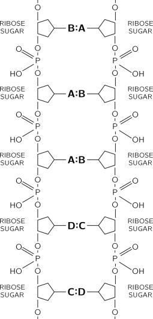

[up](top.md)

## 3 物理学と他の学問との関係

### 3-1 はじめに

すべての学問のうちで、物理学はいちばん基礎的かつ包括的であって、あらゆる学問の発展に大きな影響を与えてきた.昔、自然哲学と称せられるものがあった! 我々の近代科学はそれから生まれてきたものなのだが、物理学は今日ちょうどそれにあたる位置を占めている.物理学はあらゆる現象で基礎的の役目を演ずるので、他の学問分野の研究者たちも、それを勉強している.そこでこの章では、物理学以外の学問では、どんなことが基礎的な問題となっているかということを説明するつもりである.しかし、僅かな枚数で、そのこみいった、微妙な、そして見事なこどがらを本式に取り扱うことはとてもできない.枚数が限られているので、物理学と工学、産業、社会、戦争などとの関係を論ずるわけにもいかない.それどころでなく、数学と物理学との間にある極めて顕著な関係にさえもふれることができない(我々の見方からすれば、数学は自然科学でないという意味で、科学ではない.数学の正否をためすのは実験ではない).しかし、ここでまず明らかにしておかなければならないが、あるものが科学ではないからといって、それは下らないものだときまっていはしない.例えば、恋愛は科学ではない.だから、あるものが科学ではないといったところで、そこに何かあやまりがあるということにはならない.単に科学ではないというだけのことである.

### 3-2 化学

物理学からいちばん大きい影響を受けた学問は、おそらく化学であろう.歴史的にいうと、初期の化学で取り扱われたのは、ほとんどすべて今日我々が無機化学といっているもの、すなわち生物に関連のない物質の化学であった.元素というものがたくさんあり、その間にどんな関係があるのか、---また、それがどのようにして、岩石の中や地球の中などにある比較的簡単な各種の化合物を作っているのか.このようなことを見つけ出すのには、厖大な調査や研究が必要であった.この初期の化学は、物理学にとって実に重要なものであった.原子という考えは、主として化学の実験によって立証されたのだから、物理学と化学との間には、切っても切れない関連があったのである.メンデレーフの周期表からは、各種の元素の間に面白い関係がたくさんあることがよみとれるのであって、化学の理論、すなわち反応そのものの理論は、大部分この表に要約されている.これは、どの物質とどの物質とが、どのように化合するかという規則の集積であって、これが無機化学を形成するのである.これらの規則は、結局すべて量子力学の原理によって説明されるのだから、理論化学は要するに物理学なのである.しかし、強調しておかなければならないのは、これはあくまで原則的の話に過ぎないということである.前にもいったとおり、将棋の規則を知っているということと、将稘をさすことができるということとは、別問題である.規則を知っていても、うまくさせないということがあるのである.一つの化学反応を考えたとき、そこでどんな現象がおこるかということをはっきり予言するのは非常に難しい.しかし、ともかく、理論化学のいちばんの根本は、量子力学に帰することは確かである.

物理学と化学とから出た分野で、その両方によって発展した非常に大切なものがある.それは統計的方法である.これは、ある一つの状態があって、それを支配する運動法則がわかっているような場合に適用できるのであって、統計力学といううまい名前がついている.どんな化学状態であっても、そこには無数の原子が関係しているのであって、しかも、それらの原子はみな、全く偶然的な複雑な揺動を続けているのである.そのおのおのの衝突を分析し、おのおのの分子の運動をこまかく追跡することができたとすれば、どんな現象がおこるかという見当をつけることができないわけではない.しかし、これらすべての分子を追跡するのに、どれだけの数が必要かといえば、それはたいへんなものであって、どんな計算機の容量をも、あるいは、我々の思考容量をもはるかに超えてしまう.だから、このような複雑な状態を取り扱う方法を考え出すということが、非常に大切なのである.統計力学は、熱現象、熱力学現象の学問である.学問としての無機化学は、今までは、本質的には物理化学といわれるものと、量子化学といわれるものに帰した.反応はどんな速さで起こるか、どんな現象が起こるか、分子はどのように衝突するか、最初にとび出すのは何か、等々を研究するのが物理化学である.起こっている現象を物理法則にてらして理解するのに助けになるのが量子化学である.

化学のもう一つの分野は、有機化学で、生物に関連のある物質の化学である.かっては、生物に関連のある物質は非常に霊妙なものであって、無機物から人工的に作り出すことはできないと信ぜられていた.しかし、これは決して正しくはない---有機物と、無機化学で作り出されるものとの間には、何の違いもない.ただ有機物では分子の組合せがより複雑になっているだけのことである.有機化学は、このような物質を提供する生物学とも、また産業とも、非常に密接に関係していることは明らかである.また物理化学や量子力学は、無機化学と同様に、有機化学へも適用することができる.しかし、有機化学の主な問題は、こういうところにあるのではなく、むしろいろいろな生物系やいろいろな生物の中で作り出される物質を分析し合成することにある.そしてこれがだんだんと進んで、いつの間にか、生化学につらなり、生物学自身につらなり、あるいは分子生物学につらなることになる.

### 3-3 生物学

次は、生物の学問、すなわち生物科学である.生物学において、初期の生物学者が取り扱わなければならなかったのは、どんな生物がいるかをみつけ出すというような純記載的な問題であった.そして、のみの脚には毛が何本はえているかを数えるというようなこともしなければならなかった、このようなことが真剣に研究された後に、生物学者は、生物の中の機能の問題に入っていった.こまかいところに入るのはたいへんなので、研究は、まず大まかのところから始まったのはいうまでもない.

このとき、すでに物理学と生物学との間には、注目すべき関係があったのであった.それはエネルギー保存という物理法則が発見されるのに、生物学がその一翼を担ったということである.この法則をはじめていい出したのはマイヤーであるが、そのとき、彼は生物がとる熱とだす熱とをひきあいに出してこの例証としたのであった.

生物現象をさらによく調べてみると、そこにはたくさんの物理現象がある:血液の循環、鼓動、血圧等々、さらに神経がある:とがった石をふむと、ふんだということがわかり、ともかくその情報が足から上の方へ伝わってくる.どのようにしてこういうことになるのか.これは面白い問題である.生物学者の研究の結果によると、神経は非常に細い管であって、その壁は複雑でかつ非常に薄い.細胞がポンプのように働いて、この壁をとおしてイオンを動かし、ちょうど電気の場合のキャパシティーのように、外側には正のイオン、内側には負のイオンが分布するようになっている.この膜には面白い性質がある.もしも1カ所で"放電が起こって"、或るイオンが1カ所で通過したとすると、そこの電圧が下がり、その電気的の影響が近くにあるイオンに及ぶ.そしてそれがまた膜に影響を及ばして、その近所でもイオンを通過させるようになる.そして、これがまた次々に影響を及ぼすというわけで、とがった石をふんで、神経の一端が"刺激"されると、膜の"通過性"という波が神経繊維に沿って伝わっていくのである. この波は長い将棋だおしに似ている: 一端をつついてたおすと、それが次のをたおす、それがまた次のをたおす、こういうことが順々に進行していくのである.しかし、将棋の駒をたてなおさなければ、これではたった一つの情報しか伝えられない.神経細胞でも、駒のたてなおしと同じことだ.ふたたびイオンをゆっくり送り出して、次の刺激がきても大丈夫なようになるのである.このようなわけで、我々はどんなことを明らかにしようと努力しているのか、自らちゃんと承知しているのである(少なくとも、その見当はついている).この神経刺激に伴う電気的の変化は、もちろん、電気計器でしらべることができる.そして電気的の変化が現実に起こっているのだから、電気的変化に関する物理学が、この現象を解明するのに大いにものをいったのは明らかである.

-------------

反対に、脳のどこかから神経に沿ってメッセージが送られてくることがあります。神経の末端では何が起こっているのでしょうか？そこでは、神経が細かく枝分かれして、エンドプレートと呼ばれる筋肉の近くの構造につながっています。理由はよくわかっていませんが、神経の末端にインパルスが到達すると、アセチルコリンという化学物質の小さなパケットが発射され（一度に5〜10個の分子）、それが筋繊維に影響を与えて筋肉を収縮させるという、なんとも単純な仕組みです。筋肉はどのようにして収縮するのですか？筋肉は、ミオシンとアクトミオシンという2つの異なる物質を含む、非常に多くの繊維が近接していますが、アセチルコリンによって引き起こされる化学反応が、筋肉の寸法を変更する仕組みはまだわかっていません。このように、機械的な運動を行う筋肉の基本的なプロセスは知られていません。

生物学は非常に広い分野ですから、視覚の仕組み（目の中で光がどのように作用するか）や聴覚の仕組みなど、とても言及できないような問題が山ほどあります。思考の仕組みについては、後に心理学の項で述べます） さて、今述べた生物学に関するこれらの問題は、生物学的には、生命の根幹に関わるものではなく、たとえ理解できたとしても、生命そのものを理解することはできないという意味で、本当に基本的なものです。例えば、神経を研究している人たちは、自分たちの仕事が非常に重要だと感じています。なぜなら、神経のない動物は存在しないからです。しかし、神経がなくても生命は存在します。植物には神経も筋肉もありませんが、働いていること、生きていることに変わりはありません。生物学の基本的な問題を解決するためには、もっと深く考えなければなりません。考えてみると、すべての生物には非常に多くの共通した特徴があることがわかります。最も共通する特徴は、細胞でできていて、それぞれの細胞の中には、化学的に何かを行うための複雑な機械があるということです。例えば、植物の細胞には、光を拾ってグルコースを生成する機械があり、暗闇の中でグルコースを消費して植物を維持しています。植物が食べられると、ブドウ糖自体が動物の中で、植物の光合成（および暗闇での逆効果）と非常に密接に関連した一連の化学反応を起こす。

Fig. 3–1.

生命体の細胞内では、ある化合物が別の化合物に変化したり、別の化合物に変化したりする、多くの精巧な化学反応が行われています。生化学の研究に費やされた膨大な努力の印象を与えるために、図3-1のチャートは、細胞内で起こる一連の多くの反応のほんの一部、おそらくその1パーセント程度について、これまでの知識をまとめたものです。

ここでは、かなり小さなステップのシーケンスまたはサイクルで、ある分子から別の分子へと変化する一連の分子が見られます。これは、クレブスサイクル、呼吸サイクルと呼ばれています。それぞれの化学物質、それぞれのステップは、分子の中でどのような変化が起こるかという点では非常に単純ですが、生化学の中心となる重要な発見ですが、これらの変化を実験室で実現するのは比較的困難です。ある物質と非常によく似た別の物質があったとしても、一方が他方に変わるだけではありません。なぜなら、2つの形態は通常、エネルギー障壁や「丘」によって隔てられているからです。こんな例えがあります。丘の反対側にある同じ高さの物体を別の場所に運ぶには、その物体を押し上げればよいのですが、そのためには何らかのエネルギーを加える必要があります。このように、ほとんどの化学反応が起こらないのは、活性化エネルギーと呼ばれるものが邪魔をしているからである。化学物質に原子を追加するためには、何らかの再配置が起こるように原子を近づける必要があり、そうすればくっつきます。しかし、十分なエネルギーを与えて近づけることができなければ、完成には至らず、"丘 "の途中まで行って、また降りてくるだけです。しかし、文字通り分子を手に取り、原子を押したり引いたりして、新しい原子を入れるための穴を開け、それを元に戻すことができれば、余分なエネルギーを必要としない、丘を回り込む別の方法を見つけたことになり、反応は簡単に進むでしょう。現在、細胞内には、これまで説明してきた分子の変化よりもはるかに大きな分子が存在し、複雑な方法で小さな分子を適切に保持し、反応が容易に起こるようにしています。これらの非常に大きくて複雑なものは酵素と呼ばれています。元々は砂糖の発酵で発見されたことから、発酵物と呼ばれていました。実際、サイクルの最初の反応のいくつかはここで発見されました）。) 酵素があると、反応が進みます。

酵素は、タンパク質という別の物質からできています。酵素はとても大きくて複雑で、それぞれが異なっており、ある特別な反応を制御するために作られています。酵素の名前は、図3-1の各反応のところに書かれています。ここで強調しておきたいのは、酵素自体は反応に直接関与していないということです。酵素は変化せず、原子をある場所から別の場所に移動させるだけである。酵素は、工場の機械のように、次の分子にそれを行う準備ができている。もちろん、特定の原子を供給し、他の原子を廃棄する方法がなければならない。例えば、水素。酵素には、あらゆる化学反応に必要な水素を運ぶ特別なユニットが付いています。例えば、水素を還元する酵素は3～4種類あり、私たちのサイクルの中で様々な場所で使われています。興味深いのは、ある場所で水素を放出した機械が、その水素を別の場所で使用することです。

図3-1のサイクルで最も重要なのは、GDPからGTP（グアノシン二リン酸からグアノシン三リン酸）への変化である。なぜなら、一方の物質にはもう一方の物質よりも多くのエネルギーが含まれているからである。酵素の中に水素原子を運ぶための「箱」があるように、三リン酸基にはエネルギーを運ぶための特別な「箱」があるのです。つまり、GTPはGDPよりもエネルギーが大きく、サイクルが一方通行であれば、余分なエネルギーを持つ分子が生成され、その分子がエネルギーを必要とする他のサイクル、例えば筋肉の収縮などを促進することができるのです。GTPがなければ筋肉は収縮しません。筋繊維を水の中に入れてGTPを加えると、筋繊維は収縮し、適切な酵素があればGTPをGDPに変えることができます。つまり、本当のシステムは、GDPとGTPの変換にあり、暗闇の中では、昼間に蓄えられたGTPを使って、全体のサイクルを逆に回しているのです。酵素は、反応の進行方向を気にしません。気にしたら物理法則の1つに違反してしまうからです。

物理学が生物学やその他の科学において重要であるのは、もう一つの理由があり、それは実験技術に関連するものです。実際、実験物理学の大きな発展がなければ、今日の生化学チャートは知られていなかったでしょう。なぜかというと、この非常に複雑なシステムを分析するための最も有用なツールは、反応に使われている原子にラベルを付けることだからです。つまり、「緑のマーク」がついた二酸化炭素をサイクルに導入し、3秒後に緑のマークがどこにあるかを測定し、10秒後にまた測定する、といった具合に、反応の経過をたどることができるのです。緑のマーク」とは何ですか？同位体の違いです。原子の化学的性質は、原子核の質量ではなく、電子の数で決まることを思い出してください。しかし、例えば炭素の場合、すべての炭素原子核が持つ6個の陽子と一緒に、6個の中性子や7個の中性子が存在することがあります。化学的にはC12とC13の2つの原子は同じですが、重さが異なり、核の性質も異なるため、区別することができます。これらの重さの異なる同位体、あるいはC14のような放射性同位体を用いれば、ごく少量をより高感度に追跡することができ、反応を追跡することができる。

さて、酵素とタンパク質の説明に戻ります。全てのタンパク質が酵素ではなく、全ての酵素はタンパク質です。筋肉に含まれるタンパク質や、軟骨や髪の毛、皮膚などに含まれる構造タンパク質など、それ自体が酵素ではないタンパク質もたくさんあります。しかし、タンパク質は生命にとって非常に特徴的な物質であり、まず第一に、すべての酵素を構成していますし、第二に、その他の生体物質の多くを構成しています。タンパク質は非常に興味深いシンプルな構造をしています。アミノ酸が連なっているのです。アミノ酸は20種類あり、それぞれが互いに結合してCO-NHなどの骨格を持つ鎖を形成します。タンパク質は、この20種類のアミノ酸がいろいろな形でつながったものである。それぞれのアミノ酸は、おそらく何か特別な目的を持っている。例えば、ある場所に硫黄原子を持つものは、同じタンパク質の中に2つの硫黄原子があると結合を形成し、鎖を2点で結んでループを形成するのです。また、酸素原子が多いために酸性物質になるもの、塩基性物質になるものもあります。あるものは、大きなグループが片側に垂れ下がっているので、大きなスペースを占めています。アミノ酸の一つであるプロリンは、本当はアミノ酸ではなくイミノ酸です。ちょっとした違いで、プロリンが鎖の中にあると、鎖がよじれてしまうのです。もし、あるタンパク質を作りたいと思ったら、次のような指示を出します。「ここに硫黄のフックを1つ付けて、次にスペースを取るものを付けて、次に鎖にねじれを作るものを付けなさい。このようにして、複雑な構造を持つ、フックの付いた複雑な見た目の鎖を得ることができます。これはおそらく、様々な酵素が作られる方法と同じです。最近（1960年以降）の大きな成果の1つは、ある種のタンパク質の正確な空間的原子配列をついに発見したことです。これらのタンパク質には56～60個のアミノ酸が並んでいます。2つのタンパク質では、1,000個以上の原子（水素原子を含めるとさらに2,000個近く）が複雑なパターンで配置されています。1つ目はヘモグロビン。この発見の悲しい点は、パターンからは何も見えないということです。なぜそのような仕組みになっているのかがわからないのです。もちろん、それは次の問題として攻略されています。

もうひとつの問題は、酵素はどうやって何になるかを知っているのかということです。赤目のハエが赤目のハエの赤ちゃんをつくるのだから、赤い色素をつくる酵素の全パターンの情報を、ハエからハエへと伝えなければならない。それを担うのが、タンパク質ではなく、細胞の核の中にあるDNA（デソキシリボース核酸の略）という物質です。これは、細胞から細胞へと受け渡される重要な物質であり（例えば、精子細胞はほとんどがDNAで構成されている）、酵素を作るための情報を伝えるものである。DNAは "設計図 "なのだ。設計図はどのようなもので、どのように機能するのでしょうか。まず、設計図は自分自身を複製することができなければなりません。第二に、タンパク質に指示を与えることができなければなりません。複製については、細胞の複製と同じように考えてよいでしょう。細胞は単純に大きくなり、半分に分裂します。では、DNA分子も同じように、大きくなって半分になるのでしょうか。確かに、原子は大きくなったり、半分になったりしない。いや、もっと巧妙な方法でなければ、分子の複製は不可能なのだ。

Fig. 3–2.Schematic diagram of DNA. 

DNAという物質の構造は、まず化学的に組成を調べ、次にX線を使って空間のパターンを調べるという方法で、長い間研究されてきました。その結果、次のような驚くべき発見があった。DNA分子は一対の鎖であり、互いにねじれている。これらの鎖の骨格は、タンパク質の鎖と似ていますが、化学的には全く異なり、図3-2に示すように、一連の糖とリン酸の基で構成されています。もし、この鎖を真ん中で分割すると、BAADC...という系列になり、生物ごとに異なる系列を持つことになります。このように、タンパク質の製造に関する具体的な指示は、何らかの方法でDNAの特定の系列に含まれているのかもしれません。

系列に沿ってそれぞれの糖に付着し、2つの鎖をつなぐのは、特定のペアの架橋である。興味深いのは、例えばAとB、CとDのように、特定のペアだけが向かい合って座ることができることです。これらのペアは、2本の鎖に「合う」ように付けられ、強い相互作用のエネルギーを持っています。しかし、CはAとは合いませんし、BはCとは合いません。AとB、CとDというように、ペアでしか合いません。一つの鎖にどんな文字があっても、それぞれの文字は他の鎖に特定の相補的な文字がなければならないのです。

では、生殖についてはどうだろうか。この鎖を2つに分けたとします。どうやって同じような鎖を作ることができるでしょうか？細胞の物質の中に製造部門があり、リン酸塩、糖、A、B、C、Dのユニットが鎖状につながっていない状態で出てきたとしたら、分割された鎖にくっつくのは、BAADC...の補語であるABBCD...という正しいものだけになります。

次に、A、B、C、Dの順番が、タンパク質中のアミノ酸の配列をどのように決定するのかという問題がある。これは現在の生物学の中心的な未解決問題である。しかし、最初の手がかりとなる情報は、次のようなものです。細胞の中にはリボソームという小さな粒子があり、そこではタンパク質が作られていることがわかっています。しかし、そのリボソームは、DNAとその指示書がある核の中にはありません。何か問題がありそうです。しかし、すべての情報を伝える大きなDNA分子そのものではなく、その一部のような小さな分子の断片がDNAから出てくることもわかっています。これはRNAと呼ばれていますが、これは本質的なものではありません。これは、DNAのコピーのようなもので、短いコピーです。RNAは、どのようなタンパク質を作ればよいかというメッセージを何らかの形で伝え、リボソームに送られます。RNAがリボソームに到達すると、リボソームでタンパク質が合成されます。それもわかっています。しかし、RNAに書かれたコードに沿って、どのようにアミノ酸が入ってきて、どのように配置されるのか、その詳細はまだ分かっていません。どうやって読めばいいのかわからないのです。例えば、A、B、C、C、Aという「並び」がわかっても、どんなタンパク質が作られるのかはわかりません。

現在、生物学ほど多くの分野で進歩している学問はありません。生命を理解しようとする人をどんどん導いていく、最も強力な仮定を挙げるとすれば、それは「すべてのものは原子でできている」ということであり、生物が行うすべてのことは、原子のギラギラとした動きから理解できるということです。

### 3-4 天文学

このように早口で全世界を説明してきましたが、ここでは天文学について説明します。天文学は物理学よりも古い。天文学は物理学よりも古く、星や惑星の運動の美しい単純さを示し、それを理解することで物理学を始めました。しかし、天文学の中で最も注目すべき発見は、星が地球上の原子と同じ種類の原子でできているということです(注1)。原子は、特定の周波数を持つ光を放出します。これは、音の高さや周波数が決まっている楽器の音色のようなものです。しかし、色の混合物を目で見ても、それがどの部分からできているのか分かりません。しかし、分光器を使えば、光の波の周波数を分析することができるので、星の中にある原子の曲調を知ることができます。実は、化学元素のうち2つは、地球で発見される前に星で発見されています。ヘリウムは太陽で発見されたことからその名が付けられ、テクネチウムはある冷たい星で発見されました。星は地球上の原子と同じ種類のものでできているので、星を理解する上での大きな助けになります。現在では、原子について多くのことが分かっています。特に、高温で密度があまり高くない条件下での原子の振る舞いについては、統計力学的に星の物質の振る舞いを分析することができます。地球上の条件を再現することはできなくても、基本的な物理法則を使えば、何が起こるかを正確に、あるいは非常に近い形で知ることができることが多いのです。このように、物理学が天文学を助けているのです。奇妙に思えるかもしれませんが、太陽の内部の物質の分布は、地球の内部よりもはるかによくわかっています。星の内部で何が起こっているかは、望遠鏡で小さな光の点を見なければならないという困難さからは想像できないほどよくわかっています。というのも、ほとんどの状況下で星の中の原子が何をすべきかを計算できるからです。

最も印象的な発見の1つは、星が燃え続けるためのエネルギーの起源です。これを発見した一人の男性は、「星が輝くためには核反応が起こっているに違いない」と気づいた次の日の夜、ガールフレンドと出かけていました。彼女が「見て、星がきれいに光っているわね」と言った。彼は、"そうだ、そして今、なぜ星が輝くのかを知っているのは、世界で僕だけなんだ "と言った。彼女はただ笑っていた。彼女は、その瞬間、星が輝く理由を知っている唯一の男と一緒にいることに感動しなかったのです。まあ、一人でいるのは寂しいことだけど、それがこの世界の現実だからね。

太陽のエネルギーは、水素を核で「燃やす」ことで得られ、水素はヘリウムに変わります。さらに、星の中心部では、水素からさまざまな化学元素の製造が行われています。私たちが作られているものは、かつて星の中で「調理」され、吐き出されたものなのです。なぜそれが分かるのでしょうか？それは手掛かりがあるからです。異なる同位体の割合、つまりC12とC13がどのくらいあるのかは、化学反応によって変わることはありません。割合は純粋に核反応の結果なのです。私たちがいる冷たく死んだ琥珀の中の同位体の割合を見ることで、私たちを作っているものが形成された炉がどのようなものだったかを知ることができます。その炉は星のようなものでしたから、私たちの元素は星の中で「作られ」、新星や超新星と呼ばれる爆発の中で吐き出された可能性が高いのです。天文学は物理学に近いので、天文学的なことをたくさん勉強しながら進めていきましょう。

### 3-5 地学

ここからは地球科学、つまり地質学と呼ばれる分野です。まず、気象学と天気です。気象学の道具はもちろん物理学的な道具であり、実験物理学の発展によってそれが可能になったことは前に説明したとおりです。しかし、気象学の理論は、物理学者が満足に解明したことはありません。"あなたは、「空気しかないのだから、空気の運動の方程式はわかっている」とおっしゃいます。はい、そうです。"では、今日の空気の状態がわかっているのに、なぜ明日の空気の状態がわからないのでしょうか？" まず、今日の空気の状態はよくわかりません。なぜなら、空気はいたるところで渦を巻き、ねじれているからです。空気は非常に繊細で、不安定であることがわかります。ダムの上をスムーズに流れる水が、大量の塊や水滴になって落ちてくるのを見たことがある人なら、不安定という意味がわかるだろう。放水路を通過する前の水の状態は完璧に滑らかですが、落下し始めた瞬間の水滴はどこから始まるのでしょうか。塊の大きさや場所を決めるのは何か？それがわからないのは、水が不安定だからである。滑らかに動く空気の塊でも、山を越えると複雑な渦巻きや渦になる。多くの分野で、今日では分析できない乱流の状況が見られます。気象の話から離れて、地質の話をしましょう。

地質学の基本的な疑問は、「地球は何によってできているのか」ということです。最も分かりやすいのは、皆さんの目の前にある、川や風などの浸食プロセスです。これらを理解するのは簡単ですが、侵食のたびに、同じ量の別のことが起こっています。現在の山は、平均して過去より低くはありません。山を形成するプロセスがあるはずです。地質学を学べば、山を形成するプロセスと、誰も理解していないが地質学の半分を占める火山があることがわかるだろう。火山の現象は本当に理解されていません。地震の原因も、結局のところわかっていません。何かが他のものを押していれば、それが折れて滑るということは理解できます。しかし、何が、なぜ、押しているのでしょうか？理論的には、地球の内部には、内外の温度差による循環流があり、その動きが表面をわずかに押していると考えられます。そのため、2つの相反する流れが隣り合っていると、それらがぶつかる部分に物質が集まり、ストレスのかからない山の帯ができ、火山や地震が発生するのです。

地球の内部はどうなっているのでしょうか？地球を伝わる地震波の速さや、地球の分布密度については多くのことが知られています。しかし、物理学者は、地球の中心部で予想される圧力において、物質がどのくらいの密度であるべきかについて、きちんとした理論を得ることができませんでした。つまり、このような状況では、物質の性質をうまく把握することができないのです。地球の場合は、星の中の物質の状態よりもはるかにうまくいきません。今のところ、数学的にはちょっと難しすぎるようですが、重要な問題であることに気づいて、誰かが本気で解決する日もそう遠くないかもしれません。もう1つは、密度がわかっても、循環流がわからないということです。また、高圧下での岩石の性質を解明することもできません。岩石がどのくらいの速さで "与える "のか、それはすべて実験で解明しなければならない。

### 3-6. 心理学

次に、心理学という科学について考えます。ちなみに、精神分析は科学ではなく、せいぜい医学的なプロセスであり、おそらくは魔法使いのようなものである。精神分析には、病気の原因となるさまざまな「精霊」などの理論があります。魔術師は、マラリアのような病気は空気中に出てくる霊によって引き起こされるという理論を持っています。蛇を振っても治りませんが、キニーネはマラリアに効きます。しかし、キニーネはマラリアに効きます。ですから、もしあなたが病気になったら、私は魔術師のところに行くことをお勧めします。なぜなら、魔術師は部族の中でその病気について最もよく知っている人だからです。一方で、彼の知識は科学ではありません。精神分析は、実験によって注意深くチェックされておらず、効果のあるケースの数、効果のないケースの数などのリストを見つけることはできません。

心理学の他の分野は、感覚の生理学のようなもの、つまり目で何が起こっているのか、脳で何が起こっているのかに関わるものですが、お望みとあらば、あまり面白くありません。しかし、それらを研究することで、小さな、しかし実際の進歩が見られます。最も興味深い技術的な問題の一つは、心理学と呼ばれるかもしれないし、そうでないかもしれない。ある動物が何かを学ぶと、それまでとは違うことができるようになります。どんなふうに変わったのか？何かを覚えるときに、どこを見ればいいのか、何を探せばいいのかわからない。ある事実を覚えたとき、それが何を意味するのか、神経系にどのような変化があるのか、わかりません。これは非常に重要な問題ですが、まだ全く解決されていません。しかし、何らかの記憶というものがあると仮定すると、脳は相互に接続された電線や神経の巨大な塊であるため、おそらく単純な方法では分析できません。これを計算機や計算素子に例えると、計算機にもたくさんの線があり、シナプスや神経の接続に似た何らかの要素があります。これは非常に興味深いテーマですが、これ以上議論する時間がありません。思考と計算機の関係です。もちろん、このテーマは、普通の人間の行動の本当の複雑さについては、ほとんど何も教えてくれないことを理解しておく必要があります。すべての人間はとても異なっています。そこにたどり着くまでには、まだまだ時間がかかりそうです。もっと前から始めなければなりません。もし、犬がどう動くのかがわかれば、私たちはかなり前進したことになります。犬の方がわかりやすいが、犬の仕組みはまだ誰にもわからない。

### 3-7 なぜそのようになったのか？

物理学が他の科学に理論的に役立つためには、機器の発明以外に、当該科学が物理学者に物理学者の言葉で対象物の説明を提供しなければなりません。カエルはなぜ跳ぶのか」と言われても、物理学者は答えられません。もし彼らが、カエルとは何か、分子はこんなにたくさんある、ここには神経がある、などと教えてくれれば、それは違う。地球や星がどんなものか、多かれ少なかれ教えてくれるのであれば、それを理解することができる。物理学の理論が役に立つためには、原子がどこにあるのかを知らなければならない。化学を理解するためには、どのような原子が存在するかを正確に知らなければ、分析することができません。もちろん、これは1つの限界でしかありません。

姉妹科学には、物理学にはない別の種類の問題があります。それは、言葉は悪いですが、「歴史的問題」と呼ばれるものです。なぜそのようになったのか？生物学のすべてを理解すると、地球上にあるすべてのものがどのようにしてそこに存在するようになったのかを知りたくなります。生物学の重要な部分である進化論があります。地質学では、山がどのように形成されているかだけでなく、地球全体が最初にどのように形成されたのか、太陽系の起源などを知りたいと考えます。それはもちろん、世の中にどんな物質があったのかを知りたいということにもつながります。星はどのように進化したのか？初期条件は何だったのか？それが天文学史の問題です。星の形成、私たちを作った元素の形成、そして宇宙の起源については、多くのことが解明されています。

現在、物理学で研究されている歴史問題はありません。物理学の法則はこうだが、どうしてそうなったのか」という疑問がないのです。今のところ、物理法則が時間とともに変化しているとか、過去には現在とは違っていたとか、そういう想像はしていません。もちろん、そうかもしれないし、そうだとわかった瞬間に、物理学の歴史的な問題は、宇宙の他の歴史と一緒になって、物理学者は天文学者、地質学者、生物学者と同じ問題について話すことになるでしょう。

最後に、多くの分野に共通する、非常に古くからある、解決されていない物理学上の問題があります。それは、新しい基本粒子を見つけるという問題ではなく、100年以上も前の古い問題です。物理学の分野では、姉妹科学にとって重要であるにもかかわらず、誰も数学的に満足のいく分析ができていません。それは、循環する流体や乱流の解析です。星の進化を見ていると、ある時点で対流が始まると推測できますが、それ以降は何が起こるべきか推測できなくなります。数百万年後に星が爆発しても、その理由がわからない。天気の分析もできません。地球の中でどのような運動が行われているのか、そのパターンもわかりません。この問題の最も単純な形は、非常に長いパイプを用意して、そこに水を高速で通すことです。ある量の水をパイプに通すためには、どのくらいの圧力が必要なのか。第一原理や水の性質から分析できる人はいません。水が非常にゆっくり流れる場合や、ハチミツのような濃厚なベトベトを使う場合は、うまくできます。教科書にも載っているでしょう。しかし、本当にできないのは、実際にパイプの中を流れる濡れた水を扱うことです。それこそが、いつの日か解決しなければならない中心的な問題なのですが、まだ解決していません。

ある詩人が「グラス一杯のワインの中に全宇宙がある」と言いました。詩人は理解されるために書くわけではありませんから、彼がどのような意味で言ったのか、おそらく私たちにはわかりません。しかし、グラス1杯のワインをよく見ると、宇宙全体が見えてくるのは事実です。物理学的なもの、つまり風や天候によって蒸発するねじれた液体、グラスに映る反射物、そして私たちの想像力が原子を加える。ガラスは地球の岩石を蒸留したもので、その組成には宇宙の年齢や星の進化の秘密が見えてくる。ワインの中にはどんな不思議な化学物質が入っているのだろう？それらはどのようにして生まれたのか？発酵物があり、酵素があり、基質があり、生成物がある。ワインの中には、「すべての生命は発酵である」という偉大な一般論がある。ルイ・パスツールが多くの病気の原因を発見したように、誰もワインの化学を発見することはできない。クラレットはなんと生き生きとしていて、それを見ている意識にその存在を押し付けているのだ。もし私たちの小さな心が、何らかの便宜を図って、このワイングラスを、この宇宙を、物理学、生物学、地質学、天文学、心理学などの部分に分割したとしても、自然はそれを知らないことを忘れてはいけません。ですから、最終的には何のためにあるのかを忘れずに、すべてを元に戻しましょう。飲んで、すべてを忘れよう！」という最後の楽しみを与えてくれます。

注1: いかに自分が急いでいるか！？この短い物語の一文一文にどれだけのものが含まれているか。"星は地球と同じ原子でできています。" 私はいつもこのような小さなテーマを一つ選んで講義をしています。詩人は科学が星の美しさを奪っていると言いますが、それは単なるガス原子の塊です。単なる」なんてことはない。私も砂漠の夜に星を見て、それを感じることができます。しかし、私が見ているものは少ないのか、多いのか？この回転木馬の中で、私の小さな目は100万年前の光を捉えることができる。広大なパターンの中で、私はその一部であり、もしかしたら私のものは、忘れられた星から吐き出されたものかもしれませんし、そこで吐き出されているものかもしれません。あるいは、パロマーの大きな目でそれらを見ると、おそらくすべてが一緒になっていた共通の出発点から、すべてがバラバラになって押し寄せてくる。そのパターン、意味、理由は何なのか？謎について少しでも知っておくことは、謎を損ねることにはならない。なぜなら、過去の芸術家が想像したよりもはるかに素晴らしい真実があるからです。現在の詩人たちは、なぜそれを語らないのか？木星が人間のようであれば語ることができ、木星がメタンとアンモニアの巨大な回転球体であれば黙っていなければならない詩人とは一体何者なのか。

[up](top.md)

