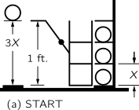

[up](top.md)

## 4 エネルギーの保存 (Conservation of Energy)

### 4-1 エネルギーとは何か

この章では、一般的な物事の説明を終えて、物理学のさまざまな側面についてのより詳細な学習を開始します。ここでは、理論物理学で使われる考え方や推論を説明するために、物理学の最も基本的な法則の一つである「エネルギー保存」を取り上げます。

これまでに知られているすべての自然現象を支配している事実、あるいは法則があります。この法則に例外はなく、私たちが知る限りでは正確です。その法則を「エネルギー保存則」といいます。これは、エネルギーと呼ばれる一定の量があり、それは自然界の多様な変化の中でも変化しないというものです。これは数学的な原理で、何かが起こっても変化しない数値があるということですから、非常に抽象的な考えです。メカニズムの説明や具体的なものではなく、ある数字を計算して、自然のいたずらを見終わってからもう一度計算すると、同じ数字になっているという不思議な事実なのです。例えば、ビショップが赤いマスの上にいて、何回か移動した後、詳細は不明だが、まだ赤いマスの上にいる。このような性質の法則があるのです) これは抽象的な考えなので、その意味を例えで説明します。

デニス・ザ・メナス」のような子供を想像してみてください。彼は、絶対に破壊できない、分割できないブロックを持っています。それぞれが他のものと同じものです。彼が28個のブロックを持っていると仮定しましょう。彼の母親は、一日の始まりに、彼と28個のブロックを部屋に入れます。一日の終わりに、好奇心旺盛な彼女がブロックを注意深く数えてみると、彼がブロックをどう使っても28個しか残らないという驚異的な法則を発見します。この状態が何日も続き、ある日積み木が27個になってしまいましたが、少し調べてみると、敷物の下に1個あることがわかりました。しかし、ある日、ブロックの数が変わったように見え、26個しかありません。よくよく調べてみると、窓が開いていたことがわかり、外を見てみると残りの2つのブロックが見つかります。別の日には、注意深く数えてみると30個になっていました。ブルースがブロックを持って遊びに来ていて、デニスの家にもブロックを置いていったことがわかります。余分なブロックを処分した後、窓を閉めてブルースを入れず、順調に進んでいたのですが、ある時、ブロックを数えたら25個しかありませんでした。しかし、部屋の中にはおもちゃ箱があり、お母さんはおもちゃ箱を開けようとしますが、男の子は「いやだ、僕のおもちゃ箱を開けないで」と言って、叫びます。お母さんはおもちゃ箱を開けてはいけない。好奇心旺盛な彼女は、ある計画を思いつきます。ブロック1個の重さが3オンスであることを知っているので、28個のブロックを見た時点で箱の重さを測り、16オンスの重さを測ります。次に確認したいとき、彼女はもう一度箱の重さを測り、16オンスを引いて3で割ります。彼女は次のことを発見します。

```math
\left( 見たブロックの数 \right) + \dfrac{(箱の重さ) - 16オンス}{3オンス} = 一定 \tags{4.1}
```

その後、新たな逸脱があったように見えますが、よく調べてみると、浴槽の汚れた水がレベルを変えていることがわかりました。子供がブロックを投げ入れているのですが、汚れていて見えません。しかし、計算式に別の項を加えることで、水の中に何個のブロックがあるかを知ることができます。元々の水の高さは6インチで、1つのブロックが水を4分の1インチ上げているので、この新しい式は次のようになります。

```math
\left( 見たブロックの数 \right) + \dfrac{(箱の重さ) - 16オンス}{3オンス} + \dfrac{(水の高さ) - 6インチ}{1/4インチ}= 一定 \tags{4.2}
```
彼女の世界が徐々に複雑になっていく中で、彼女は、見てはいけない場所にあるブロックの数を計算する方法を表す一連の用語を見つけました。その結果、彼女は複雑な公式、計算しなければならない量、そして彼女の状況では常に同じままである量を見つけます。

これをエネルギーの保存に例えるとどうなるでしょうか？この絵から抽象化しなければならない最も注目すべき点は、ブロックが存在しないことです。(4.1)と(4.2)の第1項を取り除くと、多かれ少なかれ抽象的なものを計算していることになります。このアナロジーには次のようなポイントがあります。まず、エネルギーを計算しているとき、その一部がシステムから出て行ってしまうこともあれば、入ってくることもあります。エネルギーの保存性を検証するためには、何かを入れたり、何かを取り出したりしていないか注意しなければなりません。次に、エネルギーには多数の異なる形態があり、それぞれに公式があります。重力エネルギー、運動エネルギー、熱エネルギー、弾性エネルギー、電気エネルギー、化学エネルギー、放射エネルギー、核エネルギー、質量エネルギーなどです。これらの各寄与の式を合計しても、エネルギーの出入り以外は変わりません。

ここで重要なのは、現在の物理学では、エネルギーとは何かということを知らないということです。エネルギーが一定量の小さな塊でやってくるというイメージはありません。そういうものではないのです。しかし、何かの数値を計算する公式があって、それを全部足すと「28」となり、いつも同じ数字になる。それは抽象的なもので、どういう仕組みで、どういう理由でそうなっているのかはわかりません。


### 4-2 重力ポテンシャルエネルギー

エネルギーの保存は、そのすべての形態の公式があって初めて理解できます。ここでは、地表付近の重力エネルギーの公式についてお話ししたいと思います。この公式は、歴史とは全く関係なく、この講義のために考案された推論であり、いくつかの事実と綿密な推論から自然について多くのことが引き出せるという驚くべき事実を皆さんに示すために導き出したいと思います。これは、理論物理学者がどのような仕事に携わっているかを示すものです。これは、蒸気機関の効率に関するカルノー氏の最も優れた議論を模したものです(*1)。

重りを持ち上げる機械、つまり、ある重りを下げることで別の重りを持ち上げる性質を持つ機械を考えてみよう。また、この重量挙げ機械には永久機関というものは存在しないという仮説を立ててみよう。実際、永久機関は存在しないというのは、エネルギー保存の法則の一般的な記述である）。永久機関の定義には注意が必要です。まず、重量挙げ用の機械について考えてみよう。たくさんの重りを持ち上げたり下げたりして、機械を元の状態に戻したとき、正味の結果として重りを持ち上げたことになるなら、その持ち上げた重りを使って他のものを動かすことができるので、永久機関があることになります。ただし、重りを持ち上げた機械を元の状態に戻し、さらにその機械が完全に自己完結していること、つまりブルース・ブロックのように外部から重りを持ち上げるためのエネルギーを受け取っていないことが条件です。


Fig. 4–1.シンプルなウェイトリフティングマシン 


図4-1に非常に簡単な重量挙げの機械を示します。この機械は、3個の "強い "重りを持ち上げます。片方の天秤皿に3個、もう片方の天秤皿に1個の重りを載せます。しかし、実際に動作させるためには、左の天秤皿から少しの重りを持ち上げなければなりません。しかし、実際に動作させるためには、左の天秤を少し持ち上げなければなりません。逆に、もう一方の天秤を少しだけ持ち上げてごまかせば、3単位の天秤を下げて1単位の天秤を持ち上げることができます。もちろん、実際の昇降機であれば、少しずつ追加していかなければ動かないことはわかっています。しかし、それは一時的なものだと思っています。理想的な機械は存在しないが、余分なものを必要としない。私たちが実際に使う機械は、ある意味ではほとんど可逆的である。つまり、1人分の重さを下げて3人分の重さを持ち上げることができるなら、3人分の重さを下げて1人分の重さをほぼ同じだけ持ち上げることもできるだろう。

ここで、機械には2つのクラスがあると考えます。1つは、現実の機械をすべて含む可逆性のないもの、もう1つは可逆性のあるもので、これはもちろん、ベアリングやレバーなどの設計にいくら注意しても、実際には実現できません。しかし、1単位の重さ（1ポンドまたはその他の単位）を1単位の距離だけ下げ、同時に3単位の重さを持ち上げる、そのような可逆的な機械があると仮定する。この可逆的な機械を機械Aと呼ぶ。この特定の可逆的な機械が3単位の重さをXの距離だけ持ち上げるとする。次に、別の機械Bがあるとする。これは必ずしも可逆的ではなく、同じように1単位の重さを1単位の距離だけ下げるが、3単位の重さをYの距離だけ持ち上げる機械である。その理由を見てみましょう。YがXよりも高かったとしよう。1単位の重りを機械Bで1単位の高さまで下げると、3単位の重りがYの距離だけ持ち上がる。次に、重りをYからXまで下げて自由な力を得て、逆走する機械Aを使って3単位の重りをXの距離だけ下げ、1単位の重りを1単位の高さだけ持ち上げることができる。これで、1単位の重りは元の位置に戻り、2つの機械は再び使えるようになります。したがって、YがXよりも高ければ永久機関になるのですが、これは不可能だと仮定しました。以上のことから、YがXより高くなることはないので、設計可能なすべての機械の中で、可逆式の機械が最も優れていることがわかります。

また、すべてのリバーシブル・マシンは、まったく同じ高さまで持ち上げなければならないことがわかります。仮にBも本当にリバーシブルだったとします。YがXよりも高くないという議論は、もちろん以前と同じように成り立ちますが、逆に機械を逆の順序で使用して、XがYよりも高くないことを証明することもできます。もし誰かが、3個のユニットをある距離だけ持ち上げ、1個のユニットを1個の距離だけ下げるような、非常に精巧な一連のレバーを作ったとしたら、それを、同じことをして基本的に可逆的な単純なレバーと比較すると、その機械はそれを高くは持ち上げないか、おそらくそれほど高くは持ち上げないだろうということが、すぐにわかります。彼の機械が可逆的であれば、我々はその機械がどのくらいの高さまで持ち上げられるかを正確に知っている。要約すると、どのように動作するかにかかわらず、1ポンドを1フィート落とし、3ポンドの重りを持ち上げるすべての可逆的な機械は、常に同じ距離Xを持ち上げるということである。これは明らかに大きな実用性を持つ普遍的な法則である。次に問題となるのは、当然ながら、Xとは何かということです。




Fig. 4–2.A リバーシブル・マシン. 


この距離Xを3対1で持ち上げるリバーシブルな機械があるとします。図4-2のように、動かないラックに3つのボールをセットします。1つのボールは、地面から1フィートの距離にあるステージ上に保持されています。この機械は、3つのボールを持ち上げ、1つのボールを距離1だけ下げることができます。さて、3つのボールを保持する台には、床と2つの棚がちょうど距離Xの間隔で配置されており、さらに、ボールを保持する棚も距離Xの間隔で配置されていることを確認しました(a)。まず、ボールをラックから棚に水平に転がします(b)。高さを変えないので、この作業にはエネルギーがかからないと仮定します。すると、可逆装置が作動して、1個のボールを床に下ろし、ラックを距離Xだけ持ち上げます(c)。ここで、ラックの配置を工夫して、これらのボールが再びプラットフォームと同じ高さになるようにしました。このようにして、ボールをラックに降ろします（d）。ボールを降ろした後は、機械を元の状態に戻すことができます。これで、上3段の棚に3個、下1段に1個のボールが入ったことになります。しかし、不思議なことに、ある意味では、2つの玉を持ち上げたことにはならないのです。なぜなら、以前から2と3の棚に玉があったからです。その結果、1つのボールを3倍の距離だけ持ち上げたことになります。さて、3Xが1フィートを超えれば、ボールを下げて機械を初期状態(f)に戻し、再び装置を動かすことができます。したがって、3Xは1フィートを超えることはできません。3Xが1フィートを超えれば、永久機関を作ることができるからです。同様に、1フィートが3Xを超えられないことは、機械全体を逆に走らせることで証明できます。したがって、3Xは1フィートより大きくも小さくもなく、議論だけでX=1/3フィートという法則を発見することができます。この結果を別の言い方で表現すると、3ポンドに持ち上げた高さ（この問題ではX）をかけたものは、1ポンドに下げた距離（この場合は1フィート）をかけたものに等しいということになる。すべての重さを床からの高さに掛けて、機械を作動させてから、すべての重さにすべての高さを掛けても、変化はありません。1つの重りだけを動かした例を、1つの重りを下げるときに複数の重りを持ち上げる場合に一般化しなければなりませんが、それは簡単です）。

重さと高さの和を重力位置エネルギーと呼んでいます。これは、物体が地球との空間的な関係によって持つエネルギーです。重力エネルギーの公式は、地球からあまり離れていない限り（高くなるほど力は弱くなります）、次のようになります。

```math
(一つの物体の重力ポテンシャルエネルギー) = (重さ)×(高さ) \tags{4.3}
```
それはとても美しい推論です。ただ、問題は、それが真実ではないかもしれないということです。例えば、永久機関は実際には可能なのかもしれません。前提条件が間違っているかもしれないし、推論が間違っているかもしれないので、常に確認する必要があります。それは実験的に、実際にそうであることがわかります。

何かとの相対的な位置関係に関係するエネルギーの一般的な名称は、位置エネルギーと呼ばれています。この場合はもちろん、重力ポテンシャルエネルギーと呼ぶ。重力ではなく電気的な力の問題で、たくさんのレバーを使って電荷を他の電荷から「持ち上げる」場合、そのエネルギーの内容は電気的位置エネルギーと呼ばれます。一般的な原理としては、エネルギーの変化は力×力が押された距離であり、これは一般的なエネルギーの変化である。

```math
(エネルギーの変化) = (力) × (力が押された距離) \tags{4.4}
```

このコースを続けていく中で、このような他の種類のエネルギーにも多く触れていきます。


Fig. 4–3.傾斜した平面 

エネルギー保存の原理は、さまざまな状況で何が起こるかを推論するのに非常に役立ちます。高校では、滑車やレバーをさまざまな方法で使用する際に、多くの法則を学びました。今では、これらの「法則」はすべて同じものであり、75の法則を暗記しなくても理解できるようになっています。簡単な例は、滑らかな傾斜面で、嬉しいことに、3-4-5の三角形です（図4-3）。その傾斜面に1ポンドの重りを滑車で吊るし、滑車の反対側には重りWを吊るします。重りWがどのくらいの重さであれば、平面上の1ポンドと釣り合うかを知りたいのです。どうすればそれがわかるのでしょうか？ちょうどバランスが取れていると言えば、リバーシブルなので上下に動くことができ、次のような状況を考えることができます。最初の状況である(a)では、1ポンドの重りが下にあり、重りWが上にあります。Wが可逆的な方法で滑り落ちたとき、(b)では、1ポンドの重りが上部にあり、重りWは以前あった平面から斜めの距離、つまり5フィートのところにあります。1ポンドの重りを3フィートだけ持ち上げ、Wの重りを5フィートだけ下げました。したがって、W＝3/5ポンドとなります。これは、力の成分からではなく、エネルギーの保存から推論したことに注意してください。しかし、巧妙さは相対的なものです。ステヴィヌスが発見し、彼の墓石に刻まれた、さらに素晴らしい方法で演繹することができます。図4-4を見ると、鎖が回っていないので、1ポンドの3/5でなければならないことがわかります。鎖の下の部分がそれ自体でバランスをとっていることは明らかで、一方の5つの重りの引っ張りと他方の3つの重りの引っ張り、あるいは脚の比率が何であれ、バランスをとらなければなりません。この図を見ると、Wは1ポンドの3/5でなければならないことがわかります。墓石にこのような碑文が書かれていれば、あなたはうまくやっていると言えるでしょう）。


図4-4.ステヴィヌスの墓碑銘 

ここでは、エネルギーの原理をより複雑な問題である、図4-5のスクリュージャッキで説明します。長さ20インチのハンドルを使って、1インチに10個のねじ山を持つねじを回します。1トン（2000ポンド）を持ち上げるためには、ハンドルにどれだけの力が必要かを知りたいと思います。例えば、1トンを1インチ持ち上げようとすると、ハンドルを10回回さなければなりません。1回まわすと約126インチ進みます。このようにハンドルは1260インチ移動しなければならず、いろいろな滑車などを使うと、ハンドルの先に未知の小さな重さWをかけて1トンを持ち上げることになります。そこで、Wは約1.6ポンドであることがわかりました。これはエネルギーの保存の結果です。


図4-5.スクリュージャッキ


図4-6.片方の端を支えた重り付きの棒

ここで、図4-6のようなやや複雑な例を考えてみましょう。長さ8フィートの棒が一端で支えられています。棒の中央には60ポンドの重りがあり、支持部から2フィート離れたところには100ポンドの重りがあります。棒の重さを無視して、バランスを保つためには、棒の端をどのくらいの力で持ち上げればよいでしょうか。片方の端に滑車をつけて、その滑車に重りをぶら下げたとします。重りWはどのくらいの大きさにすればバランスがとれるでしょうか？重りが任意の距離を落下することを想像すると、簡単に4インチ下がるとすると、2つの負荷の重りはどのくらいの高さまで上がるでしょうか？中央は2インチ、固定端から4分の1の位置は1インチ上がります。したがって、高さと重さの和は変化しないという原則から、重さWに4インチ下げたものと、60ポンドに2インチ上げたものと、100ポンドに1インチ上げたものとを足しても、何にもならないということになります。

```math
−4W + (2)(60) + (1)(100) = 0,W = 55 lb \tags{4.5}
```

したがって、バーのバランスをとるためには、55ポンドの重りが必要です。このようにして、複雑な橋の配置など、「バランス」の法則を導き出すことができるのです。この方法は仮想作業の原則と呼ばれています。なぜなら、この議論を適用するためには、構造物が実際には動いていない、あるいは動かせないにもかかわらず、少し動いているように想像しなければならないからです。これは、実際には動いていなくても、動かせなくても、構造物が少し動いているように想像する必要があるからです。

### 4-3 運動エネルギー

もう一つのエネルギーを説明するために、振り子を考えてみましょう（図4-7）。質量を脇に寄せて離すと、前後に揺れます。その際、振り子は両端から中央に向かう際に高さを失います。位置エネルギーはどこへ行くのでしょうか？重力エネルギーは、下の方にあると消えてしまいますが、それでもまた上に上がっていきます。重力エネルギーは別の形になっているはずです。重力エネルギーは別の形になっているはずです。明らかに、再び登ることができるのは運動のおかげですから、底に着いたときに重力エネルギーが何か別の形に変換されています。


図4-7.振り子。

運動のエネルギーの公式を得なければならない。さて、可逆的な機械についての議論を思い出してみると、底面の運動には、ある高さまで上昇することを可能にするエネルギー量が必要であり、それは、上昇するための機械や上昇するための経路とは何の関係もないことが容易にわかります。つまり、子供用の積み木に書いたような等価式があるのです。エネルギーを表す別の形式があります。それが何かは簡単に言えます。底面の運動エネルギーは、重さに、その速度に対応して進むことができる高さをかけたものに相当します。K.E.=WHです。必要なのは、物体の運動に関係する何らかの規則によって高さを教えてくれる公式です。ある速度で何かを始めれば、例えば真上に向かっていけば、ある高さに到達します。それが何であるかはまだわかりませんが、速度に依存しており、そのための公式があります。では、速度Vで動く物体の運動エネルギーの公式を求めるには、その物体が到達できる高さを計算し、それに重さを掛けなければなりません。すぐにこのように書けることがわかります。

```math
K.E. = WV^2/2g. \tags{4.6}
```

もちろん、運動にエネルギーがあるということは、重力場にいるということとは関係ありません。運動がどこから来たかは関係ありません。これは、様々な速度に対する一般的な式です。(4.3)も(4.6)も近似式です。1つ目の理由は、高さが大きいとき、つまり重力が弱くなるほどの高さにあるときには正しくないからです。2つ目の理由は、高速では相対論的な補正が必要だからです。しかし、最終的にエネルギーの正確な計算式が得られれば、エネルギー保存の法則は正しいことになります。


### 4-4 エネルギーの他の形態

このようにして、他の形態のエネルギーの存在を説明することができます。まず、弾性エネルギーについて考えてみましょう。ばねを引っ張ると、何らかの仕事をしなければなりません。なぜならば、ばねを引っ張ると、そのばねで重りを持ち上げることができるからです。したがって、伸びた状態では、何らかの仕事をする可能性があるのです。重さと高さの和を評価しても、それはチェックアウトされません。バネに張力がかかっているという事実を考慮して、何か他のものを加えなければなりません。弾性エネルギーとは、バネを伸ばしたときの計算式です。それはどれくらいのエネルギーなのでしょうか？手を離すと、弾性エネルギーは、バネが平衡点を通過するときに運動エネルギーに変換され、バネの圧縮・伸張と運動の運動エネルギーを行ったり来たりします。(多少の重力エネルギーも出入りしますが、この実験は「横」にしてもできます)。これまで、小さな重りをつけて物を動かしたり、「機械は元に戻る」とか「永遠に続く」とか言ってごまかしてきましたが、結局は止まってしまうことがわかります。バネが上下に動き終わったときのエネルギーはどうなっているのでしょうか。ここで、もうひとつのエネルギーである「熱エネルギー」が登場します。

ばねやてこの中には、たくさんの原子が集まってできた結晶があり、部品の配置に細心の注意を払い、何かが何かの上を転がっても、原子が全く動かないように調整することができます。しかし、非常に注意しなければなりません。通常、物が転がると、素材の凹凸のためにぶつかったり、揺れたりして、原子が中で動き出します。動きが遅くなった後、原子がランダムに、混乱した形で内部を動き回っていることに気づくのです。運動エネルギーは残っていますが、それは目に見える動きとは関係ありません。夢のようだ。運動エネルギーが残っていることをどうやって知ることができるのか？温度計を使えば、実際にバネやレバーが温かくなっていることがわかりますし、実際に運動エネルギーが一定量増加していることもわかります。私たちはこのようなエネルギーを熱エネルギーと呼んでいますが、実際には新しい形態ではなく、単なる運動エネルギー、つまり内部の動きであることがわかっています。なぜなら、大きな物質の塊を動かすたびに、原子が絶対に乱れないわけではなく、ある程度のランダムな動きが原子系に入るからです。私たちはそれを見ることはできませんが、温度計などで測定することができます）。)

エネルギーには他にも様々な形態がありますが、もちろんこれ以上詳しく説明することはできません。電気エネルギーがあります。これは電荷による押し引きに関係しています。放射エネルギー、つまり光のエネルギーがあります。光は電磁場の中の小刻みな動きとして表現されるので、電気エネルギーの一形態であることがわかります。また、化学反応によって放出されるエネルギーである化学エネルギーもあります。なぜなら、化学エネルギーは原子が互いに引き合うエネルギーであり、弾性エネルギーも同様だからです。化学エネルギーには2つの部分があり、1つは原子内の電子の運動エネルギーであり、その部分は運動エネルギーであり、もう1つは電子と陽子の相互作用による電気エネルギーであり、その部分は電気エネルギーである、というのが現代の理解です。次に核エネルギーですが、これは原子核内の粒子の配列に関わるエネルギーで、公式はありますが、基本的な法則はありません。それは電気的でもなく、重力的でもなく、純粋な運動エネルギーでもないことはわかっていますが、それが何であるかはわかっていません。しかし、それが何であるかは分かっていません。それは、エネルギーの付加的な形態のようです。最後に、相対性理論に関連して、運動エネルギーの法則が修正され、運動エネルギーが質量エネルギーと呼ばれる別のものと組み合わされるようになったことがあります。物体は、その存在自体がエネルギーを持っています。もし私が陽電子と電子を持っていて、重力も何も気にせず、何もせずにじっと立っていて、それらが一緒になって消えると、放射エネルギーが解放され、一定の量になり、その量は計算できます。その量は計算することができます。それが何であるかは関係なく、2つのものを消滅させれば、一定量のエネルギーが得られる。この式はアインシュタインが最初に見つけたもので、E=mc^2です。


エネルギー保存則が解析に非常に有効であることは、これまでの議論で明らかです。公式をすべて知らなくても、いくつかの例で説明しました。もし、すべての種類のエネルギーについてすべての公式を持っていれば、詳細を調べなくても、多くのプロセスがどのように機能するかを分析することができます。ですから、保存則は非常に興味深いものです。では、物理学には他にどのような保存則があるのかという疑問が出てきます。エネルギーの保存則に類似した保存則が2つあります。一つは、直線運動量の保存と呼ばれるものです。もう1つは角運動量の保存と呼ばれるものです。これらについては、後ほど詳しく説明します。最後の分析では、私たちは保存則を深く理解していません。エネルギーの保存を理解していないのです。私たちは、エネルギーを、ある数の小さな塊として理解していません。光子は塊で出てきて、光子のエネルギーはプランク定数に周波数をかけたものだと聞いたことがあるかもしれません。確かにその通りですが、光の周波数は何でもありますから、エネルギーがある一定の確定した量でなければならないという法則はありません。デニスのブロックとは違って、少なくとも現在理解されている範囲では、どんな量のエネルギーでもありえます。ですから、私たちはこのエネルギーを現時点で何かを数えて理解しているわけではなく、単に数学的な量として理解しているだけで、それは抽象的でかなり特殊な状況です。量子力学では、エネルギーの保存は、絶対的な時間に依存しないという世界のもう1つの重要な特性と非常に密接に関係していることがわかりました。ある瞬間に実験をして試してみて、その後に同じ実験をしても、まったく同じように振る舞うことができるのです。これが厳密に正しいかどうかはわかりません。仮にそうだと仮定して、量子力学の原理を加えれば、エネルギー保存の原理が導き出されます。これは、かなり微妙で面白いもので、説明するのは簡単ではありません。他の保存則も関連しています。運動量の保存は、量子力学では「どこで実験しても結果は同じ」という命題と関連しています。空間の独立性が運動量の保存と関係するように、時間の独立性がエネルギーの保存と関係し、最後に装置を回しても違いはないので、世界が角の向きに対して不変であることが角運動量の保存と関係します。これらの他にも、3つの保存則があります。これらの保存則は、今日私たちが知る限りでは正確なものであり、ブロックを数えるという性質を持っているため、より簡単に理解することができます。

3つの保存法則のうち、まず電荷の保存ですが、これは単に、自分が持っている正の電荷の数と負の電荷の数を数えても、その数は決して変わらないということです。プラスをマイナスで消すことはあっても、プラスがマイナスより多くなることはありません。この法則に似た法則が他に2つあり、1つは「バリオンの保存」と呼ばれるものです。中性子や陽子などの不思議な粒子がありますが、これらはバリオンと呼ばれています。自然界のどのような反応においても、プロセスに入ってくるバリオンの数(*2)を数えれば、出てくるバリオンの数は全く同じになります。もう一つの法則として、レプトンの保存があります。レプトンと呼ばれる粒子のグループは、電子、ミューオン、ニュートリノと言えます。電子には反電子がありますが、これは陽電子で、つまり-1レプトンです。反応中のレプトンの総数を数えると、少なくとも現在分かっている限りでは、出入りの数は決して変わらないことが分かります。


これが6つの保存則で、3つは空間と時間に関わる微妙なもの、3つは何かを数えるという意味での単純なものです。

海の水は一定の温度を持っているので、水の中の原子はたくさん動き回っていますが、どこかからエネルギーを調達しなければ、原子を一定の動きにまとめることはできません。つまり、エネルギーは保存されるという事実はわかっていても、人間が使えるエネルギーはそう簡単には保存されないのです。どのくらいのエネルギーが利用できるかを規定する法則を熱力学の法則といい、不可逆的な熱力学的過程にはエントロピーという概念が関係しています。

最後に、今日、私たちはどこからエネルギーを得ることができるのかという問題について述べます。私たちのエネルギーは、太陽、雨、石炭、ウラン、水素から供給されています。太陽は雨を降らせ、石炭も作るので、これらはすべて太陽からのものです。エネルギーは保存されていますが、自然はそれに関心がないようで、太陽からたくさんのエネルギーを放出していますが、20億分の1しか地球に降り注いでいません。自然はエネルギーが保存されているにもかかわらず、あまり気にせず、大量のエネルギーをあらゆる方向に使っています。ウランからはすでにエネルギーが得られており、水素からもエネルギーが得られますが、現在は爆発的に危険な状態になっています。熱核反応で制御できるようになれば、1秒間に10クォートの水から得られるエネルギーは、アメリカで発電されるすべての電力に匹敵することがわかります。1分間に150ガロンの水を流すと、現在アメリカで使われているすべてのエネルギーを供給できるだけの燃料があることになります。ですから、物理学者は、どうすれば私たちがエネルギーを持つ必要性から解放されるかを考えなければなりません。それは可能です。

-----
*1 ここで重要なのは、(4.3)の結果ではなく、理論的な推論によってその結果を得ることができるかどうかです。

*2 反バリオンを-1バリオンと数える。

[up](top.md)
