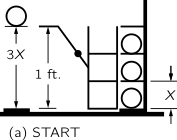
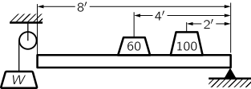

[up](top.md)

## 4 エネルギーの保存

### 4-1 エネルギーとは何か

概論的の話は前章で一応終わったから、この章では、物理学のいろいろな面にもう少しくわしく立ち入って勉強しはじめることにしよう.理論物理学ではどんな概念や考え方が使われているか.このことを示す一つの例として、これからエネルギー保存の法則のことを述べよう.これは物理学における最も基本的な法則の一つである.

今日までに知られているあらゆる自然現象を通じて、その全部にあてはまる事実---法則といってもよい---が一つある.これまでわかっているところでは、この法則には一つの例外もなく、精確に成立する.これがすなわちエネルギー保存の法則である.その内容は次のとおりである.ここに、我々がエネルギーと名付けるある一つの量を考えると、自然界でどんな複雑な現象が起こっても、その量は変化しないというのである.これは、いわば数学的の原理でたいへん抽象的な考えである; ここに一つの数量があってどんな現象が起こってもその量は変化しないというのだから、それはあるメカニズムの記述でもなく、また具体的のことがらの記述でもない; 我々がまずある数を計算しておく、それから自然がいろいろな変化をした後になって、もういっぺんこの数を計算してみる.そうすると、面白いことには、その値が前と同じだというのである.(チェスで赤い目にいるビショップは、何手動かしても---一つ一つの手はわからなくても---やはりどこかの赤い目にいるということに似ている.エネルギー保存というのは、この種の法則である.)これは抽象的な考えだから、一つの実例によってその意味を説明しよう.

ここに"腕白デニス"のような子供がいて、積木をもっているとしよう.その積木は絶対に丈夫で、いくつかに割れることはないとしよう.積木はみんな同じ大きさであるとする.また子供のもっている積木は28コであるとする.ある朝のこと、お母さんは、この28コの積木をもたせてデニスを室で遊ばせておいた.その日の夜になって、お母さんは気をつけて積木の数を数えてみた.そしてそこで現象論的な一つの法則を発見する---デニスが積木でどんな遊び方をしたとしても、積木の数はいつも28コである! それから数日たったある日、積木を数えてみると27しかなかった.しかしちょっと探したら、あとの1コは敷物の下から出てきた.---積木の数に変りがないということをたしかめるためには、お母さんはそこら中によく目をくばらなければならない.ところがある日、積木の数が変わった.たった26になってしまっていた.しかしよく見ると、室の窓があいていた.そこから外を見ると、残りの2コは外に落ちていた.またある日、注意して積木の数を数えてみると、30になていた!これにはたいへんびっくりした.しかしとなりのプルースが自分の積木をもって遊びに来て、デニスのうちにいくつかおき忘れていったということがわかったので、問題は解決した.お母さんはこの余分の積木を窓からすててから、窓をしめ、もうプルースを入れてやらないようにした.これで当分勘定はうまくあっていたが、またある日、積木の数を数えてみたら、たった25しかない.この室にはおもちゃ箱がある.そこでお母さんがそこへ行って箱をあけようとすると、デニスは、"僕のおもちゃ箱をあけちやイヤ"と、叫ぶのである.お母さんは、おもちゃ箱をあけさせてもらえない.何とかして見付けだしてやろうとして、お母さんは頭のいい方法を発明した.お母さんは積木1コの目方は3オンスであるということを知っている.また、積木28が全部箱から外に出ているとき、箱全体の目方をはかってみたら、それは16オンスであった.その次に、お母さんが積木の数をたしかめようとするときには、おもちゃ箱の目方をはかり、それから16オンスをひいて3でわった.お母さんは次のことを発見したのである:

$$\left( 外に出ている積木の数 \right) + \dfrac{(箱の重さ) - 16オンス}{3オンス} = 一定 \tag{4.1}$$

ところがこの式が成り立たないことがあった.しかしそのときよく見ると、風呂桶に入っているよごれ水の面の高さがいつもとちがうようである.腕白デニスが積木を風呂桶の中にほうり込んだのである.水がよごれているので、お母さんには積木は見えない.しかし、、上の式にまた別な項を加えて計算すれば風呂桶の中に積木がいくつ入っているか、お母さんにはわかるのである.水の深さは、はじめ6インチで、積木を1コ投げ入れるごとに水面は$\frac{1}{4}$インチずつ高くなる.だから新しい式はこうなる.

$$\left( 外に出ている積木の数 \right) + \dfrac{(箱の重さ) - 16オンス}{3オンス} + \dfrac{(水の深さ) - 6インチ}{1/4インチ}= 一定 \tag{4.2}$$

お母さんは、おもちゃ箱も調べなければならない.風呂桶も調べなければならないとうことになって、だんだんに面倒になるが、それに相当するだけの項をつけ加えて考えれば、目で見てたしかめることのできない場所に積木がいくつあるかを勘定することができるようになる.こうしてお母さんは一つの式に到達したのあって、それで計算すると、この量はあらゆる場合に一定である.

さてこの積木の話はエネルギー保存とどこが似ているのか? 積木のたとえ話のなかでいちばん大切なのは、"見えるところには積木が一つもない"という場合である.(4.1)や(4.2)の式の第1項を取り去って考えてみるとわかるように、我々はいわば抽象的のものを計算しているのである.そこで積木とエネルギーのアナロジーはこういうことになる.第1、我々がエネルギーを計算するときに、そのエネルギーの一部分が、考えている系から出て行ってしまったり、また若干のエネルギーが入って来たりすることがあるが、しかしエネルギー保存を証明するのには、考えている系に何も入れなかった、また何も取り出さなかったという条件が大切である.第2に、エネルギーにはちがった形のものがたくさんあるのであって、おのおのに対してそれぞれ計算式がある.すなわち: 重力エネルギー、運動エネルギー、熱エネルギー、弾性エネルギー、電気エネルギー、化学エネルギー、輻射エネルギー、核エネルギー、質量エネルギー等である.これらのおのおのの量を求めて全部加えあわせると、エネルギーの出入りがなければ、答はいつも一定なのである.

エネルギーとは何だろうか.それについては、現代の物理学では何もいえない.このことは頭に入れておく必要がある.エネルギーはきまった分量のつぶになっているということはない.そのようなものではないのである.しかしある数量を計算する式があって、それをみんな加えると“28”という---いつも同じ数になるというのである.いろいろな式のからくりや理由にはふれないという点で、エネルギーというのは抽象的なものなのである.

### 4-2 重力の位置のエネルギー

エネルギーの保存則を理解するためには、すべての形のエネルギーの式を知らなければならない.これから地球の表面近くの重力による位置のエネルギーをあらわす式を考えよう.これからその式を導くにあたっては、実際の歴史とは全く無関係なやり方でやってみる.このやり方は、この講義のために特に工夫したものである.いくつかの事実とちゃんとした理屈とから出発すれは、自然についてずいぶんたくさんのことがらを引き出すことができるものなのであって、このやり方によって、その例証を諸君に示そうと思う.これは理論物理学者の仕事のやり方を示す一つの例である.カルノーが蒸気機関の効率を論じたとき、実にエレガントな方法を使ったが、これから述べるやり方もそれにならったものである.(*1)

重量あげの器械---一方のおもりを下におし下げると他のおもりが上にもち上がるというはたらきをする器械---を考える.それから次の仮説をおく:このような器械では永久運動というようなものはない.(永久運動というものは全然存在しないというのが、実はエネルギー保存の法則の一般的記述なのである.)永久運動を定義するには、気を付けなければならないことがある.まず、重量あげ器械についてそれを考えてみよう.おもりをたくさん上げたり下げたりしたあとで、器械をはじめの状態に戻したときに、もしも差引きおもりが上がっていたということになったとすると、永久運動器械というものがあるということになる、それは、そのもち上げられたおもりを使えば何か他のものをはたらかすことができるがらである.これは、おもりをもち上げた器械が完全にもとの状態にもどているならは、という条件つきであり、更にまたこの器械が自給自足---おもりを上げるのにブルースの積木のようなエネルギーをほかからもらわなかった---ならば、という条件つきである.

Fig. 4–1. 簡単な重量あげ器械 

図4-1に示したのは、非常に簡単な重量あげ器械である.この器械は"強さ"3のおもりをもち上げる.一方の皿の上にはおもりが三つ、他の皿の上には一つのっている.しかしこの器械を実際にはたらかせるのには、左の皿を少しだけ軽くしてやらなければならない.また、ちょっとうまく、右の皿を少しだけ軽くしてやれば、おもり三つの方が下がり、それによって、おもり一つの方がもち上がる.もちろん実際の重量あげ器械をはたらかせるには、軽くする代りに余分をちょっと加えてやらなければならないのであるが、このことはしはらくの間、無視しておく.理想的の器械というものは現実には存在しないが、もしありとすればこのちょっとの余分というものを必要としないものである.我々が実際に使う器械はほとんど可逆的にはたらかせることができる: すなわち、おもり一つをある距離だけおし下げることによって、おもり三つをもち上げることができるならば、逆におもり三つをおし下げることによって、おもり一つを前に下げたのと同じ距離だけもち上げることができるのである.

さて器械というものに2種類あると考える.第1の種類というのは、可逆的でないものであって、現実の器械はすべてこれに含まれる.また第2の種類というのは可逆的なものである.軸受や腕などのところをどんなに気を付けて設計しても、可逆的の器械は実現不可能であるのはもちろんのことである.しかしかりにそういう可逆的な器械があると仮定する.そしておもり一つ分(1オンスその他、何でもよい)を単位の距離だけおし下げると、そのとき、おもり三つ分がもち上がるとしよう.この可逆的な器械を、器械$A$とする.そしてこの可逆的な器械ではおもり三つ分が距離$X$だけもち上がるとする.別にもう一つ別の器械$B$があるとし、これは可逆的でなくてもよい.この器械ではおもり一つ分を単位の距離だけおし下げると、おもり三つ分が距離$Y$だけもち上がるとする.ここで、$Y$は$X$よりも高くはないということを証明することができるのである.すなわち、可逆的な器械がもち上げるよりも、もっと高くにおもりをもち上げることのできる器械をつくることは不可能だというのである.その理由を考えよう.かりに$Y$が$X$よりも大きかったとしてみよう.おもり一つを考え、それを器械$B$によって単位の距離だけおし下げると、おもり三つは距離$Y$だけもち上がる.こうすれば$Y$は$X$よりも大きいのだから、利用しうる動力が得られたことになる.そこでおもりを$Y$から$X$まで下げ、それから可逆的の器械$A$を反対むきに使って、おもり三つを距離$X$だけおし下げ、おもり一つを単位の距離だけもち上げることができる.こうすると、このおもり一つは前と同じところに戻って、器械$A$も器械$B$も次の段の準備ができているということになる.このように、もしも$Y$が$X$よりも高かったとすると、永久運動が得られることになる.しかしこれは不可能であると仮定しておいたことである.これらの仮定から、我々はこう結論することができる.$Y$は$X$よりも高くない.したがって、考えうるあらゆる器械のなかで、可逆的な器械が最善のものであるということになる.

これだけでなく、おもりをもち上げる高さは、すべての可逆的の器械について、みなまさに同じであるということもわかる.それには、まず器械$B$も、実は可逆的であったとする.$Y$が$X$よりも高いことはないという論法は、もちろん前のとおりそれでよいのであるが、こんどは我々は器械を反対の順に使い、論法を逆に進めて、$X$が$Y$よりも高いことはないことを証明することができる.これは実に注目すべきことである.何故ならば、このことによっていろいろの器械の内部の仕掛けを見ないでも、それがものをもち上げる高さを、論ずることができることになるからである.いま、誰かがおそろしく手のこんだ何段かのてこを使って、おもり一つを単位の距離だけおし下げることによっておもり三つをもち上げるものをつくたとする.一方、同じはたらきをする1段てこの可逆的なものをつくってこれとくらべてみても、手のこんでいる器械の方がおもりを高くもち上げられるということはない.むしろおそらく低いということが上のことからすぐわかるのである.またもし、彼の器械が可逆的なものであるならば、それがおもりをもち上げる高さはいくらであるかということも、我々にはキチンとわかる.これまでのことをまとめれば次のようになる: 内部のしかけがどうであろうとも、1ポンドのものを1フィートおし下げることによって1コ3ポンドのものはどの高さまで上がるかというと、あらゆる可逆的の器械でそれはみな同じ距離$X$である.これはたしかに非常に有用な普遍法則である.そこで次の間題は、いうまでもなく、$X$の値はどれほどであるかということである.

(a)はじめ
(b)タマをのせる
(c)1ポンドのものが3ポンドのものを距離$X$だけ上げる
(d)タマをおろす
(e)おきなおし
(f)おわり

図.4–2. 可逆器械. 

-----------------------------------------

この距離Xを3対1で持ち上げるリバーシブルな機械があるとします。図4-2のように、動かないラックに3つのボールをセットします。1つのボールは、地面から1フィートの距離にあるステージ上に保持されています。この機械は、3つのボールを持ち上げ、1つのボールを距離1だけ下げることができます。さて、3つのボールを保持する台には、床と2つの棚がちょうど距離Xの間隔で配置されており、さらに、ボールを保持する棚も距離Xの間隔で配置されていることを確認しました(a)。まず、ボールをラックから棚に水平に転がします(b)。高さを変えないので、この作業にはエネルギーがかからないと仮定します。すると、可逆装置が作動して、1個のボールを床に下ろし、ラックを距離Xだけ持ち上げます(c)。ここで、ラックの配置を工夫して、これらのボールが再びプラットフォームと同じ高さになるようにしました。このようにして、ボールをラックに降ろします（d）。ボールを降ろした後は、機械を元の状態に戻すことができます。これで、上3段の棚に3個、下1段に1個のボールが入ったことになります。しかし、不思議なことに、ある意味では、2つの玉を持ち上げたことにはならないのです。なぜなら、以前から2と3の棚に玉があったからです。その結果、1つのボールを3倍の距離だけ持ち上げたことになります。さて、3Xが1フィートを超えれば、ボールを下げて機械を初期状態(f)に戻し、再び装置を動かすことができます。したがって、3Xは1フィートを超えることはできません。3Xが1フィートを超えれば、永久機関を作ることができるからです。同様に、1フィートが3Xを超えられないことは、機械全体を逆に走らせることで証明できます。したがって、3Xは1フィートより大きくも小さくもなく、議論だけでX=1/3フィートという法則を発見することができます。この結果を別の言い方で表現すると、3ポンドに持ち上げた高さ（この問題ではX）をかけたものは、1ポンドに下げた距離（この場合は1フィート）をかけたものに等しいということになる。すべての重さを床からの高さに掛けて、機械を作動させてから、すべての重さにすべての高さを掛けても、変化はありません。1つの重りだけを動かした例を、1つの重りを下げるときに複数の重りを持ち上げる場合に一般化しなければなりませんが、それは簡単です）。

重さと高さの和を重力位置エネルギーと呼んでいます。これは、物体が地球との空間的な関係によって持つエネルギーです。重力エネルギーの公式は、地球からあまり離れていない限り（高くなるほど力は弱くなります）、次のようになります。

$$(一つの物体の重力ポテンシャルエネルギー) = (重さ)×(高さ) \tag{4.3}$$

それはとても美しい推論です。ただ、問題は、それが真実ではないかもしれないということです。例えば、永久機関は実際には可能なのかもしれません。前提条件が間違っているかもしれないし、推論が間違っているかもしれないので、常に確認する必要があります。それは実験的に、実際にそうであることがわかります。

何かとの相対的な位置関係に関係するエネルギーの一般的な名称は、位置エネルギーと呼ばれています。この場合はもちろん、重力ポテンシャルエネルギーと呼ぶ。重力ではなく電気的な力の問題で、たくさんのレバーを使って電荷を他の電荷から「持ち上げる」場合、そのエネルギーの内容は電気的位置エネルギーと呼ばれます。一般的な原理としては、エネルギーの変化は力×力が押された距離であり、これは一般的なエネルギーの変化である。

$$(エネルギーの変化) = (力) × (力が押された距離) \tag{4.4}$$

このコースを続けていく中で、このような他の種類のエネルギーにも多く触れていきます。

Fig. 4–3.傾斜した平面 

エネルギー保存の原理は、さまざまな状況で何が起こるかを推論するのに非常に役立ちます。高校では、滑車やレバーをさまざまな方法で使用する際に、多くの法則を学びました。今では、これらの「法則」はすべて同じものであり、75の法則を暗記しなくても理解できるようになっています。簡単な例は、滑らかな傾斜面で、嬉しいことに、3-4-5の三角形です（図4-3）。その傾斜面に1ポンドの重りを滑車で吊るし、滑車の反対側には重りWを吊るします。重りWがどのくらいの重さであれば、平面上の1ポンドと釣り合うかを知りたいのです。どうすればそれがわかるのでしょうか？ちょうどバランスが取れていると言えば、リバーシブルなので上下に動くことができ、次のような状況を考えることができます。最初の状況である(a)では、1ポンドの重りが下にあり、重りWが上にあります。Wが可逆的な方法で滑り落ちたとき、(b)では、1ポンドの重りが上部にあり、重りWは以前あった平面から斜めの距離、つまり5フィートのところにあります。1ポンドの重りを3フィートだけ持ち上げ、Wの重りを5フィートだけ下げました。したがって、W＝3/5ポンドとなります。これは、力の成分からではなく、エネルギーの保存から推論したことに注意してください。しかし、巧妙さは相対的なものです。ステヴィヌスが発見し、彼の墓石に刻まれた、さらに素晴らしい方法で演繹することができます。図4-4を見ると、鎖が回っていないので、1ポンドの3/5でなければならないことがわかります。鎖の下の部分がそれ自体でバランスをとっていることは明らかで、一方の5つの重りの引っ張りと他方の3つの重りの引っ張り、あるいは脚の比率が何であれ、バランスをとらなければなりません。この図を見ると、Wは1ポンドの3/5でなければならないことがわかります。墓石にこのような碑文が書かれていれば、あなたはうまくやっていると言えるでしょう）。

図4-4.ステヴィヌスの墓碑銘 

ここでは、エネルギーの原理をより複雑な問題である、図4-5のスクリュージャッキで説明します。長さ20インチのハンドルを使って、1インチに10個のねじ山を持つねじを回します。1トン（2000ポンド）を持ち上げるためには、ハンドルにどれだけの力が必要かを知りたいと思います。例えば、1トンを1インチ持ち上げようとすると、ハンドルを10回回さなければなりません。1回まわすと約126インチ進みます。このようにハンドルは1260インチ移動しなければならず、いろいろな滑車などを使うと、ハンドルの先に未知の小さな重さWをかけて1トンを持ち上げることになります。そこで、Wは約1.6ポンドであることがわかりました。これはエネルギーの保存の結果です。

図4-5.スクリュージャッキ

図4-6.片方の端を支えた重り付きの棒

ここで、図4-6のようなやや複雑な例を考えてみましょう。長さ8フィートの棒が一端で支えられています。棒の中央には60ポンドの重りがあり、支持部から2フィート離れたところには100ポンドの重りがあります。棒の重さを無視して、バランスを保つためには、棒の端をどのくらいの力で持ち上げればよいでしょうか。片方の端に滑車をつけて、その滑車に重りをぶら下げたとします。重りWはどのくらいの大きさにすればバランスがとれるでしょうか？重りが任意の距離を落下することを想像すると、簡単に4インチ下がるとすると、2つの負荷の重りはどのくらいの高さまで上がるでしょうか？中央は2インチ、固定端から4分の1の位置は1インチ上がります。したがって、高さと重さの和は変化しないという原則から、重さWに4インチ下げたものと、60ポンドに2インチ上げたものと、100ポンドに1インチ上げたものとを足しても、何にもならないということになります。

$$−4W + (2)(60) + (1)(100) = 0,W = 55 lb \tag{4.5}$$

したがって、バーのバランスをとるためには、55ポンドの重りが必要です。このようにして、複雑な橋の配置など、「バランス」の法則を導き出すことができるのです。この方法は仮想作業の原則と呼ばれています。なぜなら、この議論を適用するためには、構造物が実際には動いていない、あるいは動かせないにもかかわらず、少し動いているように想像しなければならないからです。これは、実際には動いていなくても、動かせなくても、構造物が少し動いているように想像する必要があるからです。

### 4-3 運動エネルギー

もう一つのエネルギーを説明するために、振り子を考えてみましょう（図4-7）。質量を脇に寄せて離すと、前後に揺れます。その際、振り子は両端から中央に向かう際に高さを失います。位置エネルギーはどこへ行くのでしょうか？重力エネルギーは、下の方にあると消えてしまいますが、それでもまた上に上がっていきます。重力エネルギーは別の形になっているはずです。重力エネルギーは別の形になっているはずです。明らかに、再び登ることができるのは運動のおかげですから、底に着いたときに重力エネルギーが何か別の形に変換されています。

図4-7.振り子。

運動のエネルギーの公式を得なければならない。さて、可逆的な機械についての議論を思い出してみると、底面の運動には、ある高さまで上昇することを可能にするエネルギー量が必要であり、それは、上昇するための機械や上昇するための経路とは何の関係もないことが容易にわかります。つまり、子供用の積み木に書いたような等価式があるのです。エネルギーを表す別の形式があります。それが何かは簡単に言えます。底面の運動エネルギーは、重さに、その速度に対応して進むことができる高さをかけたものに相当します。K.E.=WHです。必要なのは、物体の運動に関係する何らかの規則によって高さを教えてくれる公式です。ある速度で何かを始めれば、例えば真上に向かっていけば、ある高さに到達します。それが何であるかはまだわかりませんが、速度に依存しており、そのための公式があります。では、速度Vで動く物体の運動エネルギーの公式を求めるには、その物体が到達できる高さを計算し、それに重さを掛けなければなりません。すぐにこのように書けることがわかります。

$$K.E. = WV^2/2g. \tag{4.6}$$

もちろん、運動にエネルギーがあるということは、重力場にいるということとは関係ありません。運動がどこから来たかは関係ありません。これは、様々な速度に対する一般的な式です。(4.3)も(4.6)も近似式です。1つ目の理由は、高さが大きいとき、つまり重力が弱くなるほどの高さにあるときには正しくないからです。2つ目の理由は、高速では相対論的な補正が必要だからです。しかし、最終的にエネルギーの正確な計算式が得られれば、エネルギー保存の法則は正しいことになります。

### 4-4 エネルギーの他の形態

このようにして、他の形態のエネルギーの存在を説明することができます。まず、弾性エネルギーについて考えてみましょう。ばねを引っ張ると、何らかの仕事をしなければなりません。なぜならば、ばねを引っ張ると、そのばねで重りを持ち上げることができるからです。したがって、伸びた状態では、何らかの仕事をする可能性があるのです。重さと高さの和を評価しても、それはチェックアウトされません。バネに張力がかかっているという事実を考慮して、何か他のものを加えなければなりません。弾性エネルギーとは、バネを伸ばしたときの計算式です。それはどれくらいのエネルギーなのでしょうか？手を離すと、弾性エネルギーは、バネが平衡点を通過するときに運動エネルギーに変換され、バネの圧縮・伸張と運動の運動エネルギーを行ったり来たりします。(多少の重力エネルギーも出入りしますが、この実験は「横」にしてもできます)。これまで、小さな重りをつけて物を動かしたり、「機械は元に戻る」とか「永遠に続く」とか言ってごまかしてきましたが、結局は止まってしまうことがわかります。バネが上下に動き終わったときのエネルギーはどうなっているのでしょうか。ここで、もうひとつのエネルギーである「熱エネルギー」が登場します。

ばねやてこの中には、たくさんの原子が集まってできた結晶があり、部品の配置に細心の注意を払い、何かが何かの上を転がっても、原子が全く動かないように調整することができます。しかし、非常に注意しなければなりません。通常、物が転がると、素材の凹凸のためにぶつかったり、揺れたりして、原子が中で動き出します。動きが遅くなった後、原子がランダムに、混乱した形で内部を動き回っていることに気づくのです。運動エネルギーは残っていますが、それは目に見える動きとは関係ありません。夢のようだ。運動エネルギーが残っていることをどうやって知ることができるのか？温度計を使えば、実際にバネやレバーが温かくなっていることがわかりますし、実際に運動エネルギーが一定量増加していることもわかります。私たちはこのようなエネルギーを熱エネルギーと呼んでいますが、実際には新しい形態ではなく、単なる運動エネルギー、つまり内部の動きであることがわかっています。なぜなら、大きな物質の塊を動かすたびに、原子が絶対に乱れないわけではなく、ある程度のランダムな動きが原子系に入るからです。私たちはそれを見ることはできませんが、温度計などで測定することができます）。)

エネルギーには他にも様々な形態がありますが、もちろんこれ以上詳しく説明することはできません。電気エネルギーがあります。これは電荷による押し引きに関係しています。放射エネルギー、つまり光のエネルギーがあります。光は電磁場の中の小刻みな動きとして表現されるので、電気エネルギーの一形態であることがわかります。また、化学反応によって放出されるエネルギーである化学エネルギーもあります。なぜなら、化学エネルギーは原子が互いに引き合うエネルギーであり、弾性エネルギーも同様だからです。化学エネルギーには2つの部分があり、1つは原子内の電子の運動エネルギーであり、その部分は運動エネルギーであり、もう1つは電子と陽子の相互作用による電気エネルギーであり、その部分は電気エネルギーである、というのが現代の理解です。次に核エネルギーですが、これは原子核内の粒子の配列に関わるエネルギーで、公式はありますが、基本的な法則はありません。それは電気的でもなく、重力的でもなく、純粋な運動エネルギーでもないことはわかっていますが、それが何であるかはわかっていません。しかし、それが何であるかは分かっていません。それは、エネルギーの付加的な形態のようです。最後に、相対性理論に関連して、運動エネルギーの法則が修正され、運動エネルギーが質量エネルギーと呼ばれる別のものと組み合わされるようになったことがあります。物体は、その存在自体がエネルギーを持っています。もし私が陽電子と電子を持っていて、重力も何も気にせず、何もせずにじっと立っていて、それらが一緒になって消えると、放射エネルギーが解放され、一定の量になり、その量は計算できます。その量は計算することができます。それが何であるかは関係なく、2つのものを消滅させれば、一定量のエネルギーが得られる。この式はアインシュタインが最初に見つけたもので、E=mc^2です。

エネルギー保存則が解析に非常に有効であることは、これまでの議論で明らかです。公式をすべて知らなくても、いくつかの例で説明しました。もし、すべての種類のエネルギーについてすべての公式を持っていれば、詳細を調べなくても、多くのプロセスがどのように機能するかを分析することができます。ですから、保存則は非常に興味深いものです。では、物理学には他にどのような保存則があるのかという疑問が出てきます。エネルギーの保存則に類似した保存則が2つあります。一つは、直線運動量の保存と呼ばれるものです。もう1つは角運動量の保存と呼ばれるものです。これらについては、後ほど詳しく説明します。最後の分析では、私たちは保存則を深く理解していません。エネルギーの保存を理解していないのです。私たちは、エネルギーを、ある数の小さな塊として理解していません。光子は塊で出てきて、光子のエネルギーはプランク定数に周波数をかけたものだと聞いたことがあるかもしれません。確かにその通りですが、光の周波数は何でもありますから、エネルギーがある一定の確定した量でなければならないという法則はありません。デニスのブロックとは違って、少なくとも現在理解されている範囲では、どんな量のエネルギーでもありえます。ですから、私たちはこのエネルギーを現時点で何かを数えて理解しているわけではなく、単に数学的な量として理解しているだけで、それは抽象的でかなり特殊な状況です。量子力学では、エネルギーの保存は、絶対的な時間に依存しないという世界のもう1つの重要な特性と非常に密接に関係していることがわかりました。ある瞬間に実験をして試してみて、その後に同じ実験をしても、まったく同じように振る舞うことができるのです。これが厳密に正しいかどうかはわかりません。仮にそうだと仮定して、量子力学の原理を加えれば、エネルギー保存の原理が導き出されます。これは、かなり微妙で面白いもので、説明するのは簡単ではありません。他の保存則も関連しています。運動量の保存は、量子力学では「どこで実験しても結果は同じ」という命題と関連しています。空間の独立性が運動量の保存と関係するように、時間の独立性がエネルギーの保存と関係し、最後に装置を回しても違いはないので、世界が角の向きに対して不変であることが角運動量の保存と関係します。これらの他にも、3つの保存則があります。これらの保存則は、今日私たちが知る限りでは正確なものであり、ブロックを数えるという性質を持っているため、より簡単に理解することができます。

3つの保存法則のうち、まず電荷の保存ですが、これは単に、自分が持っている正の電荷の数と負の電荷の数を数えても、その数は決して変わらないということです。プラスをマイナスで消すことはあっても、プラスがマイナスより多くなることはありません。この法則に似た法則が他に2つあり、1つは「バリオンの保存」と呼ばれるものです。中性子や陽子などの不思議な粒子がありますが、これらはバリオンと呼ばれています。自然界のどのような反応においても、プロセスに入ってくるバリオンの数(*2)を数えれば、出てくるバリオンの数は全く同じになります。もう一つの法則として、レプトンの保存があります。レプトンと呼ばれる粒子のグループは、電子、ミューオン、ニュートリノと言えます。電子には反電子がありますが、これは陽電子で、つまり-1レプトンです。反応中のレプトンの総数を数えると、少なくとも現在分かっている限りでは、出入りの数は決して変わらないことが分かります。

これが6つの保存則で、3つは空間と時間に関わる微妙なもの、3つは何かを数えるという意味での単純なものです。

海の水は一定の温度を持っているので、水の中の原子はたくさん動き回っていますが、どこかからエネルギーを調達しなければ、原子を一定の動きにまとめることはできません。つまり、エネルギーは保存されるという事実はわかっていても、人間が使えるエネルギーはそう簡単には保存されないのです。どのくらいのエネルギーが利用できるかを規定する法則を熱力学の法則といい、不可逆的な熱力学的過程にはエントロピーという概念が関係しています。

最後に、今日、私たちはどこからエネルギーを得ることができるのかという問題について述べます。私たちのエネルギーは、太陽、雨、石炭、ウラン、水素から供給されています。太陽は雨を降らせ、石炭も作るので、これらはすべて太陽からのものです。エネルギーは保存されていますが、自然はそれに関心がないようで、太陽からたくさんのエネルギーを放出していますが、20億分の1しか地球に降り注いでいません。自然はエネルギーが保存されているにもかかわらず、あまり気にせず、大量のエネルギーをあらゆる方向に使っています。ウランからはすでにエネルギーが得られており、水素からもエネルギーが得られますが、現在は爆発的に危険な状態になっています。熱核反応で制御できるようになれば、1秒間に10クォートの水から得られるエネルギーは、アメリカで発電されるすべての電力に匹敵することがわかります。1分間に150ガロンの水を流すと、現在アメリカで使われているすべてのエネルギーを供給できるだけの燃料があることになります。ですから、物理学者は、どうすれば私たちがエネルギーを持つ必要性から解放されるかを考えなければなりません。それは可能です。

-----
*1 ここで重要なのは最後の結果(4.3)を求めることではない.この結果は諸君もすでに知っているだろう.重要なのは、むしろ、理論的の考察によってその結果に到達することができるという点である.

*2 反バリオンを-1バリオンと数える。

[up](top.md)
