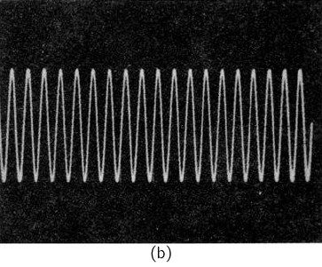
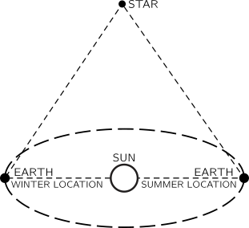
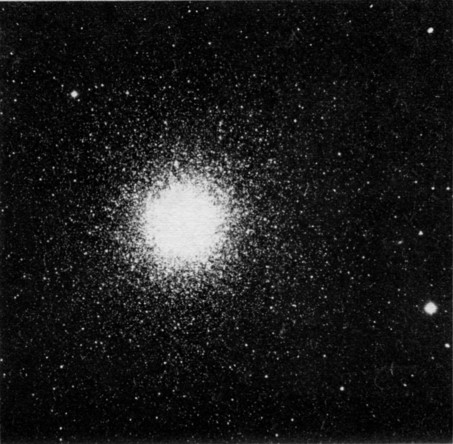
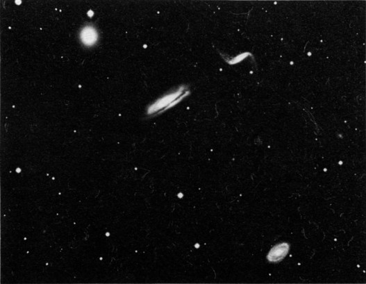

[up](top.md)

## 5 時間と距離

### 5-1 運動

この章では、時間という概念と距離という概念について、いくつかの面を考えてみることにする.前にも強調したとおり、物理学は、他のすべての科学と同じように、観測に依存する.物理的科学が発達して今日の姿になったのは、主として、量的な観測をするということに重きがおかれた結果であるといってよい.物理学の核心は量的の関係に到達することにあるが、それは量的の観測によってのみ可能なのである.

350年前にガリレオがやった仕事を物理学のはじまりであるとし、ガリレオをもって最初の物理学者であるとしようとする人が多い.それまでの、運動の研究というものは、思弁的なものであって、ただ頭の中で考えられる議論にもとづいたものであった.その議論の大部分は、アリストテレスやその他のギリシャの哲学者のいい出したものであって、"証明ずみ"のこととされていた.ガリレオはそれに疑いをもち、運動に関する一つの実験を行なた.それは、本質的に次のようなものであった.溝に勾配をつけてそれにそってタマをころがして、その運動を観察したのである.彼はそれをただ見ただけではない;どのくらい時間がたつとタマはどのくらい進んでいるかということを測定したのである.

距離を測る方法は、ガリレオよりもずっと前からよくわかっていた.しかし、正確に時間を測る方法、特に短い時間を正確に測る方法はなかった.ガリレオは後になってもっとよい時計(我々の知っているような時計ではないが)を工夫したけれども、最初の実験のときには、等間隔の時間を数えるのに、脈搏を使った.我も同じことをしよう.

タマが坂を下りてくると同時に、"1…2…3…4…5…6…7…8…"と脈搏を数える.友達にたのんで、脈一つごとにタマの位置に小さいしるしをつけてもらう; こうすれば、時間間隔1、2、3、4、… ごとに、出発点からタマがどこまで動いたかという距離を測ることができる.ガリレオは彼の観測の結果を次のようにいいあらわしている.動き出した瞬間から時間が1、2、3、4、…単位たったときのタマの位置にしるしをつけると、それらの位置と出発点との間の距離は1、4、9、16、…という数に比例するというのである.今日では、我々は、距離は時間の自乗に比例するという:

$$D \propto t^2$$

図5-1. タマが傾斜した軌道を転がり落ちる。

運動をしらべるのは、物理学全体の根本であって、どこといつという問題を取り扱うのである.

### 5-2 時間

まず時間というものが何を意味するかを考えてみよう.時間とは何であるか.時間のうまい定義があれば結構である.ウェブスター辞典をひいてみると"時間"は"間隔"であると定義してあるが、"間隔"の方をみると"時間"であると定義してある.これではあまり役に立ちそうにない.あるいはこういえばいいのかもしれない."時間とは、他に何事が起こらなくても起こるものである".しかしこういっても大したことはない.時間というものは我々が定義(辞書的な意味で)できそうにないもののうちの一つであるというのだとしたら、それはもうわかりきっているものだと割りきってしまうのもよかろう:時間とはどれだけたつかということである!

しかし、ともかくほんとに大切なことは、時間をどのように定義するかということではなくて、どのようにして測るかということなのである.時間を測る一つの方法は規則正しく何遍も何遍もくりかえすなんらかの現象---何か周期的な現象---を利用することである.例えば、1日というようなものである.1日というものは、何遍も何遍もくりかえし起こっているようである.しかしちょっと考えてみても、"日というものははたして周期的なのだろうか; 日というものは規則正しいのだろうか”という疑問が当然おこってくる.1日の長さはいつでもすべて同じ長さなのだろうか.夏の1日は冬の1日よりも長いという感じをもっている人もきっといるだろう.また退屈な冬の1日は、ばかに長いと思われることもたしかにある."オヤ、今日の1日の長かったこと!"などと誰かがいっているのを諸君もきいたことがあるにちがいない.

しかし、1日の長さは平均してだいたい同じ長さであるようである.1日の長さがはたして同じであるかどうか---ある1日と次の日とが、あるいは少なくとも平均して---をためす方法はないだろうか.その一つの方法は何か他の周期的現象と比較することである.砂時計を使って、そのような比較をするにはどうすればよいか.砂時計をもてきて、一日中、誰かにそのそばにいてもらい、砂の最後の粒がおちたら砂時計をさかさまにするように頼んでおけば、周期的現象を"つくりだす"ことができる.

こうすれば、朝から次の朝までの間に砂時計を何遍さかさまにしたかという回数を数えることができる.こうやってみると、こんどは、"時間"(砂時計をさかさまにすること)の数は、"日"によて決して同じはないことがわかる.これでは太陽も、砂時計も、あるいは両方とも信用きないということになる.しかしちょっと考えみれば気が付くように、正午から翌日の正午までが何"時間"であるかを数えればいいのである.(ここで正午というのは12時00分ではなく、太陽がいちばん高いところにある瞬間ある.)こうやっみるとこんどこそ、正午から正午までの"時間"の数は、毎日同じであることがわかる.

こうして我は"時間"も"1日"も規則正しい周期性をもっていることを確信し、そして時間に等間隔の仕切りをつけるのである.もっとも、両方が"真に"周期的であることを証明したわけではない.ところで、ここに何か全能者がいて、砂時計の砂の流れを夜はおそくし昼は速くするということはありえないかという疑問も生じるかも知れない.我の実験では、この種の疑問に答えることはできない.我々がせいぜいいえることは、ある一種の規則性が他の種の規則性とうまくあうというだけのことである.我々が時間を定義するのには、何か周期的とみえる現象のくりかえしにその根拠を求めているということだけはいえるのである.

### 5-3 短い時間

我々は、1日の長さというものが、いつも同じように繰り返されているのかということを検討したのであるが、その過程の中で、大切な副産物が得られたことに注意しておく必要がある.我々は1日の何分の1という長さを正確に測る方法を見出した.すなわち、時間を短いものにわけて測るという方法を見出したのである.このやり方をおしすすめて、もっと短い時間を測ることはできないだろうか.

ガリレオは、一つの振子は、その振幅が小さい限り、いつも等間隔で前後に振れるということをたしかめている.ためしに1"時間"の間に振子が何回ふれるかを数えてくらべてみると、たしかにそうなっている.こうして我々は1時間というものをいくつかに仕分けることができる.機械的の工夫を使って振動を数え---そしてそれをつづけるなら、---振子大時計ができるわけである.

さて、我々の振子が1時間に3600回振動するならば(そして1日の中にその1時間が24あるならば)、この振子の周期を1"秒"ということにきめる.こうすればもとの時間の単位をおよそ$10^5$にわけたことになる.同じ理屈で、1秒をさらにさらにこまかい間隔にわけることができる.しかし、諸君もみるとおり、むやみにはやく振動する機械的振子をつくることはむずかしい.今では発振器と称する電気的振子をつくって、振動周期の非常に短いくりかえし現象をつくり出すことができるのである.このような電子発振器で前後に振動するのは電流であって、これが振子のおもりに相当する.

このような電子発振器を何段かつくって、それぞれ一つ手前のにくらべて周期が$\dfrac{1}{10}$になっているようにしたとする.おのおのの発振器を"検定"するには、一つ前のおそい発振器が1ふれする間にそれが何回ふれるかを数えればよい.しかし振動周期が1秒よりも短くなると、その振動を数えるには、何とか工夫して我々の観測能力を拡大しなければならない.その工夫の一つは例えば陰極線オッシロスコープであって、これは短時間をみる顕徴鏡のようなものである.このしかけでは、電流(あるいは電圧)と時間との関係を示すグラフが螢光スクリーンの上にプロットされる.このオッシロスコープを我々の発振器の二つにつなぐ.まず一つの発振器の電流のグラフを書かせ、次にもう一つの発振器の電流のグラフを書かせると、図5-2に示したようなものが得られる.おそい方の発振器の1周期の間にはやい方の周期がいくつふくまれているかをこの図から数えるのはわけない.

図5-2.オシロスコープの蛍光板にうつる二つの曲線 (a)ではオシロスコープはある発振器につながっている (b)は10分の1の周期の発振器につながっている

近代的の電子技術を利用して、$10^{-12}$秒というくらい短い周期で発振するものもできている.そしてその周期は、前に述べたような比較方法によって我々の時間の基本単位、秒、に対して検定されている.この数年間、"レーザー"という光増幅器が開発され完成されたが、それによって、$10^{-12}$秒よりも周期の短い発振器がつくられるようになった.その周期を、上に述べたような方法によって検定することはまだ不可能であるが、しかし、これも間もなく解決するであろう.

$10^{-12}$秒よりも短い時間が測定されることもあるが、これは別の手法によったものである.実は、"時間"の定義として別のものが使われているのである.その一つの方法は、ある運動体に二つの現象が起こる間に、それが、どれだけ動いたかという距離を測るのである.例えば自動車が走っていて、ヘッドライトをつけ、次に消したとすると、どこでつけたか、どこで消したかという位置と、自動車の速さとがわかっていれば、ヘッドライトがついていた時間の長さを求めることができるのである.その時間は、ヘッドライトがついていた距離を速さでわればよい.

最近数年の間に、$π^0$中間子の寿命を測るのに、まさにこのような方法が使われた.$π^0$中間子が写真エマルジョンの中で生じて、その中に残した小さな跡を顕徴鏡でみると、$π^0$中間子(光に近い速さで飛ぶということはわかっている)が、崩壊するまでに平均としておよそ$10^{-7}\mathrm{m}$の距離を動くということがわかった.それの寿命はたった$10^{-16}$秒であったわけだ.前とはちょっとちがった“時”の定義がここで使われたことに注意しておかなくてはならない.しかし、我々の理解に矛盾を生じないかぎり、両方の定義は同等であると信じている.

我々の技術を更に拡大し---必要とあらば定義を拡大して---更にもっとはやい物理現象の経過時間を考えることができる.原子核内の振動周期というようなものも考えることができる.第2章に述べたような、最近発見された新奇な共鳴(粒子)の寿命も考えられる.その全寿命はわずかに$10^{-24}$秒であって、光(我々の知っているもののなかでいちばん速い)が、水素の核(我々の知っているもののなかでいちばん小さい)をよぎる時間とだいたい等しい.

もっと短い時間についてはどうだろうか?もっと短い"時間"というものは存在するのだろうか?我々がその短い時間に起こることを測ることができないとしたら---あるいはそういうことを考えても無駄だというなら---もっと短い時間ということを口にすることに、はたして意味があるのだろうか?恐らくないのだろう.しかし、これは未解決の問題であって、諸君が疑問をもち、そして将来20年か30年の間に諸君自ら解決すべき間題である.

### 5-4 長い時間

こんどは1日よりも長い時間について考えよう.長い時間を測るのはわけない.日数をかぞえるだけでよい---それをかぞえてくれる人がいる限りわけないことである.他にもまだ自然の周期というものがある: およそ365日の1年がある.その他にも、自然が、年数を数える手段を提供してくれていることがある.たとえば、木の年輪だとか、河底の堆積物などがそれである.昔、あることが起こってから、どのくらいの時間が経過したということをきめるのにこのような自然時計が役に立つ場合がある.

長い時間を測るときに、年数を数えることができないという場合には、他の測定法をみつけなければならない.そのなかで、最も成功した方法の一つは、放射性物質を"時計"として使うということである.この場合には、日とか振子とかいう周期的現象はないけれども、また別の種類の"規則性"がある.ある種の物質のサンプルを一つとってその放射能を測ると、その年代が一定の長さだけ古くなると、一定の割合で強さが減少することがわかっている.放射能を時間(例えば日数)の関数として観測してグラフにかくと、図5-3に示したような曲線が得られる.放射能が$T$日で半分になったとすると(これを半減期という)、更に$T$日たてば$\dfrac{1}{4}$になる.以下同様である.任意の時間間隔$t$を考えると、その中には半減期が$\dfrac{t}{T}$個あるわけだから、$t$だけ時間がたった後に残っているものの割合は$\left( \dfrac{1}{2} \right) ^{t/T}$である.

図5-3. 時間による放射能の減衰  
放射能は"半減期"$T$ごとに半分ずつにへる

ある1片の物質、例えば1片の木、があって、それができたときには$A$という量の放射性物質が含まれていたということがわかっているとする.そして、直接の測定によって、いまは$B$という量の放射性物質が含まれているということがわかったとすれば、次の方程式をとくことによって、このものの年齢$t$を計算することができる.

$$\left(\dfrac{1}{2}\right)^{\frac{t}{T}} = \dfrac{B}{A}$$

具合のいいことに、一つのものが形成されたときにその中にどのくらいの量の放射能が含まれていたかがわかる場合がある.例えば、空気中の二酸化炭素は、放射性アイソトープ$C^{14}$(宇宙線の作用でたえず補充されている)を少量含んでいることがわかっている.そこで、あるものの中の炭素の全量を測れば、それのある一部分は、もとは放射性$C^{14}$であったわけである.だから上の式の最初の値$A$がわかる.炭素-14の半減期は5000年である.綿密な測定によると、この半減期の20倍ほどの長さの時間がたった後に残っている量をも測ることができる.こうして10万年も昔に生きていた生物の"年をきめる"ことができるのである.

表 5-1 いろいろの時間

| 年 | 秒 |              | 何の平均寿命か |
|---:|---:|:-------------|:---------------|
|    |    | ?????        |                |
|    | $10^{18}$ | 宇宙の年齢 |           |
|    |    | 地球の年齢   | $\mathrm{U}^{238}$|
| $10^9$ | |             |                |
|    | $10^{15}$ |       |                |
| $10^6$ | | 最古の人類  |                |
|    | $10^{12}$ | ピラミッドの年齢 |     |
|    |    |              | $\mathrm{Ra}^{226}$ |
| $10^3$ | | アメリカ合衆国の年齢 |       |
|    | $10^9$ | 人間の寿命 | $\mathrm{H}^3$ |
| $1$|    |              |                |
|    | $10^6$ |          |                |
|    |    | 1日          |                |
|    | $10^3$ | 光が太陽から地球まで伝わる | 中性子 |
|    | $1$ | 心臓のひとうち |             |
|    | $10^{-3}$ | 音波の周期 |           |
|    | $10^{-6}$ | ラジオ波の周期 | $\mu$中間子 |
|    |    |              | $\pi ^{\pm}$中間子 |
|    | $10^{-9}$ | 光が1フィート伝わる |  |
|    | $10^{-12}$ | 分子回転の周期 |      |
|    | $10^{-15}$ | 原子振動の周期 |      |
|    |    |              |  $\pi ^0$中間子 |
|    | $10^{-18}$ | 光が原子をとおる |    |
|    | $10^{-21}$ |      |                |
|    |    | 原子核振動の周期 |            |
|    | $10^{-24}$ | 光が原子核をとおる | 奇妙な粒子 |
|    |    | ??????       |                |

もっと古いものの年齢も知りたいことであるし、また我々は知っていると思う.そのような知識の大部分は、いろいろちがった半減期をもっている他の放射性アイソトープの測定の結果からわかってきたのである.測定に使うアイソトープの半減期が長ければ長いほど、長い時間を測ることができる.例えばウランには半減期が109年のアイソトープがある.だからもしもウランを含んでいるものが形成されたのが今から109年の昔だったとすれば、今日ではその半分しか残っていないはずである.このウランは崩壊すると、鉛に変わる.大昔に何か化学的に形成された岩石の1片をとって考える.鉛とウランとは化学的性質がちがうので、鉛はこの岩石のなかのある場所に集まり、ウランは他の場所に集まって、ウランと鉛とは別々になる.今日この岩石の1片をみると、ウランだけあったはずの場所が、一部分ウランで一部分鉛になっている.それらの割合をくらべれば、ウランの何パーセントがなくなって、それが鉛に変わったのかということがわかる.この方法によって、年齢が数十億年だということがわかった岩石もある.この方法を拡張して、特定の岩石を使う代りに、海水の中のウランと鉛に着目して地球全体の平均をとると、地球自身の年齢はおよそ45億年であることが(この数年来)わかてきた.

地球にふってくる隕石の年齢もウラン法できめられるが、地球の年齢がそれと同じであることがわかったのは、面白いことである.地球は、宇宙にただよっていた岩片から形成されたものであり、また隕石はおそらく岩片の残りであると思われる.50億年以上昔のあるときに、字宙ははじまった.また宇宙に人間というものが生まれたのは、1〜1.2千万年の前のことだと、今では信ぜられている.それ以前にどんなことが起こたか、我は知らない.そこで、次のような疑問が当然おこってくる: この問題は意味をなすか?それより以前ということには意味があるのか?

### 5-5 時間の単位と基準

-----------------------------

1日や1秒といった標準的な時間の単位から始めて、他のすべての時間をこの単位の倍数や分数で参照すると便利であることを示唆してきました。時間の基本的な基準として何を取るべきでしょうか。人間の脈拍を取るべきでしょうか。脈拍を比較してみると、かなりばらつきがあることがわかります。2つの時計を比較すると、それほど変化していないことがわかります。では、時計を使ってみよう、と言うかもしれません。でも、誰の時計？あるスイス人の少年が、自分の町のすべての時計を同時に正午に鳴らしたいと思ったという話があります。彼は、町中の時計を一斉に正午に鳴らしたいと思い、その価値を皆に説いて回りました。皆は、自分の時計が正午を鳴らした時に、他の時計も正午を鳴らしてくれれば、それは素晴らしいアイデアだと思ったのです。誰の時計を基準にするかは、なかなか難しいことです。幸いなことに、私たちは地球という一つの時計を共有している。長い間、地球の自転周期が時間の基本的な基準とされてきました。しかし、測定の精度が上がるにつれ、最高の時計で測ると、地球の回転は正確には周期的ではないことがわかってきました。この「最良の」時計とは、互いに一致しているために正確であると信じられる時計のことである。現在では、様々な理由から、ある日は他の日よりも長く、ある日は他の日よりも短く、平均して地球の周期は、数世紀の経過とともに少しずつ長くなっていると考えられています。

ごく最近まで、地球の周期に勝るものはなかったので、すべての時計は一日の長さに関連しており、1秒は平均的な一日の1/86,400と定義されていました。最近、私たちは、地球よりも安定した時間の基準となると思われる、誰もが知っている自然現象を利用したいくつかの自然発振器を経験してきました。いわゆる "原子時計 "である。原子時計の基本的な内部周期は原子の振動であり、温度やその他の外的な影響には非常に敏感ではない。この時計は10^9分の1以上の精度で時を刻むことができる。この2年間で、ハーバード大学のノーマン・ラムゼイ教授は、水素原子の振動を利用した改良型原子時計を設計・製作した。ラムゼイ教授は、この時計はさらに100倍の精度があると考えている。これが本当かどうかは、現在行われている測定でわかる。

天文学的な時間よりもはるかに正確な時計を作ることができたのだから、近いうちに時間の単位を原子時計の規格の一つで定義することが科学者の間で合意されるだろうと期待している。

### 5-6 大きな距離

ここで、「距離」について考えてみましょう。物事にはどれくらいの距離があり、どれくらいの大きさがあるのでしょうか。誰もが知っているように、距離を測る方法は、棒から始めて数えることです。あるいは、親指から始めて数えます。単位から始めて数えるのです。小さいものはどうやって測りますか？どうやって距離を細分化するのでしょうか？時間を細分化するのと同じ方法で、小さい単位を取って、その単位の数を数えて長い単位を作ります。そうすれば、どんどん小さな長さを測ることができます。

しかし、距離といっても、メートル棒で数えて得られる距離とは限りません。2つの山の頂上間の水平方向の距離を、メートル棒だけで測るのは難しいでしょう。私たちは経験的に、距離を測る方法として三角測量を採用しました。これは、距離の定義を変えていることになりますが、どちらも使える場合には、お互いに一致します。空間はユークリッドが考えていたものとほぼ同じですから、2種類の距離の定義は一致します。地球上では一致しているので、さらに大きな距離を三角測量で測ることに自信が持てました。例えば、スプートニク1号の高さを三角測量で測ってみました。その結果、高さはおよそ5×10^5メートルであることがわかりました。また、月までの距離も同じようにして測ることができます。地球上の別の場所にある2台の望遠鏡を使って、必要な2つの角度を得ることができます。このようにして、月までの距離が4×10^8メートルであることがわかりました。

図5-4.スプートニクの高さは三角測量で決まる。

太陽と同じことはできないし、少なくとも誰もできていない。太陽のある一点に焦点を合わせて角度を測る精度は、太陽までの距離を測るには十分ではありません。では、どうすれば太陽までの距離を測ることができるのか。三角測量の延長線上にある方法を考えてみましょう。天体観測によって、すべての惑星の相対的な距離を測定すると、すべてのものの相対的な距離が適切に設定された太陽系の図が得られますが、絶対的な距離はありません。そこで、絶対的な距離を測る必要があるのですが、それにはいくつかの方法があります。最近まで最も正確だと信じられていた方法の1つは、地球の近くを時々通過する小さな惑星の1つであるエロスまでの地球からの距離を測定することでした。この小さな天体を三角測量することで、必要な1つの尺度を得ることができる。残りの部分の相対的な距離がわかれば、例えば、地球から太陽までの距離や、地球から冥王星までの距離を知ることができるのです。

この1年で、太陽系のスケールに関する知識は大きく進歩しました。ジェット推進研究所では、レーダーによる直接観測で、地球から金星までの距離を極めて正確に測定しました。もちろん、これは推測される距離とは全く異なるものです。光の進行速度（つまりレーダー波の進行速度）がわかっているということは、それが地球と金星の間のどこでも同じ速度であると仮定しています。電波を発射して、反射波が戻ってくるまでの時間を数えます。その時間から、速度がわかっていると仮定して、距離を推測します。これで、「距離を測る」ということに、もうひとつの定義ができました。

ずっと遠くにある星までの距離をどうやって測るのか。幸いなことに、私たちは三角測量法に戻ることができます。なぜなら、太陽の周りを移動する地球は、太陽系外の物体を測定するための大きな基準線を与えてくれるからです。夏の星と冬の星に望遠鏡を向ければ、この2つの角度を正確に測ることができ、星までの距離を測ることができるかもしれません。

図5-5.地球の公転軌道の直径を基準にして、三角測量で近くの星の距離を測ることができる。

星が遠すぎて三角測量ができない場合は？天文学者は、常に新しい距離の測り方を発明しています。例えば、星の色からその大きさや明るさを推定できることがわかってきました。三角測量で距離がわかっている多くの近距離の星の色と明るさを測定したところ、ほとんどの場合、星の色と本来の明るさには滑らかな関係があることがわかりました。今、遠くの星の色を測定すれば、その色と明るさの関係から、その星の本来の明るさを知ることができます。地球上でその星がどれだけ明るく見えるか（あるいはどれだけ暗く見えるか）を測ることで、その星がどれだけ遠くにあるかを計算することができるのです。固有の明るさがあれば、見かけの明るさは距離の二乗に比例して減少します）。このような恒星の距離の測り方が正しいことを確認できるのが、球状星団と呼ばれる星の集まりでの結果です。球状星団の写真を図5-6に示す。この写真を見ただけで、これらの星が集まっていることがわかります。色彩輝度法による距離測定でも、同様の結果が得られています。

図5-6.銀河系の中心付近にある星の集まり。地球からの距離は3万光年、つまり約3×10^20メートル。

多くの球状星団を調べてみると、もう一つの重要な情報が得られます。空のある部分に球状星団が集中していて、そのほとんどが私たちから同じくらいの距離にあることがわかったのです。この情報と他の証拠を組み合わせると、この星団の集まりが銀河系の中心を示していると結論づけられます。銀河の中心までの距離は、約10^20メートルです。

私たちの銀河の大きさがわかれば、さらに大きな距離、つまり他の銀河までの距離を測定する鍵となります。図5-7は、私たちの銀河系とほぼ同じ形をした銀河の写真です。おそらく、大きさも同じではないでしょうか。銀河の大きさが同じであれば、その距離を知ることができます。空に映る角度を測り、直径を知り、距離を計算して、再び三角測量を行います。

図5-7. 我々の銀河系のような渦巻き銀河。直径が我々の銀河系と同じであると仮定して、その見かけの大きさから距離を計算してみましょう。地球から3,000万光年(3×10^23m)の距離にあります。

最近、巨大なパロマー望遠鏡で、非常に遠い銀河の写真が撮影されました。その一つを図5-8に示します。これらの銀河の中には、宇宙の限界の約半分である10^26メートルの距離にあるものもあると考えられていますが、これは私たちが考えられる最大の距離です。

図5-8. 現在（1960年）までに200インチ望遠鏡で測定された最遠の天体、Boötesの3C 295（矢印で示す）。

### 5-7 短距離の場合

さて、今度は小さな距離について考えてみましょう。1メートルを細分化するのは簡単です。それほど難しくなく、1メートルを足した1000個の等しいスペースをマークすることができます。少し難しいかもしれませんが、同じように（良い顕微鏡を使って）、ミリメートルを1000等分して、ミクロン（100万分の1メートル）の目盛りを作ることができます。可視光の波長（約5×10^(-7)メートル）よりも小さいものを「見る」ことはできないので、さらに小さいスケールに進むことは困難です。

図5-9. いくつかのウイルス分子の電子顕微鏡写真。大きな」球体は校正用で、直径が2×10^(-7)メートル（2000Å）であることが知られています。

しかし、目に見えるものだけで終わる必要はありません。電子顕微鏡があれば、10^(-8)メートルまでの写真を撮ることができます（図5-9）。このように、ミクロの世界の三角測量のような間接的な方法で、どんどん小さなスケールを測っていくことができます。まず、一定の間隔で並んだマークから短い波長の光（X線）が反射する様子を観察して、光の振動の波長を求めます。次に、同じ光が結晶で散乱するパターンから、結晶中の原子の相対的な位置を求め、化学的に求めた原子間隔と一致する結果が得られる。このようにして、原子の直径は約10^(-10)メートルであることがわかった。

典型的な原子の大きさである約10^(-10)メートルと、その10^(-5)倍の大きさである10^(-15)メートルの原子核の間には、物理的な大きさの大きな "ギャップ "があります。核の大きさでは、別の方法で大きさを測ることができます。有効断面積と呼ばれる見かけの面積σを測るのである。半径を知りたければ、原子核はほぼ球形なので、σ=πr^2から求めることができます。

核の断面積を測定するには、薄い板状の物質に高エネルギー粒子のビームを通し、通過できなかった粒子の数を観測します。これらの高エネルギー粒子は、薄い電子の雲を通り抜け、集中した重さのある原子核にぶつかった場合にのみ、止められたり、そらされたりします。例えば、厚さ1cmの物質があったとします。原子の層は約10^8層になります。しかし、原子核は非常に小さいので、どの原子核も他の原子核の後ろに位置する可能性はほとんどありません。この状況を粒子線に沿って高倍率で見ると、図5-10のようになるのではないかと想像しています。

図5-10. 厚さ1cmのカーボンブロックの核だけを観察した場合の想像図。

非常に小さな粒子が通過する際に原子核にぶつかる確率は、原子核のプロファイルで覆われた総面積を写真の総面積で割った値になります。スラブ状の物質のある領域Aに、N個の原子（もちろん、それぞれが1つの核を持っている）が存在することがわかっているとします。そうすると、原子核で「覆われている」面積の割合はNσ/Aとなります。ここで、ビームの粒子がスラブに到達した数をn1、反対側から出てきた数をn2とします。透過しなかった粒子の割合は(n1-n2)/n1で、これはちょうど覆われた領域の割合と同じになります。原子核の半径は、次の式(*1)で求められます。

$$\pi r^2 = \sigma = \dfrac{A}{N} \dfrac{n_1 - n_2}{n_1}.$$

このような実験から、原子核の半径は約1～6倍の10^(-15)メートルであることがわかった。この10^(-15)メートルという長さの単位は、エンリコ・フェルミ（1901-1954）にちなんでフェルミと呼ばれています。

もっと小さな距離に行くと何が見えてくるのか？より小さい距離を測ることはできるのか？このような疑問にはまだ答えられない。未だに解明されていない核力の謎は、このような小さな距離での空間の考え方、あるいは測定方法を変えることによってのみ解明できるのではないかと考えられている。

長さの単位として、地球の半径やその何分の1かのような自然の長さを使うのが良いと思われるかもしれません。メートルはもともとそのような単位で、地球の半径の（π/2）×10^(-7)倍と定義されていました。しかし、このように長さの単位を決めるのは、便利でもなければ正確でもありません。長い間、フランスの特殊な実験室に置かれた棒の2本の傷の間の距離を1メートルとすることが国際的に合意されていた。しかし最近になって、この定義では正確性に欠け、また恒久性や普遍性にも欠けることがわかってきた。現在、新しい定義を採用することが検討されている。それは、合意された（任意の）スペクトル線の波長数である。

-----

距離と時間の測定は、観察者によって結果が異なります。互いに動いている2人の観測者が、同じように見えるものを測定しても、同じ距離や時間を測ることはできない。また、距離や時間間隔は、測定に使用する座標系（または「参照枠」）によって、異なる大きさになります。このことについては、後の章で詳しく説明します。

距離や時間を完全に正確に測定することは、自然の法則では許されません。先ほど、物体の位置を測定する際の誤差は、少なくとも以下の大きさでなければならないと述べました。

Δx≧ℏ/2Δp.

ここで、ℏは縮小プランク定数と呼ばれる小さな基本物理定数で、Δpは位置を測定している物体の運動量（質量×速度）の知識の誤差です。また、位置測定の不確かさは、粒子の波動性に関係しているとも言われています。

空間と時間の相対性は、時間の測定にも最小の誤差があることを意味し、実際には次のように与えられます。

Δt≧ℏ/2ΔE。

ここでΔEは、我々が時間を測定しているプロセスのエネルギーに関する知識の誤差である。何かがいつ起こったかをより正確に知りたければ、何が起こったかについての知識を減らさなければなりません。なぜなら、関係するエネルギーについての知識が減るからです。時間の不確かさは、物質の波動性にも関係している。

-----
*1 この式が正しいのは、核で覆われた面積が全体のごく一部である場合、つまり（n1-n2）／n1が1よりはるかに小さい場合だけです。そうでない場合は、一部の核が前の核に隠れてしまうことを補正する必要があります。

[up](top.md)
