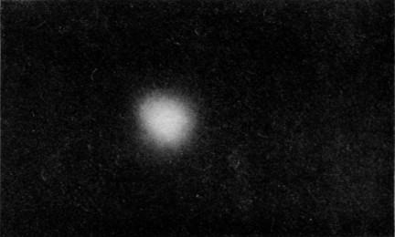

[up](top.md)


## 6 確率

```
"この世界の真の理法は確率論にある"
   ---ジェームズ・クラーク・マックスウェル
```

### 6-1 チャンスと見込み

“チャンス”という言葉は、日常生活の中でひろく使われている.ラジオの天気予報ではこんなことをいうだろう: "明日、雨が降るチャンスは60パーセントです".また諸君はこういうだろう: "僕が100歳まで生きるチャンスは小さい".科学者もまたチャンスという言葉を使う.地震学者はこういう問題に関心があるだろう: "来年南カリフォルニアにこれこれの大きさの地震が起こるチャンスはどのくらいか?" 物理学者はこういう問題をもち出すだろう: "このガイガー計数管が次の10秒間に20カウントを記録するチャンスはどのくらいか?" 政治屋や政治家はこういう問題に関心をもつだろう: "次の10年間以内に核戦争が起こるチャンスはどのくらいか?" そして諸君はこの章で何かを覚えるチャンスはどのくらいかということに関心があるだろう.

チャンスというと、推量に似たことを意味する.何故我々は推量するのだろうか? あることに対して判断を下したいのだが、情報が不完全であるとか、知識が不確実であるとかというときに、我々は推量するのである.ことがらはいったいどうなのか、どんなことが起こりそうなのか、ということを推量したいということはしばしばある.また我々が何事かを決定しなければならないので、推量したいということもしばしばある.例えば：明日レインコートをもって出ようか? 建物を新たに設計するのに、どんな地震動について対策を考えればよいか? 自分のうちにも死の灰よけを作ろうか? 国際会議において自分の態度をかえようか? 今日学校に出ようか?

我々の知識は限られているのに、あることがらについて、できるだけ多くのことをいいたいから推量をするということもある.たしかに一般化ということは、元来その性質からいって、一つの推量である.物理学の理論というのもある推量に他ならない.推量にはいい推量もあるし、悪い推量もある.確率論というのは、よりよい推量をするための体系である.ある状態があって、それは非常に変動はするけれども、平均的には一定の性状をもっているというような場合に確率ということで考えると、話を量的に進めることができるのである.

貨幣を投げることを考えよう.投げ方にも---貨幣にも---"ごまかしがない"ならば、1回投げてみたときに表が出るか裏が出るか、どちらの結果を期待すべきかということを知る方法はない。それでも何遍も何遍もやれば、表が出る回数と裏が出る回数とはだいたい等しいはずだという気がする。このとき我はこういう："貨幣を投げて表の出る確率は0.5である".


ーーーーーーーーーーーーーーーーーーーーーーーーーーー


確率という言葉は、将来行われるであろう観測に対してのみ使われます。ある観測結果の「確率」とは、ある観測を繰り返したときに、その結果が得られる可能性が最も高い割合を見積もることを意味します。例えば、投げたばかりのコインをN回見るような観察を繰り返すことを想定し、ある特定の結果A（例えば「頭」）が得られる可能性の高い観察回数の推定値を$N_A$とすると、Aが得られる確率をP(A)とすると、次のようになります。

$$P(A) = N_A / N. \tag{6.1}$$


この定義にはいくつかのコメントが必要です。まず第一に、何かが起こる確率というのは、その出来事が何らかの再現可能な観察の結果として起こりうるものである場合にのみ言うことができます。あの家に幽霊がいる確率はどれくらいか」と問うことに意味があるかどうかは不明である。

厳密に再現可能な状況はないと反論されるかもしれません。その通りです。少なくとも、時間や場所を変えて観測しなければなりません。私たちが言えることは、「繰り返される」観測は、私たちが意図する目的のためには、同等であるように見えるべきだということです。少なくとも、それぞれの観測は、同じように準備された状況で、特に最初に同じ程度の無知で行われたと考えるべきです。トランプゲームで相手の手札をこっそり見た場合、勝つ確率の推定値は、見ない場合とは異なります。

ここで強調しておきたいのは、式(6.1)の$N$と$N_A$は、実際の観測に基づいた数値を表すものではないということです。$N_A$は、$N$回の観測で何が起こるかの最良の推定値です。したがって、確率は、私たちの知識と推定する能力に依存します。つまり、私たちの常識にかかっているのです。幸いなことに、多くの物事の常識にはある程度の合意があるので、異なる人が同じ見積もりをすることもあります。しかし、確率は「絶対」の数字である必要はありません。確率は私たちの無知に依存しているので、知識が変われば違ったものになるかもしれません。

確率の定義には、もうひとつ、かなり「主観的」な側面があることにお気づきでしょうか。私たちは$N_A$を「最も可能性の高い数字の推定値」と呼んでいます。正確に$N_A$を観測することを期待しているのではなく、$N_A$に近い数字を期待しており、$N_A$という数字がその付近の他の数字よりも可能性が高いことを意味しています。例えば、コインを30回投げたとすると、頭の数がちょうど15になる可能性は非常に低く、むしろ15に近い数、例えば12、13、14、15、16、17になる可能性が高いと考えるべきです。しかし、もし選ばなければならないとしたら、15個の頭は他のどの数字よりも可能性が高いと判断します。$P(heads)=0.5$と書きます。

なぜ私たちは15を他の数字よりも可能性が高いと選んだのでしょうか？それは次のように考えたからではないでしょうか。トスの総数$N$で最も可能性の高い頭の数を$N_H$とすると、最も可能性の高い尾の数$N_T$は($N-N_H$)となります。(ここでは、すべてのトスで頭か尻尾のどちらかが出て、「その他」の結果は出ないと仮定しています!) しかし、コインが「正直」であれば、頭か尻尾のどちらかを選ぶことはできません。コイン（またはトス）が不正であると考える何らかの理由があるまでは、頭と尻尾の可能性を等しくしなければなりません。ですから、$N_T=N_H$としなければなりません。$N_T=N_H=N/2$、つまり$P(H)=P(T)=0.5$となります。

この推論は、ある観測結果がm個の異なるが "等価 "な（つまり、同じように起こりうる）可能性がある場合に一般化できます。ある観測でm個の異なる結果が得られ、そのうちの1つが他のものと同じくらいの確率であると信じる理由がある場合、特定の結果$A$の確率は$P(A)=1/m$となります。

不透明な箱の中に7つの異なる色のボールが入っていて、「無作為に」（つまり、見ずに）1つを選ぶ場合、特定の色のボールが得られる確率は$1/7$である。シャッフルした52枚のカードを「ブラインドドロー」してハートの10が出る確率は$1/52$。サイコロでダブルワンが出る確率は$1/36$。

-----

第5章では、原子核の大きさを見かけの面積（断面積）で表現しました。これは本当の意味での確率の話です。薄い板状の物質に高エネルギーの粒子を照射すると、通過する可能性もあれば、核に当たる可能性もあります。原子核は目に見えないほど小さいので、原子核を狙うことはできません。ブラインドシュートですね。) スラブにはn個の原子があり、それぞれの原子の核の断面積がσであるとすると、核によって「影」となる総面積はnσとなります。大量の$N$個のランダムショットでは、ある原子核のヒット数$N_C$は、影の面積がスラブの総面積に対する比率と同じように、$N$に対する比率になることが予想されます。

$$N_C / N = n\sigma / A. \tag{6.2}$$

したがって、ある発射粒子がスラブを通過する際に衝突を受ける確率は、次のようになります。

$$P_C = \dfrac{n}{A} \sigma \tag{6.3}$$

ここで、$n/A$はスラブの単位面積あたりの原子の数です。

### 6-2 揺らぎ


図6-1. 30回トスする3つのゲームで観察されたヘッドとテールのシーケンス。

ここでは、確率の考え方を使って、「コインをN回投げたら、実際には何個の頭が出るだろうか」という問題を、もう少し詳しく考えてみたいと思います。"コインをN回投げたら、実際には何回目のヘッドが出るのか？" しかし、この質問に答える前に、このような「実験」で何が起こるかを見てみましょう。図6-1は、N=30の実験の最初の3回の結果を示しています。頭」と「尻尾」の並びは、得られたままを示しています。最初のゲームでは頭が11個、2回目も11個、3回目は16個でした。3回の実験で，15個の「頭」が出たことは一度もありませんでした．コインを疑うべきなのでしょうか？それとも、このようなゲームで最も可能性の高い「頭」の数は15であると考えるのは間違いだったのでしょうか？さらに97回の実験を行い、30回ずつ計100回の実験を行いました。その結果を表6-1(*1)に示します。

表6-1 コインを30回投げたときの連続した試行におけるヘッドの数 
|11 |16|17|15|17|16|19|18|15|13|
|:-:|:-:|:-:|:-:|:-:|:-:|:-:|:-:|:-:|:-:|
|11|17|17|12|20|23|11|16|17|14|
|16|12|15|10|18|17|13|15|14|15|
|16|12|11|22|12|20|12|15|16|12|
|16|10|15|13|14|16|15|16|13|18|
|14|14|13|16|15|19|21|14|12|15|
|16|11|16|14|17|14|11|16|17|16|
|19|15|14|12|18|15|14|21|11|16|
|17|17|12|13|14|17|9|13|19|13|
|14|12|15|17|14|10|17|17|12|11|


表6-1の数字を見ると、ほとんどの結果が、12から18の間にあるという意味で、15に「近い」ことがわかります。この結果の分布をグラフにしてみると、その詳細がよくわかります。kのスコアが得られたゲームの数を数え、その数を各kごとにプロットします。13ゲームで15ヘッドのスコアが得られました。14ヘッドのスコアも13回得られました。16と17のスコアは、それぞれ13回以上得られています。ヘッドに何らかの偏りがあると考えていいのだろうか。私たちの「最良の推定値」は十分ではなかったのでしょうか？30回トスしたときの「最も可能性の高い」スコアは，本当は16個のヘッドだと結論づけるべきなのでしょうか？でも、待ってください。すべてのゲームを合わせると、3000回のトスがありました。そして、頭が出た数の合計は1493個でした。頭を出した回数の割合は0.498で、半分より少し少ないくらいです。頭が出る確率が0.5よりも大きいと考えるべきではありません。ある特定の観測セットで16個の頭が最も多く出たという事実は、変動です。私たちは，最も可能性の高い頭の数は15であると考えています。


図6-2. 30回トスした100ゲームの結果をまとめたもの。縦棒は、k個の頭のスコアが得られたゲームの数を示す。破線の曲線は、確率計算によって得られたスコアkのゲーム数の期待値を示す。


"30回のトスゲームで15個の頭、あるいは16個、あるいはその他の数が得られる確率は何でしょうか？"という質問をすることがあります。 1回のトスゲームでは、頭が1つになる確率は0.5で、頭が1つにならない確率は0.5だと言いました。2回トスするゲームでは、4つの可能な結果があります。HH, HT, TH, TT. これらの順序はそれぞれ同じ確率なので，(a)頭が2個になる確率は1/4，(b)頭が1個になる確率は2/4，(c)頭が0個になる確率は1/4，という結論になる．頭が1つになる方法は2つありますが、頭が0つになる方法も2つになる方法も1つしかありません。

ここで、3回トスをするゲームを考えてみましょう。3回目のトスは、頭か尻尾になる可能性が同じです。3つの頭を得る方法は1つしかありません。つまり、最初の2回のトスで2つの頭を得て、最後のトスで頭を得なければなりません。しかし、2つの頭を得るためには3つの方法があります。頭を2個投げた後に尻尾を投げる方法（1通り）と，最初の2回のトスで頭を1個だけ投げた後に頭を投げる方法（2通り）です。つまり、3-H、2-H、1-H、0-Hのスコアの場合、同じように起こりうる方法の数は1、3、3、1で、合計8通りの可能性があるということになります。確率は、1/8、3/8、3/8、1/8となります。


図6-3. 3回トスするゲームで、頭が0個、1個、2個、3個のスコアが得られる方法の数を示すための図である。


Fig.6-4. 図6-3のような図で、6回トスするゲームの場合。

これまでの議論は、図6-3のような図にまとめられます。トスの数が多いゲームでは、この図をどのように続けるべきかは明らかです。図6-4は、6回トスするゲームの場合の図です。図上の任意の点への「方法」の数は、出発点から取ることのできる異なる「経路」（頭と尻尾のシーケンス）の数にすぎません。垂直方向の位置は、投げられたヘッドの総数を示しています。このような図に表示される数字の集合は、パスカルの三角形と呼ばれています。この数字は、(a+b)^nの展開にも現れることから、二項係数とも呼ばれています。トスの回数をn、頭を投げる回数をkとすると、図中の数字は通常$\binom{n}{k}$という記号で示されます。なお、二項係数は以下の式でも計算できます。

$$\binom{n}{k} = \dfrac{n!}{k!(n-k)!} \tag{6.4}$$

ここで，n！は，(n)(n-1)(n-2)⋯(3)(2)(1)の積を表し，「n階乗」と呼ばれる．

ここで，式(6.1)の定義を用いて，n回のトスでk個の頭を投げる確率P(k,n)を計算してみましょう。可能な配列の総数は2^n(1回のトスで2つの結果があるため)であり，k個の頭を得る方法の数は$\binom{n}{k}$であり，どれも同じ確率であるから，次のようになる．

$$P(k,n) = \dfrac{\binom{n}{k}}{2^n} \tag{6.5}$$


P(k,n)はk個の頭が出ると予想されるゲームの割合なので、100ゲームで100・P(k,n)回のk個の頭が出ると予想されます。図6-2の破線の曲線は、100・P(k,30)から計算された点を通過しています。14または15ゲームで15ヘッドのスコアが得られると予想されますが、このスコアは13ゲームで観測されたものです。13または14ゲームで16のスコアが得られると予想していたが、15ゲームでそのスコアが得られた。このような変動は "ゲームの一部 "です。

先ほどの方法は、1つの観測結果に2つの可能性しかないという最も一般的な状況にも適用できます。この2つの結果をW（「勝ち」）とL（「負け」）と呼ぶことにしましょう。一般的なケースでは、1つの事象におけるWまたはLの確率は等しくなくてもよい。Wが得られる確率をpとすると、Lの確率qは必然的に(1-p)となります。n回の試行の集合において、Wがk回得られる確率P(k,n)は 

$$P(k,n) = \binom{n}{k} p^kq^{n-k}. \tag{6.6}$$

### 6-3 ランダムウォーク

確率の考え方を必要とする面白い問題がもう一つあります。それは "ランダムウォーク "の問題です。最も簡単なバージョンでは、x=0の地点からスタートした「プレーヤー」が、「移動」のたびに、前進（+xに向かう）か後退（-xに向かう）かのいずれかのステップを踏むことを要求される「ゲーム」を想像します。その選択はランダムに行われ、例えばコインを投げて決めることができます。得られた動きをどのように表現すればよいのでしょうか。一般的には、ブラウン運動と呼ばれる気体中の原子（または他の粒子）の動きや、測定における誤差の組み合わせに関連する問題です。このランダムウォークの問題は、先に述べたコイン投げの問題と密接な関係があることがわかります。

まず，ランダムウォークの例をいくつか見てみましょう．歩行者の進歩を、Nステップで移動した正味の距離$D_N$で表すことができます。図6-5のグラフには、ランダムウォークの経路の3つの例を示している。図6-1に示したコイントスの結果をランダムな選択の順序として使用している）。


図6-5. ランダムウォークの進捗状況。横座標Nは総歩数、縦座標$D_N$はスタート位置からの正味の移動距離。

このような動きについて、私たちは何を語ることができるでしょうか。まず、"彼は平均してどのくらいの距離を進んでいるのか？"と尋ねてみましょう。彼は前進することも後退することも同じなので、彼の平均的な進歩はゼロになると考えなければなりません。しかし、Nが大きくなればなるほど、彼は出発点から遠く離れている可能性が高くなるような気がします。そこで、彼の絶対値での平均移動距離、つまり｜D｜の平均値を聞いてみることにしましょう。しかし、「進歩」のもう一つの尺度である距離の二乗を扱う方がより便利です。D^2は正の動きでも負の動きでも正の値をとるので、このようなランダムな放浪の尺度としては妥当なものです。

$D^2_N$の期待値は、ちょうどN（歩数）であることがわかります。期待値」とは、確率的な値（最良の推測）を意味しており、多くの繰り返しシーケンスにおける平均的な動作の期待値と考えることができます。このような期待値を⟨$D^2_N$⟩で表し、"mean square distance "と呼ぶこともあります。1ステップ後の$D^2$は常に+1なので、確かに$⟨D^2_1⟩=1$となります（距離はすべて1ステップという単位で測ります）。距離の単位を書き続けることはしない)。

N>1のときの$D^2_N$の期待値は、$D_{N-1}$から求めることができる。(N-1)ステップ後に$D_{N-1}$が得られれば、Nステップ後には$D_N=D_{N-1}+1$または$D_N=D_{N-1}-1$が得られる。二乗の場合は

$$D^2_N = \left\{\begin{array}{c}
    D^2_{N-1} + 2D_{N-1} + 1\\
    or\\
    D^2_{N-1} - 2D_{N-1} + 1
\end{array}\right. \tag{6.7}$$

いくつかの独立した配列では、それぞれの値が2分の1ずつ得られると予想されるので、平均的な期待値は2つの可能性のある値の平均に過ぎません。つまり、$D^2_N$の期待値は$D^2_{N-1}+1$となります。一般的には、$D^2_{N-1}$の「期待値」$⟨D^2_{N-1}⟩$を期待するべきです（定義上は！）。そこで 

$$\langle D^2_N \rangle = \langle D^2_{N-1} \rangle + 1. \tag{6.8}$$

すでに、$⟨D^2_1⟩=1$であることを示しましたので、次のようになります。

$$\langle D^2_N \rangle = N \tag{6.9}$$

これは非常にシンプルな結果です。

ランダムウォークにおける「原点から離れたところでの進歩」を、距離の二乗ではなく、距離のような数値で表したい場合は、「二乗平均平方根距離」$D_{rms}$を使います。

$$D_{rms} = \sqrt{\langle D^2 \rangle} = \sqrt{N}. \tag{6.10}$$

ランダムウォークは、その数学的性質が、章の初めに考えたコイン投げゲームに酷似していることを指摘しました。各ステップの方向が，コイントスでの頭と尻尾の出現に対応していると想像すると，$D$はちょうど$N_H-N_T$（頭と尻尾の数の差）になります．$N_H+N_T=N$は、ステップ(とトス)の総数なので、$D=2N_H-N$となります。先に$N_H$の期待分布（kとも呼ばれる）の式を導き、式(6.5)の結果を得ました。$N$ は単なる定数なので、$D$ にも対応する分布があります ($N/2$ 以上の頭には、「欠けた」尾があるので、$N_H$ と $D$ の間には 2 の係数があります)。図6-2のグラフは、30回のランダムステップで得られる距離の分布を表しています（k=15は$D=0$、k=16は$D=2$などと読み替えます）。

$N_H$ の期待値 $N/2$ からの変化は 

$$N_H - \dfrac{N}{2} = \dfrac{D}{2}. \tag{6.11}$$

$rms$の偏差値は 

$$\left( N_H - \dfrac{N}{2} \right)_{rms} = \frac{1}{2} \sqrt{N}. \tag{6.12}$$

$D_{rms}$の結果によると、30ステップの「典型的な」距離は$\sqrt{30}≒5.5$、つまり典型的なkは15から5.5/2=2.75単位程度になると予想されます。図6-2の曲線の中心からの "幅 "は約3単位で、この結果と一致しています。

これで、今まで避けてきた問題を考えることができます。コインが「正直」なのか「負荷」がかかっているのかをどうやって見分けたらいいのでしょうか？少なくとも部分的な答えを出すことができます。正直なコインの場合、ヘッドが出る割合は0.5であると予想されます。

$$\dfrac{\langle N_H \rangle}{N} = 0.5. \tag{6.13}$$

また、実際の$N_H$は$N/2$から約$\sqrt{N}/2$の乖離があると予想され、また、分数は 

$$\dfrac{1}{N} \dfrac{\sqrt{N}}{2} = \dfrac{1}{2 \sqrt{N}}.$$

$N$が大きければ大きいほど、$N_H/N$の割合は2分の1に近くなると考えられます。


図6-6. 1円玉をN回投げたときに、頭が出た回数の割合。

図 6-6 は、この章で報告されたコイン投げの割合 $N_H/N$ をプロットしたものです。$N$が大きいと、頭の割合が0.5に近づく傾向があることがわかります。残念ながら、どのような実行または実行の組み合わせにおいても、観測された偏差が期待された偏差の近くになるという保証はありません。大きな揺らぎ、つまり頭や尻尾が長く続くことで、恣意的に大きな偏差値が得られるという有限の可能性が常にあるのです。私たちが言えるのは、もし偏差値が期待値の$1/2\sqrt{N}$に近ければ（例えば2倍か3倍以内）、コインの正しさを疑う理由はないということです。それよりもはるかに大きい場合は、コインに負荷がかかっている（あるいは、トスする人が賢い！）と疑うことはできても、証明することはできません。

また、「コイン」や似たような「偶然性」のある物体（例えば、いつも2つの位置のどちらかに落ちる石）で、頭と尻尾の確率が違うと信じるに足る理由がある場合、どのように扱うべきかは考えていません。私たちは$P(H)=⟨N_H⟩/N$と定義しました。どのようにして$N_H$の期待値を知ることができるでしょうか？ある場合には，我々ができる最善の方法は，大量のトスで得られたヘッドの数を観察することである．他に良い方法がない場合には, $⟨N_H⟩=N_H$(観測された) としなければならない. しかし，このような場合には，別の実験や別の観察者が$P(H)$が異なると結論づけるかもしれないことを理解しなければならない。しかし、様々な答えが偏差$1/2\sqrt{N}（P(H)が1/2に近い場合）の範囲内で一致することを期待したいと思います。実験物理学者は通常、「実験的に決定された」確率には「誤差」があると言い、次のように書いています。

$$P(H) = \dfrac{N_H}{N} \pm \dfrac{1}{2\sqrt{N}} . \tag{6.14}$$

このような表現には、十分な知識があれば計算できる「本当の」あるいは「正しい」確率があり、観測はゆらぎによる「誤差」であるかもしれないという意味が含まれています。しかし、このような考え方を論理的に整合させることはできません。確率という概念は、ある意味で主観的なものであり、常に不確かな知識に基づいており、その定量的な評価は情報の増加に伴って変化するものであることを認識しておいた方がよいでしょう。

### 6-4 確率分布

さて、ランダムウォークに戻って、それを改良したものを考えてみましょう。各ステップの方向（$＋$または$-$）がランダムに選択されることに加えて、各ステップの長さも予測不可能な方法で変化し、唯一の条件はステップの長さが平均して1単位であるとします。このケースは、気体中の分子の熱運動のようなものを象徴しています。ステップの長さを$S$とすると、$S$はどんな値でもよいのですが、ほとんどの場合は「1」に近い値になります。具体的には、$⟨S^2⟩=1$、あるいは等価的に$S_{rms}=1$とする。$⟨D^2⟩$の導出は、式(6.8)を次のように変更する以外は、先ほどと同様に行います。

$$\langle D^2_N \rangle = \langle D^2_{N-1} \rangle + \langle S^2 \rangle = \langle D^2_{N-1}  \rangle + 1. \tag{6.15}$$

私たちは、先ほどと同様に、その

$$\langle D^2_N \rangle = N. \tag{6.16}$$

距離$D$の分布はどうなるだろうか。例えば、30ステップ後に$D=0$になる確率は？答えはゼロです。$D$が特定の値になる確率はゼロです。なぜなら、長さの異なる後ろ向きのステップの合計が、前向きのステップの合計と正確に一致する可能性はまったくないからです。図6-2のようなグラフを描くことはできません。

しかし、$D$が0、1、2のいずれかに正確になる確率ではなく、$D$が0、1、2のいずれかに近くなる確率を問えば、図6-2のような表現を得ることができます。ここで、$P(x,Δx)$を、$D$が$x$に位置する区間$Δx$（例えば、$x$から$x+Δx$まで）に存在する確率と定義します。$Δx$が小さい場合、$D$が区間に入る確率は、区間の幅である$Δx$に比例すると予想されます。そこで、次のように書くことができます。

$$P(x, \Delta x) = p(x) \Delta x. \tag{6.17}$$

関数$p(x)$は、確率密度と呼ばれます。

$p(x)$の形は、ステップの数である$N$と、個々のステップの長さの分布に依存します。ここでは証明できませんが、$N$が大きい場合、個々のステップの長さの分布が妥当なものであれば、$p(x)$は同じになり、$N$にしか依存しません。これらの曲線の「半値幅」（$x=0$からの典型的な広がり）は、これまでに示したように$\sqrt{N}$であることに気づくでしょう。


図6-7. Nステップのランダムウォークにおいて、スタート地点からDの距離に到達するための確率密度。(Dはrmsのステップ長の単位で測定される）。

また、$p(x)$の値がゼロ付近では、$\sqrt{N}$に反比例していることにも気づくだろう。これは、曲線がすべて同じような形をしていて、曲線の下の面積がすべて等しくなければならないからです。$p(x)Δx$は、$Δx$が小さいときに$Δx$の中に$D$が見つかる確率なので、$x_1$から$x_2$までの任意の区間を何回かに分けて小刻みに切り、それぞれの増分について$p(x)Δx$の項の和を評価することで、$D$が$x_1$から$x_2$までの任意の区間のどこかに見つかる確率を求めることができます。$D$が$x_1$と$x_2$の間に入る確率は、$P(x_1<D<x_2)$と書くと、図6-8の斜線部分に相当します。増分$Δx$を小さくすればするほど、この結果は正しくなります。したがって、次のように書くことができます。

$$P(x_1 < D < x_2) = \sum p(x) \Delta x = \int ^{x_2} _{x_1} p(x)dx. \tag{6.18}$$


図6-8. ランダムウォークで移動した距離$D$が$x_1$と$x_2$の間にある確率は、$x_1$から$x_2$までの$p(x)$の曲線の下の部分になります。

曲線全体の下の部分は、$D$がどこかに着地する（つまり、$x=-∞$と$x=+∞$の間のある値を持つ）確率です。その確率はきっと1です。私たちは、次のようにしなければなりません。

$$\int ^{+\infin} _{-\infin} p(x)dx = 1. \tag{6.19}$$

図6-7の曲線は、$\sqrt{N}$に比例して幅が広くなるので、総面積を1に保つためには、高さを$1/\sqrt{N}$に比例させる必要があります。

これまで説明してきた確率密度関数は、最も一般的に遭遇するものです。これは「正規確率密度」または「ガウス確率密度」と呼ばれています。数学的には次のような形になります。

$$p(x) = \dfrac{1}{\sigma \sqrt{2 \pi}} e ^{-x^2/2\sigma ^2} \tag{6.20}$$

ここで、σは標準偏差と呼ばれ、ここでは$σ=\sqrt{N}$、rmsのステップサイズが1と異なる場合には$σ=\sqrt{N}S_{rms}$で与えられます。

先ほど、気体中の分子や粒子の動きはランダムウォークのようなものだと言いました。例えば、ある有機化合物の瓶を開けて、その蒸気の一部を空気中に放出したとします。空気の流れがあり、空気が循環していれば、その流れに乗って蒸気も運ばれます。しかし、空気が完全に静止していても、蒸気は徐々に広がり、拡散し、部屋全体に浸透していきます。私たちはそれを色やにおいで感知することができる。静止した空気中で有機物の蒸気の個々の分子が広がるのは、他の分子と衝突して分子運動を起こすからである。平均的な「ステップ」の大きさと、1秒間に踏み出すステップの数がわかっていれば、ある特定の時間が経過した後に、1つまたは複数の分子が出発点からある距離に見つかる確率を求めることができます。時間が経つにつれ、ステップ数が増え、図6-7の連続した曲線のようにガスが広がっていきます。後の章では、ステップの大きさとステップの頻度が、気体の温度と圧力にどのように関係するかを見ていきましょう。

先ほど、気体の圧力は、分子が容器の壁にぶつかって跳ね返っているからだと言いました。後日、より定量的な記述をする際には、分子が跳ねるときの速度を知りたいと思うでしょう。なぜなら、分子が与える衝撃はその速度に依存するからです。しかし、分子の速さを語ることはできません。そこで、確率的な表現が必要になります。分子の速度はどのようなものでもよいのですが、ある速度は他の速度よりも確率が高いのです。ある分子が$v$と$v+Δv$の間の速度を持つ確率は$p(v)Δv$であり、確率密度である$p(v)$は速度$v$の与えられた関数である、と言って、何が起こっているかを説明します。マクスウェルが、常識と確率の考え方を用いて、$p(v)$の数式をどのようにして見つけたかは、後述する。関数$p(v)$の形(*2)を図6-9に示します。速度はどのような値でもよいが、最も確率の高い値$vp$に近い値になる可能性が高い。


図6-9. 気体中の分子の速度の分布。

図6-9の曲線は、少し違った意味で考えられることが多い。一般的な容器（例えば1リットル）に入っている分子を考えると、非常に多くの$N$個の分子が存在しています（$N≒1022$）。$p(v)Δv$は、1つの分子がその速度を$Δv$に持つ確率ですから、確率の定義では、区間$Δv$に速度を持つ分子が見つかる期待数$⟨ΔN⟩$は次のように与えられます。

$$\langle \Delta N \rangle = Np(v)\Delta v. \tag{6.21}$$

$Np(v)$を "速度分布 "と呼んでいます。2つの速度$v_1$と$v_2$の間の曲線の下の部分、例えば図6-9の斜線部分は、$v_1$と$v_2$の間の速度を持つ分子の予想される数を（曲線$Np(v)$に対して）表しています。気体では通常、多数の分子を扱うため、期待される数からのずれは小さい（$1/\sqrt{N}$のように）と考えられ、「期待される」数を言わずに、代わりに次のように言うことが多いです。"$v_1$と$v_2$の間の速度を持つ分子の数は、曲線の下の面積である。" しかし、このような表現は、常に確率的な数について述べていることを忘れてはなりません。

### 6-5 不確定性原理

確率の考え方は、気体中の約10^22個の分子の振る舞いを説明するのに役立ちますが、各分子の位置や速度を書き留めることは明らかに不可能です。確率がこのような問題に適用された当初は、非常に複雑な状況を処理するための便宜的なものと考えられていました。しかし、現在では、原子レベルの現象を記述するためには、確率の考え方が不可欠であると考えられています。粒子の数学的理論である量子力学では、位置や速度の特定には常に不確実性がつきまといます。せいぜい、ある座標$x$に近い位置にある粒子が一定の確率で存在するというだけです。

確率密度$p_1(x)$を与えることができ、$p_1(x)Δx$は粒子が$x$と$x+Δx$の間で発見される確率となります。粒子が$x_0$付近にある場合、関数$p_1(x)$は図6-10(a)のようなグラフになります。同様に、粒子の速度を確率密度$p_2(v)$で指定する必要があり、$p_2(v)Δv$は速度が$v$と$v+Δv$の間に存在する確率です。


図6-10. 粒子の位置と速度を観測した場合の確率密度。


$p_1(x)$と$p_2(v)$の2つの関数を独立して選択することはできず、特に両方とも任意に狭くすることはできないというのは、量子力学の基本的な結果の1つです。$p_1(x)$の曲線の代表的な「幅」を$[Δx]$、$p_2(v)$の曲線の代表的な「幅」を$[Δv]$とすると（図参照）、自然界では、2つの幅の積は、少なくとも数$ℏ/2m$（$m$は粒子の質量）と同じ大きさでなければなりません。この基本的な関係を次のように書くことができます。

$$[Δx]⋅[Δv]≥ℏ/2m.\tag{6.22}$$

この式は、先に述べたハイゼンベルグの不確定性原理を表しています。

式(6.22)の右辺は定数なので、この式は、粒子を特定の場所に強制的に「固定」しようとすると、結果的に粒子の速度が高くなることを意味しています。また、非常にゆっくりと、あるいは正確な速度で進ませようとすると、粒子は「広がって」しまい、どこにいるのかよくわからなくなってしまうのです。粒子は面白いことをする

不確定性原理とは、自然を記述しようとするときに必ず存在する「あいまいさ」のことです。自然を最も正確に記述するには、確率という言葉を使わなければなりません。このような自然の記述方法を好まない人もいます。粒子に何が起こっているのかを知ることができれば、その速度と位置を同時に知ることができるのではないかと、なんとなく思ってしまうのです。量子力学が開発されたばかりの頃、アインシュタインはこの問題についてかなり悩んでいました。しかし、神はサイコロを振って電子の動きを決めるようなことはしないはずだ」と言って首を振っていました。アインシュタインはこの問題について長い間悩んでいましたが、おそらく、これが人が与えることのできる自然の最良の記述であるという事実に、自分自身を納得させることはできなかったでしょう。この問題に取り組んでいる物理学者の中には、別の方法で世界を記述することができるのではないか、物事の在り方に関する不確実性をすべて取り除くことができるのではないか、という直感的な確信を持っている人がまだ1人か2人います。しかし、まだ誰も成功していません。

粒子の位置を指定する際に必要な不確実性は、原子の構造を記述する際に最も重要になります。1個の陽子からなる原子核と、その外側に1個の電子を持つ水素原子では、電子の位置の不確かさは原子そのものの大きさに匹敵します。そのため、電子が陽子の周りを「周回」しているとは言えません。せいぜい言えることは、陽子から$r$の距離にある体積$ΔV$の要素の中にある電子を観測する一定の確率$p(r)ΔV$があるということです。確率密度$p(r)$は量子力学で与えられます。乱れていない水素原子の場合、$p(r)=Ae^{-2r/a}$となります。aという数字は、関数が急激に減少する「典型的な」半径である。原子核からの距離が$a$よりもはるかに大きくても、電子が見つかる確率は小さいので、$a$は「原子の半径」と考えてもよく、約10^(-10)メートルとなります。



図6-11. 水素原子を可視化したもの。雲の密度（白さ）は、電子を観測する確率密度を表しています。

電子を観測する確率密度に比例した密度を持つ「雲」を想像することで、水素原子のイメージを作ることができます。その雲の例を図6-11に示します。このように、水素原子のイメージは、原子核が「電子の雲」（本当は「確率の雲」）に囲まれているというのが一番しっくりきます。電子はどこかに存在していますが、自然界では特定の場所に存在する確率しか知ることができません。

自然についてできるだけ多くのことを知ろうとする現代物理学は、確実に「知る」ことができないものがあることを発見した。私たちの知識の多くは、常に不確かなものでなければなりません。私たちが知ることができるのは、ほとんどが確率という言葉で表されます。


-----
*1 最初の3回のゲームの後、実際に30枚の小銭を箱の中で激しく振って、出てきた頭の数を数えるという実験が行われました。

*2 マクスウェルの式は$p(v)=Cv^2e^{-av^2}$で、$a$は温度に関係する定数、$C$は全確率が1になるように選ばれます。   


[up](top.md)
