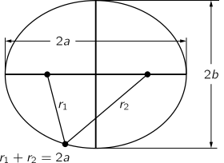
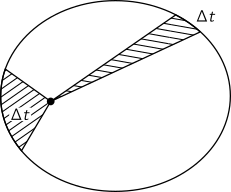
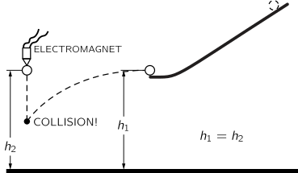
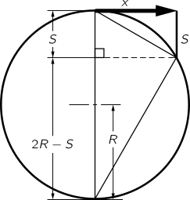
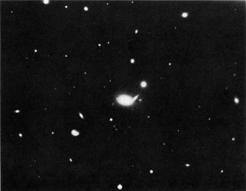
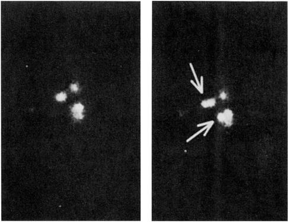

[up](top.md)

## 7 重力の理論

### 7-1惑星の運動

この章では、人間の心の中で最も広範囲に及ぶ一般化の一つについて説明します。人間の頭脳に感心している間に、重力の法則のようなエレガントでシンプルな原理をこれほど完全かつ一般的に従える自然に畏敬の念を抱くための時間を取るべきである。重力の法則とは何でしょうか？宇宙に存在するすべての物体は、他のすべての物体を引き寄せる力を持っているということです。この力は、2つの物体の場合、それぞれの質量に比例し、2つの物体間の距離の2乗に反比例して変化します。この言葉は、数学的には次の式で表されます。

$$F = G\dfrac{mm'}{r^2}$$

これに、物体は力の方向に、その物体の質量に反比例する量だけ加速することで力に反応するという事実を加えれば、必要なことはすべて言えたことになります。十分に才能のある数学者なら、この2つの原理の結果をすべて推論できるでしょう。しかし、あなたにはまだ十分な才能がないと思われるので、この2つの単純な原理だけではなく、その結果をもっと詳しく説明しましょう。重力の法則が発見されたときの話を簡単にして、その結果、歴史に与えた影響、その法則がもたらす謎、アインシュタインが行った法則の改良点などを議論し、さらに、この法則と他の物理学の法則との関係についても議論していきます。これらすべてを1つの章で説明することはできませんが、これらのテーマは後続の章で適宜扱われます。

物語は、古代の人々が星の中の惑星の動きを観察し、最終的に惑星が太陽の周りを回っていると推論するところから始まりますが、この事実は後にコペルニクスによって再発見されました。しかし、惑星がどのようにして太陽の周りを回っているのか、どのような動きをしているのかを正確に解明するには、もう少し時間がかかりました。16世紀に入ってから、惑星が本当に太陽の周りを回っているのかどうかについて、大きな議論があった。ティコ・ブラーエは、古代人の考えとは異なる考えを持っていた。それは、天空における惑星の実際の位置を十分に正確に測定すれば、惑星の運動の本質に関するこれらの議論は最もよく解決されるだろうという考えである。測定によって惑星の動きが正確に分かれば、どちらかの視点を確立することができるかもしれません。何かを発見するためには、深い哲学的な議論よりも、慎重に実験を行った方が良いという、非常に優れたアイデアである。この考えに基づいて、ティコ・ブラーエはコペンハーゲンの近くにあるフヴェン島の天文台で、長年にわたって惑星の位置を研究した。彼は膨大な量の表を作成し、ティコの死後、数学者のケプラーがそれを研究した。ケプラーはこれらのデータから、非常に美しく、驚くべき、しかし単純な惑星運動の法則を発見したのである。

### 7-2 ケプラーの法則

まず、ケプラーは、それぞれの惑星が太陽の周りを楕円と呼ばれる曲線で回り、太陽はその楕円の焦点に位置することを発見しました。楕円とは、単なる楕円ではなく、焦点に1本ずつ、2本の鋲と輪っか状の紐と鉛筆を使って得られる非常に具体的で正確な曲線であり、数学的には、2つの固定点（焦点）からの距離の和が一定であるすべての点の軌跡である。数学的に言えば、2つの固定点（焦点）からの距離の和が一定であるすべての点の軌跡であり、言ってみれば、円を縮めたものです（図7-1）。

図7-1. 楕円。

ケプラーの2つ目の発見は、惑星が一様な速度で太陽の周りを回っているのではなく、太陽に近いほど速く、遠いほど遅く動くという、まさにこのような現象であった。例えば、ある惑星を1週間間隔で2回連続して観測し、それぞれの観測位置で惑星に半径ベクトル(*1)を引いたとする。その週に惑星が通過した公転円弧と2つの半径ベクトルは、図7-2の斜線部分のように、ある平面領域に収まります。1週間後に、太陽から遠い位置（惑星の動きが遅い位置）で同様の観測を行った場合、同様に拘束される領域は、最初のケースと全く同じになります。つまり、第二法則に従って、それぞれの惑星の軌道速度は、半径が等しい面積を等しい時間で「掃き出す」ようになっているのである。

図7-2. ケプラーの面積の法則。

最後に、ケプラーが発見した3つ目の法則は、他の2つの法則とは異なるカテゴリーのもので、1つの惑星だけを扱うのではなく、1つの惑星を他の惑星に関連付けるものである。この法則は、2つの惑星の公転周期と軌道の大きさを比較すると、公転周期は軌道の大きさの3/2乗に比例するというものだ。周期とは、惑星がその軌道を一周するのにかかる時間であり、大きさとは、楕円形の軌道の最大の直径（専門的には長軸と呼ばれる）の長さである。もっと簡単に言えば、惑星がほぼ円を描くように回っているとすれば、円を一周するのに必要な時間は、直径（または半径）の3/2乗に比例する。したがって、ケプラーの3つの法則は

1. 各惑星は、太陽を中心とした楕円形で太陽の周りを移動する。
2. 太陽から惑星への半径ベクトルは、等間隔の時間で等面積を掃き出す。
3. 2つの惑星の周期の2乗は、それぞれの軌道の半長軸の3乗に比例する。$T∝a^{3/2}$である。

### 7-3 力学の発展

ケプラーがこれらの法則を発見する一方で、ガリレオは運動の法則を研究していた。問題は、「惑星はなぜ回っているのか」ということです。当時、惑星が回っているのは、背後に目に見えない天使がいて、翼を打ち鳴らして惑星を前進させているからだ、という説がありました。この説は、現在では修正されていることがわかります。惑星を回り続けるためには、目に見えない天使は別の方向に飛ばなければならず、彼らには翼がないことがわかったのです。それ以外は、やや似たような説ですね！) ガリレオは、これらの法則を理解するために不可欠な、運動に関する非常に注目すべき事実を発見しました。それは「慣性の原理」です。何かが動いていて、それに何も触れず、完全に乱されていなければ、それは永遠に続き、一直線に一定の速度で惰性で動き続けます。なぜ惰性で動いているのかは分からないが、そういうものなのである。

ニュートンはこの考えを改め、「体の動きを変えるには力を使うしかない」としました。速度が上がれば、運動方向に力が加わったことになります。逆に、運動を別の方向に変えれば、横に力が加わったことになる。ニュートンはこのように、体の速度や運動方向を変えるためには力が必要だという考えを加えた。例えば、石にひもをつけてぐるぐると回している場合、石を円の中にとどめておくには力が必要だという。紐を引っ張らなければならないのです。実は、力によって生じる加速度は質量に反比例する、つまり力は質量に加速度をかけたものに比例するという法則があります。質量が大きいほど、ある加速度を出すのに必要な力は強くなります。質量は、同じ紐の先に他の石をつけて、同じ円を同じ速さで周らせることで測定できます。このようにして、必要な力が大きいか小さいかがわかり、重いものほど大きな力を必要とすることがわかりました。) これらの考察から得られた素晴らしいアイデアは、惑星の軌道を維持するのに接線方向の力は必要ない（天使が接線方向に飛ぶ必要はない）ということです。邪魔するものが何もなければ、惑星は一直線に進みます。しかし、実際の運動は、力がなければ進むはずだった線から逸脱します。その逸脱は、運動の方向ではなく、基本的に運動と直角になります。つまり、慣性の原理により、太陽の周りを回る惑星の運動を制御するために必要な力は、太陽の周りを回る力ではなく、太陽に向かう力なのである。太陽に向かう力があるとすれば、もちろん太陽が天使かもしれない！）。

### 7-4 ニュートンの引力の法則

運動理論の理解を深めたニュートンは、太陽が惑星の運動を支配する力の座や組織になり得ることを理解していた。ニュートンは、等しい面積が等しい時間で掃き出されるという事実そのものが、すべての偏差が正確に放射状であるという命題を正確に示すサインポストであること、つまり面積の法則は、すべての力が正確に太陽に向かっているという考えの直接的な結果であることを自ら証明した（おそらく我々もすぐに証明できるだろう）。

次に、ケプラーの第3法則を分析することで、惑星が遠ければ遠いほど力が弱くなることを示すことができます。太陽からの距離が異なる2つの惑星を比較すると、力はそれぞれの距離の2乗に反比例していることがわかります。この2つの法則を組み合わせて、ニュートンは「2つの物体の間には、距離の2乗に反比例した力が一直線上にあるはずだ」と結論づけた。

一般性を重んじるニュートンは、この関係が太陽と惑星の間だけでなく、もっと一般的に当てはまると考えた。例えば、地球の月が地球の周りを回っているように、木星にも月が回っていることはすでに知られており、ニュートンはそれぞれの惑星がその月を力で支えていることを確信していた。私たちを地球に縛り付けている力を知っていたので、これは万物が万物を引っ張っているという普遍的な力であると提唱した。

次に問題となったのは、地球が人間を引っ張る力は、月を引っ張る力と「同じ」かどうか、つまり距離の二乗に反比例するかどうかである。地表の物体が静止状態から解放された最初の1秒間に16フィート落ちるとしたら、同じ時間に月はどこまで落ちるのか。月は全く落ちないと言えるかもしれません。しかし、もし月に何の力もなければ、月は一直線に落ちていくはずですが、月は円を描いて落ちていくので、何の力もなかった場合の位置から本当に落ちていくことになります。月の公転半径（約24万マイル）と、月が地球を1周する時間（約29日）から、月が1秒間に公転して移動する距離を計算し、1秒間に落下する距離を算出することができます(*2)。地球の半径は4,000マイルで、地球の中心から4,000マイル離れたところにあるものが1秒間に16フィート落ちるとすると、その60倍の距離である24万マイル離れたところにあるものは、16フィートの1/3600しか落ちないことになり、これも1インチの約1/20になりますから、逆二乗の法則とよく一致します。ニュートンは、この重力理論を同様の計算で試してみたいと思い、慎重に計算したところ、あまりにも大きな矛盾があったため、理論は事実に反しているとみなし、結果を公表しませんでした。その6年後、地球の大きさを新たに測定したところ、天文学者が誤った月の距離を使っていたことが分かった。これを聞いたニュートンは、修正した数字で再度計算してみると、見事に一致した。

図7-3. 垂直方向と水平方向の運動の独立性を示す装置。

月が「落ちる」という考えは、見ての通り、それ以上近づかないので、少々混乱しています。月が落ちるというのは、「力がなければ進むはずの直線から外れる」という意味です。地表での例を考えてみましょう。地表近くで放たれた物体は、最初の1秒間で16フィート落ちる。水平に発射された物体も16フィート落下しますが、水平方向に移動していても、同じ時間で同じ16フィート落下します。図7-3は、このことを示す装置です。水平な線路の上には、少し離れたところから前方に向かって発射される予定のボールがあります。同じ高さには垂直に落下するボールがあり、電気的なスイッチが配置されているので、最初のボールが軌道から離れた瞬間に、2番目のボールが放出されます。2つのボールが同時に同じ深さに来たことは、空中で衝突することで証明されます。水平に発射された弾丸のようなものは、1秒間に2000フィートくらいの距離を進むかもしれませんが、水平に狙った場合には16フィート落ちることになります。弾丸をどんどん撃っていくとどうなるか。地球の表面は曲がっていることを忘れてはいけません。もし十分に速く撃てば、16フィート落ちたときには、以前と同じ高さになっているかもしれません。どうしてでしょう？落下することに変わりはありませんが、地球が湾曲しているため、地球の「周り」に落ちるのです。問題は、地球が地平線から16フィート下に位置するためには、1秒間にどれだけの距離を移動しなければならないかということです。図7-4では、半径4000マイルの地球と、力がない場合に弾丸が通る接線方向の直線経路を示しています。ここで、幾何学の素晴らしい定理の一つである、「接線は、等しい弦で切られた直径の2つの部分の平均比例である」という定理を使うと、移動する水平距離は、落ちた16フィートと地球の8000マイルの直径の平均比例であることがわかります。(16/5280)×8000の平方根は5マイルに非常に近い値になります。このように、弾丸が秒速5マイルで移動した場合、毎秒16フィートの速度で地球に向かって落下し続けますが、地球は湾曲し続けているので、決して近づくことはできないことがわかります。このようにして、ガガーリン氏は地球の周りを1秒間に約5マイルの速さで25,000マイル移動しながら、宇宙空間に身を置いていたのである。少し高い位置にいたので、少し時間がかかったようです。

図7-4. 円軌道の中心に向かう加速度。平面幾何学から、$x/S=(2R-S)/x≒2R/x$、Rは地球の半径4000マイル、xは1秒間に「水平に移動した」距離、Sは1秒間に「落下した」距離（16フィート）です。

新しい法則の大発見は、入れたものよりも取り出したものの方が多い場合にのみ有効です。さて、ニュートンは、ケプラーの法則の第2法則と第3法則を使って、引力の法則を導き出しました。彼は何を予測したのか？第一に、月の動きを分析して、地表の物体の落下と月の落下を結びつけたので、予測になりました。第二に、軌道が楕円であるかどうか。後の章で、運動を正確に計算することが可能であることを見てみましょう。実際、楕円であるはずだと証明することができるので(*3)、ケプラーの第一法則を説明するために余分な事実は必要ありません。このようにして、ニュートンは最初の強力な予言をしたのです。

重力の法則は、それまで理解されていなかった多くの現象を説明します。例えば、月が地球を引っ張ることで、これまで謎だった潮の満ち引きが起こります。月が水を引き上げることで潮の満ち引きが起こる。それは以前から考えられていたことだが、ニュートンほど賢くはなかったので、1日のうち潮の満ち引きは1回だけであるべきだと考えた。その理由は、月が水を引っ張り上げて満潮と干潮を作り、その下で地球が回転しているので、一つの観測所の潮が24時間ごとに上がったり下がったりするというものでした。実際には12時間で潮が上下します。また、月が地球を海から引き離すため、潮の満ち引きは地球の反対側で行われるべきだと主張する学説もある。これらの説はどちらも間違っています。月が地球を引っ張る力と水を引っ張る力は、中心部ではバランスがとれています。しかし、月に近い水は平均よりも引っ張られ、月から遠い水は平均よりも引っ張られないのです。さらに、水は流れることができますが、硬い地球は流れません。本当の姿は、この2つの組み合わせである。

図7-5. 地球-月系と潮汐。

バランスが取れている」とはどういうことでしょうか？何がバランスなのか？月が地球全体を引っ張っているのなら、なぜ地球は月の真上に落ちてこないのでしょうか？それは、地球が月と同じように、地球の内側にあって中心ではない点を中心にして円を描いているからです。月は地球の周りを回っているだけではなく、図7-5のように、地球と月の両方が中心の位置を回り、それぞれがその共通の位置に向かって落ちていくのです。この共通の中心を回る運動が、それぞれの落下のバランスをとっているのです。つまり、地球も一直線に進んでいるのではなく、円を描くように移動しているのです。反対側の水は、月の引力が地球の中心での "遠心力 "とちょうど釣り合うよりも弱いため、"アンバランス "になっています。その結果、水は地球の中心から離れて上昇していきます。一方、月の近くでは、月からの引力の方が強く、空間的には逆の方向になりますが、やはり地球の中心からは離れています。その結果、2つの潮の満ち引きが発生するのです。

### 7-5 万有引力

重力がわかると、他に何がわかるでしょうか。地球が丸いことは誰でも知っています。なぜ地球は丸いのでしょうか？それは簡単で、引力のせいです。地球が丸いと理解できるのは、ただ単に、すべてのものがすべてのものを引き寄せ、できる限り自分自身を引き寄せているからなのです。さらに言えば、地球は回転しているので正確には球体ではなく、赤道付近では重力に逆らう傾向のある遠心力が働きます。そうすると、地球は楕円形になるはずで、正しい楕円の形も得られます。このようにして、重力の法則から、太陽、月、地球は（ほぼ）球体であることが推測できます。

重力の法則を使って他に何ができるでしょうか？木星の衛星を見れば、木星の周りをどのように動いているかがすべてわかります。ところで、かつて木星の衛星には、注目すべき難点があった。木星の衛星はローマーによって注意深く研究されていたが、ローマーはこの衛星が予定より早くなったり、遅れたりすることに気づいた。ローマーは、月が予定よりも早く回っているときと、遅れているときがあることに気づいた（予定を知るには、非常に長い時間待って、月が一周する平均時間を調べればよい）。木星が特に地球に近いときは先行し、木星が地球から遠いときは遅れていたのだ。これは、重力の法則で説明するのは非常に難しいことで、他に説明がつかなければ、この素晴らしい理論の死を意味していました。ある法則が、あるべき場所でも機能しないとしたら、それはただの間違いです。しかし、この矛盾の理由は非常にシンプルで美しいものでした。それは、木星から地球まで光が伝わる時間のために、木星の衛星を見るのに少し時間がかかるというものです。木星が地球に近いとその時間は少し短くなり、地球から遠いと時間は長くなる。月が地球に近いか遠いかで、平均して少し前に見えたり、少し後ろに見えたりするのはこのためである。この現象は、光が瞬間的に伝わるものではないことを示しており、光の速度を初めて推定することができました。これが行われたのは1676年。

すべての惑星がお互いに引っ張り合っているとすると、例えば木星が太陽の周りを回るのを制御する力は、太陽からの力だけではなく、例えば土星からの力もあります。太陽は土星よりもはるかに質量が大きいので、この力はそれほど強くはありませんが、多少の引っ張りはあるので、木星の軌道は完全な楕円ではなく、わずかにずれていて、正しい楕円軌道の周りを「ふらふら」しています。このような運動は少し複雑である。木星、土星、天王星の運動を、重力の法則に基づいて解析する試みがなされた。木星、土星、天王星の運動を重力の法則に基づいて解析し、それぞれの惑星がお互いに及ぼす影響を計算して、運動のわずかなズレや不規則性をこの法則で完全に理解できるかどうかを調べた。驚いたことに、木星と土星は順調だったが、天王星は "変 "だった。非常に奇妙な行動をしていました。正確な楕円ではないが、木星と土星の引力があるので、それは理解できる。しかし、それらの引力を考慮しても、天王星の軌道は正しくないため、重力の法則が覆される可能性は否定できない。イギリスとフランスのアダムスとル・ベリエという2人の人物が、それぞれ独自に別の可能性にたどり着いた。この惑星「N」は天王星を引っ張っている可能性がある。彼らは、観測された摂動を引き起こすためには、そのような惑星がどこに存在しなければならないかを計算した。そして、それぞれの天文台に「皆さん、こんなところに望遠鏡を向ければ、新しい惑星が見えますよ」とメッセージを送った。相手が自分のことを気にかけてくれるかどうかは、相手次第であることが多い。彼らはル・ベリエに注目していました。他の天文台でも、数日後にすぐに見てみると、やはり惑星Nがあったのです。

図7-6. 二重星系。

図7-7. シリウスAに対するシリウスBの軌道。

この発見は、太陽系内ではニュートンの法則が絶対的に正しいことを示していますが、最も近い惑星の比較的小さな距離を超えて、その法則は適用されるのでしょうか？最初のテストは、星は惑星と同様に互いに引き合うのかという質問にあります。二重星では、星同士が引き合うという確かな証拠があります。図7-6は、2つの星が非常に接近している二重星を示しています（写真には3つ目の星も写っているので、写真を回転させていないことがわかります）。また、この星は数年後の姿でもあります。固定された星を基準にして、2つの星の軸が回転していることがわかります。つまり、2つの星はお互いの周りを回っているのです。ニュートンの法則に従って回転しているのでしょうか？このような二重星系の相対的な位置関係を注意深く測定した結果を図7-7に示します。1862年から始まった測定は、1904年までずっと続いています（今頃はもう一周しているでしょう）。すべてがニュートンの法則と一致していますが、シリウスAという星が焦点に入っていません。なぜだろう？楕円の平面が "空の平面 "ではないからだ。軌道面に対して直角に見ているわけではないので、楕円を傾けて見ると、楕円のままですが、焦点が同じ場所ではなくなってしまうのです。このようにして、重力の法則の要件にしたがって、互いに動き回る二重星を分析することができるのです。

図7-8. 球状星団。

重力の法則は、さらに大きな距離でも成立することが、図7-8に示されています。ここに重力が作用していることがわからない人は、魂がないと言っても過言ではありません。この図は、天空で最も美しいものの一つである球状星団を示しています。点はすべて星です。中心に向かってぎっしり詰まっているように見えますが、これは観測機器の故障によるものです。実際には、一番中心にある星でも、その距離は非常に大きく、ぶつかることはほとんどありません。内側にある星は外側にある星よりも多く、外側に行くほど少なくなっていきます。これらの星の間に引力が存在することは明らかです。太陽系の10万倍という巨大なサイズの中で、重力が存在することは明らかです。さらに、図7-9に示すように、銀河系全体を見てみましょう。この銀河の形を見ると、明らかに物質が凝集している傾向があります。もちろん、この法則が正確に逆二乗であることを証明することはできませんが、ただ、この巨大な次元において、全体をまとめる引力がまだ存在することは確かです。それは非常に賢いことだが、なぜそれがただのボールではないのか」と言う人がいるかもしれない。なぜなら、それは回転しており、角運動量を持っているからです。その角運動量は、収縮する際に放棄することができず、ほとんど平面で収縮しなければなりません。(ちなみに、腕がどのように形成され、銀河の形がどのように決まるのか、正確な詳細は解明されていません。) しかし、銀河の形が重力によるものであることは、その構造の複雑さからまだ完全には解析できていないものの、明らかになっています。銀河の中には、おそらく5万光年から10万光年のスケールがあります。地球の太陽からの距離が$8\frac{1}{3}$光分ですから、この次元がいかに大きいかがお分かりいただけると思います。

図7-9. 銀河（M81）。

図7-10. 銀河の集まり。

重力は、さらに大きな次元で存在しているようです。図7-10は、たくさんの「小さな」ものが集まっている様子を示しています。これは、星の集まりと同じように、銀河の集まりです。このように、銀河は遠く離れていても互いに引き合っていて、銀河団としてまとまっています。重力は数千万光年の距離でも存在するのかもしれません。今のところ、重力は距離の二乗に反比例して永遠に消えていくように思われています。

図7-11. 恒星間ダストクラウド。

星雲を理解するだけでなく、重力の法則から、星の起源についても考えられるようになりました。図7-11のように、大きなチリとガスの雲があるとすると、チリのかけらがお互いに重力で引き合って、小さな塊になっているかもしれません。図には見えませんが、"小さな "黒い斑点がありますが、これが塵やガスの集まりの始まりで、その引力によって星ができ始めるのかもしれません。実際に星ができたことがあるかどうかは、まだ議論の余地があります。図7-12は、それを示唆する証拠の一つです。左は1947年に撮影された、星がいくつかあるガスの領域の写真で、右はそれからわずか7年後に撮影された、2つの新しい輝点がある写真です。ガスが蓄積され、重力が作用して、内部で恒星の核反応が始まって星になるのに十分な大きさのボールに集められたのでしょうか？そうかもしれないし、そうでないかもしれない。たった7年の間に、幸運にも1つの星が目に見える形に変化するのを見ることができるのは不合理だし、2つの星を見ることができるのはもっと不自然だ。

図7-12. 新しい星の形成？

### 7-6 キャベンディッシュの実験

図7-13. 小物に対する万有引力の法則を検証し、重力定数Gを測定するためにキャベンディッシュが使用した装置の簡略図。

重力は非常に長い距離を持っています。しかし、2つの物体の間に力があるのなら、自分の物体の間の力を測ることができるはずです。星の周りを回るのを見るのではなく、鉛の玉とビー玉を用意して、ビー玉が鉛の玉に向かっていくのを見ることができないだろうか。このように簡単な方法で行われるこの実験の難しさは、力の弱さや繊細さにあります。空気が入らないように装置を覆ったり、帯電していないことを確認したりと、細心の注意を払って行わなければなりません。この力を最初に測定したのはキャベンディッシュで、図7-13に模式的に示した装置である。これは、トーションファイバーと呼ばれる非常に細い繊維で支えられたアームの先端に、固定された2つの大きな鉛の球と、2つの小さな鉛の球との間に働く直接の力を示したものです。ファイバーがどれだけねじれるかを測定することで、力の強さを測定し、その力が距離の二乗に反比例することを確認し、その強さを決定することができます。このようにして、式中の係数Gを正確に求めることができます。

$$F= G\dfrac{mm'}{r^2}$$

質量も距離もすべてわかっている。"地球のことはもうわかっていた "とおっしゃいましたね。そうですが、地球の質量はわかっていませんでした。この実験でGを知り、地球の引力の強さを知ることで、間接的に地球の質量の大きさを知ることができるのです。この実験は、「地球の重さを量る」と呼ばれていますが、これを利用して重力法則の係数Gを求めることができます。これは、地球の質量を知るための唯一の方法です。Gは次のようになります。

$$6.670×10^{-11}ニュートン・m^2/kg^2$$

重力理論のこの大成功が科学史に与えた影響の重要性は、いくら強調してもし過ぎることはない。無限の議論とパラドックスがあった初期の時代に蔓延していた混乱、自信のなさ、不完全な知識を、この法則の明快さと単純さとで比較してみてください。すべての月、惑星、星がこのような単純な規則で支配されているという事実、さらに人間がそれを理解し、惑星がどのように動くべきかを推論することができたという事実です。これこそが、その後の科学の成功の理由であり、世界の他の現象にもこのような美しく単純な法則があるのではないかという希望を与えてくれたのです。

### 7-7 重力とは何か？

しかし、そんなに簡単な法則なのでしょうか？その仕組みはどうなっているのでしょうか。私たちは、地球が太陽の周りをどのように動いているかを説明しただけで、何がそれを動かしているのかは言っていません。ニュートンはこのことについて仮説を立てず、機械的なことには触れずに、何をするかを見つけることで満足していました。それ以来、誰も機械を与えていません。物理法則の特徴は、このように抽象的な性格を持っていることです。エネルギー保存の法則は、計算して足し合わせなければならない量に関する定理であり、機械については一切触れられていません。なぜ、背後にあるメカニズムがないのに、数学で自然を表現できるのか？それは誰にもわかりません。続けるしかないのです。そうすればもっと多くのことがわかるからです。

重力のメカニズムは数多く提案されています。その中で、多くの人が時々考えていたものを考えてみるのも面白い。最初は「発見」したときに興奮して喜びますが、すぐにそれが正しくないことがわかります。最初に発見されたのは1750年頃です。空間を縦横無尽に高速で移動し、物質を通過する際にわずかに吸収されるだけの粒子がたくさんあったとします。その粒子が吸収されると、地球に衝撃を与えることになります。しかし、同じ方向に向かう粒子がたくさんあるので、その衝撃はすべてバランスします。しかし、太陽が近くにあると、太陽を通って地球に向かってくる粒子が一部吸収され、太陽から来る粒子の数が反対側から来る粒子の数よりも少なくなります。そのため、地球は太陽に向かって正味の衝動を感じており、それが距離の二乗に反比例することはすぐにわかります。この機械のどこが問題なのか？それは、真実ではない新しい結果を含んでいるからです。地球が太陽の周りを移動すると、後ろから来る粒子よりも前から来る粒子の方が多く衝突することになります（雨の中を走ると、顔に当たる雨の方が後頭部に当たる雨よりも強いのです！）。そのため、地球の前方から与えられる衝動が大きくなり、地球は運動の抵抗を感じて軌道が遅くなります。この抵抗を受けて地球が止まるまでの時間を計算すると、地球がまだ軌道上にあるためには十分な時間がかからないので、この仕組みは機能しません。このように、存在しない他の現象を予測することなく、重力を「説明」する機械はこれまでに発明されていません。

次に、重力と他の力との関係について考えてみましょう。現在のところ、重力を他の力の観点から説明することはできません。電気の一面とかではないので、説明がつかないのです。しかし、重力と他の力は非常によく似ているので、類推してみると面白いです。例えば、電荷を帯びた2つの物体の間に働く電気の力は、重力の法則とそっくりです。電気の力は、マイナス記号付きの定数で、電荷の積の倍数であり、距離の2乗に反比例して変化します。電気の力は、電荷の積のマイナス記号付きの定数倍で、距離の二乗に反比例して変化します。しかし、この2つの法則が、距離の同じ関数に関係していることは、非常に驚くべきことではないだろうか。重力と電気は、私たちが思っている以上に密接な関係にあるのかもしれません。重力と電気を統一しようとする試みは数多くなされており、いわゆる統一場理論は、電気と重力を統合しようとする非常にエレガントな試みに過ぎません。しかし、重力と電気を比較する際に最も興味深いのは、力の相対的な強さです。しかし、重力と電気を比較する際に最も興味深いのは、力の相対的な強さです。

図7-14. 2つの電子間の電気的相互作用と重力的相互作用の相対的な強さ。

ある自然の単位で、電気による2つの電子（自然界の普遍的な電荷）の反発と、質量による2つの電子の引力をとると、電気の反発と重力の引力の比を測定することができます。この比は距離に依存せず、自然界の基本的な定数である。その比率を図7-14に示します。2つの電子間の電気的反発に対する重力の引力は、1÷4.17×10^42です。問題は、このような大きな数字がどこから来るのかということです。それは、地球の体積とノミの体積の比のように、偶然のものではありません。私たちは、電子という同じものの2つの自然な側面を考えました。この幻想的な数字は自然界の定数ですから、自然界の深いところに関わっています。このような途方もない数はどこから来るのだろうか？ある人は、いつか「万能方程式」を見つけて、その中で根の一つがこの数字になると言っています。しかし、このような途方もない数が自然の根となる方程式を見つけることは非常に困難です。他の可能性としては、宇宙の年齢と関連付けることが考えられます。明らかに、どこかに別の大きな数字を見つけなければならないだろう。しかし、それは宇宙の年齢を年数で表したものだろうか？年は「自然」ではなく、人間が考え出したものだからです。自然なものの例として、光が陽子を横切るのにかかる時間、10^(-24)秒を考えてみましょう。この時間を宇宙の年齢である2×10^10年と比較すると、答えは10^(-42)となります。ゼロの数がほぼ同じなので、重力定数は宇宙の年齢と関係していると提唱されています。そうだとすると、宇宙の年齢と光が陽子を横切るのにかかる時間の比が、宇宙が古くなるにつれてだんだん大きくなっていくので、重力定数は時間とともに変化することになります。重力定数が時間とともに変化している可能性はありますか？もちろん、その変化は非常に小さいので、確信を持つことは困難です。

一つの方法としては、地球上に生命が誕生してから現在に至るまでの約10^9年間、つまり宇宙の年齢の10分の1の期間に、この変化がどのような影響を与えたかを調べることが考えられます。この間に、重力定数は約10％増加したことになります。つまり、太陽の構造（物質の重さと放射エネルギーの発生率のバランス）を考えれば、重力が10パーセント強ければ、太陽の明るさは重力定数の6乗で10パーセント以上になると推測できるのです。重力が変化したときに地球の軌道がどうなるかを計算してみると、地球がより近くなったことがわかります。また、水は海ではなく、空気中の水蒸気になっていたでしょうから、海で生命が誕生することはなかったはずです。ですから、重力定数が宇宙の年齢に応じて変化しているとは今は考えていません。しかし、今あげたような議論はあまり説得力がなく、この問題が完全に解決したわけではありません。

重力は質量に比例するという事実があります。質量とは、基本的には、円を描くように回っているものをどれだけ保持しにくいかという慣性の尺度です。したがって、重いものと軽いものの2つの物体が、重力のために同じ速度で大きな物体の周りを同じ円で回ると、一緒にいることができます。それは、円を描くためには、質量が大きいほど強い力が必要だからです。つまり、ある質量に対して重力がちょうどよい割合で強くなっているので、2つの物体は一緒に回ってしまうのです。片方の物体がもう片方の物体の中に入っていれば、その中に留まることになり、完璧なバランスが保たれます。そのため、ガガーリンやチトフは宇宙船の中では「無重力」になっていて、例えばチョークを放すと、宇宙船全体と全く同じように地球の周りを回ってしまうので、目の前で宙吊りになっているように見えるのです。この力が非常に正確に質量に比例しているのは非常に興味深いことです。もしも正確に比例していなければ、慣性と重量が異なる何らかの効果があるはずですから。そのような効果がないことは、まずエトヴェシュが1909年に、そして最近ではディッケが行った実験によって、非常に正確に確認されています。試したすべての物質について、質量と重さは1,000,000,000分の1以下の正確な比例関係にある。これは驚くべき実験である。

### 7-8 重力と相対性理論

もう一つの話題は、アインシュタインによるニュートンの重力の法則の修正です。あれほど騒がれたニュートンの重力の法則ですが、実は正しくありません。ニュートンの重力の法則は、相対性理論を考慮に入れてアインシュタインが修正したものです。ニュートンによれば、重力の影響は瞬間的なもので、質量を移動させれば、その質量の位置が変わったために、すぐに新しい力を感じることができ、それによって無限の速度で信号を送ることができる。アインシュタインは、「光速以上の信号は送れないから、重力の法則は間違っている」という議論を展開しました。遅れを考慮して修正することで、アインシュタインの引力の法則と呼ばれる新しい法則が生まれました。この新しい法則の特徴として、非常にわかりやすいのが次の点です。アインシュタインの相対性理論では、エネルギーを持つものは、重力で引き寄せられるという意味で質量を持っています。エネルギーを持つ光にも "質量 "があります。エネルギーを持った光が太陽の前を通るとき、太陽に引き寄せられています。そのため、光はまっすぐには進まず、屈折してしまいます。例えば、日食の時には、太陽の周りにある星が、太陽がない場合と比べてずれて見えるはずで、実際に観測されています。

最後に、重力を他の理論と比較してみましょう。近年、すべての質量は小さな粒子でできており、核力などのいくつかの種類の相互作用があることがわかってきました。これらの核力や電気力のうち、重力を説明できるものはまだ見つかっていません。自然界の量子力学的な側面は、まだ重力に引き継がれていないのです。量子効果を必要とするほどスケールが小さくなると、重力効果は非常に弱くなり、重力の量子理論の必要性はまだ発展していません。一方で、物理理論の一貫性を保つためには、ニュートンの法則をアインシュタインの法則に修正したものを、さらに不確定性原理と一致するように修正できるかどうかが重要になります。この最後の修正はまだ完了していません。

-----
1) 半径ベクトルとは、太陽から惑星の軌道上の任意の位置まで引いた線のこと。
2) つまり、月の軌道の円が、1秒前に月があった地点でそれに接する直線からどれだけ下がるか、ということである。
3) この講座では、その証明は行われていません。

[up](top.md)

