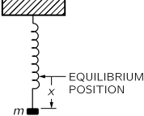

[up](top.md)

## 9 ニュートンの力学法則

### 9-1 運動量と力

力学の法則（運動の法則）の発見は、科学の歴史の中でも劇的な出来事でした。ニュートンの時代までは、惑星などの運動は謎に包まれていましたが、ニュートン以降は完全に解明されました。惑星の摂動によるケプラーの法則からのわずかなずれも計算できたのです。振り子や、バネや重りを入れた振動子の運動なども、ニュートンの法則が示されてから、完全に解析できるようになりました。この章もそうです。この章の前には、バネの上の質量がどのように動くかを計算することはできませんでしたし、木星と土星による天王星の摂動を計算することもできませんでした。この章の後では、振動する質量の動きだけでなく、木星と土星によって生じる天王星の摂動も計算できるようになるでしょう。

ガリレオは慣性の原理を発見し、運動の理解を大きく前進させました。物体を放っておいても、邪魔されなければ、元々動いていたものは一定の速度で一直線に動き続け、ただ止まっていたものは止まり続けます。もちろん、自然界ではそのようなことはありません。テーブルの上でブロックを滑らせると止まりますが、それは放っておかれたのではなく、テーブルと擦れ合っているからです。正しいルールを見つけるためには、ある種の想像力が必要であり、その想像力をガリレオが提供したのである。

もちろん、次に必要なのは、何かの影響を受けた物体がどのように速度を変化させるかというルールです。それがニュートンの貢献である。ニュートンは3つの法則を書いた。第1法則は、先ほどのガリレオ式の慣性の原理をそのまま述べたもの。第2法則は、力と呼ばれるさまざまな影響を受けたときに、速度がどのように変化するかを具体的に示すものである。第3法則は、力についてある程度説明したものですが、これについては別の機会に説明します。ここでは、第2法則についてのみ説明します。第2法則とは、物体の運動が力によって次のように変化するというものです。これを数学的に説明すると、まず、この考え方を説明します。

運動量は速度とは異なります。物理学ではたくさんの言葉が使われていますが、それらはすべて物理学では正確な意味を持っていますが、日常の言葉ではそのような正確な意味を持っていない場合があります。運動量はその一例であり、正確に定義しなければなりません。軽いものを腕で一定の力で押すと簡単に動きますが、通常の意味ではるかに重い別のものを同じように押すと、その動きはかなり鈍くなります。実際には、物体の重さと慣性の間には理解すべき違いがあるので、「軽い」「重い」という言葉を「質量が小さい」「質量が大きい」に変えなければなりません。なぜなら、物体の重さと慣性には理解すべき違いがあるからです(動かすのがどれだけ大変かということと、重さがどれだけあるかということは別のことです)。重さと慣性は比例関係にあり、地球上では数値的に等しいと考えられることが多いので、学生にはある種の混乱が生じます。火星では、重さは違っても、慣性に打ち勝つために必要な力の大きさは同じです。

慣性の定量的な尺度として質量という言葉を使っていますが、質量を測るには、例えば、ある速度で物体を円の中に振り、その円の中にとどめるためにどれだけの力が必要かを測ることがあります。このようにして、すべての物体に一定の質量が与えられます。さて、物体の運動量は、その質量と速度の2つの部分の積である。したがって、ニュートンの第二法則は、数学的には次のように書くことができます。

$$F = \dfrac{d}{dt}(mv) \tag{9.1}$$

ここで、いくつかの点を考慮する必要があります。このような法則を記述する際には、多くの直感的なアイデア、意味合い、仮定を使用し、それらを最初におおよそ組み合わせて「法則」を作成します。後になって、各用語の意味をより詳細に検討しなければならないかもしれませんが、すぐにそれをしようとすると、混乱してしまいます。このように、最初はいくつかのことを当然のことと考えます。第一に、物体の質量は一定であるということです。実際にはそうではありませんが、質量は一定であり、常に同じであるというニュートンの近似値からスタートし、さらに、2つの物体を合わせるとその質量が加算されるということです。これらの考え方は、もちろん、ニュートンが方程式を書いたときに暗示していたもので、そうでなければ意味がありません。例えば、質量が速度に反比例して変化するとすると、どのような状況でも運動量は変化しませんから、質量が速度とともにどのように変化するかを知らなければ、この法則は何の意味も持ちません。最初は「変化しない」と言います。

その後、力についての意味合いが出てきます。大雑把に言えば、力とは筋肉で押したり引いたりするようなものだと思っていますが、この運動の法則があるので、もっと正確に定義することができます。最も重要なことは、この関係には、運動量や速度の大きさの変化だけでなく、その方向の変化も含まれるということです。質量が一定であれば、式(9.1)は次のようにも書けます。

$$F= m\dfrac{dv}{dt} = ma. \tag{9.2}$$

加速度$a$は速度の変化率であり、ニュートンの第二法則は、与えられた力の効果が質量に反比例して変化するというだけでなく、速度の変化の方向と力の方向が同じであるとしています。このように、速度の変化、つまり加速度には、一般的な言葉よりも広い意味があることを理解しなければなりません。動いている物体の速度は、速くなったり、遅くなったり（遅くなった場合は、負の加速度で加速すると言います）、進行方向を変えたりすることで変化します。速度と直角方向の加速度については、第7章で説明しました。半径Rの円の中を、円に沿って一定の速度$v$で進む物体は、$t$が非常に小さい場合、直線経路から$\frac{1}{2}(v^2/R)t^2$に相当する距離だけ遠ざかることがわかりました。したがって、運動と直角方向の加速度の式は

$$a=v^2/R \tag{9.3}$$

となり、速度に直角な力は物体を曲がった道に動かすことになります。曲率半径は、力を質量で割って加速度を求め、(9.3)を使って求めることができます。

### 9-2 スピードと速度

私たちの言葉をより正確にするために、速度と速度という言葉の使用において、1つのさらなる定義をしなければなりません。通常、私たちはスピードと速度は同じものだと考えていますし、普通の言葉では同じものです。しかし、物理学では、2つの言葉があることを利用して、2つの考え方を区別するために使うことにしました。私たちは、大きさと方向の両方を持つ速度と、速度の大きさを意味するように選択し、方向を含まない速度を注意深く区別しています。これをより正確に表現するには、物体の$x、y、z$座標が時間とともにどのように変化するかを説明する必要があります。例えば、ある瞬間に図9-1のような動きをしている物体があったとします。ある小さな時間間隔$Δt$の間に、物体は$x$方向に一定の距離$Δx$、$y$方向に一定の距離$Δy$、$z$方向に一定の距離$Δz$を移動します。これら3つの座標変化の影響を総合すると、辺が$Δx、Δy、Δz$である平行六面体の対角線に沿った変位$Δs$となる。速度に関しては、変位$Δx$は速度の$x$成分を$Δt$倍したものであり、$Δy$と$Δz$についても同様である。

$$Δx=v_xΔt,\ Δy=v_yΔt,\ Δz=v_zΔt \tag{9.4}$$

図9-1. 物体の小さな変位。

### 9-3 速度、加速度、力の成分

式(9.4)では、物体が$x$方向、$y$方向、$z$方向にどのくらいの速さで移動しているかを示すことで、速度を成分に分解しました。速度は、その3つの直交成分の数値を与えれば、速度は大きさも方向も完全に特定できます。

$$v_x=dx/dt,\ v_y=dy/dt,\ v_z=dz/dt \tag{9.5}$$

一方で、物体の速度は

$$ds/dt=|v| = \sqrt{v_x^2 + v_y^2 + v_z^2} \tag{9.6}$$

図9-2. 大きさと方向の両方が変化する速度の変化。

次に、図9-2に示すように、力の作用により、速度が別の方向、別の大きさに変化したとします。このような一見複雑な状況でも、速度の$x、y、z$成分の変化を評価すれば、簡単に分析することができます。時間$Δt$における速度の$x$方向成分の変化は、$Δv_x=a_xΔt$となります（$a_x$は加速度の$x$方向成分と呼びます）。同様に、$Δv_y=a_yΔt$、$Δv_z=a_zΔt$であることがわかります。このように考えると、ニュートンの第2法則は、「力は加速度と同じ方向にある」という意味で、実際には3つの法則であることがわかります。つまり、$x、y、z$方向の力の成分は、質量に対応する速度成分の変化率をかけたものに等しいということです。

$$\begin{array}{l}
F_x=m(dv_x/dt) = m(d^2x/dt^2) = ma_x\\
F_y=m(dv_y/dt) = m(d^2y/dt^2) = ma_y\\
F_z=m(dv_z/dt) = m(d^2z/dt^2) = ma_z
\end{array} \tag{9.7}$$

速度や加速度が、その量と方向を表す線分を3つの座標軸に投影することで成分に分解されたように、ある方向への力も、$x、y、z$方向のある成分で表される。
$$\begin{array}{l}
F_x = F \cos(x,F)\\
F_y = F \cos(y,F)\\
F_z = F \cos(z,F)
\end{array} \tag{9.8}$$

ここで、$F$は力の大きさ、$(x,F)$は$x$軸と$F$の方向との間の角度を表す、などです。

ニュートンの第二法則は、式(9.7)で完全な形で与えられます。物体にかかる力がわかり、それを$x、y、z$の各成分に分解すれば、これらの式から物体の運動を求めることができます。簡単な例を見てみましょう。$y$方向と$z$方向には力がなく、$x$方向、つまり垂直方向にのみ力があるとします。式(9.7)は、垂直方向には速度の変化があるが、水平方向には変化がないことを示しています。このことは、第7章で特殊な装置を使って実証しました（図7-3参照）。落下体は、水平方向の動きは変化せず、垂直方向は水平方向の動きがゼロの場合と同じように動きます。つまり、$x、y、z$方向の運動は、力がつながっていなければ独立している。

### 9-4 力とは何か？

ニュートンの法則を使うためには、力を表す式が必要で、ニュートンの法則は「力に注目せよ」と言っています。物体が加速するということは、何かの力が働いているということで、それを見つけなさいということです。力学の未来のための私たちのプログラムは、力のための法則を見つけることでなければなりません。さらに、ニュートン自身がいくつかの例を挙げています。重力の場合、彼は力の具体的な公式を示しました。他の力の場合には、次の章で勉強する「第3法則」の情報の一部を提供し、作用と反作用の同等性に関係しています。

では、地表付近の物体にはどのような力が働いているのでしょうか。地表付近では、重力による垂直方向の力は物体の質量に比例し、地球の半径$R$に比べて高さが小さい場合には高さにほとんど依存しません：$F=GmM/R^2=mg$、$g=GM/R^2$は重力加速度と呼ばれます。このように、重力の法則から、重さは質量に比例し、力は鉛直方向で、質量に$g$をかけたものになります。面白いのは垂直方向の動きで、ニュートンの第2法則では次のようになります。

$$mg=m(d^2x/dt^2). \tag{9.9}$$

$m$をキャンセルすると、$x$方向の加速度は一定で$g$に等しいことがわかります。これはもちろん、よく知られている重力下での自由落下の法則で、次の方程式が導かれます。

$$\begin{array}{l}
v_x = v_0 + gt\\
x = x_0 + v_0t + \frac{1}{2}gt^2
\end{array}$$

図9-3. ばねの上の質量。

別の例として、距離に比例して逆向きの力を加えるガジェット（図9-3）を作ることができたとしましょう、それがバネです。重力はもちろんバネの最初の伸びで相殺されますが、それを忘れて余計な力だけを考えてみると、質量を下に引っ張るとバネは上に引っ張られ、上に押すとバネは下に引っ張られます。この機械は、バランスのとれた状態からの変位に正確に比例して、引き上げるほどに力が大きくなり、引き下げるほどに上向きの力が大きくなるように、注意深く設計されています。この機械の動きを見てみると、上へ、下へ、上へ、下へ......と、なかなか美しい動きをしています。問題は、この動きをニュートンの方程式で正しく記述できるかどうかです。ニュートンの法則(9.7)を適用して、この周期的な振動の動きを正確に計算できるかどうか見てみましょう。今回の例では、方程式は

$$-kx = m(dv_x/dt). \tag{9.11}$$

ここでは、$x$方向の速度が$x$に比例して変化している状況です。多数の定数を保持していても何の得にもならないので、時間の尺度が変わったか、単位に事故があって、たまたま$k/m=1$になったと想像します。そこで、次の方程式を解いてみましょう。

$$dv_x/dt = -x. \tag{9.12}$$

先に進むためには、$v_x$が何であるかを知らなければなりませんが、もちろん、速度が位置の変化率であることは知っています。

### 9-5 力学系方程式の意味

さて、式(9.12)が何を意味するのかを分析してみましょう。ある時刻$t$において、物体がある速度$v_x$と位置$x$を持っていたとします。少し後の時刻$t+ϵ$の速度と位置はどうなるのでしょうか？この質問に答えられれば、問題は解決します。与えられた条件から始めて、最初の瞬間、次の瞬間、その次の瞬間......と、どのように変化するかを計算し、このようにして運動を徐々に進化させていくことができるからです。具体的には、$t=0$の時点で$x=1、v_x=0$と与えられていたとします。なぜ、物体は動くのでしょうか？$x=0$以外の位置にあるとき、物体に力が働いているからです。
x>0であれば、その力は上向きになります。そのため、運動の法則により、ゼロだった速度が変化し始めます。ある程度の速度がつき始めると、物体は上に向かって移動し始めます。さて、任意の時刻$t$において、$ϵ$が非常に小さい場合、時刻$t+ϵ$での位置を、時刻$t$での位置と速度で非常によく近似して次のように表すことができます。

$$x(t+ϵ)=x(t)+ϵv_x(t). \tag{9.13}$$

$ϵ$が小さければ小さいほど、この式はより正確になりますが、$ϵ$が消失するほど小さくなくても、有用な正確さです。では、速度はどうでしょうか？$t+ϵ$の時点での速度を求めるためには、速度がどのように変化するか、つまり加速度を知る必要があります。では、どうやって加速度を求めるのでしょうか？そこで登場するのが「力学の法則」です。動力学の法則は、加速度が何であるかを教えてくれます。加速度は$-x$だそうです。

$$v_x(t+ϵ)  = v_x(t)+ϵa_x(t) \tag{9.14}$$
$$\ \ \ \ \ \ \ \ \ \ \ \ \ \ \ = v_x(t)-ϵx(t) \tag{9.15}$$

式(9.14)は単なる運動学であり、加速度があるから速度が変わるというものです。しかし、式(9.15)は加速度と力を関連付けるもので、力学的なものです。つまり、この問題のこの特定の時間には、加速度を$-x(t)$に置き換えることができるということです。したがって、ある時刻の$x$と$v$の両方がわかれば、加速度がわかり、新しい速度がわかり、新しい位置がわかります-これが機械の仕組みです。力のために速度が少しずつ変わり、速度のために位置が少しずつ変わる。

### 9-6 方程式の数値解法

では、実際に問題を解いてみましょう。仮に、$ϵ=0.100$秒とします。ここまでやってみて、これでは不十分だと思ったら、もう一度、$ϵ=0.010$秒でやってみることにしましょう。初期値$x(0)=1.00$から始めて、$x(0.1)$は何でしょうか？以前の位置$x(0)$に速度($0$)を加えたものに$0.10$秒をかけたものです。まだ動き出していないので、$x(0.1)$は$1.00$のままです。しかし、$0.10$秒後の新しい速度は、以前の速度$v(0)=0$に、加速度と$ϵ$を掛けたものを加えたものになります。このときの加速度は$-x(0)=-1.00$です。したがって

$$v(0.1)=0.00−0.10×1.00=−0.10.$$

次に、0.20秒の時点で

$$\begin{array}{rl}
    x(0.2) &=x(0.1)+ϵv(0.1)\\
    &=1.00−0.10×0.10=0.99
\end{array}$$

そして
$$\begin{array}{rl}
    v(0.2) & =v(0.1)+ϵa(0.1)\\
    & =−0.10−0.10×1.00=−0.20.
\end{array}$$

そうやって、延々と残りの動きを計算していけばいいわけです。しかし、現実的には、精度を上げるためのちょっとした工夫が必要です。この計算を始めたときと同じように続けた場合、$ϵ=0.100$秒というのはかなり粗雑なので、運動はかなり粗雑にしか見つからず、$ϵ=0.01$という非常に小さな間隔で計算しなければなりません。そうすると、妥当な総時間間隔を経るためには、多くの計算サイクルが必要になります。そこで、同じように粗い間隔$ϵ=0.10$秒を使って、計算の精度が上がるように整理してみましょう。これは、解析の手法を微妙に改善すれば可能です。

新しい位置は、古い位置に時間間隔$ϵ$を加えたものに、速度をかけたものであることに気づく。しかし、速度は？時間間隔の初めの速度は1つの速度で、時間間隔の終わりの速度は別の速度です。ここでの改善点は、その中間の速度を使うことです。もし、今の速度がわかっていても、その速度が変化しているのであれば、今と同じ速度で行っても正しい答えは得られません。今」の速度と区間終了時の「その時」の速度の間にある速度を使うべきなのです。同じことが速度にも当てはまります。速度の変化を計算するには、速度を求める2つの時間の中間にある加速度を使うべきです。後の位置は、前の位置に、区間の途中の時刻の速度の$ϵ$倍を加えたものに等しい。同様に、この中間点での速度は、前の区間の中間である$ϵ$前の時刻での速度に、時刻$t$での加速度の$ϵ$倍を加えたものである。つまり、次の方程式を使う。

$$\begin{array}{rl}
    x(t+ϵ) & =x(t)+ϵv(t+ϵ/2),\\
    v(t+ϵ/2)  & =v(t-ϵ/2)+ϵa(t),\\
    a(t) & =-x(t).
\end{array} \tag{9.16}$$

$v(ϵ/2)$とは何かというわずかな問題だけが残っています。最初に与えられたのは$v(0)$であり、$v(-ϵ=2)$ではありません。計算を始めるために、特別な式、すなわち、$v(ϵ/2)=v(0)+(ϵ/2)a(0)$を使うことにします。

 表9-1

$dv_x/dt=-x$の解

インターバル：$ϵ=0.10$秒

|$t$|$x$|$v_x$|$a_x$|
|:-:|:-:|:-:|:-:|
|0.0 |1.000 |0.000|−1.000|
|||−0.050||
|0.1 |0.995| |−0.995|
|||−0.150|
|0.2|0.980| |−0.980|
|||−0.248||
|0.3|0.955| |−0.955|
|||−0.343||
|0.4 |0.921 ||−0.921|
|||−0.435||
|0.5 |0.877| |−0.877|
|||−0.523||
|0.6 |0.825 ||−0.825|
|||−0.605||
|0.7 |0.764| |−0.764|
|||−0.682||
|0.8 |0.696 ||−0.696|
|||−0.751||
|0.9 |0.621 ||−0.621|
|||−0.814||
|1.0 |0.540| |−0.540|
|||−0.868||
|1.1 |0.453| |−0.453|
|||−0.913||
|1.2 |0.362| |−0.362|
|||−0.949||
|1.3 |0.267| |−0.267|
|||−0.976||
|1.4 |0.169| |−0.169|
|||−0.993||
|1.5 |0.070| |−0.070|
|||−1.000||
|1.6 |−0.030| |+0.030|

これで、計算を実行する準備ができました。便宜上、表9-1のように、時間、位置、速度、加速度の列と、その間の速度の行を持つ表の形で作業を行うことができます。このような表は、もちろん、一連の方程式（9.16）から得られる数値を表現するための便利な方法にすぎず、実際には方程式そのものを書く必要はありません。表の各スペースを1つずつ埋めていくだけです。この表を見ると、運動の様子がよくわかります。静止状態からスタートして、最初に少し上向きの（負の）速度を得て、距離を少し縮めます。その後、加速度は少し小さくなりますが、それでも速度は増していきます。しかし、進むにつれて速度はますます遅くなり、$t=1.50$秒頃に$x=0$を通過すると、「このまま進むだろう」と確信を持って予測できますが、今度は反対側になります。したがって、速度は減少します。これらの数値を関数$x=\cos t$と比較してみると興味深い。
その一致は、私たちの計算の有効数字3桁分の精度に収まっています。$x=\cos t$が運動方程式の正確な数学的解であることは後述しますが、このような簡単な計算でこのような正確な結果が得られるということは、数値解析の力を印象的に示しています。

図9-4. ばねの上の質量の動きのグラフ。

### 9-7 惑星の運動

上記の解析は、振動するバネの運動については非常に素晴らしいものですが、太陽の周りを回る惑星の運動を解析することはできるでしょうか？軌道を楕円に近似することができるかどうか見てみましょう。ここでは、太陽の動きを含まないという意味で、太陽が無限に重いと仮定します。ある惑星がある場所から出発して、ある速度で動いているとすると、それは太陽の周りを何かのカーブを描いて回っています。そのカーブが何であるかを、ニュートンの運動法則と重力の法則によって分析してみましょう。どうやって？ある瞬間に、それは空間のある位置にあります。太陽からこの位置までの半径方向の距離を$r$とすると、重力の法則により、太陽の質量と惑星の質量の積を距離の二乗で割った定数倍の力が内側に向かってかかっていることがわかります。これをさらに分析するには、この力によってどのような加速度が発生するかを調べなければなりません。ここでは、$x$と$y$と呼ばれる2つの方向に沿った加速度の成分が必要です。このように、ある瞬間の惑星の位置を$x$と$y$で指定すると（$z$方向には力がなく、初速度$v_z$がなければ$z$をゼロ以外にするものはないので、$z$は常にゼロであると仮定する）、図9-5に示すように、惑星と太陽を結ぶ線に沿って力がかかります。

図9-5. 惑星にかかる重力の大きさ 

この図から、力の水平成分は、2つの三角形が似ていることから、水平距離$x$が完全な斜辺$r$と同じように、完全な力と関係していることがわかります。また、$x$が正の場合、$F_x$は負になります。つまり、$F_x/|F|=-x/r$、または、$F_x= -|F|x/r= -GMmx/r^3$となります。ここで力学的法則を用いて、この力の成分は、惑星の質量に$x$方向の速度変化率をかけたものに等しいことを求めます。したがって、次のような法則がわかります。

$$\begin{array}{rl}
    m(dv_x/dt) &=-GMmx/r^3,\\
    m(dv_y/dt) &=-GMmy/r^3,\\
    r &=\sqrt{x^2+y^2}
\end{array} \tag{9.17}
$$

これが、私たちが解かなければならない方程式のセットです。ここでも、数値計算を簡単にするために、時間の単位、つまり太陽の質量が$GM≡1$となるように調整されている（あるいは運がいい）と仮定します。この例では、惑星の初期位置が$x=0.500$、$y=0.000$で、速度は最初からすべて$y$方向であり、大きさは1.630であると仮定しています。では、どのようにして計算するのでしょうか？再び、時間、$x$位置、$x$速度$v_x$、$x$加速度$a_x$の列を持つ表を作り、さらに、二重線で区切って、$y$方向の位置、速度、加速度の3つの列を作ります。$x$方向の加速度は$-x/r^3$、$y$方向の加速度は$-y/r^3$、$r$は$x^2+y^2$の平方根であることを示しています。このように、$x$と$y$が与えられた場合、横に少し計算して、2乗の和の平方根をとって$r$を求め、さらに、2つの加速度を計算する準備として、$1/r^3$を評価することも有用です。この作業は、2乗、3乗、逆数の表を使うことで簡単に行うことができます。その後、$x$に$1/r^3$を掛けるだけですが、これは計算尺を使って行います。

このようにして、時間間隔$ϵ=0.100$を用いて、次のステップで計算を進めます。$t=0$における初期値は、

$$\begin{array}{rlrlr}
    x(0) &=0.500 & y(0)&=0.000\\
    v_x(0)&=0.000 & v_y(0)&=+1.630
\end{array}$$

これらから、次のように求められる。

$$\begin{array}{rlrlr}
r(0)&=0.500&1/r^3(0)&=8.000\\
a_x(0)&=−4.000&a_y(0)&=0.000
\end{array}$$

したがって、速度$v_x(0.05)$と$v_y(0.05)$を計算することができます。

$$v_x(0.05)=0.000−4.000×0.050=−0.200;$$
$$v_y(0.05)=1.630+0.000×0.050=1.630.$$

ここからが本番の計算です。

$$\begin{array}{rlc}
    x(0.1) & =0.500−0.20×0.1 &=0.480\\
    y(0.1) & =0.0+1.63×0.1  &=0.163\\
    r(0.1) & =\sqrt{0.480^2 +0.163^2} &=0.507\\
    1/r^3(0.1)&=7.677&\\
    a_x(0.1)&=−0.480×7.677 &=−3.685\\
    a_y(0.1)&=−0.163×7.677 &=−1.250\\
    v_x(0.15)&=−0.200−3.685×0.1&=−0.568\\
    v_y(0.15)&=1.630−1.250×0.1 &=1.505\\
    x(0.2)&=0.480−0.568×0.1&=0.423\\
    y(0.2)&=0.163+1.505×0.1&=0.313\\
    &etc.&
\end{array}$$

このようにして、表9-2の値が得られ、20ステップほどで太陽の周りを半周する惑星を追いかけることができました。図9-6は、表9-2の$x$、$y$座標をプロットしたものです。点は、10分の1単位の時間が連続したときの位置を表しています。惑星は、最初は速く動き、最後はゆっくり動くことがわかり、曲線の形が決まります。このようにして、惑星の運動を計算する方法がわかったのです。

表9-2

$dv_x/dt=-x/r^3, dv_y/dt=-y/r^3, r=\sqrt{x2+y2}$の解。

区間：$ϵ=0.100$

$t=0$における軌道 $v_y=1.63、v_x=0、x=0.5、y=0$

|$t$|$x$ |$v_x$ |$a_x$ |$y$ |$v_y$ |$a_y$ |$r$ |$1/r^3$|
|:-:| :-:|:-----:|:----:|:--:|:---:|:-----:|:--:|:-----:|
|0.0 |0.500 ||−4.000 |0.000 ||0.000 |0.500 |8.000|
|||−0.200 |||1.630 ||||
|0.1 |0.480 ||−3.685 |0.163 ||−1.251 |0.507 |7.677|
|||−0.568 |||1.505 ||||
|0.2 |0.423 ||−2.897 |0.313 ||−2.146 |0.527 |6.847|
|||−0.858 |||1.290 ||||
|0.3 |0.337 ||−1.958 |0.443 ||−2.569 |0.556 |5.805|
|||−1.054 |||1.033 ||||
|0.4 |0.232 ||−1.112 |0.546 ||−2.617 |0.593 |4.794|
|||−1.165 |||0.772 ||||
|0.5 |0.115 ||−0.454 |0.623 ||−2.449 |0.634 |3.931|
|||−1.211 |||0.527 ||||
|0.6 |−0.006 ||+0.018 |0.676 ||−2.190 |0.676 |3.241|
|||−1.209 |||0.308 ||||
|0.7 |−0.127 ||+0.342 |0.706 ||−1.911 |0.718 |2.705|
|||−1.175 |||0.117 ||||
|0.8 |−0.244 ||+0.559 |0.718 ||−1.646 |0.758 |2.292|
|||−1.119 |||−0.048 ||||
|0.9 |−0.356 ||+0.702 |0.713 ||−1.408 |0.797 |1.974|
|||−1.048 |||−0.189 ||||
|1.0 |−0.461 ||+0.796 |0.694 ||−1.200 |0.833 |1.728|
|||−0.969 |||−0.309 ||||
|1.1 |−0.558 ||+0.856 |0.664 ||−1.019 |0.867 |1.536|
|||−0.883 |||−0.411 ||||
|1.2 |−0.646 ||+0.895 |0.623 ||−0.862 |0.897 |1.385|
|||−0.794 |||−0.497 ||||
|1.3 |−0.725 ||+0.919 |0.573 ||−0.726 |0.924 |1.267|
|||−0.702 |||−0.569 ||||
|1.4 |−0.795 ||+0.933 |0.516 ||−0.605 |0.948 |1.174|
|||−0.608 |||−0.630 ||||
|1.5 |−0.856 ||+0.942 |0.453 ||−0.498 |0.969 |1.100|
|||−0.514 |||−0.680 ||||
|1.6 |−0.908 ||+0.947 |0.385 ||−0.402 |0.986 |1.043|
|||−0.420 |||−0.720 ||||
|1.7 |−0.950 ||+0.950 |0.313 ||−0.313 |1.000 |1.000|
|||−0.325 |||−0.751 ||||
|1.8 |−0.982 ||+0.952 |0.238 ||−0.230 |1.010 |0.969|
|||−0.229 |||−0.774 ||||
|1.9 |−1.005 ||+0.953 |0.160 ||−0.152 |1.018 |0.949|
|||−0.134 |||−0.790 ||||
|2.0 |−1.018 ||+0.955 |0.081 ||−0.076 |1.022 |0.938|
|||−0.038 |||−0.797 ||||
|2.1 |−1.022 ||+0.957 |0.002 ||−0.002 |1.022 |0.936|
|||+0.057 |||−0.797 ||||
|2.2 |−1.017 ||+0.959 |−0.078 ||+0.074 |1.020 |0.944|
||||||−0.790 ||||
|2.3 |||||

$2.101$秒で$x$軸を横切り、∴周期$=4.20$秒。

$2.086$秒で$v_x=0$となる。

$x$を$-1.022$で交差、∴半長軸$=1.022+0.5002=0.761$。

$v_y=-0.797$。

予測時間$π(0.761)^{3/2}=π(0.663)=2.082$。

図9-6. 太陽の周りの惑星の動きを計算したもの。

では、海王星、木星、天王星、その他の惑星の動きをどうやって計算するかを見てみましょう。もし、たくさんの惑星があって、太陽も動いていたら、同じことができるでしょうか？もちろん、できます。特定の惑星にかかる力を計算します。例えば、$x_i,y_i,z_i$の位置にある$i$番の惑星を計算します（$i=1$は太陽を、$i=2$は水星を、$i=3$は金星を表しています）。すべての惑星の位置を知る必要があります。1つの惑星に作用する力は、例えば位置$x_j,y_j,z_j$にある他のすべての物体によるものです。したがって、方程式は 

$$\begin{array}{l}
    m_i \dfrac{dv_{ix}}{dt} = \sum^N_{j=1} -\dfrac{Gm_im_j(x_i - x_j)}{r^3_{ij}}\\
    m_i \dfrac{dv_{iy}}{dt} = \sum^N_{j=1} -\dfrac{Gm_im_j(y_i - y_j)}{r^3_{ij}}\\
    m_i \dfrac{dv_{iz}}{dt} = \sum^N_{j=1} -\dfrac{Gm_im_j(z_i - z_j)}{r^3_{ij}}    
\end{array} \tag{9.18}
$$

さらに、2つの惑星$i$と$j$の間の距離を$r_{ij}$と定義すると、これは次のようになります。

$$r_{ij} = \sqrt{(x_i - x_j)^2 + (y_i - y_j)^2 + (z_i - z_j)^2} \tag{9.19}$$

また、∑はjのすべての値の合計を意味し、他のすべての項（もちろん$j=i$を除く）の合計を意味します。したがって、私たちがすべきことは、もっとたくさんの列を作ることです。木星の運動のために9列、土星の運動のために9列、というように必要です。そして、すべての初期位置と速度が揃ったら、まず式（9.19）を使ってすべての距離を計算することで、式（9.18）からすべての加速度を計算することができます。どのくらいの時間でできるの？家でやると、とても時間がかかります。しかし、現代では、非常に高速に算術を行う機械があります。非常に優れた計算機では、足し算を行うのに1マイクロ秒、つまり100万分の1秒かかることもあります。非常に優れた計算機では、足し算に1マイクロ秒、つまり100万分の1秒かかります。問題によっては、1サイクルの計算で30回の乗算を行うこともあります。その場合、1サイクルにかかる時間は300マイクロ秒です。つまり、1秒間に3000サイクルの計算ができるということになります。例えば10億分の1の精度を出すためには、惑星が太陽の周りを1周するのに相当する4×10^5サイクルが必要になります。これは130秒、つまり約2分の計算時間に相当します。したがって、この方法では、すべての惑星のすべての摂動を10億分の1に修正しながら、太陽の周りを回る木星を追うのに、わずか2分しかかかりません。誤差は間隔$ϵ$の二乗に比例して変化することが分かりました。区間を1000分の1にすれば、100万分の1の精度になります。そこで、間隔を1万倍にしてみましょう）。)

このように、この章では、バネの上の質量の動きさえも計算できない状態でスタートしました。しかし、ニュートンの法則の威力は絶大で、このような単純な運動だけでなく、演算処理が可能な機械さえあれば、途方もなく複雑な惑星の運動でさえ、どこまでも正確に計算することができるようになったのです。

[up](top.md)

