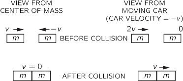
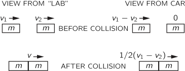
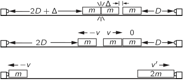
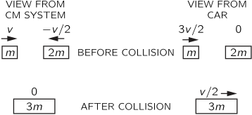
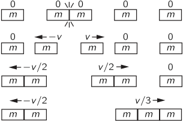

[up](top.md)

## 10 運動量の保存

### 10-1 ニュートンの第三法則

体の加速度と力の関係を示すニュートンの運動の第2法則に基づけば、力学上のあらゆる問題を原理的に解決することができます。例えば、数個の粒子の運動を求めるには、前章で紹介した数値計算法を用いることができます。しかし、ニュートンの法則をさらに研究するには理由があります。まず、運動の中には非常に単純なケースでも、数値的な手法だけでなく、直接的な数学的解析が可能なものがあります。例えば、落下体の加速度が32フィート/秒²であることがわかっており、この事実から数値計算によって運動を算出することができますが、運動を解析して一般解である$s=s_0+v_0t+16t^2$を求める方がはるかに簡単で満足のいく結果が得られます。同じように、調和振動子の位置を数値的に計算することはできますが、一般解がtの単純な余弦関数であることを解析的に示すことも可能であり、より簡単で正確な方法で結果を得ることができる場合には、わざわざ算術的な手間をかける必要はありません。同じように、重力で決まる太陽の周りの天体の運動も、第9章の数値計算法で一点一点計算していくと、軌道の大まかな形がわかりますが、正確な形がわかると嬉しいですよね、解析すると完全な楕円になります。

しかし、残念ながら、解析で正確に解ける問題はほとんどありません。例えば、調和振動子の場合、バネの力が変位に比例するのではなく、もっと複雑な場合には、数値計算に頼らざるを得ません。あるいは、太陽の周りを回る物体が2つあって、全部で3つの物体があるとすると、解析では簡単な運動の式が出せないので、実際には数値的に問題を解決しなければなりません。これが有名な三体問題で、長い間、人間の解析力が問われていました。数学的な解析力には限界があり、数値的な手法を使う必要があるかもしれないという事実を理解するのに、どれほどの時間がかかったかは非常に興味深いところです。現在では、解析的にできない問題の多くが数値計算によって解決されており、難しいとされていた昔の三体問題も、前章で述べたのと全く同じ方法、つまり十分な演算を行うことで、日常的に解決されています。しかし、簡単な問題は解析で、中程度の難しい問題は数値計算で解決できるが、非常に複雑な問題はどちらの方法でも解決できないという場合もあるのだ。複雑な問題とは、例えば、自動車同士の衝突や、気体の分子の動きなどです。1立方ミリメートルの気体の中には無数の粒子があり、これだけの変数（約10^17---1億個）を使って計算するのは馬鹿げていると思います。ガスや鉄の塊の分子や原子の動き、太陽の周りを2〜3個の惑星が回っているのではなく、球状星団の中の星の動きなどは、直接できないので、他の方法を考えなければなりません。

このように詳細を追うことができない場合には、ニュートンの法則の帰結である一般的な性質、つまり一般的な定理や原理を知る必要があります。その一つが、第4章で述べたエネルギー保存の原理です。もう一つは、本章の主題である運動量保存の原理です。力学をさらに学ぶ理由は、さまざまな状況で繰り返される運動のパターンがあるので、そのパターンをある特定の状況で研究するのが良いということです。例えば、衝突を研究しましょう。様々な種類の衝突には多くの共通点があります。流体の流れでは、流体が何であるかはあまり関係なく、流れの法則は似ています。その他の問題としては、振動や揺れ、特に機械的な波の特殊な現象（音、棒の振動など）を研究します。

ニュートンの法則の話の中で、この法則は「力に注目してください」という一種のプログラムであり、ニュートンは力の性質について2つのことしか教えていないと説明しました。重力の場合には、力の完全な法則を教えてくれたのです。しかし、原子間の非常に複雑な力の場合、彼は力のための正しい法則を知らなかった。しかし、彼は1つのルール、力の1つの一般的な性質を発見し、それは彼の第3法則で表現されている。それが、ニュートンが力の性質について持っていた知識の総体である。重力の法則とこの原則であり、他の詳細はない。

この原理とは、「作用は反作用に等しい」というものです。

例えば、2つの小さな物体、例えば粒子があって、1つ目の物体が2つ目の物体に力を加え、ある力で押したとします。すると同時に、ニュートンの第3法則により、2番目の粒子は1番目の粒子を逆方向に同じ力で押すことになり、さらにこれらの力は事実上同一線上に作用する。これがニュートンの提唱した仮説（法則）であり、正確ではないがかなり正しいと思われる（その誤差については後述する）。とりあえず、作用は反作用に等しいというのが真実であると考えることにします。もちろん、他の2つの粒子と同じ線上にない3つ目の粒子がある場合、例えば3つ目の粒子が他の2つの粒子それぞれに自分の押し力を与えるので、この法則は1つ目の粒子にかかる力の合計と2つ目の粒子にかかる力の合計が等しいことを意味しません。その結果、最初の2つにかかる総作用は何らかの別の方向になり、最初の2つの粒子にかかる力は一般的には等しくもなく反対でもありません。しかし、各粒子にかかる力は部分に分解することができ、相互作用する他の各粒子による1つの寄与または部分があります。そして、各粒子のペアは、大きさが等しく、方向が反対の対応する相互作用の成分を持っています。

### 10-2 運動量の保存

さて、上記の関係の興味深い結果は何でしょうか？簡単のために、2つの相互作用する粒子があるとします。おそらく質量が異なり、1と2という番号がついています。この2つの粒子の間の力は等しくて反対ですが、その結果はどうなるでしょうか？ニュートンの第2法則によると、力は運動量の時間変化率であるため、粒子1の運動量変化率$p_1$は粒子2の運動量変化率$p_2$を差し引いたものに等しいと結論づけられます。

$$dp_1/dt=-dp_2/dt \tag{10.1}$$

ここで、変化率が常に等しく、反対であるとすると、粒子1の運動量の変化の総和は、粒子2の運動量の変化の総和と等しく、反対であることになります。つまり、粒子1の運動量を粒子2の運動量に加えると、粒子間の相互の力(内力といいます)によるこれらの総和の変化率はゼロになります；つまり

$$d(p_1+p_2)/dt=0 \tag{10.2}$$

この問題では、他の力はないものとします。この和の変化率が常に0であれば、それは単に量$(p_1+p_2)$が変化していないことの言い換えである。この量は$m_1v_1+m_2v_2$とも書かれ、2つの粒子の合計運動量と呼ばれています）。これで、2つの粒子間の相互作用によって、2つの粒子の全運動量が変化しないという結果が得られました。これは、運動量保存の法則を表しています。つまり、どんなに複雑な力であっても、2つの粒子の間に何らかの力が働き、その力が働く前と後の2つの運動量の合計である$m_1v_1+m_2v_2$を測定または計算すれば、結果は等しくなるはずであり、運動量の合計は一定であるということです。

この議論を、より複雑な状況で相互に作用する3つ以上の粒子に拡大すると、内部の力に関する限り、すべての粒子の総運動量は一定であることが明らかになります。なぜなら、ある粒子の運動量が他の粒子によって増加しても、2番目の粒子の運動量が1番目の粒子によって減少することで正確に補われるからです。つまり、すべての内的な力が均衡するため、粒子の総運動量を変化させることはできないのです。また、外からの力（外力）がなければ、全体の運動量を変化させる力はないので、全体の運動量は一定となります。

問題の粒子の相互作用に由来しない力がある場合にどうなるかを説明する価値があります。相互作用する粒子を分離したとします。相互に働く力しかない場合は、先ほどと同様に、どんなに複雑な力があっても、粒子の全運動量は変わりません。一方で、孤立したグループの外にある粒子からも力が出ているとします。外部の物体が内部の物体に及ぼす力を外力と呼びます。後で、すべての外力の合計が、内部のすべての粒子の合計運動量の変化率に等しいことを示しますが、これは非常に便利な定理です。

相互作用する多数の粒子の全運動量の保存は、次のように表すことができます。

$$m_1v_1+m_2v_2+m_3v_3+⋯=一定 \tag{10.3}$$

外力がない場合 ここで、粒子の質量とそれに対応する速度には、1、2、3、4、...と番号が振られています。 それぞれの粒子について、ニュートンの第二法則の一般的な記述をします。

$$F=\dfrac{d}{dt}(mv),\tag{10.4}$$

は、特に任意の方向の力と運動量の成分に当てはまります。したがって、ある粒子にかかる力の$x$成分は、その粒子の運動量の変化率の$x$成分に等しく、すなわち

$$F_x=\dfrac{d}{dt}(mv_x),\tag{10.5}$$

となり、$y$方向、$z$方向についても同様である。したがって、式 (10.3)は、実際には各方向に1つずつの3つの方程式です。

運動量保存の法則に加えて、ニュートンの第二法則にはもう一つ興味深い結果があります。これは後で証明されますが、今は単に述べるだけです。この法則は、私たちがじっとしていても、直線上を一定の速度で動いていても、物理法則は同じように見えるというものです。例えば、子供が飛行機の中でボールを弾いてみると、地面で弾いているのと同じようにボールが弾むことがわかります。飛行機が非常に速い速度で動いていても、速度が変わらない限り、子供には飛行機が静止しているときと同じ法則に見えるのです。これが相対性原理と呼ばれるものです。ここでは、これを「ガリレオ相対性理論」と呼び、後述するアインシュタインによるより慎重な分析と区別しています。

今、ニュートンの法則から運動量保存の法則を導き出しましたが、ここから衝撃や衝突を記述する特別な法則を見つけ出すこともできます。しかし、多様性を持たせるために、また、例えば、ニュートンの法則を知らずに別のアプローチを取るような場合に物理学で使用できる一種の推論の例として、衝撃と衝突の法則を全く別の観点から議論してみましょう。先に述べたガリレオ相対性理論の原則に基づいて議論を進め、最後に運動量保存の法則にたどり着くことにします。

まず、自然は一定の速度で走って見ても、立ち止まって見ても同じように見えるという前提で考えてみます。2つの物体が衝突してくっついたり、寄ってきて跳ねて離れたりする衝突について説明する前に、まず、2つの物体がバネか何かで固定されていて、その後、バネか、あるいはちょっとした爆発によって突然解放されて押されることを考えてみよう。さらに、一方向だけの運動を考えてみます。まず、2つの物体がまったく同じで、きれいな左右対称の物体で、その間でちょっとした爆発があったとします。爆発の後、一方の物体は速度$v$で右に向かって動いているとします。そうすると、もう一方の物体が速度$v$で左に向かって動いているのは合理的に見えます。物体が同じであれば、右や左が優先される理由はなく、物体は対称的な動きをするからです。これは、多くの問題で非常に有用であるにもかかわらず、公式から入るだけでは出てこない考え方の一例です。

実験の最初の結果は、「同じものは同じ速さになる」というものでしたが、ここで、銅とアルミニウムという異なる素材の2つの物体を用意して、2つの質量を同じにしたとします。ここでは、物体が同じでなくても、質量が等しい2つの物体で実験を行えば、速度は等しくなると仮定します。誰かが反対するかもしれません。"でもさ、逆にやってもいいんだよ、そんなこと仮定しなくても。この実験では、等しい速度を獲得する2つの質量を意味するように、等しい質量を定義することができます」。その提案に従って、銅と非常に大きなアルミニウムの間で小さな爆発を起こします。銅は飛び出し、アルミニウムはほとんど動かないほどの重さです。それはアルミニウムが多すぎるので、ほんのわずかになるまで量を減らし、爆発させるとアルミニウムは飛び去り、銅はほとんど動かなくなります。これではアルミニウムが足りない。これではアルミニウムの量が足りませんね。よろしい、では裏を返せば、「速度が等しければ質量も等しい」ということになります。これは単なる定義のように見えますが、物理法則を単なる定義に変えることができるのは驚きです。しかし、そこにはいくつかの物理法則が存在しており、この「質量が等しい」という定義を受け入れると、次のようにすぐに法則の1つを見つけることができます。

前述の実験で、AとB（銅とアルミニウム）の2つの物質の質量が等しいことがわかっていて、第3の物体、例えば金のかけらを、上記と同じように銅と比較し、その質量が銅の質量と等しいことを確認したとします。ここで、アルミニウムと金の実験を行うと、論理的にはこれらの質量が等しくなければならないということはありませんが、実験では実際に等しくなっています。つまり、実験によって新しい法則が見つかったのです。この法則を表現すると、次のようになります。もし2つの質量がそれぞれ3つ目の質量に等しいならば（この実験では速度が等しいことで決まる）、それらは互いに等しい。このステートメントは、数学的な量に関するポスチュレートとして使用される同様のステートメントからは全く導かれません）。この例から、私たちはうっかりするとすぐに推論を始めてしまうことがわかります。速度が等しいときに質量が等しいと言うのは、単なる定義ではなく、質量が等しいと言うことは、数学的に等しいという法則を暗示することになり、その結果、実験についての予測が可能になるからです。

2つ目の例として、ある強さの爆発で一定の速度が得られる実験をして、AとBが等しいことがわかったとします。その後、さらに強い爆発を使った場合、今得られた速度が等しいというのは本当でしょうか、それとも嘘でしょうか。繰り返しますが、論理的にはこの問題を決定づけるものは何もありませんが、実験はそれが真実であることを示しています。そこで、もう一つの法則をご紹介します。2つの物体の質量が、ある速度で測ったときに等しければ、別の速度で測ったときにも質量が等しくなる。これらの例から、単なる定義のように見えたものが、実際にはいくつかの物理学の法則を含んでいることがわかります。

以下の展開では、等しい質量の間で爆発が起こった場合、等しい逆の速度になることが真実であると仮定します。また、逆の場合も想定します。同じ速度で反対方向に動いている2つの同じ物体が衝突し、何らかの接着剤でくっついた場合、衝突後はどちらに動くのでしょうか？これも対称的な状況であり、右も左もないので、静止していると仮定します。また、同じ質量の2つの物体は、たとえ材質が違っていても、衝突してくっつくと、同じ速度で反対方向に移動しても、衝突後に静止すると仮定してみましょう。

### 10-3 運動量は保存される!

図10-1.リニアエアートラフの端面図

図10-2. 爆発物交流用シリンダーを取り付けたグライダーの断面図。

上記の仮定を実験的に検証することができます。第一に、質量が同じで静止している2つの物体を爆発で分離すると、同じ速度で離れていくこと、第二に、質量が同じで、同じ速度で集まってきた2つの物体を衝突させてくっつけると、止まることです。これを実現するには、ガリレオを悩ませていた摩擦をなくすために、空気桶(*1)という素晴らしい発明をする必要があります（図10-1）。ガリレオは、物が自由に滑らないので、物を滑らせて実験することができませんでしたが、魔法のような工夫を加えることで、今日から摩擦をなくすことができます。ガリレオが宣伝したように、私たちの物体は難なく、一定の速度で延々と滑っていきます。これは、空気の上で物体を支えることで実現しています。空気は摩擦が非常に少ないので、力が加わっていない状態では、物体は実質的に等速で滑っていきます。まず、同じ重さ（質量）になるように慎重に作られた2つの滑空ブロック（重さは実際に測ったものですが、この重さは質量に比例することがわかっています）を使用し、2つのブロックの間に密閉された円筒の中に小さな爆発物のキャップを置きます（図10-2）。軌道の中心点でブロックを静止させ、キャップを電気火花で爆発させてブロックを強制的に引き離すことにします。どうなるでしょうか？飛び立った時の速度が同じであれば、2つのブロックは同時に谷の端に到達するはずです。端に到達すると、両者は実質的に反対の速度で跳ね返り、一緒になって、出発点である中央に止まるでしょう。これは良いテストで、実際にやってみると、説明した通りの結果になります（図10-3）。

図10-3. 質量が等しい場合の作用・反作用実験の模式図。

さて、次に考えてみたいのは、もっと単純ではない状況ではどうなるかということです。2つの等しい質量があり、1つは速度$v$で動いていて、もう1つは静止していて、それらが衝突してくっついたとすると、何が起こるでしょうか？終わってみると、全体で$2m$の質量があり、未知の速度で漂っています。どんな速度か？それが問題です。その答えを見つけるために、車に乗っていても、物理学的には止まっているのと同じように見えるという前提で考えます。まず、等しい速度$v$で反対方向に動く2つの等しい質量は、衝突すると止まってしまうという知識から始めます。ここで、この現象が起きている間、私たちは自動車に乗って速度$-v$で通り過ぎているとします。すると、どのように見えるでしょうか。衝突する2つの質量のうち、一方の質量に同乗しているので、その質量の速度はゼロに見えます。しかし、もう一方の質量は、速度$v$で反対方向に進んでいるので、速度$2v$でこちらに向かってきているように見えます（図10-4）。したがって、速度$2v$の物体が静止している同じ物体にぶつかると速度$v$になり、数学的には全く同じで、速度vの物体が静止している物体にぶつかってくっつくと、速度$v/2$で動く物体ができるという結論になります。なお、あらかじめ質量と速度を掛け合わせて足し算すると$mv+0$となり、後からすべてのものの質量と速度を掛け合わせた場合と同じ答え、$2m×v/2$が得られます。つまり、速度$v$の質量が静止しているものにぶつかるとどうなるかがわかるわけです。

図10-4. 同じ質量同士の非弾性衝突を示す2つの図。

これと全く同じ方法で、2つの速度を持つ同じ物体がぶつかるとどうなるかを推測することができます。

図10-5. 同じ質量同士の非弾性衝突の2つの図。

それぞれ速度$v_1、v_2$の等しい2つの物体が衝突してくっついたとします。衝突後の2体の速度$v$はどうなるか？また、自動車に乗って、速度$v_2$で通り過ぎると、一方の体は静止しているように見えます。もう一方の体は速度$v_1-v_2$を持っているように見え、先ほどと同じケースになります。すべてが終わると、2人は自動車に対して$\frac{1}{2}(v_1-v_2)$で動いていることになります。では、地上での実際の速度はどうなるのでしょうか？$v=\frac{1}{2}(v_1-v_2)+v_2$または$\frac{1}{2}(v_1+v_2)$となります(図10-5)。ここでも、次のことに注意してください。

$$mv_1+mv_2=2m(v_1+v_2)/2. \tag{10.6}$$

このように、この原理を使えば、同じ質量の2つの物体がぶつかってくっつくような、どんな衝突でも解析することができます。実際、ここでは一次元でしか扱っていませんが、自分が車に乗って斜め方向に走っていると想像すれば、もっと複雑な衝突についても多くのことがわかります。原理は同じですが、細部はやや複雑になります。

速度$v$で動いている物体が、静止している同じ物体と衝突して、速度$v/2$で動いている物体になるかどうかを実験的に検証するために、エアトラフ装置を使って次のような実験を行うことができる。トラフの中に3つの同じ重さの物体を置き、そのうちの2つは最初に爆発筒の装置で結合させ、3つ目の物体はこれらの物体のごく近くにあるが少し離れていて、ぶつかった別の物体にくっつくように粘着性のバンパーをつけておく。さて、爆発の瞬間、質量$m$の2つの物体が等しく反対の速度$v$で動いています。その瞬間、1つの物体が3つ目の物体と衝突し、質量$2m$の物体が速度$v/2$で動いていると考えられます。本当に$v/2$であるかどうかを調べるにはどうしたらよいでしょうか。トラフ上の質量の初期位置を、端からの距離が等しくなく、2：1の割合になるように配置することで、そのようになります。したがって、速度 $v$ で移動し続ける 1 つ目の質量は、くっついている 2 つの質量に比べて、一定時間内に 2 倍の距離を移動するはずです (2 つ目の物体が 3 つ目の物体に衝突する前に移動したわずかな距離を考慮してください)。質量$m$と質量$2m$は同時に両端に到達するはずですが、実際にやってみると、その通りになりました（図10-6）。

図10-6. 速度vの質量mが速度0の質量mに衝突すると、速度v/2の2mが得られることを確認する実験。

次に解決したい問題は、2つの異なる質量がある場合にどうなるかということです。質量$m$と質量$2m$のものを用意して、私たちの爆発的な相互作用を適用してみましょう。するとどうなるでしょうか。爆発の結果、$m$が速度$v$で動くとしたら、$2m$はどのくらいの速度で動くでしょうか？先ほどの実験を、2つ目と3つ目の質量の間隔をゼロにして繰り返してみると、反応する質量$m$と$2m$が速度$-v$と$v/2$になるという、同じ結果が得られます。このように、$m$と$2m$の直接反応は、$m$と$m$の対称的な反応と同じ結果となり、その後、$m$と第3の質量$m$が衝突してくっつきます。さらに、トラフの端から戻ってきた質量$m$と$2m$は、速度が（ほぼ）正反対になっているので、くっついてしまうと止まってしまうことがわかります。

図10-7. mと2mの非弾性衝突を示す2つの図。

さて、次の質問はこうだ。例えば、速度$v$の質量$m$が、静止している別の質量$2m$にぶつかってくっついたらどうなるのか？ガリレオ相対性理論の原理を使えば、これに答えるのは非常に簡単です。先ほど説明した衝突を、速度$-v/2$で動く車から見てみるだけです（図10-7）。車から見ると、速度は

$$v′_1=v−v(car)=v+v/2=3v/2$$

と

$$v′_2=−v/2−v(car)=−v/2+v/2=0.$$

衝突の後、質量$3m$は速度$v/2$で動いているように見えます。このようにして答えが出ました。つまり、衝突前後の速度の比は3対1です。質量$m$の物体が質量$2m$の静止した物体に衝突すると、全体がくっついて1/3の速度で動き出します。質量と速度の積の総和は変わらないというのがまた一般的な法則で、$mv+0$は$3m×v/3$に等しいので、運動量保存の定理を少しずつ積み上げていくことになります。

これで、1対2になりました。同じ論法を使って、1対3、2対3などの結果を予測することができます。静止状態からスタートして、2対3の場合を図10-8に示す。

図10-8. 2mと3mの間の作用と反作用。

どの場合も、最初の物体の質量にその速度を加えたものと、2番目の物体の質量にその速度を加えたものとが、最後の物体の総質量にその速度を加えたものに等しいことがわかります。これらはすべて、運動量の保存の例です。対称的な単純なケースから始めて、より複雑なケースで法則を実証しました。実際には、どんな合理的な質量比にも対応できますし、どの比も合理的な比に非常に近いので、どの比も好きなだけ正確に扱うことができます。

### 10-4 運動量とエネルギー

前述の例はすべて、物体が衝突してくっついた場合や、最初はくっついていたが後に爆発して離れた場合などの単純なケースです。しかし、例えば、同じ質量の2つの物体が同じ速度で衝突し、跳ね返った場合など、物体がまとまらない状況もあります。例えば、同じ質量の2つの物体が同じ速度で衝突し、跳ね返ってきた場合、一瞬、2つの物体は接触し、両者は圧縮される。最大限に圧縮された瞬間、両者の速度はゼロになり、圧縮されたバネのように弾性体にエネルギーが蓄積される。このエネルギーは、衝突前の物体が持っていた運動エネルギーに由来するもので、速度がゼロになった瞬間にゼロになる。しかし、運動エネルギーの喪失は一瞬である。圧縮された状態は、爆発の際にエネルギーを放出するキャップに似ている。体はすぐに一種の爆発で減圧され、再び飛び散りますが、その場合はすでに分かっています-体は等しい速度で飛び散ります。しかし、この跳ね返りの速さは、一般的には初期の速さよりも小さい。素材がパテの場合は運動エネルギーは回復しないが、もっと硬いものであれば、通常はある程度の運動エネルギーが回復する。衝突の際には、残りの運動エネルギーは熱と振動エネルギーに変換されます。振動エネルギーもすぐに熱に変換されます。衝突する物体を鉄のような弾性の高い素材で作り、バネ性のあるバンパーを慎重に設計することで、衝突による熱や振動の発生を最小限に抑えることができます。このような状況では、跳ね返りの速度が初期速度と実質的に等しくなり、このような衝突を弾性と呼びます。

弾性衝突の前後の速度が等しいのは、運動量の保存の問題ではなく、運動エネルギーの保存の問題である。しかし、対称的に衝突した後に跳ね返ってくる物体の速度が互いに等しく反対であることは、運動量の保存の問題である。

同様に、異なる質量、異なる初速度、異なる弾性度を持つ物体の衝突を解析して、最終速度と運動エネルギーの損失を求めることもできますが、その詳細については触れません。

弾性衝突は、内部に "歯車、車輪、部品 "を持たないシステムでは特に興味深い。衝突しても、離れていく物体は衝突したときと同じ状態なので、エネルギーが蓄積される場所がありません。そのため、非常に小さな物体同士の衝突は、常に弾性的、あるいは弾性的に近い状態になります。例えば、気体中の原子や分子の衝突は完全弾性体と言われています。そうでなければ、気体の中から光や熱の放射というエネルギーが出てくることが理解できないからだ。気体の衝突では、たまにエネルギーの低い赤外線が出ることがありますが、これは非常にまれで、出てくるエネルギーも非常に小さいものです。そのため、ほとんどの場合、気体中の分子の衝突は完全に弾性的であると考えられている。

興味深い例として、同じ質量の2つの物体が弾性衝突することを考えてみましょう。同じ速度で衝突した場合、対称性により、同じ速度で離れていきます。しかし、これを別の状況で見てみましょう。一方が速度$v$で動いていて、もう一方が静止している場合です。どうなるでしょうか？これは以前にも経験したことがあります。静止している物体が全く同じ質量の他の物体に弾性的に衝突すると、動いている物体は止まり、止まっていた物体はもう一方の物体が持っていたのと同じ速度で離れていきます。この動作は、適切な衝撃装置を使って簡単に示すことができます。より一般的には、両方の体が異なる速度で動いている場合、衝突時に速度を交換するだけです。

また、ほとんど弾性的な相互作用の例として、磁気があります。滑空ブロックに一対のU字型の磁石を配置して、互いに反発するようにしておくと、一方が静かに漂ってもう一方に近づくと、それを押しのけて完全に静止し、今度はもう一方が摩擦なしに進んでいくのです。

運動量保存の原理は、詳細を知らなくても多くの問題を解決することができるので、とても便利です。例えば、キャップの爆発の際のガスの動きを詳しく知らなくても、体がバラバラになる速度を予測することができます。また、ロケットの推進力も興味深い例です。大きな質量$M$のロケットは、質量$m$の小片をロケットに対してものすごい速度$V$で放出します。この後、ロケットは、最初は止まっていたとしても、小さな速度$v$で動くことになります。運動量保存の原理を使って、この速度を計算すると

$$v=\dfrac{m}{M}・V$$

となります。

物質が放出されている間は、ロケットは速度を上げ続けます。ロケットの推進力は本質的には銃の反動と同じで、空気に押される必要がないのです。

### 10-5 相対論的運動量

現代では、運動量保存の法則にはいくつかの修正が加えられています。しかし、この法則は現在でも有効であり、その修正は主に物事の定義において行われています。相対性理論では、運動量の保存があることが判明しました。粒子には質量があり、運動量は依然として$mv$（質量×速度）で与えられますが、質量は速度に応じて変化するため、運動量も変化します。質量は次の法則に従って速度とともに変化します。

$$m=\dfrac{m_0}{\sqrt{1 - v^2/c^2}}, \tag{10.7}$$

ここで、$m_0$は静止している物体の質量、cは光速である。この式から、vが非常に大きくない限り、$m$と$m_0$の間には無視できるほどの差があり、通常の速度の場合、運動量の式は古い式に還元されることが容易にわかります。

単一粒子の運動量の成分は次のように書かれます。

$$p_x=\dfrac{m_0v_x}{\sqrt{1-v^2/c^2}}, \ \  p_y=\dfrac{m_0v_y}{\sqrt{1-v^2/c^2}}, \ \ p_z=\dfrac{m_0v_z}{\sqrt{1-v^2/c^2}}, \tag{10.8}$$

ここで、$v^2=v^2_x+v^2_y+v^2_z$である。衝突の前後で、相互作用するすべての粒子について$x$成分を合計すると、その合計は等しくなります。つまり、運動量は$x$方向に保存されます。同じことがどの方向にも言えます。

第4章では、エネルギーには、電気エネルギー、機械エネルギー、放射エネルギー、熱エネルギーなど、さまざまな形があることを認識しなければ、エネルギー保存則は成立しないことを説明しました。また、熱エネルギーのように、エネルギーが "隠れている "と言われる場合もあります。この例から、"隠された形の運動量、例えば熱の運動量もあるのではないか？"という疑問がわいてきます。答えは、次のような理由から、運動量を隠すことは非常に困難です。

体内の原子のランダムな運動は、その速度の二乗を合計すると、熱エネルギーの尺度となります。この和は正の結果であり、方向性を持たない。体が全体として動いていてもいなくても、熱はそこにあり、熱という形でのエネルギーの保存はあまり明白ではない。一方、方向性のある速度を合計して、ゼロではない結果が得られれば、それは体全体がある特定の方向に漂っていることを意味し、そのような総体的な運動量は容易に観察できる。このように、ランダムな内部の失われた運動量はありません。なぜならば、身体は全体として動くときにのみ正味の運動量を持つからです。したがって、機械的な量としての運動量は、隠すことが難しいのです。しかし、電磁場などでは運動量が隠されることがあります。このケースも相対性理論の影響です。

ニュートンの命題の1つは、「遠く離れた場所での相互作用は瞬間的である」というものでした。例えば、電気的な力の場合、ある場所にある電荷を突然動かしても、別の場所にある電荷への影響は瞬間的には現れず、少し遅れて現れることがわかりました。このような状況では、たとえ力が同じであっても、勢いがチェックアウトされず、しばらくの間、トラブルが発生します。なぜなら、最初の電荷は、例えばある反力を感じて勢いを増しますが、2番目の電荷は何も感じておらず、まだ勢いが変わっていないからです。しかし、2番目の電荷は何も感じておらず、まだその運動量は変化していません。影響力がその間の距離を横切るには時間がかかりますが、それは毎秒18万6000マイルの速さで起こります。そのわずかな時間の間に、粒子の運動量は保存されません。もちろん、2つ目の電荷が1つ目の電荷の影響を受けてすべてが静まった後、運動量の方程式は正しくチェックされますが、その小さな間隔の間、運動量は保存されません。この間、粒子の運動量$mv$とは別の種類の運動量があり、それは電磁場の運動量であると言って表します。粒子の運動量に場の運動量を加えれば、どの瞬間も常に運動量が保存されていることになります。電磁界が運動量とエネルギーを持ちうるということは、その場が非常に現実的であることを意味します。したがって、理解を深めるためには、粒子間の力だけがあるという当初の考え方を、粒子が場を作り、場が別の粒子に作用し、場自体が粒子と同じようにエネルギー量や運動量などの身近な性質を持つという考え方に修正する必要があります。例えば、電磁場には光と呼ばれる波がありますが、光には運動量があることがわかっています。光が物体に衝突すると、1秒間に一定量の運動量が運ばれます。光は物体に衝突して圧力を与えることができます。この圧力は非常に小さいものですが、十分に繊細な装置を使えば測定可能です。

さて、量子力学では、運動量はもはや$mv$ではなく、別のものであることがわかりました。粒子の速度が何を意味するのかを正確に定義するのは難しいですが、運動量はまだ存在します。量子力学では、粒子が粒子として表現されている場合には、運動量は$mv$のままですが、粒子が波として表現されている場合には、運動量は1cmあたりの波の数で測定され、この波の数が多いほど運動量が大きいという違いがあります。このような違いはありますが、量子力学でも運動量保存の法則は成り立ちます。$F=ma$の法則が間違っていても、ニュートンの運動量保存の導出がすべて間違っていても、量子力学では、結局、その特定の法則は維持されるのです。

---
*1) H. V. Neher and R. B. Leighton, Amer. Jour. of Phys. 31, 255 (1963)を参照。

[up](top.md)

