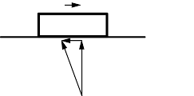
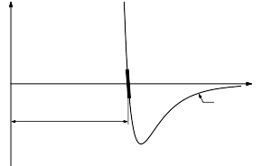

[up](top.md)

## 12 力の特徴

### 12-1 力とは何か？

物理法則を学ぶことは、自然を理解し利用するのに役立つというだけでも面白く価値のあることですが、たまには立ち止まって、"本当は何を意味しているのか "を考えてみるべきでしょう。文章の意味は、昔から哲学者が興味を持って悩んできたテーマですが、物理法則の意味はさらに興味深いものです。というのも、一般に物理法則はある種の本当の知識を表していると考えられているからです。知識の意味は哲学の深い問題であり、"What does it mean?" と問うことは常に重要です。

ここでは、「$F=ma$と書くニュートンの物理法則の意味は何か」と問いかけてみましょう。力、質量、加速度の意味とは？" と問いかけてみましょう。さて、質量の意味は直感的にわかりますし、加速度も位置と時間の意味がわかれば定義できます。ここでは、それらの意味については触れず、力という新しい概念に集中することにします。答えは同じように簡単です。"ある物体が加速しているならば、その物体には力が働いている」。ニュートンの法則ではそうなっています。ですから、想像しうる最も正確で美しい力の定義は、「力は物体の質量に加速度をかけたものである」ということだけかもしれません。すべての外力の合計がゼロであれば、運動量の保存が有効であるという法則があったとすると、"すべての外力の合計がゼロであるとはどういうことか "という疑問が生じます。その言葉を定義するには、楽しい方法があります。"全運動量が一定のとき、外力の総和はゼロになる。" それは何か間違っているはずです。なぜなら、それは何も新しいことを言っていないからです。力は質量に加速度をかけたものに等しい」という基本法則を発見したのに、「力は質量に加速度をかけたものである」と定義しても、何も発見していないことになります。また、「力」の定義として、「何の力も働いていない動く物体は、直線上を等速で動き続ける」とすることもできます。もし、ある物体が一定の速度で直線的に移動していないのを観察したら、その物体には何か力が働いていると言えるかもしれません。このようなものは、確かに物理学の内容ではありません。なぜならば、それは円を描く定義だからです。しかし、上記のニュートンの記述は、力の最も正確な定義であり、数学者には魅力的なもののように思われますが、定義からは何の予測もできないので、全く役に立たないのです。一日中、肘掛け椅子に座って、自由に言葉を定義することはできるかもしれませんが、2つのボールがお互いに押し合うとどうなるか、あるいは、重りがバネに吊るされるとどうなるかを調べることは、全く別の問題です。なぜなら、体がどのように振る舞うかは、定義の選択からは完全に外れているからです。

例えば、「放置された物体はその位置を保ち、動かない」とすると、何かが漂っているのを見たら、それは「ゴース」のせいだと言うことができます。「ゴース」とは位置の変化率のことです。ゴルチェとは、位置の変化率のことです。これで、ゴルチェが作用しているとき以外は、すべてが静止しているという、すばらしい新しい法則ができました。これは上記の力の定義と同じで、何の情報も含んでいません。ニュートンの法則の本当の内容はこうです。力は、法則$F=ma$に加えて、いくつかの独立した性質を持っているとされています。しかし、力が持つ特定の独立した性質は、ニュートンによっても他の誰によっても完全には記述されていませんでした。したがって、物理法則$F=ma$は不完全な法則なのです。それは、質量に加速度をかけたものを研究し、その積を力と呼ぶならば、つまり力の特性を興味のあるプログラムとして研究するならば、力にはある種の単純さがあることがわかるだろうということを意味しています。法則は自然を分析するための良いプログラムであり、それは力が単純になることを示唆しているのです。

さて、このような力の最初の例は、ニュートンが与えた完全な引力の法則であり、この法則を述べることで、"力とは何か？"という問いに答えています。重力以外に何もないのであれば、この法則と力の法則（運動の第2法則）の組み合わせで完全な理論となるのですが、重力以外にもいろいろなものがあり、ニュートンの法則をいろいろな場面で使いたいと考えています。そのためには、力の性質について説明しなければなりません。

例えば、力を扱う際には、何か物理的な物体が存在しない限り、力はゼロに等しいという暗黙の前提が常に存在しています。この仮定は、先に紹介した「ゴース」の場合とは全く異なります。力の最大の特徴は、物質的な起源を持っていることであり、これは単なる定義ではありません。

また、ニュートンは力について、「相互作用する物体間の力は等しく、反対の作用は反作用に等しい」という一つの法則を与えましたが、その法則は正確には正しくないことがわかりました。実際、$F=ma$の法則は正確には真ではありません。もしこれが定義であれば、常に正確に真であると言わなければなりませんが、そうではありません。

学生は、「私はこの不正確さが好きではありません。すべてを正確に定義してもらいたいのです。実際、いくつかの本には、あらゆる科学は正確なテーマであり、その中ですべてが定義されていると書かれています」と反論するかもしれません。力の正確な定義を主張しても、決して得られないでしょう。第一に、ニュートンの第二法則は正確ではないからです。第二に、物理法則を理解するためには、それらがすべてある種の近似値であることを理解しなければなりません。

どんな単純な考えも近似しています。例として、物体を考えてみましょう...物体とは何でしょうか？哲学者はいつも、「例えば、椅子を考えてみましょう」と言います。そう言った瞬間に、彼らは自分が何について話しているのか分からなくなってしまうのです。椅子とは何か？まあ、椅子はあそこにある確かなものです......確かなもの、どのように確かなものですか？だから、椅子を正確に定義すること、つまり、どの原子が椅子で、どの原子が空気で、どの原子が汚れで、どの原子が椅子に属する塗料であるかを正確に言うことは不可能なのです。ですから、椅子の質量はおおよそしか定義できません。同じように、単一の物体の質量を定義することは不可能です。なぜなら、世界には単一のままの物体は存在せず、すべての物体は多くのものの混合物であるため、近似値と理想化の積み重ねとしてのみ扱うことができるからです。

厄介なのは、理想化です。椅子の中の原子の数は、おそらく10^10分の1という優れた近似値では、1分間に変化することはありませんが、正確すぎなければ、椅子を明確なものとして理想化することができます。物理学が得ようとする自然についての近似的な見方（その試みは常に近似の精度を高めることである）に不満を持ち、数学的な定義を好むかもしれないが、数学的な定義は現実の世界では決して機能しない。数学的な定義は、すべての論理を完全に貫くことができる数学には適していますが、海の波やワイングラスなどの例で示したように、物理的な世界は複雑です。しかし、海の波やワイングラスなどの例で示したように、物理的な世界は複雑です。海の波やワイングラスなどの例で示したように、物理的な世界は複雑です。一つのものにかかる力は、すでに近似性を含んでいます。現実の世界について語るシステムがあるとすれば、そのシステムは、少なくとも今日においては、ある種の近似性を含んでいなければなりません。

このシステムは、すべてが定義できる数学の場合とはまったく異なり、何について話しているのかわからなくなります。実際、数学の栄光は、我々が何について話しているのかを言う必要がないことです。その栄光とは、法則、議論、論理が「それ」が何であるかに依存しないことです。ユークリッドの幾何学と同じ公理系に従う他の対象があれば、新しい定義をして正しい論理で追えば、すべての結果は正しいものとなり、対象が何であったかは関係ありません。しかし、自然界では、測量のように光線とセオドライトを使って線を引いたり、線を確定したりする場合、ユークリッドの意味での線を測っているのでしょうか。クロスヘアにはある程度の幅がありますが、幾何学的な線には幅がありません。したがって、ユークリッド幾何学が測量に使えるかどうかは、数学的な問題ではなく、物理的な問題なのです。しかし、数学的な観点ではなく、実験的な観点から、ユークリッドの法則が、私たちが土地を測るのに使っている種類の幾何学に適用されるかどうかを知る必要があります。そこで、適用されるという仮説を立て、それはかなりうまくいきましたが、正確ではありません。実際には抽象的なユークリッドの線が、経験の線に当てはまるかどうかは、経験の問題であり、純粋な理性で答えられる問題ではありません。

同じように、$F=ma$を定義と呼び、すべてを純粋に数学的に推論して、力学を数学理論とすることはできません。ユークリッドが行ったように、適切な仮定を設定することで、数学の体系を作ることは常に可能ですが、世界の数学を作ることはできません。なぜなら、遅かれ早かれ、公理が自然の対象に対して有効かどうかを調べなければならないからです。しかし、ユークリッドのように数学の体系を作ることはできても、世界の数学を作ることはできません。

### 12-2 摩擦

以上の考察から、ニュートンの法則を正しく理解するためには、力についての議論が必要であることがわかりました。本章では、ニュートンの法則の一種の完成形として、そのような議論を紹介することを目的としています。私たちはすでに加速度の定義とそれに関連する考え方を勉強しましたが、今度は力の特性を勉強しなければなりません。力は非常に複雑なので、この章ではこれまでの章とは異なり、あまり正確な説明はしません。

まず、ある特定の力について、空中を飛ぶ飛行機の抗力を考えてみましょう。その力にはどんな法則があるのでしょうか？きっとどんな力にも法則があるに違いない！）その力の法則が単純であるとは考えられません。翼の上を駆け抜ける空気、後ろで渦を巻く空気、胴体の周りの変化など、空中を飛ぶ飛行機の抵抗を想像してみると、単純な法則があるわけではないことがわかります。その一方で、飛行機の抗力がほぼ一定で速度の二乗、すなわち$F≈cv^2$であることは注目すべき事実です。

さて、このような法則はどのような位置づけにあるのでしょうか。$F=ma$と似ているのでしょうか。そうではありません。そもそもこの法則は、風洞でのテストによって大まかに得られる経験的なものだからです。あなたは、「$F=ma$も経験的なものかもしれない」と言います。違いがあるのはそのためではありません。違いは、経験的であることではなく、私たちが自然を理解する上で、この法則は非常に複雑な事象の結果であり、根本的に単純なものではないということです。もっともっと研究し、もっともっと正確に測定していけば、この法則は小さくなるどころか、ますます複雑になっていくでしょう。つまり、この飛行機の抗力の法則をどんどん研究していくと、「偽物」であることがわかり、深く研究すればするほど、正確に測れば測るほど、真実は複雑になっていくので、その意味では、単純で根本的なプロセスから生じたものではないと考えられ、当初の推測と一致しています。例えば、空気中をゆっくりと引きずられるように、普通の飛行機が飛んでいないような極端に低い速度の場合は、法則が変わり、引きずり摩擦は速度にほぼ線形に依存するようになります。別の例を挙げると、ボールや泡など、ハチミツのような粘性のある液体の中をゆっくりと動くものの摩擦抵抗は速度に比例しますが、液体が渦を巻くような高速の動き（ハチミツはそうではありませんが、水や空気はそうです）では、摩擦抵抗は速度の二乗にほぼ比例し（$F=cv^2$）、速度が上がり続けると、この法則さえも破綻し始めます。係数が少し変わるだけだ」と言う人は、問題から逃げているのです。次に、この飛行機にかかる力を、翼にかかる力、前部にかかる力などと分割して分析することができるのか、という大きな問題があります。確かに、あちこちのトルクを気にするのであれば可能ですが、そうすると翼にかかる力などには特別な法則が必要になります。言い換えれば、飛行機を分解して片方の翼だけを空中に置いても、残りの部分がある場合と同じ力は得られないということです。理由はもちろん、正面に当たった風の一部が翼に回り込み、翼にかかる力が変わるからです。このような単純で大雑把な経験則が飛行機の設計に使えるというのは奇跡的なことのように思えますが、この法則は物理学の基本法則と同じクラスのものではなく、これ以上研究してもどんどん複雑になっていくだけです。係数$c$が飛行機の前部の形状によってどのように変化するかの研究は、控えめに言ってもフラストレーションが溜まります。飛行機の形で係数を決める単純な法則がないのです。これに対して、重力の法則は単純で、調べれば調べるほどその単純さがわかる。

先ほど、空気中の速い動きと蜂蜜中の遅い動きの2つの摩擦について説明しました。摩擦にはもう1つ、固体が固体の上を滑るときに起こる「乾き摩擦」や「滑り摩擦」と呼ばれるものがあります。この場合、動きを維持するための力が必要になります。これを「摩擦力」といいますが、その起源も非常に複雑なものです。両者の接触面は、原子レベルでは不規則です。原子同士がくっついているように見える接触点がたくさんあって、滑っている体が引っ張られると原子がバラバラになって振動する、そんなことが起こるはずなんです。従来、この摩擦のメカニズムは、表面に凹凸があるだけで、その凹凸をスライダーが乗り越えることで摩擦が発生するという、非常に単純なものだと考えられていましたが、実際には電力が消費されているのに、その過程ではエネルギーが失われていないからです。電力損失のメカニズムは、スライダーが段差を乗り越える際に、段差が変形し、2つの体に波や原子運動が発生し、しばらくすると熱が発生するというものです。ここで非常に注目すべきことは、やはり経験的に、この摩擦が単純な法則でおおよそ説明できるということです。この法則とは、摩擦に打ち勝ち、ある物体を別の物体に引き寄せるために必要な力は、接触している2つの表面の間の法線方向の力（すなわち、表面に垂直な方向の力）に依存するというものです。実際には、かなり良い近似値として、摩擦力はこの法線力に比例し、多かれ少なかれ一定の係数を持つことになります。

$$F=μN, \tag{12.1}$$

ここで、$μ$は摩擦係数と呼ばれています（図12-1）。この係数は厳密には一定ではありませんが、実用上、あるいは工学上、必要とされる力の大きさをおおよそ判断するのに適した経験則といえます。法線方向の力や運動速度が大きくなりすぎると、熱が発生しすぎて法則は破綻します。これらの経験則にはそれぞれ限界があり、それを超えると実際には機能しないことを認識することが重要です。

図12-1. 摺動接触における摩擦力と法線力の関係。

$F=μN$という式がほぼ正しいことは、簡単な実験で証明できます。小さな角度$θ$で傾いた平面を用意し、その上に重さ$W$のブロックを置きます。そして、ブロックが自重で滑り始めるまで、平面をさらに急な角度で傾けます。平面に沿って下向きの重さの成分は$W \sin θ$であり、これはブロックが均一に滑っているときの摩擦力$F$に等しいはずです。平面に垂直な方向への重さの成分は$W \cos θ$ で、これが法線力$N$です。これらの値から、式は$W \sin θ=μW \cos θ$となり、$μ= \sin θ/ \cos θ=  \tan θ$が得られます。この法則が正確に成り立つならば、物体はある一定の傾きで滑り始めることになります。同じブロックに余分な重量をかけて負荷をかけると、$W$は増加しますが、式中のすべての力は同じ割合で増加し、$W$は相殺されます。$μ$が一定であれば、荷重をかけたブロックは再び同じ傾きで滑ることになります。元の重さで試行して角度$θ$を決めると、重さが大きいほどほぼ同じ角度で滑ることがわかります。これは一方の重さが他方の重さの何倍になっても同じで、摩擦係数は重さに依存しないという結論になります。

この実験をしていて気がついたのですが、飛行機を正しい角度$θ$だけ傾けたとき、ブロックは安定して滑らず、止まったような状態になってしまいます。ある場所では止まり、ある場所では加速しながら移動する。この挙動は、摩擦係数がほぼ一定であり、平面の場所によって異なることを示している。荷重がかかっていてもいなくても、同じような不安定な挙動が見られる。このような変化は、平面の滑らかさや硬さの違い、さらには汚れや酸化物などの異物が原因である。鉄と鉄」「銅と銅」などの$μ$の値を記載した表は、$μ$を決定する上記の要因を無視しているので、すべて誤りです。摩擦は決して「銅と銅」などではなく、銅に付着している不純物によるものなのです。

上述のような実験では、摩擦は速度にほとんど依存しない。多くの人は、物を動かすために必要な摩擦（静摩擦）が、物を滑らせるために必要な力（滑り摩擦）よりも大きいと考えていますが、乾いた金属ではその違いを示すことは非常に困難です。小さな油や潤滑剤があったり、ブロックなどをバネなどの柔軟な支えで支えていると、結合しているように見えるという経験から、このような意見が生まれたのでしょう。

摩擦の定量的な実験を正確に行うことは非常に難しく、摩擦の法則を正確に解析することの工学的価値は非常に高いにもかかわらず、未だにあまり解析されていません。$F=μN$という法則は、表面を標準化すればかなり正確になりますが、なぜこのような形の法則になるのかはよくわかっていません。係数$μ$が速度にほぼ依存しないことを示すには、微妙な実験が必要である。なぜなら、下面が非常に速く振動すると、見かけの摩擦が大幅に減少するからである。高速で実験する場合、物体が相対的に振動しないように注意しなければならない。高速での見かけ上の摩擦の減少はしばしば振動によるものだからだ。いずれにしても、この摩擦法則は半経験的な法則の一つであり、十分に理解されていない。現在では、2つの物質間の摩擦係数を見積もることさえできないのです。

銅のような純粋な物質と銅を摺り合わせて$μ$を測定しようとすると、接触面が純粋な銅ではなく、酸化物やその他の不純物が混ざっているため、誤った結果になることは前述の通りです。絶対に純粋な銅を得ようとして、表面をきれいに磨いたり、真空中でガスを出したり、考えられる限りの注意を払っても、$μ$は得られません。装置を垂直に傾けても、スライダーは落ちず、2枚の銅がくっついてしまうのだ。通常、適度な硬さの表面では1よりも小さい係数$μ$が、1の数倍になってしまうのです。これは、接触している原子がすべて同じ種類のものである場合には、原子が自分たちが別々の銅の中にいることを「知る」方法がないからです。しかし、その間に酸化物やグリース、さらに複雑な薄い表面層の汚れなど、他の原子があると、原子は自分が同じ部品にいないことを「知る」のです。銅が固体としてまとまっているのは原子間の力であることを考えると、純粋な金属で正しい摩擦係数を得ることは不可能であることがわかるはずだ。

同じような現象は、平らなガラス板とガラスのタンブラーを使った簡単な手作り実験でも観察できます。ガラス板の上にタンブラーを置き、ひもで引っ張ると、かなりよく滑り、少し不規則ですが、摩擦係数を感じることができます。ガラス板とタンブラーの底を濡らして、もう一度引っ張ってみると、結合していることがわかります。よく見ると、傷がついています。これは、水が油脂やその他の汚染物質を表面から浮き上がらせることができるからで、実際にガラスとガラスが接触しているのです。この接触が非常に良いので、しっかりと保持され、ガラスが引き裂かれるほど分離に抵抗します。

### 12-3 分子の力

図12-2. 2つの原子の間に働く力を分離距離の関数として表したもの。

次に、分子力の特徴について説明します。分子力とは、原子間の力であり、摩擦の究極の起源である。分子力は、古典物理学では満足に説明できません。完全に理解するには量子力学が必要です。しかし、経験的には、原子間の力は、図12-2のように模式的に示されています。ここでは、2つの原子間の力$F$を、原子間の距離$r$の関数としてプロットしています。様々なケースがあります。 例えば、水分子の場合、負電荷は酸素の上に多く乗っており、負電荷の平均位置と正電荷の平均位置は同一点ではない。そのため、近くにある別の分子は比較的大きな力を感じ、これを双極子-双極子力と呼びます。しかし、多くの系では電荷のバランスが非常によく、特に酸素ガスは完全な対称性を持っています。この場合、マイナスの電荷とプラスの電荷が分子内に分散しているが、マイナスの電荷の中心とプラスの電荷の中心が一致するように分布している。電荷の中心が一致しない分子を極性分子と呼び、電荷に中心間の距離をかけたものを双極子モーメントと呼ぶ。また、電荷の中心が一致している分子を無極性分子という。すべての無極性分子では、すべての電気力が中和されている。それにもかかわらず、非常に大きな距離での力は引力であり、距離の7乗に反比例して変化することがわかった。$F=k/r^7$、$k$は分子に依存する定数である。なぜこのようになるのかは、量子力学を学んだときに初めてわかることです。双極子があると、力は大きくなります。原子や分子が近づきすぎると、非常に大きな反発力で反発します。これが、私たちが床から落ちないようにする理由です。

これらの分子力は、かなり直接的な方法で示すことができます。その1つが、スライドするガラスのタンブラーを使った摩擦実験です。もう1つは、非常に注意深く研磨され、ラップされた、非常に正確に平らな2つの面を用意し、その面を非常に近づけることです。例えば、機械工場で長さを正確に測るための基準として使われるヨハンソンブロックがその例です。このようなブロックを慎重に重ね合わせ、上のブロックを持ち上げると、もう一方のブロックも分子の力でくっついて持ち上がり、一方のブロックの原子がもう一方のブロックの原子に直接引き寄せられることを示しています。

とはいえ、これらの分子引力は、重力が基本であるような意味での基本ではなく、1つの分子に含まれるすべての電子と原子核が、別の分子に含まれるすべての電子と原子核との膨大で複雑な相互作用に起因するものです。どんなに簡単そうな式も、複雑さの総和ですから、根本的な現象はまだつかめていないのです。

分子の力は、図12-2のように、大きな距離では引き合い、短い距離では反発するので、すべての原子が引き合いで結ばれ、近すぎると反発して離れていくような固体を作ることができます。ある距離$d$（図12-2のグラフが軸と交差する位置）では、力がゼロ、つまりすべての力が均衡しているので、分子はその距離だけ離れていることになります。分子を距離$d$よりも近づけると、グラフの$r$軸より上の部分で表されるように、すべての分子が反発します。分子をわずかに引き離すと、わずかな引力が生じ、その引力は距離の増加とともに大きくなる。分子をわずかに引き離すと、わずかな引力が働くが、その引力は引き離した距離が大きくなるにつれて大きくなる。十分に強く引き離すと、分子は永久に離れてしまう。

分子を$d$よりもごくわずかな距離だけ近づけたり、ごくわずかな距離だけ遠ざけたりすると、図12-2の曲線に沿った対応する距離もごくわずかになり、直線で近似することができます。したがって、多くの場合、変位が大きすぎなければ、力は変位に比例します。この原理は、フックの法則、あるいは弾性の法則と呼ばれ、体が歪んだときに元の状態に戻そうとする力は、その歪みに比例するというものです。もちろん、この法則が成り立つのは、歪みが比較的小さい場合で、大きくなると、歪みの種類に応じて、体が引き裂かれたり、押しつぶされたりする。フックの法則が成り立つ力の大きさは素材によって異なり、例えば生地やパテの場合は非常に小さな力ですが、鉄の場合は比較的大きな力となります。フックの法則は、鉄でできた長いコイルばねを垂直に吊るした状態で、きれいに示すことができます。バネの下端に適当な重りをぶら下げておくと、線材の長さ全体に小さなねじれが生じます。その結果、1回の回転で小さな垂直方向のたわみが生じ、回転数が多ければ大きな変位になります。例えば、100グラムの重りが生み出す全伸びを測定すると、さらに100グラムの重りを追加すると、それぞれ最初の100グラムで測定された伸びとほぼ等しい追加の伸びが生じることがわかります。このように力と変位の比率が一定になるのは、ばねに過負荷がかかったとき、つまりフックの法則が成り立たなくなったときからである。

[up](top.md)
