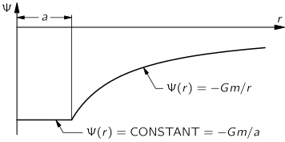

[up](top.md)

## 14 仕事と位置エネルギー(結論)

### 14-1 仕事

前の章では、物理学の中心的な役割を果たす非常に多くの新しいアイデアや結果を紹介しました。これらのアイデアは非常に重要なものなので、1章を割いてじっくりと検討する価値があると思われます。本章では、結果を得るための「証明」や具体的なトリックを繰り返すのではなく、アイデアそのものを議論することに専念したいと思います。

数学が重要な役割を果たしている技術分野の学習では、膨大な数の事実や考え方を、それらの間に存在することが「証明」または「示される」一定の関係によって理解し、記憶にとどめておくという作業に直面しています。証明そのものと、それによって確立される関係とを混同するのは簡単なことです。明らかに、学ぶべきこと、覚えるべきことは、証明ではなく、関係性です。どのような状況においても、「このようなことが真実であることが示される」と言うことができるか、それを示すことができるかのどちらかです。ほとんどの場合、使用される特定の証明は、まず、黒板や紙に素早く簡単に書けるような形で、できるだけ滑らかに見えるように作られています。その結果、証明は一見簡単そうに見えますが、実際には、著者は何時間もかけて同じことを計算するさまざまな方法を試し、最もすっきりした方法を見つけて、それを最短時間で示すことができるようにしているのです。証明を見るときに忘れてはならないのは、証明そのものではなく、「こういうことが真であることが示される」ということです。もちろん，その証明に見たこともないような数学的な手続きや「トリック」が含まれている場合には，そのトリックではなく，数学的な考え方に注目する必要があります。

このようなコースで行われるすべてのデモンストレーションの中で、著者が新入生の物理学を学んだ時のことを覚えているものは一つもないことは確かです。その逆である。それどころか、「こういうことが言える」ということを覚えているだけで、それがどうやって示されるのかを説明するために、必要なときに実演を考案するのである。本当に学んだ人であれば、同じような手順を踏むことができるはずですが、証明を覚えていても仕方がありません。だからこそ、この章では、これまでに述べた様々な記述の証明を避け、結果をまとめるだけにしておこう。

最初に消化しなければならない考え方は、力によって行われる仕事です。仕事」という物理的な言葉は、「世界の労働者は団結せよ！」という普通の意味での言葉ではなく、別の考え方です。物理的な仕事は、「$F$ ドット $ds$の線積分」と呼ばれる$∫\bm{F}・d\bm{s}$で表されますが、これは、例えば力がある方向にあって、その力が働いている物体がある方向に変位した場合、変位した方向の力の成分だけが仕事をする、ということです。例えば、力が一定で、変位が有限の距離$Δ\bm{s}$であったとすると、物体をその距離だけ移動させるときの仕事は、$Δ\bm{s}$に沿った力の成分を$Δ\bm{s}$倍したものだけである。ルールは「力×距離」ですが、実際には変位方向の力の成分に$Δ\bm{s}$をかけたもの、つまり力の方向の変位の成分に$F$をかけたものを意味します。変位に直角な力では、何の仕事もしないことは明らかである。

今、ベクトル変位$Δ\bm{s}$を成分に分解すると、つまり、実際の変位が$Δ\bm{s}$であり、それを$x$方向の変位$Δx$、$y$方向の変位$Δy$、$z$方向の変位$Δz$の成分として事実上考えたいとすると、物体をある場所から別の場所に運ぶ際に行われる仕事は、$x$に沿って行われる仕事、$y$に沿って行われる仕事、$z$に沿って行われる仕事の3つに分けて計算することができます。$x$に沿って進むときの仕事には、力の成分$F_x$だけが含まれるので、仕事は$F_xΔx+F_yΔy+F_zΔz$となります。力が一定ではなく、複雑な曲線運動をする場合は、経路をたくさんの小さな$Δ\bm{s}$に分解し、それぞれの$Δ\bm{s}$に沿って物体を運ぶための仕事を加え、$Δ\bm{s}$がゼロになるときに限界を取る必要があります。これが "線積分 "の意味です。

今言ったことはすべて、$W=∫\bm{F}・d\bm{s}$という式に含まれています。素晴らしい式だと言うのはいいのですが、その意味や結果を理解するのは別のことです。

物理学における「仕事」という言葉は、普通に使われている言葉の意味とはあまりにも違うので、同じではないように見える特殊な状況があることを注意深く観察しなければなりません。例えば、物理学的な仕事の定義によれば、100ポンドの重りを地面から離してしばらく持っていても、仕事をしているわけではありません。しかし、誰もが知っているように、階段を駆け上がるように汗をかき、体を震わせ、息を荒くします。しかし、階段を駆け上がることは仕事をしていると考えられますが（物理学的には、階段を駆け下りることで、世界から仕事を得ている）、単に物体を固定しているだけでは、仕事をしていないことになります。明らかに、仕事の物理的な定義は、生理学的な定義とは異なります。

重りを持つと「生理的な」仕事をしなければならないのは事実です。なぜ汗をかかなければならないのか？なぜ重さを支えるために食べ物を摂取しなければならないのか。なぜ、重りを支えるためだけに、体内の機械がフルスロットルで動いているのか？実際には、テーブルの上に重りを置くだけで、何の努力もせずに重りを支えることができます。そして、テーブルは静かに、穏やかに、何のエネルギーも供給せずに、同じ高さで同じ重さを維持することができるのです。生理的状況は次のようなものです。人間や他の動物には2種類の筋肉があります。1つは筋骨格と呼ばれるもので、私たちが腕などに持っている筋肉で、自発的に制御されています。もう1つは平滑筋と呼ばれるもので、腸の筋肉や、アサリでは貝殻を閉じる大内転筋のようなものです。平滑筋の働きは非常にゆっくりしていますが、"セット "を維持することができます。つまり、貝がある位置で殻を閉じようとすると、それを変えようとする大きな力があっても、その位置を維持することができるのです。つまり、貝がある位置で殻を閉じようとすると、それを変えようとする大きな力があっても、その位置を保持するのです。負荷がかかった状態で何時間も疲れずに位置を保持できるのは、テーブルが重りを支えるのと同じで、ある位置に「セット」され、分子が一時的にそこに固定されるだけで、貝には何の働きもなく、力も発生しません。私たちが重りを支えるために努力しなければならないのは、単純に筋骨格のデザインによるものです。何かを支えるときには、膨大な量の神経インパルスが筋肉に流れ込み、大量の痙攣が重さを維持し、他の繊維はリラックスしているのです。重いものを持って疲れてくると、体が震えてくるのがわかります。これは、不規則に来るボレーのために、筋肉が疲れてしまい、反応が遅くなっているからです。なぜこのような効率の悪い仕組みになっているのか？正確な理由はわかりませんが、進化の過程で高速な平滑筋を発達させることができなかったのです。平滑筋であれば、立っているだけで固定されるので、重りを支えるのに非常に有効です。平滑筋であれば、立っているだけで固定されるので、仕事をしなくてもエネルギーを必要としません。しかし、平滑筋は動作が非常に遅いという欠点があります。

さて、話を物理学に戻すと、「なぜ仕事の量を計算したいのか」という疑問が出てきます。なぜなら、粒子に働くすべての力の結果として粒子にかかる仕事は、その粒子の運動エネルギーの変化とまったく同じだからです。つまり、物体が押されている場合、その物体は速度を増していき
$$Δ(v^2)=\dfrac{2}{m}\bm{F}・Δ\bm{s}.$$

### 14-2 制約された運動

力と仕事のもう一つの興味深い特徴は、傾斜した、あるいは湾曲した線路があり、その線路に沿って摩擦なしに移動しなければならない粒子があるとします。また、ひもとおもりが付いた振り子があり、ひもによっておもりが支点を中心に円を描くように拘束されています。紐をペグに当てることで支点を変え、重りの軌道を半径の異なる2つの円に沿わせることができます。これらは、固定された摩擦のない制約と呼ばれる例です。

摩擦のない固定された制約のある運動では、制約の力が常に運動と直角になるため、制約による仕事はありません。拘束力」とは、軌道との接触力や弦の張力など、拘束力そのものによって物体に直接加わる力のことです。

重力の影響を受けて動く斜面上の粒子の運動には、拘束力や重力などがあり、非常に複雑な力が働いています。しかし、エネルギー保存と引力だけで運動を計算すると、正しい結果が得られます。厳密には結果の力を使うべきで、正しい方法ではないので、これはかなり奇妙に思えます。とはいえ、重力の拘束部分の仕事はゼロなので、重力だけの仕事が運動エネルギーの変化となります（図14-1）。

図14-1. 摺動体に働く力（摩擦なし）。

ここで重要なのは、ある力が2つ以上の「ピース」の合計として分析できる場合、ある曲線に沿って進む際に結果として生じる力が行う仕事は、その力が分析された様々な「コンポーネント」の力が行う仕事の合計であるということです。このように、力をいくつかの効果、重力＋拘束力などのベクトル和、あるいはすべての力の$x$成分、$y$成分など、好きなように分割して分析すると、正味の力が行う仕事は、分析を行う際に力を分割したすべての部分が行う仕事の合計に等しくなります。

### 14-3 保存的な力

自然界には、例えば重力のように、「保守的」と呼ばれる非常に顕著な性質を持つ力があります（政治的な考えは関係ありません、これも「おかしな言葉」の一つです）。ある物体をある曲線に沿ってある地点から別の地点に移動させる際に、力によってどれだけの仕事がなされるかを計算すると、一般的には仕事は曲線に依存しますが、特殊な場合には依存しません。曲線に依存しない場合、その力は保存的な力であると言います。つまり、図14-2の1の位置から2の位置に行くまでの距離に力の積分をかけたものを、曲線$A$に沿って計算し、次に曲線$B$に沿って計算すると、同じ数のジュールが得られ、これがすべての曲線上のこの2つの点に当てはまり、どの2つの点を使っても同じ命題が成り立つならば、その力は保存的であると言います。このような状況では、1から2までの仕事の積分を簡単な方法で評価することができ、その結果を式で表すことができます。通常は曲線も指定しなければならないので、これほど簡単ではありませんが、仕事が曲線に依存しない場合には、当然、仕事は1と2の位置にのみ依存します。

図14-2. 力の場における2点間の可能な経路。

この考え方を示すために、次のようなことを考えてみましょう。任意の場所に「標準」の点$P$をとります（図14-2）。すると、計算したい1から2までの仕事の線積分は、1から$P$に行くときにかかった仕事と、$P$から2に行くときにかかった仕事を足したものと評価できます。なぜなら、力は保存的であり、仕事は曲線に依存しないからです。さて、$P$の位置から空間の特定の位置に行くときに行われる仕事は、空間のその位置の関数です。もちろん、実際には$P$にも依存しますが、分析のために任意の点$P$を恒久的に固定します。そうすると、点$P$から点2に行くときに行われる仕事は、2の最終的な位置の何らかの関数となります。それは2がどこにあるかに依存しており、他の点に行くと異なる答えが得られます。

この位置の関数を$-U(x,y,z)$と呼び、座標が$(x2,y2,z2)$であるあるある特定の点2を指したいときは、$U(x_2,y_2,z_2)$の省略形として$U(2)$と書くことにします。また、点1から点$P$に行くときにかかる仕事は、積分に沿って逆に進み、すべての$d\bm{s}$を逆にしても書くことができる。つまり、1から$P$に行くときにかかる仕事は、点$P$から1に行くときにかかる仕事を差し引いたものになります。

$$∫^P_1\bm{F}・d\bm{s}=∫^1_P\bm{F}・(-d\bm{s})=-∫^1_P\bm{F}・d\bm{s}.$$

したがって、$P$から1へ行くときの仕事は$-U(1)$であり、$P$から2へ行くときの仕事は$-U(2)$である。したがって、1から2への積分は、$-U(2)$に\[$-U(1)$を逆にしたもの\]を加えたもの、つまり$+U(1)-U(2)$に等しい。

$$U(1)=-∫^1_P\bm{F}・d\bm{s}, \ \ U(2)=-∫^2_P\bm{F}・d\bm{s},$$
$$∫^2_1\bm{F}・d\bm{s}=U(1)-U(2)。 \tag{14.1}$$

量$U(1)-U(2)$を位置エネルギーの変化と呼び、$U$を位置エネルギーと呼ぶことにする。物体が位置2にあるときは位置エネルギー$U(2)$を持ち、位置1にあるときは位置エネルギー$U(1)$を持っているとする。また、$P$の位置にある場合は、位置エネルギーはゼロです。もし、$P$の代わりに他の点、例えば$Q$を使ったとしたら、定数を加えるだけで位置エネルギーが変わることがわかります（実証は皆さんにお任せします）。エネルギーの保存は変化にのみ依存するので、位置エネルギーに定数を加えても問題はないのです。したがって、点$P$は任意である。

さて、次の2つの命題があります。(1)力による仕事は、粒子の運動エネルギーの変化に等しいが、(2)数学的には、保存的な力の場合、仕事は関数$U$（これを位置エネルギーと呼ぶ）の変化を差し引いたものになる。この2つの結果として、「保存的な力だけが作用する場合、運動エネルギー$T$と位置エネルギー$U$は一定である」という命題にたどり着きます。

$$T+U=constant. \tag{14.2}$$

ここで、いくつかのケースでの位置エネルギーの公式について説明します。重力場が一様である場合、地球の半径に匹敵する高さに行かない場合、力は一定の垂直方向の力であり、行われる仕事は単に力に垂直方向の距離をかけたものであると考えられる。したがって

$$U(z)=mgz, \tag{14.3}$$

となり、位置エネルギーがゼロになる点$P$は、たまたま平面$z=0$の任意の点となります。その気になれば、位置エネルギーは$mg(z-6)$であると言うこともできましたが、$z=0$での位置エネルギーの値が$-6mg$であることを除けば、結果はもちろん私たちの分析と同じになります。これは、位置エネルギーの違いだけが重要であるため、違いはありません。

線状のバネを平衡点から距離$x$だけ圧縮するのに必要なエネルギーは

$$U(x)=\frac{1}{2}kx^2, \tag{14.4}$$

であり、位置エネルギーのゼロは点$x=0$、つまりバネの平衡位置にあります。ここでも、任意の定数を加えることができます。

点状の質量$M$と$$mが距離$r$離れている場合の重力の位置エネルギーは

$$U(r)=-GMm/r. \tag{14.5}$$

ここでは、無限遠でポテンシャルがゼロになるように定数を選んでいます。もちろん、電荷についても同じ法則なので、同じ式が適用されます。

$$U(r)=q_1q_2/4πϵ_0r. \tag{14.6}$$

では、実際にこれらの公式を使って、その意味を理解しているかどうかを確認してみましょう。質問です。ロケットを地球から離すためには、どのくらいの速さで発射すればよいでしょうか？解答 運動エネルギーと位置エネルギーは一定でなければなりません。「離れる」ときには何百万マイルも離れていますが、ぎりぎり離れられるということは、外では速度ゼロでぎりぎり動いていると考えてよいでしょう。地球の半径を$a$とし、質量を$M$とします。すると、運動エネルギーと位置エネルギーは、最初は$\frac{1}{2}mv^2-GmM/a$で与えられます。運動終了時には、この2つのエネルギーは等しくなければなりません。運動エネルギーは運動終了時にゼロとされています。これは、本質的にゼロの速度でギリギリまで漂っていると考えられるからです。また、位置エネルギーは$GmM$を無限大で割ったもので、ゼロとなります。つまり、片側はすべてゼロで、速度の二乗は$2GM/a$でなければならないということになります。しかし、$GM/a^2$は私たちが重力加速度と呼んでいるもので、$g$となります。

$$v^2=2ga。$$

人工衛星が地球の周りを回り続けるためには、どのくらいの速度で移動しなければならないのでしょうか？これは昔、計算してみて、$v^2=GM/a$とわかりました。ですから、地球から離れるためには、地球の表面近くを一周するときの$\sqrt{2}$倍の速度が必要になります。言い換えれば、地球から離れるためには、地球の周りを回るときの2倍のエネルギーが必要なのです（エネルギーは速度の2乗に比例するため）。そのため、歴史的に衛星を使って行われてきたのは、まず地球を一周させることであり、そのためには秒速5マイルの速度が必要だった。次に、人工衛星を地球から永久に遠ざけるためには、2倍のエネルギー、つまり秒速7マイルが必要でした。

さて、位置エネルギーの特徴の話の続きとして、2つの分子、あるいは2つの原子、例えば2つの酸素原子の相互作用を考えてみましょう。2つの分子が非常に離れている場合、その力は距離の逆7乗で変化する引力となり、非常に近づいている場合は非常に大きな斥力となります。逆7乗を積分して働いた量を求めると、位置エネルギー$U$, は、2つの酸素原子間の半径方向の距離の関数であり、距離が大きい場合は距離の逆6乗として変化します。

図14-3. 2つの原子の間の位置エネルギーを、原子間の距離の関数として表したもの。

位置エネルギー$U(r)$の曲線を図14-3のようにスケッチすると、このように$r$が大きいところでは逆6乗でスタートしますが、十分に近づくと、位置エネルギーが最小となる点$d$に到達します。$r=d$で位置エネルギーが最小になるということは、次のようなことを意味しています。$d$から出発して、小さな距離、つまり非常に小さな距離を移動した場合、この距離を移動したときの位置エネルギーの変化である仕事量は、曲線の下端では位置エネルギーの変化がほとんどないので、ほぼゼロになります。したがって、この点には力がないので、そこが平衡点となります。この点が平衡点であることを示す別の方法は、$d$からどちらかの方向に遠ざかるには仕事が必要であるということです。2つの酸素原子が落ち着き、2つの原子間の力からこれ以上エネルギーが解放されないようになると、エネルギーが最も低い状態になり、この離隔$d$になります。これは、酸素分子が冷えているときの状態です。熱すると原子が揺れて離れていき、実際にはバラバラにすることができますが、そのためにはある程度の仕事やエネルギーが必要で、それが$r=d$と$r=∞$の間の位置エネルギー差となります。原子を非常に近づけようとすると、原子同士が反発し合うため、エネルギーは非常に急激に上昇する。

なぜこのような話をしたかというと、力という考え方は量子力学にはあまり適しておらず、エネルギーという考え方が最も自然だからです。核物質間や分子間などのより高度な力を考えると、力や速度は「溶解」して消えてしまいますが、エネルギーの概念は残っていることがわかります。そのため、量子力学の本には位置エネルギーの曲線が載っていますが、2つの分子間の力の曲線が載っていることはほとんどありません。

次に、ある物体に複数の保存的な力が同時に作用している場合、その物体の位置エネルギーは、それぞれの力の位置エネルギーの総和であることに注目します。これは前に述べた命題と同じで、力が力のベクトル和として表現できるならば、全体の力によってなされる仕事は部分的な力によってなされる仕事の和であり、したがってそれはそれぞれ別々の力のポテンシャル・エネルギーの変化として分析することができるからです。したがって、全体の位置エネルギーは、すべての小さな力の合計となります。

これを一般化すると、木星、土星、天王星など、あるいは酸素、窒素、炭素などのように、互いに作用し合う多くの物体が、すべてが保存的な力のために対になって作用している系の場合になります。このような状況では、システム全体の運動エネルギーは、単に特定の原子や惑星などの運動エネルギーの合計であり、システムの位置エネルギーは、他の粒子が存在しないかのように、1つのペアの相互作用の位置エネルギーを、粒子のペアに渡って合計したものです。これは分子力には当てはまらず、式もやや複雑です。しかし、ニュートン重力には確かに当てはまり、分子力には近似的に当てはまります。分子力には位置エネルギーがありますが、それは単にペアの項の合計ではなく、原子の位置のより複雑な関数であることがあります）。したがって、重力の特殊なケースでは、式(13.14)で示したように、位置エネルギーは、$i$と$j$のすべてのペアの$-Gm_im_j/r_{ij}$の和になります。式（13.14）は、「運動エネルギーの総和と位置エネルギーの総和は、時間とともに変化しない」という命題を数学的に表現したものです。様々な惑星が回転したり、ねじれたりしても、運動エネルギーの総和と位置エネルギーの総和を計算すると、その総和は一定であることがわかります。

### 14-4 非保存的な力

保守的な力についてはかなりの時間をかけて議論してきましたが、非保守的な力についてはどうでしょうか？ここでは、通常よりも深く考えて、「非保守的な力は存在しない」と断言します。実のところ、自然界の基本的な力はすべて保守的であるように見えます。これは、ニュートンの法則の結果ではありません。実際、ニュートン自身が知っている限りでは、摩擦が明らかにそうであるように、力は非保存的である可能性があります。摩擦があるように見える」というのは、現代的な見方で、深層の力、つまり最も基本的なレベルの粒子間の力はすべて保守的であることが発見されているからです。

例えば、写真で見た大きな球状星団のようなシステムを分析すると、何千もの星がすべて相互作用しているので、総位置エネルギーの公式は、単純に1つの項ともう1つの項などをすべての星のペアで合計したものであり、運動エネルギーはすべての個々の星の運動エネルギーの合計です。しかし、球状星団全体も宇宙空間を漂っています。しかし、球状星団全体も宇宙を漂っており、遠く離れて細部が見えなければ、1つの物体として考えることができます。そこに力が加わると、その力の一部が全体として前進し、全体の中心が動いているように見えるかもしれません。一方で、力の一部は、内部の「粒子」の運動エネルギーや位置エネルギーを増大させるという、いわば「無駄」になることもあります。例えば、これらの力の作用によってクラスター全体が膨張し、粒子がより速く動くようになったとしましょう。全体のエネルギーは本当は保存されているのですが、内部の混乱した運動を見ることができない私たちの粗末な目で外から見て、全体の運動エネルギーをあたかも1つの粒子のように考えただけでは、エネルギーは保存されていないように見えますが、それは私たちが見ているものが何であるかを理解していないためです。それが、よく見ると、世界の総エネルギー（運動エネルギー＋位置エネルギー）は一定であることがわかったのです。

物質を原子レベルで詳細に研究する場合、物質の全エネルギーを運動エネルギーと位置エネルギーの2つに分離することは必ずしも容易ではありませんし、そのような分離が常に必要というわけでもありません。ほとんどの場合、それは可能です。そこで、常に可能であり、世界の潜在的プラス運動エネルギーは一定であるとしましょう。このように、世界全体の内部の潜在的プラス運動エネルギーの合計は一定であり、「世界」が孤立した物質の一部である場合、外力がなければエネルギーは一定です。しかし、これまで見てきたように、物の運動エネルギーや位置エネルギーの中には、私たちが気づかないという意味で、例えば内部の分子運動のような内部的なものもあります。水の入ったコップの中では、すべてのものが動き回っています。すべての部品が常に動いているので、内部にはある種の運動エネルギーがありますが、普段は気にすることはありません。私たちは原子の動きに気づかず、それが熱を生み出すので、それを運動エネルギーとは呼ばないのですが、熱は主に運動エネルギーです。内部位置エネルギーは、例えば化学エネルギーの形でもあります。ガソリンを燃やすとエネルギーが解放されますが、これは新しい原子配列の原子の位置エネルギーが古い配列の原子よりも低いからです。熱を純粋な運動エネルギーとして扱うことは厳密には不可能で、潜在的なエネルギーも少しは含まれている。いずれにしても、このようなさまざまな内部エネルギーは、上述の意味での「失われた」エネルギーとみなされることがあります。

別の例として、摩擦がある場合、滑る物体が止まって運動エネルギーが失われたように見えても、運動エネルギーが失われたわけではありません。運動エネルギーが失われないのは、もちろん中の原子が以前よりも大きな運動エネルギーを持ってジリジリと動いているからであり、目には見えませんが、温度を測定することでそれを知ることができます。もちろん、熱エネルギーを無視すれば、エネルギー保存の定理は間違っているように見えるでしょう。

エネルギー保存が間違っているように見えるもう一つの状況は、システムの一部分だけを研究する場合です。当然のことながら、あるものが外部の何かと相互作用していて、その相互作用を考慮に入れないと、エネルギー保存の定理は成り立たないように見えます。

古典物理学では、位置エネルギーは重力と電気だけでしたが、現在では核エネルギーやその他のエネルギーもあります。例えば、光は、古典理論では新しい形のエネルギーになりますが、光のエネルギーは光子の運動エネルギーであると想像することもでき、その場合も式(14.2)は正しいことになります。

### 14-5 電位と場

ここでは、位置エネルギーと場の考え方に関連するいくつかのアイデアについて説明します。例えば、2つの大きな物体$A$と$B$、そして2つの物体に重力で引き寄せられた3つ目の非常に小さな物体があり、その結果何らかの力$\bm{F}$が生じているとします。第12章ですでに述べたように、ある粒子にかかる重力は、その質量$m$に、粒子の位置にのみ依存する別のベクトル$\bm{C}$をかけたものとして書くことができます。

$$\bm{F}=m\bm{C}.$$

重力を分析するには、空間のすべての位置にあるある種のベクトル$\bm{C}$を想像することで、そこに置かれた質量に「作用」しますが、実際に「作用」する質量を供給してもしなくても、それ自体が存在します。$\bm{C}$には3つの成分があり、それらの成分はそれぞれ$(x,y,z)$の関数であり、空間における位置の関数です。このようなものを場と呼び、物体$A$と$B$が場を発生させている、つまりベクトル$\bm{C}$を「作っている」と言います。物体を場に置くと、その物体にかかる力は、その物体の質量に、物体が置かれている点での場のベクトルの値をかけたものになります。

また、位置エネルギーについても同じことが言えます。位置エネルギーである$(-力)・(d\bm{s})$の積分は、$(-場)・(d\bm{s})$の積分のm倍と書くことができるので、スケールを変えるだけで、空間のある点$(x,y,z)$にある物体の位置エネルギー$U(x,y,z)$は、$m$倍の別の関数（これをポテンシャル$Ψ$と呼ぶことにします）と書くことができることがわかります。積分$∫\bm{C}・d\bm{s}=-Ψ$は、$∫\bm{F}・d\bm{s}=-U$と同様に、両者の間にはスケールファクターがあるだけです。

$$U=-∫\bm{F}・d\bm{s}=-m∫\bm{C}・d\bm{s}=mΨ。 \tag{14.7}$$

この関数$Ψ(x,y,z)$を空間内のすべての点で持つことにより、空間内の任意の点における物体の位置エネルギー、すなわち$U(x,y,z)=mΨ(x,y,z)$をすぐに計算することができます - むしろ些細なことのように思えます。しかし、実際には些細なことではありません。というのも、$\bm{C}$を与える代わりに、空間のあらゆる場所で$Ψ$の値を与えることで場を記述する方がはるかに良い場合があるからです。ベクトル関数の複雑な3つの成分を書かなくても、代わりにスカラー関数の$Ψ$を与えればいいのです。さらに、場がいくつかの質量によって生成される場合、$\bm{C}$のどの成分よりも$Ψ$を計算するのははるかに簡単です。ポテンシャルはスカラーなので、方向を気にすることなく、単に加えるだけです。また、これから説明するように、場$\bm{C}$は$Ψ$から簡単に復元できます。点1、2、...に点状の質量$m_1、m_2、...$があり、ある任意の点$p$におけるポテンシャル$Ψ$を知りたいとします。

$$Ψ(p)=∑_i-\dfrac{Gm_i}{r_{ip}},\ \ i=1, 2, ... \tag{14.8}$$

図14-4. 半径aの球殻によるポテンシャル。

前章では、「ポテンシャルは異なる物体からのポテンシャルの総和である」という公式を用いて、球状の物質の殻によるポテンシャルを計算するために、殻のすべての部分からのある点でのポテンシャルへの寄与を加えました。この計算結果を図14-4に示します。ポテンシャルは負で、$r=∞$でゼロとなり、半径$a$までは$1/r$で変化し、その後は殻の内側で一定となります。殻の外側では、ポテンシャルは$-Gm/r$（$m$は殻の質量）となり、すべての質量が中心にあった場合とまったく同じになります。しかし、どこもかしこも全く同じというわけではありません。殻の内側では、ポテンシャルは$-Gm/a$となり、定数となるのです。ポテンシャルが一定であれば、場は存在せず、ポテンシャルエネルギーが一定であれば、力は存在しません。なぜならば、球体のどこかからどこかへ物体を移動させても、力がもたらす仕事は正確にゼロだからです。なぜか？なぜなら、物体をある場所から別の場所に移動させるときに生じる仕事は、位置エネルギーの変化を差し引いたものに等しいからです（あるいは、対応する場の積分は、電位の変化です）。しかし、位置エネルギーは内部のどの2点でも同じなので、位置エネルギーの変化はゼロであり、したがって、殻の内部のどの2点を行き来しても仕事は発生しません。すべての方向の変位で仕事がゼロになるには、力がまったくない場合に限られます。

このことは、位置エネルギーが与えられたときに、どのようにして力や場を求めるかということのヒントになります。例えば、物体の位置エネルギーが$(x,y,z)$の位置でわかっていて、その物体にかかる力を知りたいとします。このとき、この1点だけのポテンシャルを知っていてもダメで、隣接する点のポテンシャルも知っている必要があります。なぜかというと、力の$x$成分を計算するにはどうしたらいいか？もちろん、それができれば、$y$と$z$の成分も求めることができ、全体の力を知ることができます）。さて、物体を小さな距離$Δx$だけ動かすとすると、力が物体に与える仕事は、$Δx$が十分に小さければ、力の$x$成分に$Δx$をかけたものとなり、これは、ある点から別の点に行く際の位置エネルギーの変化に等しいはずです。

$$ΔW=-ΔU=F_xΔx. \tag{14.9}$$

私たちは単に$∫\bm{F}・d\bm{s}=-ΔU$という式を使っただけですが、これは非常に短い経路の場合です。ここで$Δx$で割ると、力は次のようになります。

$$F_x=-ΔU/Δx.\tag{14.10}$$

もちろん、これは正確ではありません。私たちが本当に欲しいのは、$Δx$がどんどん小さくなっていくときの(14.10)の極限であり、これは無限小の$Δx$の極限でのみ正確になるからです。これはxに対する$U$の微分として認識され、したがって$-dU/dx$と書きたくなります。しかし、$U$は$x$,$y$, $z$に依存しており、数学者は、このような関数を微分するときには、$x$だけが変化し、$y$と$z$は変化しないことを考慮していることを忘れないようにするために、別の記号を考案しました。$d$の代わりに「逆6」、つまり$∂$を作ったのです。$∂$は微積分の最初に使うべきもので、$d$は必ずキャンセルしたいが、$∂$は絶対にキャンセルしたくないからだ！）。そこで、$∂U/∂x$と書き、さらに、非常に慎重になりたいときには、その横に線を引いて、下に少しだけ$yz$をつけて$(∂U/∂x|_{yz})$、"$y$と$z$を一定にして、$x$に関して$U$の微分をとる "という意味にしている。しかし、他の変数を一定に保った導関数であることを示す警告として、$d$の代わりに$∂$を必ず使用します。これは偏微分と呼ばれ、$x$だけを変化させた微分である。

したがって、$x$方向の力は、$x$に関する$U$の偏微分をマイナスしたものであることがわかります。

$$F_x=-∂U/∂x. \tag{14.11}$$

同様に、$y$方向の力は、$x$と$z$を一定にして、$U$を$y$に関して微分することで求めることができます。もちろん、第3成分は、$y$と$x$を一定にして、$z$に関して微分したものになります。

$$F_y=-∂U/∂y,\ \ F_z=-∂U/∂z. \tag{14.12}$$

これが、位置エネルギーから力への導き方です。これと全く同じ方法で、ポテンシャルから場を得ます。

$$C_x=-∂Ψ/∂x,\ \ C_y=-∂Ψ/∂y,\ \ C_z=-∂Ψ/∂z. \tag{14.13}$$

ちなみに、ここでもう一つの表記法について触れておきますが、これはしばらくの間、実際に使うことはありません。$\bm{C}$はベクトルであり、$x$-、$y$-、$z$-成分を持つので、$x$-、$y$-、$z$-成分を生成する記号化された$∂/∂x$、$∂/∂y$、$∂/∂z$はベクトルのようなものである。数学者は、"grad "または "gradient "と呼ばれる輝かしい新記号$∇$を発明したが、これは量ではなく、スカラーからベクトルを作る演算子である。それは次のような「成分」を持っています。この "grad "の$x$成分は$∂/∂x$、$y$成分は$∂/∂y$、$z$成分は$∂/∂z$となり、このように数式を書く楽しさがあります。

$$F=-∇u,c=-∇ψ. \tag{14.14}$$

(14.14)は(14.11)、(14.12)、(14.13)と同じ意味ですが、(14.14)は別の書き方です。毎回、3つの式を書きたくないので、代わりに$∇U$と書きます。

場とポテンシャルのもう一つの例は、電気の場合です。電気の場合、静止している物体にかかる力は、電荷に電界をかけたものです。$\bm{F}=q\bm{E}$です。(もちろん、一般的には、電気問題における力の$x$成分には、磁場に依存する部分もあります。式(12.11)から、磁場によって粒子にかかる力は、常に速度に対して直角であり、磁場に対しても直角であることが簡単にわかります。移動する電荷の磁気による力は速度と直角なので、運動は力と直角なので、移動する電荷の磁気による仕事はありません。したがって、電界や磁界中の運動エネルギーの定理を計算する際には、磁界からの寄与は運動エネルギーを変化させないので無視してよい)。ここで、電界だけがあると仮定します。そうすると、重力と同じ方法でエネルギー、つまり仕事を計算し、任意の固定点から計算を行う点までの$\bm{E}・d\bm{s}$の積分値をマイナスした量$φ$を計算すると、電界中の位置エネルギーはちょうど電荷にこの量$φ$を掛けたものになります。

$$ϕ(\bm{r})=-∫\bm{E}・d\bm{s},$$
$$U=qϕ。$$

図14-5. 平行平板間の電界。

例えば、単位面積あたり$±σ$の表面電荷を持つ2枚の平行な金属板がある場合を考えてみましょう。これを平行平板コンデンサと呼びます。先に、金属板の外側には力がなく、金属板の間には＋から-へ向かう一定の電界があり、その大きさは$σ/ϵ_0$であることがわかりました（図14-5）。一方の板から他方の板に電荷を運ぶためには、どのくらいの仕事が必要なのかを知りたいと思います。その仕事は、$(力)・(d\bm{s})$の積分で、電荷×第1板の電位値-第2板の電位値と書くことができます。

$$W=∫^2_1\bm{F}・d\bm{s}=q(φ_1-φ_2)。$$

力は一定なので、実際に積分を計算することができます。また、プレートの分離を$d$と呼ぶなら、積分は簡単です。

$$∫^2_1\bm{F}⋅d\bm{s}=\dfrac{qσ}{ϵ_0}∫^2_1dx=\dfrac{qσd}{ϵ_0}.$$

このときの電位差$Δφ=σd/ϵ_0$を電圧差と呼び、$φ$はボルトで表されます。一対のプレートがある電圧に充電されているという場合、2枚のプレートの電位差が何ボルトになっているかを意味しています。表面電荷$±σ$を持つ2枚の平行な板で作られたコンデンサの場合、一対の板の電圧、つまり電位差は$σd/ϵ_0$となる。

[up](top.md)
