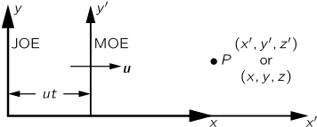
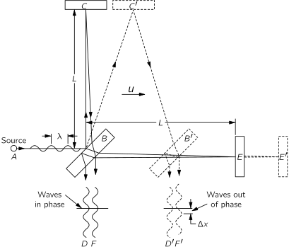
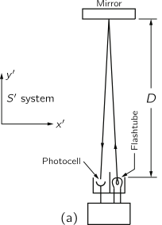
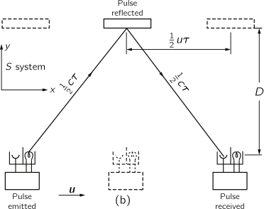
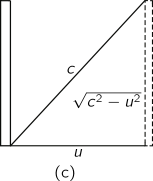

[up](top.md)

## 15 特殊相対性理論

### 15-1相対性理論の原理

ニュートンが唱えた運動方程式は、200年以上にわたって自然を正しく記述していると信じられてきましたが、この法則に誤りがあることが初めて発見され、その修正方法も発見されました。そして、1905年にアインシュタインがその誤りと修正方法を発見したのである。

ニュートンの第二法則は、次のような式で表されます。

$$F=d(mv)/dt, $$

ニュートンの第二法則は、mが一定であることを暗黙の前提として述べられていましたが、現在ではそうではなく、物体の質量は速度とともに増加することがわかっています。アインシュタインの修正式では、mは次のようになります。

$$m=\dfrac{m_0}{\sqrt{1−v^2/c^2}}, \tag{15.1}$$

ここで、「静止質量」$m_0$は動いていない物体の質量を表し、$c$は光の速度で、約3×105km・sec$^{-1}$または約186,000mi・sec$^{-1}$です。

問題を解くために必要なことだけを学びたい人にとって、相対性理論はそれだけのものです。 相対性理論とは、ニュートンの法則に質量の補正係数を加えて変化させたものです。相対性理論とは、ニュートンの法則に補正係数を加えて質量を変化させるだけのものです。仮に人工衛星のように秒速5マイルで地球を一周するような速度であれば、$v/c$=5/186,000となります。この値を式に入れると、質量の補正は20億分の1から30億分の1にしかならず、観測することはほとんど不可能です。実際、この式の正しさは、光速に近い速度で動くさまざまな粒子の観測によって十分に確認されています。しかし、その効果は通常は非常に小さいので、実験的に発見される前に理論的に発見されたことは注目に値します。経験的には、十分に速い速度では、その効果は非常に大きいのですが、そのように発見されたわけではありません。したがって、（発見された当時は）非常に微妙な修正を伴う法則が、実験と物理的な推論の組み合わせによって明るみに出たことは興味深いことである。この発見には多くの人が貢献しており、その最終的な成果がアインシュタインの発見となったのです。

アインシュタインの相対性理論は、実に2つあります。この章では、1905年に発表された「特殊相対性理論」について説明します。1915年、アインシュタインは「一般相対性理論」という追加の理論を発表しました。一般相対性理論は、特別相対性理論を重力の法則に拡張したもので、ここでは一般相対性理論については触れません。

相対性の原理は、ニュートンが運動法則の傍証の一つとして初めて述べたものである。"ある空間に含まれる物体の運動は、その空間が静止していようと、一直線に進んでいようと、それらの間では同じである。" これは、例えば宇宙船が一様な速度で漂っていれば、宇宙船の中で行われる実験や宇宙船の中で起こる現象は、もちろん外を見なければ、宇宙船が動いていない時と同じように見えるということです。これが相対性原理の意味である。問題は、動いている系の中で行われるすべての実験で、物理法則が静止している場合と同じように見えるというのが本当かどうかということです。まず、ニュートンの法則が動いている系でも同じように見えるかどうかを調べてみましょう。

図15-1. X軸に沿って均一な相対運動をする2つの座標系。

Moeさんが一様な速度$u$で$x$方向に移動しているとき、図15-1のようなある点の位置を測定したとする。彼はその点の座標系における「$x$-距離」を$x′$とする。一方，Joeは静止していて，同じ点の位置を測定し，自分の座標系での$x$座標を$x$とした．この2つの座標系の関係は，図を見れば明らかである．時間$t$後、Moeの原点は距離$ut$だけ移動しており、2つの系がもともと一致していたとすると

$$\begin{array}{l}
    x^′=x-ut,\\
    y^′=y,\\
    z^′=z,\\
    t^′=t.
\end{array}\tag{15.2}
$$

この座標変換をニュートンの法則に代入すると、これらの法則はプライミングされた系でも同じ法則に変換されることがわかります。つまり、ニュートンの法則は、動いている系でも止まっている系でも同じ形をしているので、力学的な実験をしても、その系が動いているかどうかはわからないのです。

相対性原理は古くから力学の分野で使われてきました。第10章で運動量の保存について説明したのと同じように、相対性原理は様々な人、特にホイヘンスがビリヤードの玉の衝突の規則を得るために用いました。19世紀に入ると、電気、磁気、光などの現象が解明され、この分野への関心が高まりました。多くの人がこれらの現象を注意深く研究した結果、電気、磁気、光を一つの統一された系で記述したマクスウェルの電磁場の方程式が生まれた。しかし、このマクスウェル方程式は、相対性理論の原理に従っていないように思われた。つまり、マクスウェル方程式を（15.2）式の代入によって変形しても、その形は変わらない。したがって、動いている宇宙船の中では、電気的・光学的現象が静止している船の中とは異なるはずである。したがって、これらの光学現象を利用して船の速度を決定することができます。特に、適切な光学的または電気的測定を行うことによって、船の絶対的な速度を決定することができます。マクスウェルの方程式の帰結の1つは、光が発生するような場の乱れがあると、その電磁波はすべての方向に等しく同じ速度$c$（秒速18万6,000マイル）で出ていくというものである。この方程式のもう一つの帰結は、乱れの発生源が動いている場合、放出された光は同じ速度$c$で空間を通過するということです。これは音の場合と類似しており、音波の速度は同様に音源の動きに依存しない。

光の場合、光源の動きに依存しないということは、興味深い問題をもたらします。

私たちが速度$u$の車に乗っていて、後方からの光が速度$c$で車を通り過ぎていくとします。

$$dx^′/dt=dx/dt-u。$$

となり、ガリレオ変換によれば、車の中で測定した通過光の見かけの速度は$c$ではなく、$c-u$になるはずなのです。例えば、車が秒速10万マイルで、光が秒速18万6千マイルの場合、車を通過する光は、見かけ上、秒速8万6千マイルになるはずです。いずれにしても、車を通り過ぎる光の速度を測定すれば（光のガリレオ変換が正しければ）、車の速度を知ることができるのである。このような考え方に基づいて、地球の速度を求める実験がいくつか行われましたが、いずれも失敗に終わりました（速度は全く出ませんでした）。ここでは、これらの実験のうちの1つについて、何が行われたのか、何が問題だったのかを具体的に説明します。それは一体何なのでしょうか？

### 15-2ローレンツ変換

上記のような物理学の方程式の破綻が明らかになったとき、まず考えられたのは、当時まだ20年しか経っていなかった新しいマクスウェルの電磁気学の方程式に問題があるのではないかということでした。この方程式が間違っているのは明らかなので、ガリレオ変換の下で相対性原理が成立するように方程式を変更すればよいのです。しかし、実際にやってみると、方程式に新たな項を入れることで、実験では全く存在しない新しい電気現象が予測されてしまい、この試みは断念せざるを得なかった。その後、マクスウェルの電磁気学の法則が正しいことがだんだんわかってきて、問題は別のところにあると考えられるようになった。

一方、H.A.ローレンツは、マクスウェル方程式に次のような代入を行ったところ、驚くべき不思議なことに気がついた。

$$\begin{array}{l}
   \displaystyle x^′ = \dfrac{x - ut}{\sqrt{1 -u^2/c^2}},\\
    y^′=y,\\
    z^′=z,\\
    \displaystyle t'=\dfrac{t-ux/c^2}{\sqrt{1-u^2/c^2}},
\end{array} \tag{15.3}
$$

つまり、マクスウェル方程式は、この変換を適用しても、同じ形のままなのです。式(15.3)は、ローレンツ変換として知られています。アインシュタインは、ポアンカレの提案にしたがって、すべての物理法則は、ローレンツ変換を受けても変化しないような種類のものであるべきだと提案しました。つまり、電気力学の法則ではなく、力学の法則を変えようというのである。では、どのようにしてニュートンの法則を変えれば、ローレンツ変換しても変化しないのか。この目標が設定されたならば、我々が課した条件を満たすように、ニュートンの方程式を書き換えなければならない。結果的には、ニュートン方程式の質量$m$を式（15.1）のような形に変えればよいことになります。この変更により、ニュートンの法則と電磁気学の法則が調和します。そうすると，ローレンツ変換を使って，モーの測定値とジョーの測定値を比較しても，どちらが動いているかはわからないことになります。なぜなら，すべての方程式の形が両方の座標系で同じになるからです

座標と時間の間の古い変換を新しい変換に置き換えることの意味を議論するのは興味深いことです。なぜなら、古い変換（ガリレオ）は自明のことのように思えますが、新しい変換（ローレンツ）は独特のものに見えるからです。私たちが知りたいのは、古い変換ではなく、新しい変換が論理的にも実験的にも正しい可能性があるかどうかです。それを知るためには、力学の法則を研究するだけでは不十分で、アインシュタインのように、この変換を理解するためには、私たちも空間と時間の考え方を分析しなければなりません。そのためには、アインシュタインのように、空間と時間の考え方を分析して、この変換を理解する必要があります。これらの考え方と力学への影響については、ある程度長く議論しなければなりません。

### 15-3 マイケルソン-モーリーの実験

前述のように、宇宙空間を覆っているとされる「エーテル」を介して、地球の絶対速度を測定する試みが行われた。最も有名なのは、1887年にマイケルソンとモーリーが行った実験である。この実験の否定的な結果がアインシュタインによって説明されたのは、それから18年後のことだった。

図15-2. マイケルソン-モーリー実験の模式図。

マイケルソン-モーリーの実験は、図15-2に模式的に示すような装置で行われた。この装置は、基本的には、光源$A$、部分的に銀色のガラス板B、2枚の鏡$C$と$E$を剛体の台に取り付けたものである。鏡は$B$から等距離$L$に配置されています。板$B$は対向する光線を分割します。その結果、2本の光は互いに垂直な方向に進み、鏡に反射して$B$に戻ります。光が$B$から$E$に戻ってくる時間が、$B$から$C$に戻ってくる時間と同じであれば、出てきたビーム$D$と$F$は同位相になり、お互いに補強し合うが、2つの時間がわずかに異なる場合は、ビームの位相がわずかにずれ、干渉が生じることになる。装置がエーテル中で「静止」している場合には、この2つの時間は正確に等しいはずですが、装置が右方向に速度uで動いている場合には、この2つの時間に差が生じるはずです。その理由を考えてみましょう。

まず、光が$B$から$E$まで往復するのに必要な時間を計算してみましょう。光が板$B$から鏡$E$まで行く時間を$t_1$、戻る時間を$t_2$とします。ここで、光が$B$から鏡に向かう間に、装置は距離$ut_1$だけ移動するので、光は距離$L+ut_1$を速度$c$で通過しなければなりません。この距離を$ct_1$と表すこともできるので

$$ct_1=L+ut_1、または\ \ t_1=L/(c-u)。$$

(この結果は、装置に対する光の速度が$c-u$であることからも明らかで、時間は長さ$L$を$c-u$で割ったものになります)。同様にして、時間$t_2$も計算できます。この間、プレート$B$は距離$ut_2$だけ進んでいるので、光の戻る距離は$L-ut_2$となる。すると、次のようになります。

$$ct_2=L-ut_2、または\ \ t_2=L/(c+u)。$$

すると、トータルの時間は

$$t_1+t_2=2Lc/(c^2-u^2)。$$

後で時間を比較するときに便利なように、これを次のように書きます。

$$t_1+t_2=\dfrac{2L/c}{1−u^2/c^2}. \tag{15.4}$$

2番目の計算は、光が$B$から鏡$C$まで行く時間$t_3$についてです。先ほどと同様に、時間$t_3$の間に鏡$C$は右に距離$ut_3$移動して$C^′$の位置になり、同時に光は三角形の斜辺$BC^′$に沿って距離$ct_3$移動します。この直角三角形に対しては

$$(ct_3)^2=L^2+(ut_3)^2$$

または

$$L^2=c^2t^2_3−u^2t^2_3=(c^2−u^2)t^2_3,$$

ここで、次のようになります。

$$t_3=L/\sqrt{c^2-u^2}。$$

$C^′$からの帰り道は，図の対称性からわかるように距離が同じであるため，帰りの時間も同じであり，合計時間は$2t_3$となります。少し形を変えて、次のように書くことができます。

$$2t_3=\dfrac{2L}{\sqrt{c^2-u^2}}=\dfrac{2L/c}{\sqrt{1-u^2/c^2}}.  \tag{15.5}$$

これで、2つの光の時間を比較することができます。式(15.4)と式(15.5)の分子は同じで、装置が静止していた場合にかかる時間を表しています。分母の$u^2/c^2$は、$u$が$c$と同程度の大きさでない限り、小さくなります。分母は、装置の運動による時間の変化を表しています。見てください、これらの修正は同じではありません。 --- 鏡が$B$から等距離にあるにもかかわらず、$C$に行って帰ってくる時間は、$E$に行って帰ってくる時間よりも少しだけ短く、その差を正確に測ればよいのです。

ここでちょっとした技術的な問題が発生します。2つの長さ$L$が完全には等しくないとしますか？実際には、完全に等しくすることはできないでしょう。その場合は、装置を90度回転させて、$BC$が動線上に、$BE$が動線に垂直になるようにします。そうすれば、多少の長さの違いは気にならなくなり、装置を回転させたときの干渉縞の変化を見ることができるのです。

マイケルソンとモーレイは、地球の公転運動（昼と夜の時間帯）に$BE$がほぼ平行になるように装置を回転させて実験を行った。この公転速度は1秒間に約18マイルであり、「エーテルの漂流」は少なくとも昼夜と1年のうちのある時期にはその程度になるはずである。実験装置は、そのような効果を観測するのに十分な感度を持っていたが、時間差は見られなかった。つまり、エーテルを介した地球の速度は検出できなかったのだ。実験の結果は無効であった。

マイケルソン-モーリーの実験結果は、非常に不可解であり、最も不安なものであった。このような状況を打開するための最初のアイデアは、ローレンツによるものであった。また、静止しているときの長さを$L_0$とすると、その長さに平行に速度$u$で移動したときの新しい長さを$L_∥$（$L$-parallel）と呼ぶと、次式で与えられる。

$$L_∥=L_0 \sqrt{1-u^2/c^2}. \tag{15.6}$$

この修正をマイケルソン-モーリー干渉計の装置に適用すると、$B$から$C$までの距離は変わらないが、$B$から$E$までの距離は$L \sqrt{1-u^2/c^2}$に短縮される。したがって、式(15.5)は変化しません。(15.5)は変わりませんが、式(15.4)の$L$を式(15.6)にしたがって変更する必要があります。これを行うと、次のようになります。

$$t_1+t_2=\dfrac{(2L/c)\sqrt{1−u^2/c^2}}{1−u^2/c^2}=\dfrac{2L/c}{\sqrt{1−u^2/c^2}}. \tag{15.7}$$

この結果を式(15.5)と比較すると、$t_1+t_2=2t_3$であることがわかります。このように装置が縮むのであれば、マイケルソン・モーリーの実験で効果が全くないことが理解できます。収縮仮説は、実験結果のマイナスを見事に説明したものの、その難しさを説明するために考案されたものであり、あまりにも人工的であるという反論がありました。しかし、エーテル風を発見するための他の多くの実験でも、同じような困難が生じ、自然が人間を妨害するために「陰謀」を企て、人間が$u$の測定を可能にすると考えたあらゆる現象を元に戻すために、何か新しい現象を導入しているように思われた。

ポアンカレが指摘したように、完全な陰謀はそれ自体が自然の法則であることが、最終的に認識されたのです。そこでポアンカレは、そのような自然の法則があるのだから、どんな実験をしてもエーテルの風を発見することはできない、つまり絶対的な速度を決定することはできない、と提案したのである。

### 15-4 時間の変換

収縮の考え方が他の実験での事実と調和しているかどうかを確認すると、集合の4番目の式（15.3）で表現されている方法で、時間も修正すれば、すべてが正しいことが判明した。なぜなら、$B$から$C$への往復で計算される時間$2t_3$は、動いている宇宙船の中で実験をしている人が計算した場合と、宇宙船を見ている静止した観測者が計算した場合とでは同じではないからです。船に乗っている人にとって時間は単純に$2L/c$ですが、他の観測者にとっては$(2L/c)/\sqrt{1-u^2/c^2}$（式15.5）となります。つまり、宇宙船の中の人が葉巻に火をつけているところを外部の人が見ると、すべての動作が通常よりも遅くなっているように見えますが、中の人にとってはすべてが通常の速度で動いているのです。だから、長さが短くなるだけでなく、時間を測る道具（「時計」）も見かけ上遅くならなければならない。つまり、宇宙船内の時計が、船内の人間から見て1秒経過したことを記録すると、外の人間には$1/\sqrt{1-u^2/c^2}$秒と表示される。

このように、動いている系の時計が遅くなるというのは、非常に奇妙な現象であり、説明に値する。これを理解するためには、時計の機械を見て、動いているときに何が起こるかを見なければなりません。それはかなり難しいので、非常に単純な種類の時計を取り上げよう。それは、両端に鏡がついた棒（メートル棒）で、鏡の間に光の信号を出すと、光は上下に動き続け、下りてくるたびにカチッと音がする、標準的なカチカチ時計のようなものです。このような全く同じ長さの時計を2つ作り、一緒にスタートさせて同期させると、長さが同じなので、その後は常に一致します。光は常に速度$c$で進むので、この時計の1つを人に渡して宇宙船に乗せてもらい、船の進行方向に対して垂直に棒を取り付けると、棒の長さは変わりません。直角方向の長さが変わらないことをどうやって知ることができるでしょうか？2人の男性は、すれ違うときにお互いのY字型の棒に印をつけることに合意します。そうしないと、2人が一緒になって結果を比較したときに、片方のマークがもう片方のマークよりも上になったり下になったりして、誰が本当に動いているのかがわからなくなってしまうからです。

図15-3. (a)S′系で静止している「光の時計」。(b)同じ時計をS系で動かした場合。(c)動いている "光の時計 "の光ビームの対角線上の経路を示したもの。

さて、動いている時計はどうなるでしょうか。乗る前は、「これは標準的ないい時計だから、宇宙船に乗っても変なものは見えないだろう」と思っていました。もしそうであれば、自分が動いていることがわかります。動きによって何かが変化すれば、自分が動いていることがわかります。しかし、相対性の原理では、一様に動いている系ではこのようなことはあり得ないので、何も変わっていないのです。一方、外部の観測者が時計を見ると、光は鏡から鏡へと移動する際に、棒が横方向に移動しているため、「本当は」ジグザグの経路をとっていることがわかります。このようなジグザグ運動については、マイケルソン・モーリーの実験ですでに分析されています。図15-3において、ある時間内に棒が$u$に比例した距離を進むとすると、同じ時間内に光が進む距離は$c$に比例し、したがって垂直方向の距離は$\sqrt{c^2-u^2}$に比例します。

つまり、動いている時計の中では、光が端から端まで進むのに静止している時計よりも長い時間がかかるのです。そのため、動いている時計の方が、三角形の斜辺に示されているのと同じ割合で、クリックの間の見かけの時間が長くなります（方程式の平方根の表現の元になっています）。また、この図から、$u$が大きいほど、動いている時計がよりゆっくりと動いているように見えることがわかります。この特殊な時計の動きが遅いだけでなく、もし相対性理論が正しければ、どんな原理で動いている他の時計も、同じ割合で、遅く動いているように見えるはずです。なぜそうなるのか？

上記の質問に答えるために、車輪や歯車、あるいは放射性崩壊などを利用して全く同じように作られた2つの時計があったとします。そして、これらの時計を調整して、最初の時計と正確に同期して動くようにします。光が最初の時計の中を行ったり来たりして、カチッと音を立ててその到着を知らせると、新しいモデルもある種のサイクルを完了し、同時に二重に一致したフラッシュやボンボンなどの信号で知らせます。これらの時計のうち1つは、最初の種類の時計と一緒に宇宙船に持ち込まれる。おそらく、この時計は遅くならずに、止まっている時計と同じ時間を刻み続け、動いているもう1つの時計とは一致しないだろう。そんなことになったら、船に乗っている人は、この2つの時計の不一致を利用して、船の速度を決めることができてしまいます。その原因となる新しい時計の機械については何も知る必要はありません。理由はどうあれ、最初の時計と同じように遅く動いているように見えるということだけです。

もし、すべての動く時計が遅くなるとしたら、どのような時間測定方法でも遅くなる以外の結果が得られないとしたら、ある意味では、宇宙船の中では時間そのものが遅くなっているように見えると言わざるを得ません。そこでのすべての現象、つまり人間の脈拍数、思考過程、葉巻に火をつける時間、成長と老いにかかる時間、これらすべてが同じ割合で遅くなっているに違いない、なぜなら人間は自分が動いていることがわからないからだ。生物学者や医学者は、宇宙船の中で癌が発生するまでの時間が長くなることは確かではないと言うことがありますが、現代の物理学者の視点から見れば、ほぼ確実です。

運動によって時間が遅くなることを示す非常に興味深い例として、ミューオンがあります。ミューオンは、平均寿命が2.2×10^(-6)秒で自然に崩壊する粒子です。ミューオンは宇宙線で地球に飛来しますが、実験室で人工的に生成することもできます。中には空中で崩壊するものもありますが、残りのものは物質に遭遇して止まってから崩壊します。ミューオンはその短い一生の間に、光速であっても600メートル以上の距離を移動できないことは明らかです。しかし、ミューオンは大気の最上部、約10km上空で作られるにもかかわらず、実際にはこの下の実験室で、宇宙線の中に発見されます。それはどうしてでしょうか？その答えは、さまざまなミューオンがさまざまな速度で動き、その中には光速に非常に近いものもあるからです。ミューオンの視点から見ると、ミューオンは約2μ秒しか生きられませんが、私たちの視点から見るとかなり長く生きられ、地球に到達するのに十分な長さです。その時間が長くなる要因は、すでに$1/\sqrt{1-u^2/c^2}$として与えられています。平均寿命は、異なる速度のミューオンについて非常に正確に測定されており、その値は公式と密接に一致しています。

ミューオンがなぜ崩壊するのか、そのメカニズムはわかりませんが、その挙動が相対性原理を満たすことはわかっています。これこそが相対性原理の有用性であり、他の方法ではあまり知らないことであっても、予測を立てることができるのです。例えば、ミューオンが何によって崩壊するのか全く分からないうちから、光速の10分の9の速度で動いているときに、それが持続する見かけの長さは$(2.2×10^{-6})/\sqrt{1-9^2/10^2}$秒であると予測することができ、その予測が有効であることが、相対性原理の良いところです。

### 15-5 ローレンツ収縮

さて，ローレンツ変換(15.3)に戻って，$(x,y,z,t)$座標系と$(x^′,y^′,z^′,t^′)$座標系の関係をよりよく理解しようとします。これらの座標系をそれぞれ$S$系と$S^′$系，あるいはJoe系とMoe系と呼ぶことにします。最初の式は、$x$方向に沿って収縮するというローレンツの提案に基づいていることはすでに述べましたが、収縮が起こることをどのようにして証明することができるでしょうか。マイケルソン-モーリーの実験では、相対性の原理により、横腕$BC$の長さは変えられないことがわかりましたが、実験の結果が無効であることから、時間が等しくなければなりません。つまり、実験の結果が無効になるためには、縦方向の腕$BE$が平方根$\sqrt{1-u^2/c^2}$だけ短く見えなければならないのです。この縮みは、JoeとMoeによる測定では、どのような意味を持つのでしょうか。$S^′$系で$x$方向に移動しているMoeが，ある点の$x^′$座標をメートル棒で測定しているとします。彼は棒を$x^′$回置いたので，その距離は$x^′$メートルだと思っています。しかし，$S$系のJoeの視点から見ると，Moeは短縮された定規を使っているので，測った「本当の」距離は$x^′ \sqrt{1-u^2/c^2}$メートルである．そして、$S^′$系が$S$系から距離$ut$を移動したとすると、$S$の観測者は、自分の座標で測った同じ点が、距離$x=x^′ \sqrt{1-u^2/c^2}+ut$、つまり

$$x^′=\dfrac{x-ut}{\sqrt{1-u^2/c^2}}$$

となり、これがローレンツ変換の第一式となります。

### 15-6 同時性(Simultaneity)

同様に、時間スケールの違いから、ローレンツ変換の第4式に分母の式が導入されます。この式で最も興味深いのは、分子の$ux/c^2$で、これは非常に新しく、予想外のことです。さて、これは何を意味するのでしょうか？この状況を注意深く見てみると、$S′$のMoeが見ているように、2つの離れた場所で同時に起こる出来事は、$S$のJoeが見ているようには同時に起こらないことがわかります。一方の出来事が点$x_1$で$t_0$時に起こり、もう一方の出来事が$x_2$で$t_0$時（同時刻）に起こったとすると、対応する2つの時刻$t^′_1$と$t^′_2$は、次の量だけ異なることがわかります。

$$t^′_2-t^′_1=\dfrac{u(x_1-x_2)/c^2}{\sqrt{1-u^2/c^2}}.$$

このような状況を「遠距離同時性の破綻」といいますが、もう少しわかりやすくするために、次のような実験を考えてみましょう。

宇宙船（系$S^′$）で移動している人が、船の両端に時計を置いていて、その2つの時計が同期していることを確認したいと考えているとします。どのようにして時計を同期させることができるでしょうか？いろいろな方法があります。一つの方法は，ほとんど計算を必要としないが，まず，2つの時計のちょうど中間点を見つけることである．そして、この地点から光信号を発信します。光信号は同じ速度で両方向に進み、明らかに両方の時計に同時に到着します。この信号の同時到達を利用して、2つの時計を同期させることができます。ここで，$S^′$にいる男性が，この特殊な方法で時計を同期させたと仮定してみましょう。$S$系の観測者が，この2つの時計が同期していることに同意するかどうかを見てみましょう。$S^′$の人は，自分が動いていることを知らないので，同期していると信じる権利がある。しかし、$S$の人は、船が前進しているので、前の方の時計は光の信号から遠ざかっていたので、光が追いつくためには半分以上の距離を行かなければならない。そのため、$S^′$の人は信号が同時に届いたと思っていましたが、信号は後ろの時計に先に届いていたのです。このように、宇宙船に乗っている人が2つの場所の時間が同時だと思っている場合、彼の座標系で$t^′$の等しい値は、もう一方の座標系で$t$の異なる値に対応しなければならないことがわかります。

### 15-7 4つのベクトル

ローレンツ変換で他にどんな発見があるか見てみましょう。興味深いことに、$x$と$t$の変換は、第11章で学んだ$x$と$y$の変換（座標の回転）と相似形になっています。そのときは

$$\begin{array}{l}
    x^′=x \cos θ+y \sin θ,\\
    y^′=y \cos θ-x \sin θ,
\end{array} \tag{15.8}
$$

ここで，新しい$x^′$は古い$x$と$y$を混ぜ合わせ，新しい$y^′$も古い$x$と$y$を混ぜ合わせています。同様に，ローレンツ変換では，$x$と$t$を混ぜ合わせた新しい$x^′$と，$t$と$x$を混ぜ合わせた新しい$t^′$が得られます。つまり，ローレンツ変換は回転に似ていますが，それは空間と時間の「回転」であり，奇妙な概念に見えます。回転との類似性の確認は、次の量を計算することで行うことができます。

$$x^{′2}+y^{′2}+z^{′2}−c^2t^{′2}=x^2+y^2+z^2−c^2t^2. \tag{15.9}$$

この式の各辺の最初の3項は、3次元幾何学において、座標軸が回転しても変化しない（不変）、点と原点（球面）との距離の2乗を表しています。同様に、式(15.9)は (15.9)は、ローレンツ変換に不変な、時間を含むある組み合わせが存在することを示しています。このように、回転との類似性は完全であり、ベクトル、すなわち、座標や時間と同じように変換する「成分」を含む量も相対性理論に関連して有用であるような種類のものです。

そこで、これまで空間成分だけと考えていたベクトルの考え方を、時間成分も含めて拡張することを考えています。つまり、4つの成分を持つベクトルが存在し、そのうちの3つは通常のベクトルの成分と同じであり、これらに時間部分のアナログである4つ目の成分が関連付けられると予想しています。

この概念は、次の章でさらに分析されます。前項の考え方を運動量に適用すると、変換によって、通常の運動量成分のような3つの空間部分と、エネルギーである4つ目の成分である時間部分が与えられることがわかります。

### 15-8 相対論的動力学(Relativistic dynamics)

これで、より一般的に、ローレンツ変換の下で力学の法則がどのような形になるかを調べる準備ができた。【これまで，長さと時間がどのように変化するかを説明してきたが，$m$の修正式（式15.1）をどのようにして得るかは説明していない．これは次の章で行うことにしよう】。アインシュタインが修正した$m$のニュートン力学への影響を見るために、力は運動量の変化率であるというニュートンの法則から始めましょう。

$$\bm{F}=d(m\bm{v})/dt。$$

運動量は依然としてmvで与えられますが、新しいmを使うと次のようになります。

$$\bm{p}=m\bm{v}=\dfrac{m_0\bm{v}}{\sqrt{1−v^2/c^2}}. \tag{15.10}$$

これがアインシュタインによるニュートンの法則の修正です。この修正では、作用と反作用が依然として等しい場合（詳細にはそうではないかもしれませんが、長い目で見ればそうです）、以前と同じように運動量の保存が行われますが、保存される量は、質量が一定の従来の$m\bm{v}$ではなく、質量が修正された(15.10)に示す量となります。このように、運動量の式を変更しても、運動量の保存は機能します。

次に、運動量が速度によってどのように変化するかを見てみましょう。ニュートン力学では速度に比例し、(15.10)によれば、速度のかなりの範囲では、$c$に比べて小さいですが、相対論的な力学ではほぼ同じです。なぜなら、平方根の表現が1とわずかに異なるだけだからです。しかし、$v$が$c$にほぼ等しいとき、平方根の式はゼロに近づき、したがって、運動量は無限大に向かっていきます。

ある物体に一定の力がずっとかかっていたらどうなるでしょうか。ニュートン力学では、物体は光よりも速くなるまで速度を上げ続けます。しかし、相対論的な力学ではそれは不可能です。相対性理論では、物体は速度ではなく運動量を上げ続けます。運動量は質量が増加しているため、継続的に増加します。しばらくすると、速度の変化という意味での加速度は実質的にありませんが、運動量は増え続けます。もちろん、ある力が物体の速度にほとんど変化を与えない場合、その物体には大きな慣性があると言いますが、これはまさに相対論的質量の公式（式15.10参照）が示す通りで、$v$が$c$とほぼ同じ大きさのときに慣性が非常に大きいということです。この効果の例として、ここカリフォルニア工科大学で使用されているシンクロトロンで高速の電子を偏向させるためには、ニュートンの法則に基づいて予想されるよりも2000倍も強い磁場が必要です。つまり、シンクロトロン内の電子の質量は、通常の質量の2000倍であり、陽子の質量と同じくらいなのです。$m$が$m_0$の2000倍になるということは、$1-v^2/c^2$が1/4,000,000でなければならず、$v$と$c$が8,000,000分の1ずつ違うということになるので、電子はかなり光の速度に近づいていることになる。もし、電子と光がともにシンクロトロン（700フィートの距離と推定）から出発してブリッジラボに駆け出したとしたら、どちらが先に到着するでしょうか？もちろん、光の方が速い(*1)。どのくらい早いかというと、それはわかりません。代わりに、光がどのくらい進んでいるかを知るには、1インチの約1/1000、つまり紙の厚さの1/4倍です。電子がそれだけの速さで動くと、その質量は膨大になりますが、その速さは光速を超えることはできません。

では、相対論的な質量変化のさらなる結果を見てみましょう。小さなタンクに入った気体の分子の動きを考えてみましょう。気体を加熱すると、分子の速度が速くなるため、質量も大きくなり、気体が重くなります。質量の増加を表す近似式は、速度が小さい場合、二項定理を用いて$m_0/\sqrt{1-v^2/c^2}=m_0(1-v^2/c^2)^{-1/2}$をべき乗級数で展開することで求めることができます。その結果

$$m_0(1−v^2/c^2)^{−1/2}=m_0(1+\frac{1}{2}v^2/c^2+\frac{3}{8}v^4/c^4+⋯).$$

式から明らかなように、この系列は$v$が小さいときに急速に収束し、最初の2〜3項以降の項は無視できることがわかります。ですから、次のように書けます。

$$m≅m_0+\frac{1}{2}m_0v^2\left( \dfrac{1}{c^2} \right) \tag{15.11}$$

ここで、右の第2項は分子速度による質量の増加を表しています。温度が上がると$v^2$も比例して大きくなるので、質量の増加は温度の上昇に比例すると言えます。しかし、$\frac{1}{2}m_0v^2$は昔ながらのニュートンの意味での運動エネルギーですから、このガス体全体の質量の増加は、運動エネルギーの増加を$c^2$で割ったものに等しい、つまり$Δm=Δ(K.E.)/c^2$とも言えます。

### 15-9 質量とエネルギーの等価性

以上の観察結果から、アインシュタインは、物体の質量は総エネルギー量をc2で割ったものに等しいと言えば、式(15.1)よりも簡単に表現できるのではないかと考えました。式(15.11)に$c^2$を乗じると、結果は

$$mc^2=m_0c^2+\frac{1}{2}m_0v^2+⋯ \tag{15.12}$$

ここで、左の項は物体の全エネルギーを表し、最後の項は通常の運動エネルギーと認識しています。アインシュタインは、大きな定数である$m_0c^2$は、物体の全エネルギーの一部であり、"静止エネルギー "と呼ばれる固有のエネルギーであると解釈しました。

アインシュタインのように、物体のエネルギーは常に$mc^2$に等しいと仮定した場合の結果を追ってみましょう。興味深い結果として、これまで単に仮定していた質量の速度変化に関する式(15.1)を見つけることができます。まず、エネルギーが$m_0c^2$である静止状態の物体から始めます。次に、体に力を加えると、体は動き出し、運動エネルギーが与えられます。したがって、エネルギーが増加したので、質量が増加したことになります。力が続く限り、エネルギーも質量も増え続けるのです。エネルギーの時間変化率は、力に速度をかけたものに等しいことは、すでに13章で説明しました。

$$\frac{dE}{dt}=\bm{F}・\bm{v}. \tag{15.13}$$

また、$F=d(mv)/dt$であることもわかりました（第9章、式9.1）。これらの関係を$E$の定義と合わせて考えると、式(15.13)は

$$\dfrac{d(mc^2)}{dt}=\bm{v}・\dfrac{d(m\bm{v})}{dt}. \tag{15.14}$$

この式を$m$について解きたいと思います。そのためには、まず両辺に$2m$を掛けるという数学的なトリックを使い、式を次のように変えます。

$$c^2(2m)\dfrac{dm}{dt}=2m\bm{v}・\dfrac{d(m\bm{v})}{dt}. \tag{15.15}$$

微分を除去する必要がありますが、これは両辺を積分することで実現できます。$(2m)dm/dt$は$m^2$の時間微分であり、$(2m\bm{v})・d(m\bm{v})/dt$は$(mv)^2$の時間微分であることがわかります。つまり、式(15.15)は次のようになります。

$$c^2 \dfrac{d(m^2)}{dt}=d(m^2v^2)dt. \tag{15.16}$$

2つの量の微分が等しい場合、その量自体は最大でも$C$という定数だけ異なることになります。

$$m^2c^2=m^2v^2+C. \tag{15.17}$$

定数$C$をより明確に定義する必要があります。式(15.17)はすべての速度に対して真でなければならないので、$v=0$という特別な場合を選び、この場合の質量を$m_0$とすることができます。これらの値を式(15.17)に代入すると

$$m^2_0c^2=0+C$$

この$C$の値を式(15.17)に用いると、次のようになります。

$$m^2c^2=m^2v^2+m^2_0c^2. \tag{15.18}$$

$c^2$で割って項を並べ替えると

$$m^2(1-v^2/c^2)=m^2_0,$$

ここで、次のようになります。

$$m=m_0/ \sqrt{1−v^2/c^2}. \tag{15.19}$$

これが(15.1)式であり、まさに(15.12)式の質量とエネルギーの一致に必要なものである。

通常は、与えられた物質から多くのエネルギーを発生させることはできないので、このようなエネルギーの変化は、質量の極めてわずかな変化を表します。しかし、例えばTNT20キロトンに相当する爆発エネルギーの原子爆弾では、$ΔE=Δ(mc^2)$の関係により、爆発後の汚れは、放出されたエネルギーのために、反応物質の最初の質量よりも1グラム軽くなっていること、すなわち、放出されたエネルギーは1グラムの質量を持っていることを示すことができるのです。質量とエネルギーが等価であるというこの理論は、物質を消滅させてエネルギーに完全に変換する実験によって見事に検証されている。電子と陽電子が静止状態で一緒になり、それぞれの静止質量は$m_0$である。電子と陽電子が静止した状態で一緒になり、それぞれの静止質量は$m_0$であるが、一緒になると崩壊して2つのガンマ線が発生し、それぞれのエネルギーは$m_0c^2$と測定された。この実験は、粒子の静止質量の存在に伴うエネルギーを直接決定するものである。

-----
*1) 電子は、空気の屈折率のため、可視光との競争では実際に勝利するでしょう。ガンマ線の方が良い結果が得られます。

[up](top.md)

